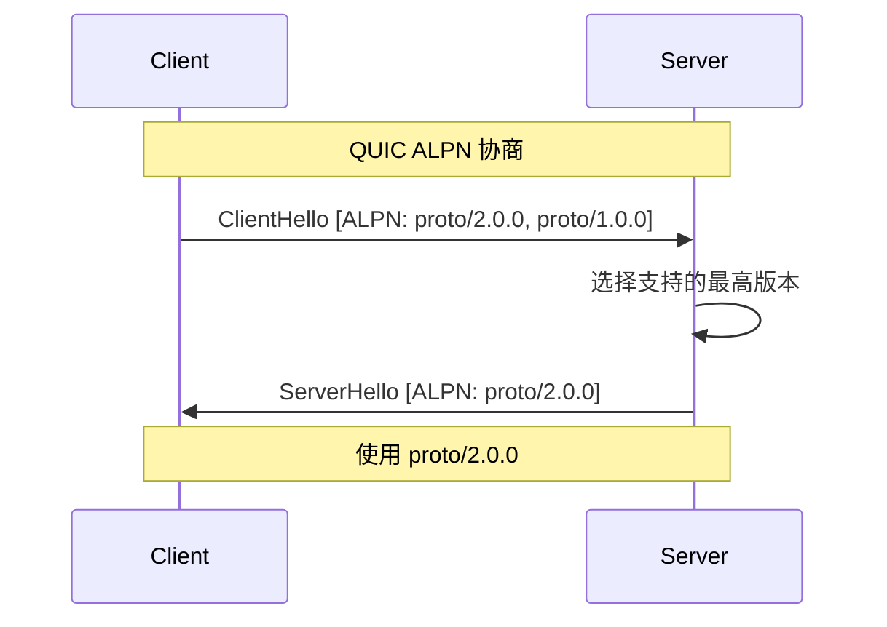

# REQ-PROTO-001: 协议命名空间

## 1. 元数据

| 属性 | 值 |
|------|---|
| **ID** | REQ-PROTO-001 |
| **标题** | 协议命名空间 |
| **类型** | generic |
| **层级** | F6: 协议层 |
| **优先级** | P1 |
| **状态** | draft |
| **创建日期** | 2026-01-11 |
| **更新日期** | 2026-01-11 |

---

## 2. 需求描述

DeP2P 采用层次化的协议命名空间，区分系统协议和应用协议，支持版本协商和 Realm 隔离。

---

## 3. 背景与动机

### 3.1 问题陈述

P2P 协议管理面临以下问题：

1. **命名冲突**：不同应用协议名冲突
2. **版本管理**：协议版本兼容性
3. **隔离需求**：不同 Realm 协议隔离

### 3.2 目标

设计清晰的协议命名空间：
- 层次化命名
- 版本语义化
- Realm 感知

### 3.3 竞品参考

| 产品 | 命名格式 | 特点 |
|------|----------|------|
| **iroh** | ALPN 字节序列 | 简洁 |
| **go-libp2p** | `/org/proto/version` | 路径格式 |
| **torrent** | 固定协议 | 无命名空间 |

**选择**：采用 libp2p 风格的路径格式，增加 Realm 支持。

---

## 4. 需求详情

### 4.1 功能要求

1. **层次化命名**：清晰的协议路径
2. **版本管理**：语义化版本号
3. **系统/应用分离**：明确区分
4. **Realm 隔离**：协议绑定 Realm
5. **协商机制**：QUIC ALPN

### 4.2 命名格式

```
/dep2p/<domain>/<protocol>/<version>
```

| 组件 | 说明 | 示例 |
|------|------|------|
| `dep2p` | 固定前缀 | `dep2p` |
| `domain` | 域（sys/app/realm） | `sys`, `app` |
| `protocol` | 协议名 | `relay`, `discovery` |
| `version` | 版本号 | `1.0.0` |

### 4.3 协议分类

```mermaid
flowchart TB
    subgraph Namespace[协议命名空间]
        SYS[系统协议<br/>/dep2p/sys/*]
        APP[应用协议<br/>/dep2p/app/*]
        REALM[Realm 协议<br/>/dep2p/realm/&lt;id&gt;/*]
    end
    
    SYS --> S1[/dep2p/relay/1.0.0/{hop,stop}]
    SYS --> S2[/dep2p/sys/discovery/1.0.0]
    SYS --> S3[/dep2p/sys/holepunch/1.0.0]
    
    APP --> A1[/dep2p/app/&lt;name&gt;/&lt;version&gt;]
    
    REALM --> R1[/dep2p/realm/my-app/msg/1.0.0]
```

### 4.4 系统协议

| 协议 | 路径 | 说明 |
|------|------|------|
| Relay | `/dep2p/relay/1.0.0/{hop,stop}` | 中继协议 |
| Discovery | `/dep2p/sys/discovery/1.0.0` | 发现协议 |
| HolePunch | `/dep2p/sys/holepunch/1.0.0` | 打洞协调 |
| Ping | `/dep2p/sys/ping/1.0.0` | 心跳检测 |
| Identity | `/dep2p/sys/identity/1.0.0` | 身份交换 |

### 4.5 应用协议

```go
// 应用协议格式
// /dep2p/app/<name>/<version>

// 示例
const (
    MyAppMsgV1   = "/dep2p/app/myapp/msg/1.0.0"
    MyAppSyncV1  = "/dep2p/app/myapp/sync/1.0.0"
)
```

### 4.6 Realm 协议

```go
// Realm 协议格式
// /dep2p/realm/<realmID>/<protocol>/<version>

// 示例
func RealmProtocol(realmID RealmID, proto, version string) string {
    return fmt.Sprintf("/dep2p/realm/%s/%s/%s", realmID, proto, version)
}

// 使用
msgProto := RealmProtocol("my-app", "msg", "1.0.0")
// -> /dep2p/realm/my-app/msg/1.0.0
```

### 4.7 版本协商



### 4.8 协议注册

```go
// ProtocolRegistry 协议注册表
type ProtocolRegistry interface {
    // Register 注册协议处理器
    Register(protoID string, handler ProtocolHandler) error
    
    // Unregister 取消注册
    Unregister(protoID string) error
    
    // Lookup 查找处理器
    Lookup(protoID string) (ProtocolHandler, bool)
    
    // ListProtocols 列出所有协议
    ListProtocols() []string
    
    // MatchProtocol 匹配协议（支持版本回退）
    MatchProtocol(requested []string) (string, bool)
}

// ProtocolHandler 协议处理器
type ProtocolHandler interface {
    // Handle 处理流
    Handle(ctx context.Context, stream Stream) error
}
```

### 4.9 使用示例

```go
// 注册系统协议
node.RegisterHandler("/dep2p/sys/ping/1.0.0", pingHandler)

// 注册应用协议
node.RegisterHandler("/dep2p/app/chat/msg/1.0.0", msgHandler)

// 注册 Realm 协议（需要先 JoinRealm）
node.JoinRealm(ctx, "my-app", psk)
node.RegisterHandler("/dep2p/realm/my-app/msg/1.0.0", realmMsgHandler)

// 打开流时指定协议
stream, _ := conn.OpenStream(ctx, "/dep2p/app/chat/msg/1.0.0")
```

### 4.10 配置选项

```go
// 协议配置
dep2p.WithProtocols(
    dep2p.Protocol{
        ID:      "/dep2p/app/myapp/1.0.0",
        Handler: myHandler,
    },
    dep2p.Protocol{
        ID:      "/dep2p/app/myapp/2.0.0",
        Handler: myHandlerV2,
    },
)
```

### 4.11 错误处理

| 场景 | 错误 | 说明 |
|------|------|------|
| 协议未注册 | `ErrProtocolNotFound` | 无对应处理器 |
| 版本不匹配 | `ErrProtocolVersionMismatch` | 无共同版本 |
| 格式无效 | `ErrInvalidProtocolID` | 协议 ID 格式错误 |
| 重复注册 | `ErrProtocolAlreadyRegistered` | 已存在 |

---

## 5. 验收标准

- [ ] 协议 ID 格式符合规范
- [ ] 系统协议正确注册
- [ ] 应用协议正确注册
- [ ] Realm 协议正确隔离
- [ ] 版本协商正常工作
- [ ] 版本回退正常工作
- [ ] 错误场景正确处理

---

## 6. 非功能要求

| 维度 | 要求 |
|------|------|
| **性能** | 协议查找 O(1) |
| **可扩展** | 支持动态注册 |
| **兼容性** | 版本向后兼容 |

---

## 7. 关联文档

| 类型 | 链接 |
|------|------|
| **竞品** | [协议设计对比](../../references/comparison/protocol/01-protocol-design.md) |
| **需求** | [REQ-PROTO-002](REQ-PROTO-002.md): 消息格式 |
| **需求** | [REQ-PROTO-003](REQ-PROTO-003.md): 流式通信 |
| **需求** | [REQ-REALM-001](../F5_realm/REQ-REALM-001.md): Realm 隔离 |

---

## 8. 实现追踪

### 8.1 代码引用

| 文件 | 符号 | 状态 |
|------|------|------|
| `internal/core/protocol/registry.go` | `ProtocolRegistry` | ⏳ 待实现 |
| `internal/core/protocol/id.go` | `ProtocolID` | ⏳ 待实现 |

### 8.2 测试证据

| 测试文件 | 测试函数 | 状态 |
|----------|----------|------|
| `internal/core/protocol/registry_test.go` | `TestProtocolRegistration` | ⏳ 待实现 |
| `internal/core/protocol/id_test.go` | `TestProtocolIDParsing` | ⏳ 待实现 |

---

## 9. 变更历史

| 日期 | 版本 | 变更说明 |
|------|------|----------|
| 2026-01-11 | 1.0 | 初始版本 |
