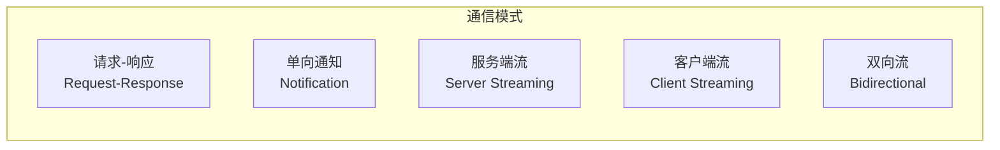
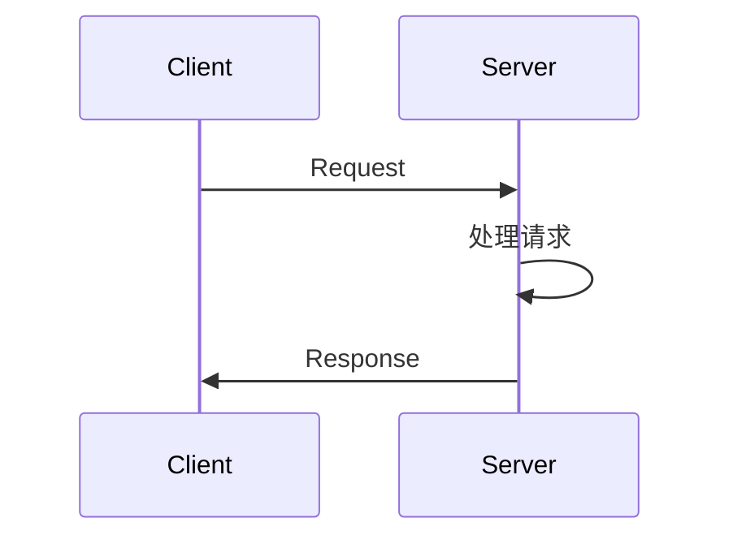
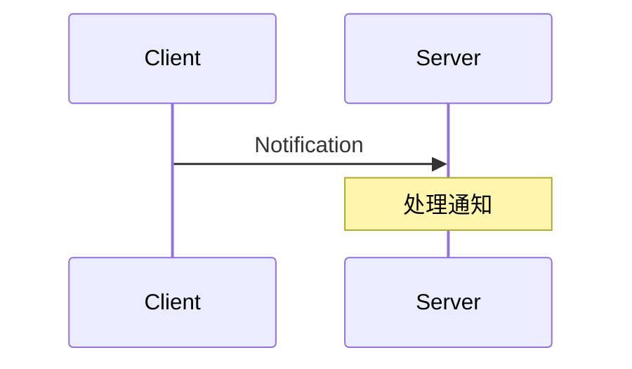
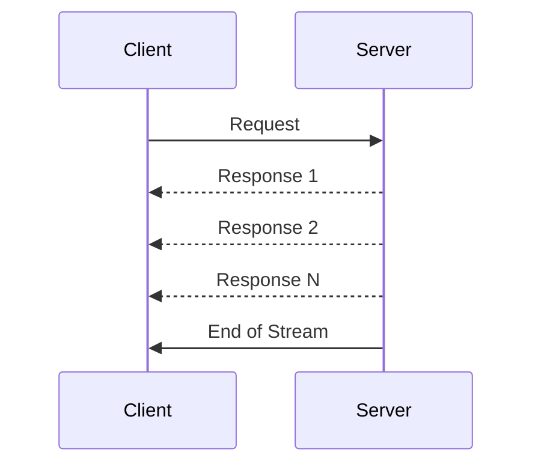
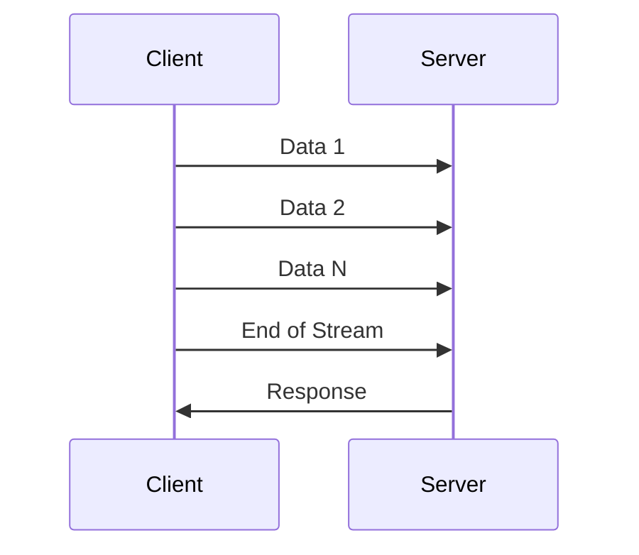
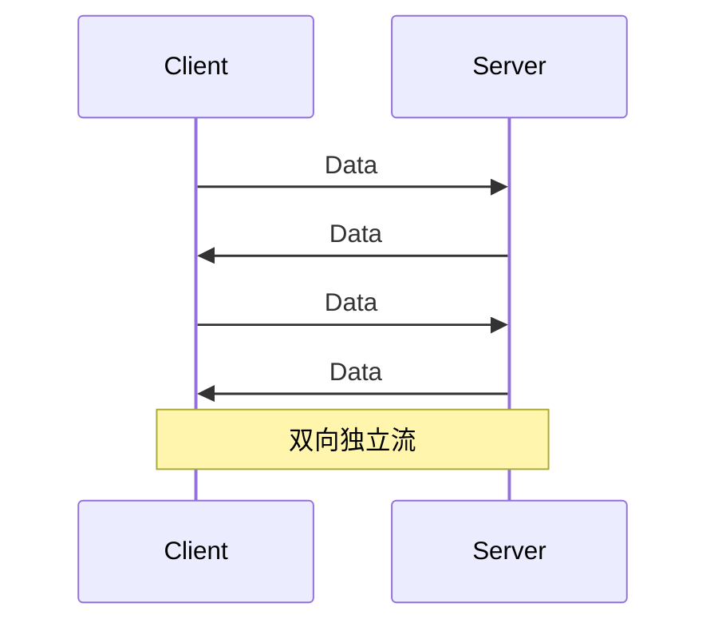

# REQ-PROTO-003: 流式通信

## 1. 元数据

| 属性 | 值 |
|------|---|
| **ID** | REQ-PROTO-003 |
| **标题** | 流式通信 |
| **类型** | generic |
| **层级** | F6: 协议层 |
| **优先级** | P1 |
| **状态** | draft |
| **创建日期** | 2026-01-11 |
| **更新日期** | 2026-01-11 |

---

## 2. 需求描述

DeP2P 支持多种通信模式，包括请求-响应、单向通知、流式传输和双向流，满足不同应用场景需求。

---

## 3. 背景与动机

### 3.1 问题陈述

P2P 应用有不同的通信需求：

1. **请求-响应**：RPC 调用
2. **单向通知**：事件推送
3. **流式传输**：大数据传输
4. **双向流**：实时交互

### 3.2 目标

设计灵活的通信模式：
- 支持多种模式
- 统一 API
- 高效资源利用

### 3.3 竞品参考

| 产品 | 通信模式 | 特点 |
|------|----------|------|
| **iroh** | Stream 原生 | 灵活 |
| **go-libp2p** | Stream + Handler | 模式丰富 |
| **gRPC** | 四种模式 | 定义清晰 |

**选择**：参考 gRPC 的四种模式，基于 QUIC Stream 实现。

---

## 4. 需求详情

### 4.1 功能要求

1. **请求-响应**：单次请求，单次响应
2. **单向通知**：只发送，不等待响应
3. **服务端流**：单次请求，流式响应
4. **客户端流**：流式请求，单次响应
5. **双向流**：双向流式数据

### 4.2 通信模式



### 4.3 模式接口

```go
// Messenger 消息接口
type Messenger interface {
    // Request 请求-响应
    Request(ctx context.Context, to NodeID, proto string, req []byte) ([]byte, error)
    
    // Send 单向通知
    Send(ctx context.Context, to NodeID, proto string, data []byte) error
    
    // OpenStream 打开流（用于流式通信）
    OpenStream(ctx context.Context, to NodeID, proto string) (Stream, error)
}

// Handler 处理器接口
type Handler interface {
    // HandleRequest 处理请求
    HandleRequest(ctx context.Context, req *Request) (*Response, error)
    
    // HandleNotification 处理通知
    HandleNotification(ctx context.Context, data []byte) error
    
    // HandleStream 处理流
    HandleStream(ctx context.Context, stream Stream) error
}
```

### 4.4 请求-响应模式



```go
// 客户端
resp, err := node.Request(ctx, serverID, "/app/echo/1.0.0", []byte("hello"))

// 服务端
node.RegisterHandler("/app/echo/1.0.0", func(ctx context.Context, req *Request) (*Response, error) {
    return &Response{Data: req.Data}, nil
})
```

### 4.5 单向通知模式



```go
// 客户端
err := node.Send(ctx, serverID, "/app/event/1.0.0", eventData)

// 服务端
node.RegisterNotificationHandler("/app/event/1.0.0", func(ctx context.Context, data []byte) error {
    processEvent(data)
    return nil
})
```

### 4.6 服务端流模式



```go
// 客户端
stream, _ := node.OpenStream(ctx, serverID, "/app/stream/1.0.0")
stream.Write(request)
stream.CloseWrite()

for {
    data, err := stream.Read()
    if err == io.EOF {
        break
    }
    process(data)
}

// 服务端
node.RegisterStreamHandler("/app/stream/1.0.0", func(ctx context.Context, stream Stream) error {
    req, _ := io.ReadAll(stream) // 读取请求
    
    for item := range generateItems(req) {
        stream.Write(item)
    }
    return nil
})
```

### 4.7 客户端流模式



```go
// 客户端
stream, _ := node.OpenStream(ctx, serverID, "/app/upload/1.0.0")

for chunk := range data {
    stream.Write(chunk)
}
stream.CloseWrite()

response, _ := io.ReadAll(stream)

// 服务端
node.RegisterStreamHandler("/app/upload/1.0.0", func(ctx context.Context, stream Stream) error {
    data, _ := io.ReadAll(stream) // 读取所有数据
    result := process(data)
    stream.Write(result)
    return nil
})
```

### 4.8 双向流模式



```go
// 客户端
stream, _ := node.OpenStream(ctx, serverID, "/app/chat/1.0.0")

go func() {
    for msg := range outgoing {
        stream.Write(msg)
    }
    stream.CloseWrite()
}()

go func() {
    for {
        msg, err := readMessage(stream)
        if err == io.EOF {
            break
        }
        incoming <- msg
    }
}()

// 服务端
node.RegisterStreamHandler("/app/chat/1.0.0", func(ctx context.Context, stream Stream) error {
    go func() {
        for {
            msg, err := readMessage(stream)
            if err == io.EOF {
                break
            }
            handleMessage(msg)
        }
    }()
    
    for msg := range outgoing {
        stream.Write(msg)
    }
    return nil
})
```

### 4.9 超时和取消

```go
// 请求超时
ctx, cancel := context.WithTimeout(context.Background(), 5*time.Second)
defer cancel()

resp, err := node.Request(ctx, serverID, proto, req)
if errors.Is(err, context.DeadlineExceeded) {
    // 超时处理
}

// 流超时
stream.SetDeadline(time.Now().Add(30 * time.Second))
```

### 4.10 配置选项

```go
// 通信配置
dep2p.WithMessaging(dep2p.MessagingConfig{
    // 请求超时
    RequestTimeout: 30 * time.Second,
    
    // 流空闲超时
    StreamIdleTimeout: 5 * time.Minute,
    
    // 最大消息大小
    MaxMessageSize: 16 * 1024 * 1024, // 16MB
})
```

### 4.11 错误处理

| 场景 | 错误 | 说明 |
|------|------|------|
| 请求超时 | `ErrRequestTimeout` | 等待响应超时 |
| 流关闭 | `ErrStreamClosed` | 流已关闭 |
| 节点不可达 | `ErrPeerUnreachable` | 无法连接 |
| 协议不支持 | `ErrProtocolNotSupported` | 对端不支持 |

---

## 5. 验收标准

- [ ] 请求-响应模式正常工作
- [ ] 单向通知模式正常工作
- [ ] 服务端流模式正常工作
- [ ] 客户端流模式正常工作
- [ ] 双向流模式正常工作
- [ ] 超时正确触发
- [ ] 取消正确传播
- [ ] 错误场景正确处理

---

## 6. 非功能要求

| 维度 | 要求 |
|------|------|
| **性能** | 请求-响应 < 10ms (本地) |
| **并发** | 单连接 100+ 并发请求 |
| **可靠** | 自动重试可配置 |

---

## 7. 关联文档

| 类型 | 链接 |
|------|------|
| **竞品** | [API 设计对比](../../references/comparison/interface/01-api-design.md) |
| **需求** | [REQ-PROTO-001](REQ-PROTO-001.md): 协议命名空间 |
| **需求** | [REQ-PROTO-002](REQ-PROTO-002.md): 消息格式 |
| **需求** | [REQ-TRANS-003](../F2_transport/REQ-TRANS-003.md): 流多路复用 |
| **需求** | [REQ-API-001](../F7_api/REQ-API-001.md): Node API 设计 |

---

## 8. 实现追踯

### 8.1 代码引用

| 文件 | 符号 | 状态 |
|------|------|------|
| `pkg/dep2p/messenger.go` | `Messenger` | ⏳ 待实现 |
| `internal/core/protocol/handler.go` | `Handler` | ⏳ 待实现 |

### 8.2 测试证据

| 测试文件 | 测试函数 | 状态 |
|----------|----------|------|
| `pkg/dep2p/messenger_test.go` | `TestRequestResponse` | ⏳ 待实现 |
| `pkg/dep2p/messenger_test.go` | `TestBidirectionalStream` | ⏳ 待实现 |

---

## 9. 变更历史

| 日期 | 版本 | 变更说明 |
|------|------|----------|
| 2026-01-11 | 1.0 | 初始版本 |
