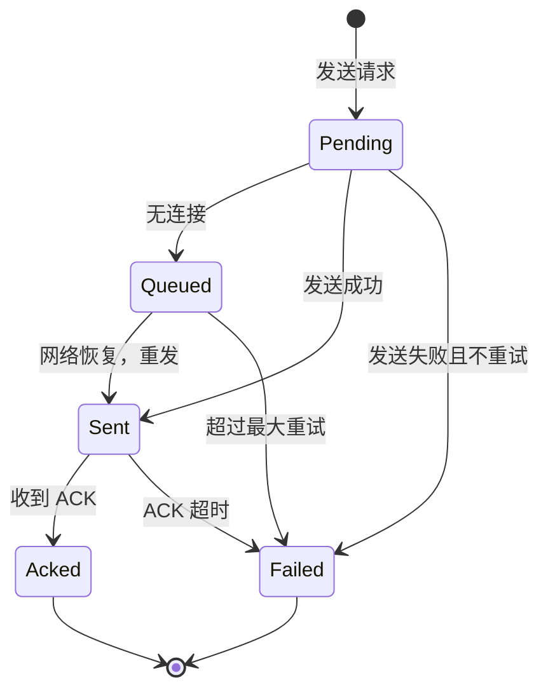

# REQ-PROTO-004: 可靠消息投递

## 1. 元数据

| 属性 | 值 |
|------|---|
| **ID** | REQ-PROTO-004 |
| **标题** | 可靠消息投递 (Reliable Message Delivery) |
| **类型** | dep2p-specific |
| **层级** | F6 |
| **优先级** | P0 |
| **状态** | draft |
| **创建日期** | 2026-01-18 |
| **更新日期** | 2026-01-18 |
| **来源** | 旧代码分析 |

---

## 2. 需求描述

提供可靠的消息投递机制，包括消息队列、ACK 确认、自动重试，确保关键消息能够送达目标节点。

---

## 3. 背景与动机

### 3.1 问题陈述

当前 GossipSub `Publish` 的问题：

1. **best-effort 语义**：发送后不保证送达
2. **静默失败**：无连接时返回 `nil`，用户误以为成功
3. **无离线支持**：网络不可用时消息直接丢失

### 3.2 目标

实现分级的消息投递语义：

| 级别 | 语义 | 适用场景 |
|------|------|----------|
| **best-effort** | 发送即忘 | 普通消息 |
| **queued** | 入队保存 | 需要重试的消息 |
| **acked** | 需要确认 | 关键业务消息 |

### 3.3 竞品参考

| 产品 | 做法 | 启示 |
|------|------|------|
| MQTT | QoS 0/1/2 | 分级投递语义 |
| Kafka | ACK + 重试 | 可靠性保证 |
| 旧 dep2p | ReliablePublisher + ACK | 完整实现，可直接复用 |

---

## 4. 需求详情

### 4.1 功能要求

#### 4.1.1 消息队列

| 特性 | 说明 |
|------|------|
| **容量** | 默认 1000 条，可配置 |
| **淘汰策略** | FIFO + LRU |
| **持久化** | 可选内存/磁盘 |
| **自动刷新** | 网络恢复后自动发送 |

#### 4.1.2 ACK 确认协议

```
协议 ID: /dep2p/sys/ack/1.0.0

消息格式：
- message_id: string (32 字节 hash)
- timestamp: int64
- sender: NodeID
- ack_type: enum (ACK, NACK)

流程：
1. 发送方发送消息，记录 pending ACK
2. 接收方处理消息，发送 ACK
3. 发送方收到 ACK，移除 pending
4. 超时未收到 ACK，自动重试
```

#### 4.1.3 关键节点机制

```go
// 配置关键节点
config := &ReliablePublisherConfig{
    EnableAck:      true,
    CriticalPeers:  []NodeID{seedNode1, seedNode2},
    RequireAllAcks: false,  // 任一关键节点确认即可
    AckTimeout:     5 * time.Second,
    MaxRetries:     3,
}
```

### 4.2 接口定义

```go
// ReliablePublisher 可靠消息发布器
type ReliablePublisher interface {
    // Publish 发布消息（best-effort，无队列）
    Publish(ctx context.Context, topic string, data []byte) error
    
    // PublishQueued 发布消息（入队，网络恢复后重试）
    PublishQueued(ctx context.Context, topic string, data []byte) (string, error)
    
    // PublishWithAck 发布消息并等待 ACK
    PublishWithAck(ctx context.Context, topic string, data []byte) (*DeliveryResult, error)
    
    // FlushQueue 手动刷新队列
    FlushQueue(ctx context.Context) error
    
    // OnDeliveryStatus 注册投递状态回调
    OnDeliveryStatus(callback StatusCallback)
}

// DeliveryResult 投递结果
type DeliveryResult struct {
    MessageID string
    Status    DeliveryStatus  // Pending, Queued, Sent, Acked, Failed
    AckedBy   []NodeID        // 确认的节点
    Error     error
    Timestamp time.Time
}

// StatusCallback 状态回调
type StatusCallback func(messageID string, status DeliveryStatus, err error)
```

### 4.3 投递状态机



### 4.4 配置选项

```go
type ReliablePublisherConfig struct {
    // 队列配置
    QueueSize      int           // 默认 1000
    FlushInterval  time.Duration // 默认 1s
    FlushBatchSize int           // 默认 10
    
    // ACK 配置
    EnableAck      bool
    AckTimeout     time.Duration // 默认 5s
    MaxRetries     int           // 默认 3
    
    // 关键节点
    CriticalPeers  []NodeID
    RequireAllAcks bool          // 是否需要所有关键节点确认
}
```

---

## 5. 验收标准

- [ ] `Publish` 在无连接时返回 `ErrNoConnectedPeers`
- [ ] `PublishQueued` 在无连接时入队，返回 messageID
- [ ] `PublishWithAck` 等待 ACK，超时返回错误
- [ ] 网络恢复后自动刷新队列
- [ ] 提供投递状态回调
- [ ] 队列满时按 LRU 淘汰

---

## 6. 非功能要求

| 维度 | 要求 |
|------|------|
| **延迟** | ACK 超时默认 5s |
| **吞吐** | 队列刷新不阻塞主流程 |
| **内存** | 队列占用可控，支持 LRU |

---

## 7. 关联文档

| 类型 | 链接 |
|------|------|
| **旧代码设计** | `ReliablePublisher` |
| **旧代码** | `internal/core/messaging/delivery/publisher.go` (~1065 行) |
| **旧代码** | `internal/core/messaging/delivery/ack.go` |
| **旧代码** | `internal/core/messaging/delivery/queue.go` |
| **相关需求** | [REQ-NET-005](../F3_network/REQ-NET-005.md): 网络弹性与恢复 |

---

## 8. 实现追踪

### 8.1 代码引用

| 文件 | 符号 | 状态 |
|------|------|------|
| `internal/core/messaging/delivery/` | `ReliablePublisher` | ⏳ 待迁移 |
| `internal/core/messaging/delivery/` | `MessageQueue` | ⏳ 待迁移 |
| `internal/core/messaging/delivery/` | `AckHandler` | ⏳ 待迁移 |

---

## 9. 变更历史

| 日期 | 版本 | 变更说明 |
|------|------|----------|
| 2026-01-18 | 1.0 | 初始版本，基于旧代码分析创建 |
