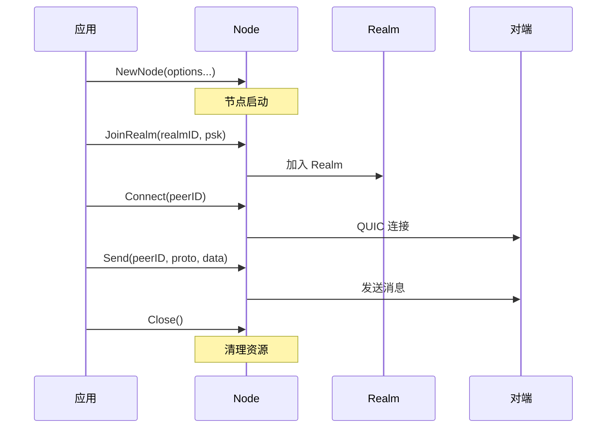

# REQ-API-001: Node API 设计

## 1. 元数据

| 属性 | 值 |
|------|---|
| **ID** | REQ-API-001 |
| **标题** | Node API 设计 |
| **类型** | dep2p-specific |
| **层级** | F7: API 层 |
| **优先级** | P0 |
| **状态** | draft |
| **创建日期** | 2026-01-11 |
| **更新日期** | 2026-01-23 |

---

## 2. 需求描述

设计 DeP2P 的核心入口 API（Node），提供简洁、一致、Realm 感知的编程接口，支持连接管理、消息传输和事件通知。

---

## 3. 背景与动机

### 3.1 问题陈述

现有 P2P 库的 API 设计存在以下问题：

1. **入口分散**：多个入口点，学习曲线陡峭
2. **配置复杂**：过多配置选项，难以上手
3. **缺乏 Realm 支持**：无原生业务隔离

### 3.2 目标

设计一个**简洁、统一、Realm 感知**的 API，让开发者能够：
- 5 分钟内启动一个节点
- 10 分钟内实现基本通信
- 轻松集成 Realm 隔离

### 3.3 竞品参考

| 产品 | 入口 | 配置方式 | 评价 |
|------|------|----------|------|
| **iroh** | `Endpoint` | Builder | 简洁，5 行代码启动 |
| **go-libp2p** | `Host` | 选项函数 | 灵活但复杂 |
| **torrent** | `Client` | 配置结构体 | 简单但专用 |

**选择**：结合 iroh 的简洁和 libp2p 的灵活，采用 Builder + 选项函数。

---

## 4. 需求详情

### 4.1 功能要求

1. **单一入口**：`Node` 作为唯一入口点
2. **灵活配置**：支持 Builder 和选项函数
3. **预设模式**：提供常用配置预设
4. **Realm 感知**：原生支持 Realm 隔离
5. **事件驱动**：支持事件订阅

### 4.2 Node 接口定义

```go
// Node 是 DeP2P 的核心入口
type Node interface {
    // === 身份 ===
    
    // ID 返回节点 ID
    ID() NodeID
    
    // NodeAddr 返回可分享的完整地址
    NodeAddr() (NodeAddr, error)
    
    // ListenAddrs 返回监听地址
    ListenAddrs() []Multiaddr
    
    // === Realm ===
    
    // JoinRealm 加入 Realm
    JoinRealm(ctx context.Context, realmID RealmID, psk []byte) error
    
    // LeaveRealm 离开当前 Realm
    LeaveRealm(ctx context.Context) error
    
    // CurrentRealm 返回当前 Realm
    CurrentRealm() (RealmID, bool)
    
    // === 连接 ===
    
    // Connect 通过 NodeID 连接（自动发现地址）
    // 
    // 语义：连接成功 = 可通信
    // - 传输层连接已建立（QUIC 握手完成）
    // - 协议层协商完成（版本兼容、身份验证）
    // - 如果目标在 Realm 内，Realm 认证已通过（PSK 验证）
    //
    // 连接失败应尽早暴露，不应存在"连接成功但发消息失败"的中间状态
    Connect(ctx context.Context, nodeID NodeID) (Connection, error)
    
    // ConnectToAddr 通过完整地址连接
    // 语义同 Connect()：连接成功 = 可通信
    ConnectToAddr(ctx context.Context, addr NodeAddr) (Connection, error)
    
    // Disconnect 断开与指定节点的连接
    Disconnect(nodeID NodeID) error
    
    // Connections 返回当前连接列表
    Connections() []Connection
    
    // === 消息（需要 JoinRealm）===
    
    // Send 发送消息（无响应）
    Send(ctx context.Context, to NodeID, proto string, data []byte) error
    
    // Request 发送请求（等待响应）
    Request(ctx context.Context, to NodeID, proto string, data []byte) ([]byte, error)
    
    // RegisterHandler 注册协议处理器
    RegisterHandler(proto string, handler Handler) error
    
    // === 事件 ===
    
    // Events 返回事件通道
    Events() <-chan Event
    
    // === 生命周期 ===
    
    // Close 关闭节点
    Close() error
}
```

### 4.3 创建方式

#### 选项函数方式

```go
// 使用选项函数
node, err := dep2p.NewNode(
    dep2p.WithPreset(dep2p.PresetDesktop),
    dep2p.WithIdentity(key),
    dep2p.WithListenAddrs("/ip4/0.0.0.0/udp/0/quic-v1"),
    dep2p.WithRelay(relayConfig),
)
```

#### Builder 方式

```go
// 使用 Builder
node, err := dep2p.Builder().
    WithPreset(dep2p.PresetDesktop).
    WithIdentity(key).
    WithListenAddrs("/ip4/0.0.0.0/udp/0/quic-v1").
    WithRelay(relayConfig).
    Build()
```

### 4.4 预设模式

| 预设 | 适用场景 | 配置特点 |
|------|----------|----------|
| `PresetDesktop` | 桌面应用 | 中等资源，NAT 穿透 |
| `PresetServer` | 服务器 | 高资源，可作为 Relay |
| `PresetMobile` | 移动设备 | 低资源，省电模式 |
| `PresetMinimal` | 嵌入式 | 最小资源 |

```go
// 预设使用
node, _ := dep2p.NewNode(dep2p.WithPreset(dep2p.PresetDesktop))
```

### 4.5 使用流程



### 4.6 完整示例

```go
package main

import (
    "context"
    "log"
    
    "github.com/dep2p/dep2p"
)

func main() {
    ctx := context.Background()
    
    // 1. 创建节点
    node, err := dep2p.NewNode(
        dep2p.WithPreset(dep2p.PresetDesktop),
    )
    if err != nil {
        log.Fatal(err)
    }
    defer node.Close()
    
    // 2. 获取可分享地址
    addr, _ := node.NodeAddr()
    log.Printf("Node: %s", addr)
    
    // 3. 加入 Realm
    psk := []byte("my-secret-key")
    if err := node.JoinRealm(ctx, "my-app", psk); err != nil {
        log.Fatal(err)
    }
    
    // 4. 注册处理器
    node.RegisterHandler("/my-app/echo/1.0", func(ctx context.Context, req Request) Response {
        return Response{Data: req.Data}
    })
    
    // 5. 连接对端
    conn, err := node.ConnectToAddr(ctx, peerAddr)
    if err != nil {
        log.Fatal(err)
    }
    
    // 6. 发送请求
    resp, err := node.Request(ctx, conn.RemoteID(), "/my-app/echo/1.0", []byte("hello"))
    log.Printf("Response: %s", resp)
    
    // 7. 监听事件
    go func() {
        for event := range node.Events() {
            switch e := event.(type) {
            case *PeerConnectedEvent:
                log.Printf("Peer connected: %s", e.PeerID)
            case *PeerDisconnectedEvent:
                log.Printf("Peer disconnected: %s", e.PeerID)
            }
        }
    }()
    
    // 8. 保持运行
    select {}
}
```

### 4.7 连接成功的层级定义

为避免"连接成功但无法通信"的问题，明确连接成功的层级：

| 层级 | 名称 | 含义 | 检查内容 |
|------|------|------|---------|
| L1 | 传输层连接 | QUIC 连接建立 | 握手完成 |
| L2 | 协议层连接 | DeP2P 协议协商完成 | 版本兼容、身份验证 |
| L3 | 应用层连接 | Realm 认证通过 | PSK 验证、成员检查 |

**Connect() 返回成功时保证**：
- L1：传输层连接已建立
- L2：协议层协商完成
- L3：如果目标是 Realm 内成员，Realm 认证已通过

**设计原则**：
- 连接失败应尽早暴露
- 不应存在"连接成功但发消息失败"的中间状态
- 如果需要 Realm 认证，应在 Connect 内完成

详见 [概念澄清文档 §15.1](../../../_discussions/20260123-nat-relay-concept-clarification.md)。

### 4.8 错误处理

| 场景 | 错误 | 说明 |
|------|------|------|
| 配置无效 | `ErrInvalidConfig` | 配置参数错误 |
| 节点已关闭 | `ErrClosed` | 节点已关闭 |
| 未加入 Realm | `ErrNotMember` | 业务 API 需要先 JoinRealm |
| 连接失败 | `ErrConnectionFailed` | 无法连接到对端 |
| 传输层失败 | `ErrTransportFailed` | QUIC 握手失败 |
| 协议协商失败 | `ErrProtocolNegotiationFailed` | 版本不兼容或身份验证失败 |
| Realm 认证失败 | `ErrRealmAuthFailed` | PSK 验证或成员检查失败 |
| 超时 | `ErrTimeout` | 操作超时 |

---

## 5. 验收标准

- [ ] 支持 NewNode() + 选项函数创建
- [ ] 支持 Builder() 方式创建
- [ ] 支持 4 种预设模式
- [ ] ID() 正确返回 NodeID
- [ ] NodeAddr() 返回可分享地址
- [ ] JoinRealm/LeaveRealm 正常工作
- [ ] Connect/ConnectToAddr 正常工作
- [ ] Send/Request 正常工作（需要 JoinRealm）
- [ ] Events() 正确推送事件
- [ ] Close() 正确清理资源
- [ ] 错误处理符合规范

---

## 6. 非功能要求

| 维度 | 要求 |
|------|------|
| **性能** | NewNode() < 100ms |
| **内存** | 空闲节点 < 10MB |
| **易用性** | 5 分钟可启动节点 |

---

## 7. 关联文档

| 类型 | 链接 |
|------|------|
| **概念澄清** | [NAT/Relay 概念澄清](../../../_discussions/20260123-nat-relay-concept-clarification.md) |
| **ADR** | [ADR-0003: 惰性中继策略](../../decisions/ADR-0003-relay-first-connect.md) |
| **竞品** | [API 设计对比](../../references/comparison/interface/01-api-design.md) |
| **竞品** | [iroh 分析](../../references/individual/iroh.md) |
| **需求** | [REQ-TRANS-002](../F2_transport/REQ-TRANS-002.md): 连接管理 |
| **需求** | [REQ-REALM-001](../F5_realm/REQ-REALM-001.md): Realm 隔离 |
| **架构** | L7: API 层 |

---

## 8. 实现追踪

### 8.1 代码引用

| 文件 | 符号 | 状态 |
|------|------|------|
| `pkg/dep2p/node.go` | `Node` | ⏳ 待实现 |
| `pkg/dep2p/options.go` | `Option` | ⏳ 待实现 |
| `pkg/dep2p/builder.go` | `Builder` | ⏳ 待实现 |
| `pkg/dep2p/presets.go` | `PresetDesktop` | ⏳ 待实现 |

### 8.2 测试证据

| 测试文件 | 测试函数 | 状态 |
|----------|----------|------|
| `pkg/dep2p/node_test.go` | `TestNewNode` | ⏳ 待实现 |
| `pkg/dep2p/node_test.go` | `TestNodeConnect` | ⏳ 待实现 |
| `pkg/dep2p/node_test.go` | `TestNodeSendRequest` | ⏳ 待实现 |

---

## 9. 变更历史

| 日期 | 版本 | 变更说明 |
|------|------|----------|
| 2026-01-11 | 1.0 | 初始版本 |
| 2026-01-23 | 1.1 | 根据概念澄清文档同步：补充 Connect() 语义（连接成功=可通信）、连接成功层级定义（传输层/协议层/应用层）、新增连接相关错误类型 |
