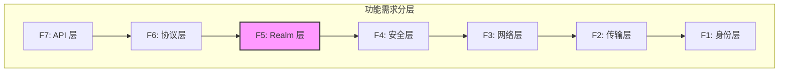
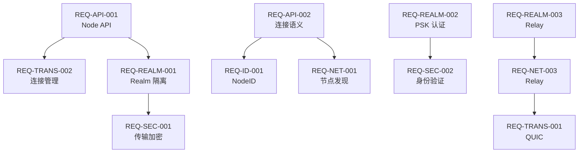

# 功能需求索引

> DeP2P 功能需求按七层架构分类

---

## 1. 概述

功能需求按照 P2P 网络分层模型组织：

> **注意**：F5 Realm 层是 DeP2P 独有设计，其他层参考业界最佳实践

---

## 2. 各层需求

### F1: 身份层 (Identity)

| ID | 标题 | 优先级 | 状态 |
|----|------|--------|------|
| [REQ-ID-001](F1_identity/REQ-ID-001.md) | NodeID 设计 | P0 | draft |
| [REQ-ID-002](F1_identity/REQ-ID-002.md) | 密钥管理 | P1 | draft |

**关键决策**：
- NodeID = Hash(PublicKey)，采用 Ed25519
- 参考 iroh 的简洁设计

### F2: 传输层 (Transport)

| ID | 标题 | 优先级 | 状态 |
|----|------|--------|------|
| [REQ-TRANS-001](F2_transport/REQ-TRANS-001.md) | QUIC 传输 | P0 | draft |
| [REQ-TRANS-002](F2_transport/REQ-TRANS-002.md) | 连接管理 | P0 | draft |
| [REQ-TRANS-003](F2_transport/REQ-TRANS-003.md) | 流多路复用 | P1 | draft |

**关键决策**：
- QUIC 作为核心传输协议
- 借鉴 iroh MagicSock 的路径抽象

### F3: 网络层 (Network)

| ID | 标题 | 优先级 | 状态 |
|----|------|--------|------|
| [REQ-NET-001](F3_network/REQ-NET-001.md) | 节点发现 | P0 | draft |
| [REQ-NET-002](F3_network/REQ-NET-002.md) | NAT 穿透 | P1 | draft |
| [REQ-NET-003](F3_network/REQ-NET-003.md) | Relay 中继 | P0 | draft |

**关键决策**：
- 多机制发现：Rendezvous + DHT + mDNS
- 统一 Relay（v2.0 缓存加速层）

### F4: 安全层 (Security)

| ID | 标题 | 优先级 | 状态 |
|----|------|--------|------|
| [REQ-SEC-001](F4_security/REQ-SEC-001.md) | 传输加密 | P0 | draft |
| [REQ-SEC-002](F4_security/REQ-SEC-002.md) | 身份验证 | P1 | draft |

**关键决策**：
- QUIC TLS 1.3 作为传输层安全
- Noise XX 用于应用层认证

### F5: Realm 层 (DeP2P 特有)

| ID | 标题 | 优先级 | 状态 |
|----|------|--------|------|
| [REQ-REALM-001](F5_realm/REQ-REALM-001.md) | Realm 强制隔离 | P0 | draft |
| [REQ-REALM-002](F5_realm/REQ-REALM-002.md) | Realm PSK 认证 | P1 | draft |
| [REQ-REALM-003](F5_realm/REQ-REALM-003.md) | Relay | P1 | draft |

**关键决策**：
- Realm 作为业务隔离域
- PSK 用于成员验证

### F6: 协议层 (Protocol)

| ID | 标题 | 优先级 | 状态 |
|----|------|--------|------|
| [REQ-PROTO-001](F6_protocol/REQ-PROTO-001.md) | 协议命名空间 | P1 | draft |
| [REQ-PROTO-002](F6_protocol/REQ-PROTO-002.md) | 消息格式 | P2 | draft |
| [REQ-PROTO-003](F6_protocol/REQ-PROTO-003.md) | 流式通信 | P1 | draft |

**关键决策**：
- 协议命名：`/dep2p/{domain}/{protocol}/{version}`
- Protobuf 作为消息格式

### F7: API 层 (Interface)

| ID | 标题 | 优先级 | 状态 |
|----|------|--------|------|
| [REQ-API-001](F7_api/REQ-API-001.md) | Node API 设计 | P0 | draft |
| [REQ-API-002](F7_api/REQ-API-002.md) | 连接语义 | P1 | draft |
| [REQ-API-003](F7_api/REQ-API-003.md) | 事件通知 | P2 | draft |

**关键决策**：
- 单一 Node 入口
- Builder + 选项函数配置

---

## 3. 需求依赖关系

---

## 4. 实施顺序建议

### 阶段 1：基础设施（P0）

1. REQ-ID-001: NodeID 设计
2. REQ-TRANS-001: QUIC 传输
3. REQ-SEC-001: 传输加密
4. REQ-TRANS-002: 连接管理

### 阶段 2：网络能力（P0）

5. REQ-NET-001: 节点发现
6. REQ-NET-003: Relay 中继
7. REQ-REALM-001: Realm 强制隔离

### 阶段 3：接口完善（P0/P1）

8. REQ-API-001: Node API 设计
9. REQ-API-002: 连接语义
10. REQ-PROTO-001: 协议命名空间

### 阶段 4：增强功能（P1/P2）

11. REQ-NET-002: NAT 穿透
12. REQ-REALM-002: Realm PSK 认证
13. REQ-REALM-003: Relay
14. REQ-API-003: 事件通知

---

**最后更新**：2026-01-11
