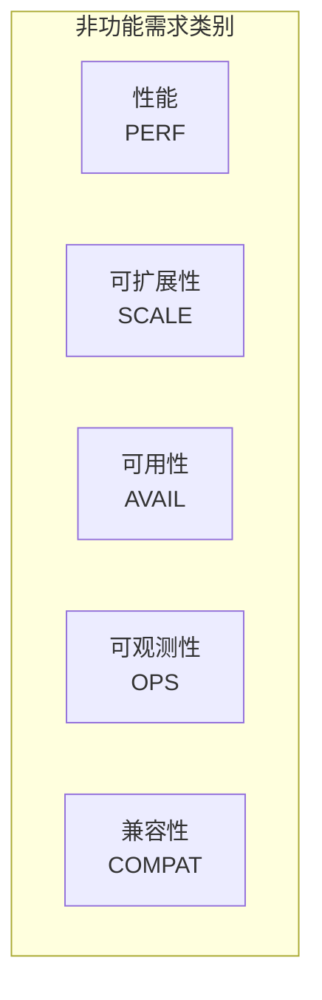

# 非功能需求索引

> 定义 DeP2P 的性能、可扩展性、可用性、可观测性等非功能需求

---

## 1. 概述

非功能需求（NFR）定义系统的**质量属性**，而非具体功能。这些需求对系统的可用性、可维护性和用户体验至关重要。

---

## 2. 需求列表

### 2.1 性能需求 (PERF)

| ID | 标题 | 优先级 | 状态 |
|----|------|--------|------|
| [REQ-PERF-001](REQ-PERF-001.md) | 性能基准 | P1 | draft |

**关键指标**：
- 连接建立延迟
- 消息吞吐量
- 内存占用
- CPU 使用率

### 2.2 可扩展性需求 (SCALE)

| ID | 标题 | 优先级 | 状态 |
|----|------|--------|------|
| [REQ-SCALE-001](REQ-SCALE-001.md) | 可扩展性 | P1 | draft |

**关键指标**：
- 最大连接数
- 最大节点数
- 最大 Realm 数

### 2.3 可用性需求 (AVAIL)

| ID | 标题 | 优先级 | 状态 |
|----|------|--------|------|
| [REQ-AVAIL-001](REQ-AVAIL-001.md) | 可用性 | P2 | draft |

**关键指标**：
- 故障恢复时间
- 连接保活
- 优雅降级

### 2.4 可观测性需求 (OPS)

| ID | 标题 | 优先级 | 状态 |
|----|------|--------|------|
| [REQ-OPS-001](REQ-OPS-001.md) | 可观测性 | P1 | draft |

**关键指标**：
- 日志级别
- Metrics 导出
- 诊断接口

### 2.5 兼容性需求 (COMPAT)

| ID | 标题 | 优先级 | 状态 |
|----|------|--------|------|
| [REQ-COMPAT-001](REQ-COMPAT-001.md) | 兼容性 | P2 | draft |

**关键指标**：
- 协议版本兼容
- API 向后兼容
- 平台支持

---

## 3. 优先级说明

| 优先级 | 需求 | 说明 |
|--------|------|------|
| **P1** | PERF, SCALE, OPS | 生产环境必需 |
| **P2** | AVAIL, COMPAT | 增强功能 |

---

## 4. 来源追溯

### 4.1 竞品分析驱动

| 竞品特性 | 对应需求 | 参考 |
|----------|----------|------|
| iroh 低延迟 | REQ-PERF-001 | 连接建立 < 100ms |
| libp2p 大规模 | REQ-SCALE-001 | 支持万级连接 |

### 4.2 能力缺口分析

能力缺口分析：

| 缺口 | 对应需求 | 说明 |
|------|----------|------|
| Prometheus 指标 | REQ-OPS-001 | 生产监控 |
| ResourceManager | REQ-PERF-001 | 资源限额 |

---

## 5. 相关文档

| 类型 | 链接 |
|------|------|
| 功能需求 | [functional/](../functional/) |
| 竞品分析 | [references/](../../references/) |

---

**最后更新**：2026-01-11
