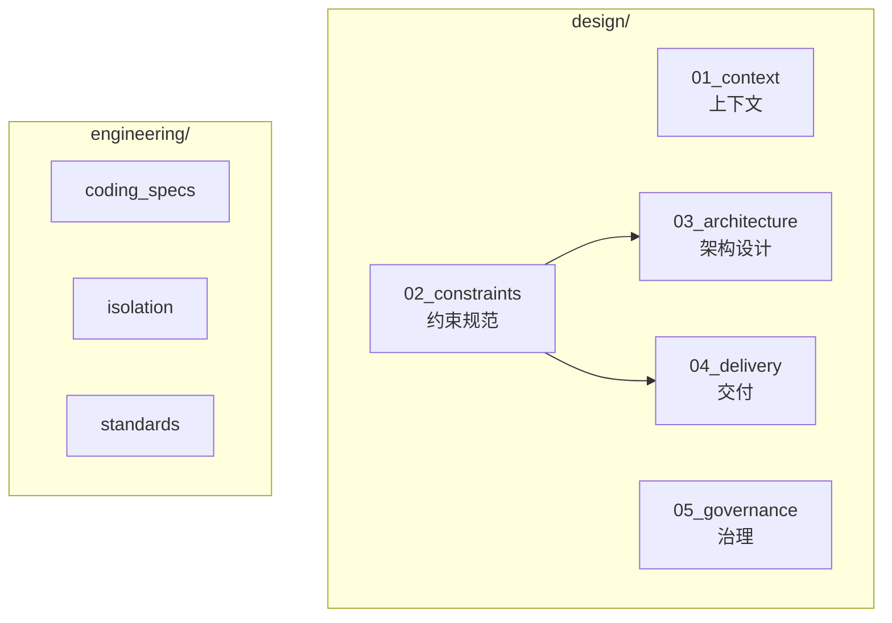
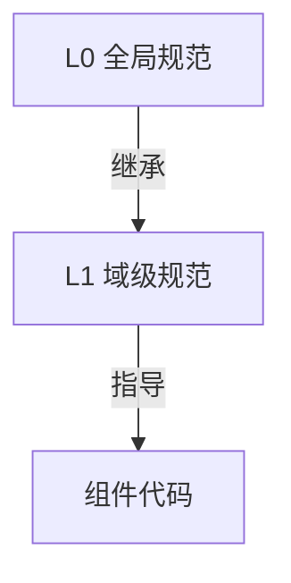

# 工程约束与标准 (Engineering)

> 定义 DeP2P 的工程约束、编码规范和工程标准

---

## 目录结构

```
engineering/
├── README.md                       # 本文件 - 工程约束总览
├── coding_specs/                   # 两层编码规范体系
│   ├── README.md                   # 编码规范总览
│   ├── L0_global/                  # 全局基础规范（所有组件共享）
│   │   ├── README.md
│   │   ├── code_style.md           # 代码风格
│   │   ├── error_handling.md       # 错误处理
│   │   ├── logging.md              # 日志规范
│   │   └── testing.md              # 测试规范
│   └── L1_domain/                  # 域级规范（P2P 五层架构特有）
│       ├── README.md
│       ├── transport_domain.md     # 传输层规范
│       ├── network_domain.md       # 网络层规范
│       ├── protocol_domain.md      # 协议层规范
│       └── security_domain.md      # 安全层规范
├── isolation/                      # 隔离约束
│   ├── README.md                   # 隔离策略总览
│   ├── testing_isolation.md        # 测试隔离策略
│   └── network_boundary.md         # 网络边界约束
└── standards/                      # 工程标准
    ├── README.md                   # 工程标准总览
    ├── code_standards.md           # 代码规范
    ├── api_standards.md            # API 设计标准
    ├── naming_conventions.md       # 命名约定
    └── documentation.md            # 文档规范
```

---

## 与设计体系的关系



---

## 与软件架构的关系

工程约束与五层软件架构的对应关系：

| 架构层 | 对应域规范 | 核心关注 |
|--------|-----------|---------|
| **API Layer** | - | API 设计标准 |
| **Protocol Layer** | protocol_domain.md | 协议协商、消息格式 |
| **Realm Layer** | security_domain.md | 认证、隔离边界 |
| **Core Layer** | transport_domain.md | QUIC、连接池、资源释放 |
| **Discovery Layer** | network_domain.md | 发现、NAT、Relay |

详见：[层次模型](../03_architecture/L2_structural/layer_model.md)

---

## 核心原则

### 1. 代码质量

| 原则 | 说明 |
|------|------|
| **可读性优先** | 代码应该易于理解 |
| **显式优于隐式** | 避免魔法值和隐式行为 |
| **错误不可忽略** | 所有错误必须处理 |
| **测试先行** | 新功能伴随测试 |

### 2. P2P 特有关注

```
┌─────────────────────────────────────────────────────────────┐
│                    P2P 特有关注点                            │
├─────────────────────────────────────────────────────────────┤
│                                                             │
│  连接管理                                                   │
│  ────────                                                   │
│  • 连接生命周期                                             │
│  • 资源释放                                                 │
│  • 超时处理                                                 │
│                                                             │
│  隔离边界                                                   │
│  ────────                                                   │
│  • Realm 隔离                                               │
│  • 控制面/数据面分离                                        │
│  • 测试隔离                                                 │
│                                                             │
│  安全要求                                                   │
│  ────────                                                   │
│  • 身份验证                                                 │
│  • 传输加密                                                 │
│  • 访问控制                                                 │
│                                                             │
└─────────────────────────────────────────────────────────────┘
```

### 3. 隔离优先

| 原则 | 说明 |
|------|------|
| 测试隔离 | 单元测试不连外网 |
| Realm 隔离 | 业务数据不跨 Realm |
| 协议隔离 | 控制面/数据面分离 |

---

## 编码规范体系

### 两层架构



| 层级 | 职责 | 适用范围 |
|------|------|----------|
| **L0 全局** | 代码风格、错误处理、日志、测试 | 所有组件 |
| **L1 域级** | 传输、网络、协议、安全特有规范 | 按域划分 |

### L0 全局规范

| 文档 | 说明 |
|------|------|
| [code_style.md](coding_specs/L0_global/code_style.md) | 格式化、导入、命名 |
| [error_handling.md](coding_specs/L0_global/error_handling.md) | 错误处理模式 |
| [logging.md](coding_specs/L0_global/logging.md) | 日志级别、格式 |
| [testing.md](coding_specs/L0_global/testing.md) | 测试分类、覆盖率 |

### L1 域级规范

| 域 | 文档 | 核心关注 |
|----|------|----------|
| 传输层 | [transport_domain.md](coding_specs/L1_domain/transport_domain.md) | QUIC、连接池、资源释放 |
| 网络层 | [network_domain.md](coding_specs/L1_domain/network_domain.md) | 发现、NAT、Relay |
| 协议层 | [protocol_domain.md](coding_specs/L1_domain/protocol_domain.md) | 协议协商、消息格式 |
| 安全层 | [security_domain.md](coding_specs/L1_domain/security_domain.md) | 身份验证、加密 |

---

## 隔离约束

### 隔离级别

| 级别 | 外网 | 适用 |
|------|------|------|
| **L0** | 禁止 | 单元测试 |
| **L1** | 禁止 | 集成测试 |
| **L2** | 受控 | E2E 测试 |
| **L3** | 允许 | 压力测试 |

### 隔离文档

| 文档 | 说明 |
|------|------|
| [testing_isolation.md](isolation/testing_isolation.md) | 测试隔离策略 |
| [network_boundary.md](isolation/network_boundary.md) | 网络边界约束 |

---

## 工程标准

### 标准列表

| 文档 | 说明 |
|------|------|
| [code_standards.md](standards/code_standards.md) | 模块结构、依赖管理 |
| [api_standards.md](standards/api_standards.md) | API 设计原则 |
| [naming_conventions.md](standards/naming_conventions.md) | 命名规则 |
| [documentation.md](standards/documentation.md) | 文档编写标准 |

---

## 自动化检查

### 工具配置

| 工具 | 用途 | 集成点 |
|------|------|--------|
| gofmt | 格式化 | pre-commit |
| golangci-lint | 代码检查 | CI |
| markdownlint | 文档格式 | CI |

### CI 检查

```
CI 检查流程：

  1. 格式化检查
     gofmt -d .
     
  2. 代码检查
     golangci-lint run
     
  3. 测试
     go test ./...
     
  4. 覆盖率
     go test -cover ./...
```

---

## 与其他文档的关联

| 文档 | 关联内容 |
|------|----------|
| [需求文档](../../01_context/requirements/) | 功能和非功能需求 |
| [ADR 决策](../../01_context/decisions/) | 架构决策记录 |
| [不变量](../../01_context/decisions/invariants/) | 系统不变量 |
| [协议规范](../protocol/) | 协议规范 |

---

## 快速导航

### 按主题

| 主题 | 文档 |
|------|------|
| 代码格式 | [code_style.md](coding_specs/L0_global/code_style.md) |
| 错误处理 | [error_handling.md](coding_specs/L0_global/error_handling.md) |
| 日志 | [logging.md](coding_specs/L0_global/logging.md) |
| 测试 | [testing.md](coding_specs/L0_global/testing.md), [testing_isolation.md](isolation/testing_isolation.md) |
| API 设计 | [api_standards.md](standards/api_standards.md) |
| 命名 | [naming_conventions.md](standards/naming_conventions.md) |

### 按域

| 域 | 文档 |
|----|------|
| 传输层 | [transport_domain.md](coding_specs/L1_domain/transport_domain.md) |
| 网络层 | [network_domain.md](coding_specs/L1_domain/network_domain.md) |
| 协议层 | [protocol_domain.md](coding_specs/L1_domain/protocol_domain.md) |
| 安全层 | [security_domain.md](coding_specs/L1_domain/security_domain.md) |

---

## 变更记录

| 日期 | 版本 | 变更内容 |
|------|------|----------|
| 2026-01-27 | 1.0 | 统一规范重构 |

---

**最后更新**：2026-01-27
