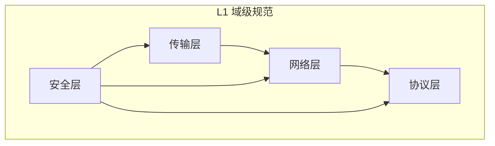

# L1 域级规范

> P2P 网络库四个核心域的编码约束

---

## 域划分



---

## 四域概览

| 域 | 文件 | 核心职责 |
|----|------|----------|
| **传输层** | [transport_domain.md](transport_domain.md) | QUIC 连接、流复用、资源管理 |
| **网络层** | [network_domain.md](network_domain.md) | 发现、NAT 穿透、Relay |
| **协议层** | [protocol_domain.md](protocol_domain.md) | 协议协商、消息格式、版本 |
| **安全层** | [security_domain.md](security_domain.md) | 身份验证、加密、访问控制 |

---

## 域间关系

```
┌─────────────────────────────────────────────────────────────┐
│                        域间依赖                              │
├─────────────────────────────────────────────────────────────┤
│                                                             │
│   协议层 ─────────────▶ 传输层                              │
│     │                      │                                │
│     │                      │                                │
│     ▼                      ▼                                │
│   网络层 ◀────────────────┘                                │
│                                                             │
│   安全层 ═══════════════════════════════════▶ 所有层        │
│                                                             │
└─────────────────────────────────────────────────────────────┘
```

---

## 域特有关注点

### 传输层

| 关注点 | 说明 |
|--------|------|
| 连接生命周期 | 建立、维护、关闭 |
| 资源释放 | 连接池、流清理 |
| 超时处理 | 握手、空闲、操作超时 |
| 错误恢复 | 重连、路径切换 |

### 网络层

| 关注点 | 说明 |
|--------|------|
| 发现策略 | Bootstrap、DHT、mDNS |
| NAT 穿透 | 打洞、Relay 回退 |
| 路径选择 | 直连 vs Relay |
| 地址管理 | 地址簿、地址验证 |

### 协议层

| 关注点 | 说明 |
|--------|------|
| 协议协商 | 版本、能力 |
| 消息格式 | 序列化、长度前缀 |
| 流量控制 | 背压、限流 |
| 兼容性 | 向前/向后兼容 |

### 安全层

| 关注点 | 说明 |
|--------|------|
| 身份验证 | NodeID 验证 |
| 加密要求 | TLS 1.3、可选 Noise |
| 密钥管理 | 生成、存储、轮换 |
| 访问控制 | Realm PSK |

---

## 使用方式

1. 首先阅读 [L0 全局规范](../L0_global/)
2. 然后阅读相关域的 L1 规范
3. 在编码时同时遵守 L0 和 L1 约束

---

## 与架构的关联

| 域规范 | 相关架构 |
|--------|----------|
| transport_domain | [传输层架构](../../../../03_architecture/) |
| network_domain | [网络层架构](../../../../03_architecture/) |
| protocol_domain | [协议层架构](../../../../03_architecture/) |
| security_domain | [安全层架构](../../../../03_architecture/) |

---

## 相关文档

- [L0 全局规范](../L0_global/)
- [工程标准](../../standards/)
- [ADR 架构决策](../../../01_context/decisions/)

---

**最后更新**：2026-01-11
