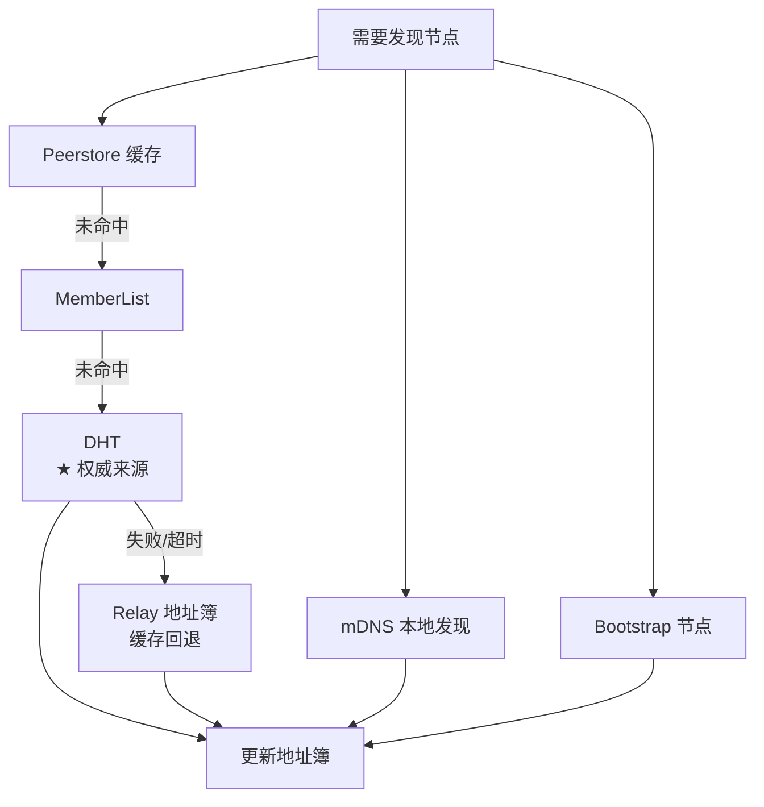
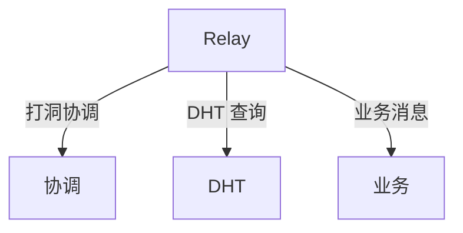

# 网络层编码规范

> 定义 DeP2P 网络层组件的编码约束

---

## 域职责

网络层负责节点发现、NAT 穿透和路径管理。

```
┌─────────────────────────────────────────────────────────────┐
│                    网络层职责边界                            │
├─────────────────────────────────────────────────────────────┤
│                                                             │
│  负责：                                                     │
│    • 节点发现（Bootstrap、DHT、mDNS、Rendezvous）           │
│    • NAT 穿透（打洞、端口映射）                              │
│    • Relay 中继管理                                         │
│    • 路径选择和优化                                          │
│                                                             │
│  不负责：                                                   │
│    • 底层连接（传输层）                                      │
│    • 协议消息（协议层）                                      │
│    • 身份验证（安全层）                                      │
│                                                             │
└─────────────────────────────────────────────────────────────┘
```

---

## 发现机制

> DHT 是权威目录，Relay 地址簿是缓存加速层

### 多机制策略



### 发现优先级

| 机制 | 优先级 | 适用场景 | 权威性 |
|------|--------|----------|--------|
| Peerstore 缓存 | 1（最高） | 已知节点 | 缓存 |
| MemberList | 2 | Realm 成员 | 缓存 |
| **DHT** | **3** | **NodeID 解析** | **★ 权威** |
| Relay 地址簿 | 4 | DHT 失败回退 | 缓存 |
| mDNS | 5 | 局域网 | 本地 |
| Bootstrap | 6（最低） | 冷启动 | 入口 |

### 三层架构

```
Layer 1: DHT（★ 权威目录） — 存储签名 PeerRecord
Layer 2: 缓存加速层 — Peerstore / MemberList / Relay 地址簿
Layer 3: 连接策略 — 直连 → 打洞 → Relay 兜底
```

### 发现结果处理

```
发现结果处理伪代码：

  FUNCTION handle_discovery_result(peer_id, addrs, source)
    IF addrs is empty THEN
      RETURN
    END
    
    existing = address_book.get(peer_id)
    
    FOR EACH addr IN addrs
      IF addr.is_valid() AND not existing.contains(addr) THEN
        address_book.add(peer_id, addr, source, ttl)
      END
    END
    
    trigger_address_validation(peer_id)
  END
```

---

## NAT 穿透

### 穿透策略

```
┌─────────────────────────────────────────────────────────────┐
│                    NAT 穿透策略                              │
├─────────────────────────────────────────────────────────────┤
│                                                             │
│  1. 检测 NAT 类型                                           │
│  2. 尝试 UPnP/NAT-PMP 端口映射                              │
│  3. 尝试 UDP 打洞                                           │
│  4. 回退到 Relay 中继                                       │
│                                                             │
│  策略选择基于：                                              │
│    • NAT 类型（Full Cone vs Symmetric）                     │
│    • 网络条件                                               │
│    • 历史成功率                                             │
│                                                             │
└─────────────────────────────────────────────────────────────┘
```

### 打洞流程

```
打洞伪代码：

  FUNCTION hole_punch(local_node, remote_node)
    // 通过 Relay 交换地址
    local_addrs = get_external_addrs()
    remote_addrs = exchange_addrs_via_relay(remote_node, local_addrs)
    
    // 同时尝试连接
    FOR EACH addr IN remote_addrs
      spawn_punch_attempt(addr)
    END
    
    // 等待任一成功
    conn = wait_for_first_success(timeout)
    
    IF conn != nil THEN
      upgrade_to_direct(conn)
    ELSE
      continue_with_relay()
    END
  END
```

---

## Relay 管理

### 统一 Relay 架构



### Relay 选择规则

| 条件 | 选择 | 原因 |
|------|------|------|
| 系统协议 | Relay | 协议前缀隔离 |
| 业务协议 | Relay | Realm 成员认证 |
| 无 Relay | 降级失败 | 兜底不可用 |

### Relay 连接管理

```
Relay 连接管理伪代码：

  FUNCTION maintain_relay_connection(relay_url)
    LOOP
      IF not connected(relay_url) THEN
        conn = connect_with_backoff(relay_url)
        IF conn != nil THEN
          register_as_client(conn)
        END
      END
      
      send_keepalive()
      SLEEP(keepalive_interval)
    END
  END
```

---

## 路径管理

### 路径类型

| 类型 | 延迟 | 优先级 |
|------|------|--------|
| 直连 IPv4 | 最低 | 最高 |
| 直连 IPv6 | 低 | 高 |
| Relay | 高 | 低 |

### 路径选择算法

```
路径选择伪代码：

  FUNCTION select_best_path(peer_id)
    paths = get_all_paths(peer_id)
    
    // 按延迟排序
    sort_by_latency(paths)
    
    // 优先直连
    direct_paths = filter_direct(paths)
    IF not empty(direct_paths) THEN
      RETURN direct_paths[0]
    END
    
    // 回退到 Relay
    relay_paths = filter_relay(paths)
    RETURN relay_paths[0]
  END
```

### 路径升级（已更新）

> 基于 2026-01-22/23 测试反馈更新，详见 [测试计划](../../../_discussions/20260122-split-infra-test-plan.md) 和 [NAT/Relay 概念澄清](../../../_discussions/20260123-nat-relay-concept-clarification.md)

```
路径升级规则：

  当前使用 Relay：
    1. 后台尝试打洞/直连
    2. 直连成功后验证 RTT
    3. RTT 更优则迁移流量
    4. ★ 保留 Relay 作为备份路径（不关闭）
    
  保留 Relay 的原因：
    • 直连可能因网络波动断开，需要快速回退
    • 其他节点（A*）可能仍需通过此 Relay 连接
    • 连接重建成本高，保留备份代价低
```

---

## 地址管理

### 地址簿规范

| 字段 | 用途 | TTL |
|------|------|-----|
| 节点地址 | 连接目标 | 1 小时 |
| 外部地址 | 自身公告 | 动态更新 |
| Relay 地址 | 中继节点 | 持久 |

### 地址验证

```
地址验证伪代码：

  FUNCTION validate_address(peer_id, addr)
    // 尝试连接
    conn = dial_with_timeout(addr, validation_timeout)
    
    IF conn == nil THEN
      mark_invalid(peer_id, addr)
      RETURN false
    END
    
    // 验证身份
    remote_id = conn.remote_id()
    IF remote_id != peer_id THEN
      conn.close()
      mark_invalid(peer_id, addr)
      RETURN false
    END
    
    mark_valid(peer_id, addr)
    RETURN true
  END
```

---

## 错误处理

### 网络层错误

| 错误 | 处理 | 重试 |
|------|------|------|
| 发现超时 | 使用缓存 | 延迟重试 |
| 打洞失败 | 使用 Relay | - |
| Relay 不可用 | 切换 Relay | 立即 |
| 地址无效 | 标记过期 | - |

### 降级策略

```
降级策略伪代码：

  FUNCTION connect_to_peer(peer_id)
    // 尝试直连
    conn = try_direct_connect(peer_id)
    IF conn != nil THEN
      RETURN conn
    END
    
    // 尝试打洞
    conn = try_hole_punch(peer_id)
    IF conn != nil THEN
      RETURN conn
    END
    
    // 使用 Relay
    conn = connect_via_relay(peer_id)
    IF conn != nil THEN
      schedule_upgrade_attempt(peer_id)
      RETURN conn
    END
    
    RETURN nil, ErrConnectFailed
  END
```

---

## 验证清单

| 检查项 | 说明 |
|--------|------|
| 多机制发现 | 至少支持 2 种 |
| NAT 穿透 | 有打洞和 Relay 回退 |
| 路径优化 | 自动升级到直连 |
| 地址验证 | 验证后才使用 |

---

## 相关文档

- [ADR-0003](../../../01_context/decisions/ADR-0003-relay-first-connect.md): 中继优先连接
- [ADR-0008](../../../01_context/decisions/ADR-0008-discovery-strategy.md): 发现策略
- [ADR-0010](../../../01_context/decisions/ADR-0010-relay-explicit-config.md): Relay 明确配置
- [REQ-NET-001](../../../01_context/requirements/functional/F3_network/REQ-NET-001.md): 发现需求

---

**最后更新**：2026-01-27
