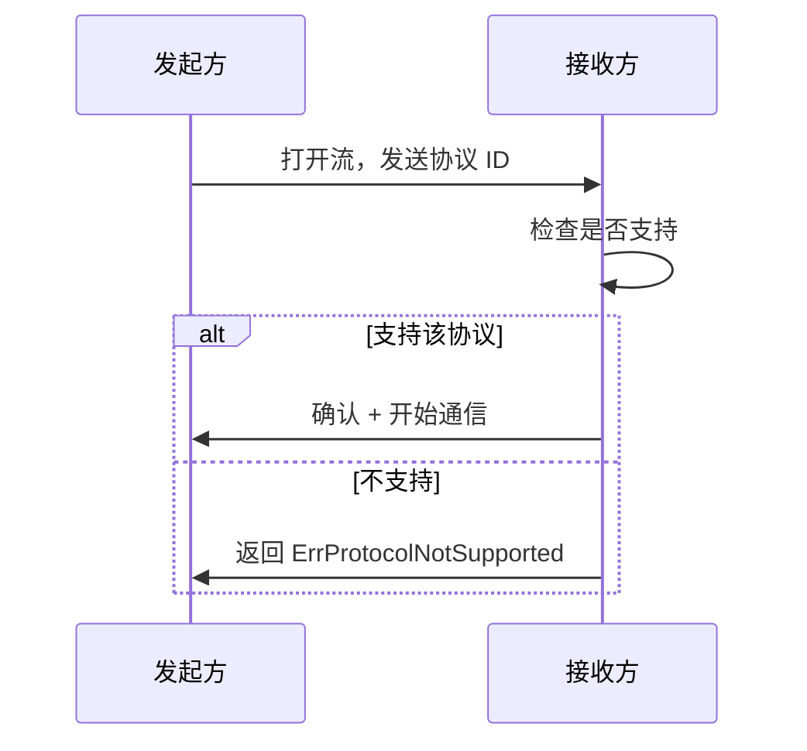

# 协议层编码规范

> 定义 DeP2P 协议层组件的编码约束

---

## 域职责

协议层负责协议协商、消息格式和通信模式。

```
┌─────────────────────────────────────────────────────────────┐
│                    协议层职责边界                            │
├─────────────────────────────────────────────────────────────┤
│                                                             │
│  负责：                                                     │
│    • 协议命名和版本管理                                      │
│    • 协议协商流程                                            │
│    • 消息格式和序列化                                        │
│    • 通信模式（请求响应、流式等）                            │
│                                                             │
│  不负责：                                                   │
│    • 底层连接（传输层）                                      │
│    • 节点发现（网络层）                                      │
│    • 加密（安全层处理）                                      │
│                                                             │
└─────────────────────────────────────────────────────────────┘
```

---

## 协议命名

### 命名规范

```
协议 ID 格式：
  
  /dep2p/{domain}/{protocol}/{version}
  
示例：
  /dep2p/sys/identify/1.0.0     # 系统协议
  /dep2p/realm/abc123/chat/1.0.0  # Realm 协议
  /dep2p/app/abc123/custom/1.0.0  # 应用协议
```

### 协议分类

| 前缀 | 分类 | 用途 |
|------|------|------|
| /dep2p/sys/ | 系统协议 | 基础设施 |
| /dep2p/realm/{id}/ | Realm 协议 | Realm 控制 |
| /dep2p/app/{id}/ | 应用协议 | 业务逻辑 |

### 版本规范

```
版本号规则：
  
  格式：major.minor.patch
  
  major: 不兼容变更
  minor: 向后兼容新功能
  patch: 向后兼容修复
```

---

## 协议协商

### 协商流程



### 协商规则

```
协议协商伪代码：

  FUNCTION negotiate_protocol(stream, wanted_protocols)
    FOR EACH proto IN wanted_protocols
      write_protocol_id(stream, proto)
      
      response = read_response(stream)
      IF response == ACCEPT THEN
        RETURN proto
      END
    END
    
    RETURN nil, ErrNoMatchingProtocol
  END
```

---

## 消息格式

### 消息结构

```
┌─────────────────────────────────────────────────────────────┐
│                    消息结构                                  │
├─────────────────────────────────────────────────────────────┤
│                                                             │
│  ┌──────────┬──────────┬──────────────────────────┐        │
│  │  长度    │  头部    │        消息体            │        │
│  │ (varint) │ (固定)   │       (变长)             │        │
│  └──────────┴──────────┴──────────────────────────┘        │
│                                                             │
│  长度：varint 编码，表示后续字节数                           │
│  头部：类型、请求ID、标志位、版本                            │
│  消息体：Protobuf 编码的业务数据                            │
│                                                             │
└─────────────────────────────────────────────────────────────┘
```

### 头部字段

| 字段 | 大小 | 用途 |
|------|------|------|
| 类型 | 1 byte | 消息类型 |
| 请求 ID | 4 bytes | 请求响应匹配 |
| 标志位 | 1 byte | 压缩、加密等 |
| 版本 | 1 byte | 协议版本 |

### 序列化规则

```
序列化规则：

  1. 使用 Protobuf 作为主要序列化格式
  2. 长度使用 varint 前缀
  3. 大端序用于固定长度字段
  4. 最大消息大小限制：4MB
```

---

## 通信模式

### 支持的模式

| 模式 | 说明 | 适用场景 |
|------|------|----------|
| 请求-响应 | 一问一答 | RPC 调用 |
| 单向通知 | 只发不回 | 事件通知 |
| 服务端流 | 请求后多响应 | 数据同步 |
| 双向流 | 双方持续交互 | 实时通信 |

### 请求-响应模式

```
请求-响应伪代码：

  FUNCTION request(peer, protocol, data)
    stream = open_stream(peer)
    DEFER stream.close()
    
    // 发送请求
    req_id = generate_request_id()
    write_message(stream, REQUEST, req_id, data)
    
    // 等待响应
    response = read_message_with_timeout(stream, timeout)
    
    IF response.req_id != req_id THEN
      RETURN nil, ErrRequestIdMismatch
    END
    
    RETURN response.data
  END
```

### 流式模式

```
流式通信伪代码：

  FUNCTION stream_data(peer, protocol)
    stream = open_stream(peer)
    
    // 发送端
    FOR EACH item IN data_source
      write_message(stream, STREAM_DATA, item)
    END
    write_message(stream, STREAM_END)
    
    // 接收端
    WHILE true
      msg = read_message(stream)
      IF msg.type == STREAM_END THEN
        BREAK
      END
      process(msg.data)
    END
  END
```

---

## 版本兼容

### 兼容性规则

```
┌─────────────────────────────────────────────────────────────┐
│                    版本兼容规则                              │
├─────────────────────────────────────────────────────────────┤
│                                                             │
│  向后兼容（必须支持）：                                      │
│    • 新增可选字段                                           │
│    • 新增枚举值                                             │
│    • 新增可选消息                                           │
│                                                             │
│  不兼容（需要新版本）：                                      │
│    • 删除必需字段                                           │
│    • 修改字段类型                                           │
│    • 修改字段编号                                           │
│                                                             │
└─────────────────────────────────────────────────────────────┘
```

### 版本协商

```
版本协商伪代码：

  FUNCTION negotiate_version(peer, supported_versions)
    // 从高到低尝试
    FOR EACH version IN sorted_desc(supported_versions)
      IF peer_supports(peer, version) THEN
        RETURN version
      END
    END
    
    RETURN nil, ErrNoCompatibleVersion
  END
```

---

## 流量控制

### 背压处理

```
背压处理伪代码：

  FUNCTION write_with_backpressure(stream, data)
    WHILE stream.buffer_full()
      IF timeout_exceeded THEN
        RETURN ErrWriteTimeout
      END
      wait_for_drain(stream)
    END
    
    RETURN stream.write(data)
  END
```

### 限流规则

| 限制 | 默认值 | 可配置 |
|------|--------|--------|
| 最大消息大小 | 4 MB | 是 |
| 最大并发流 | 256 | 是 |
| 消息速率 | 1000/s | 是 |

---

## 错误处理

### 协议错误

| 错误 | 处理 |
|------|------|
| ErrProtocolNotSupported | 尝试备选协议 |
| ErrVersionMismatch | 降级或拒绝 |
| ErrMalformedMessage | 关闭流 |
| ErrMessageTooLarge | 拒绝处理 |

### 错误码传递

```
错误响应格式：

  {
    "error_code": "PROTOCOL_NOT_SUPPORTED",
    "message": "协议 /dep2p/app/xxx 不支持",
    "details": { ... }
  }
```

---

## 验证清单

| 检查项 | 说明 |
|--------|------|
| 协议命名 | 符合 /dep2p/... 格式 |
| 版本号 | 符合 semver |
| 消息格式 | 有长度前缀 |
| 兼容性 | 遵循兼容规则 |

---

## 相关文档

- [ADR-0007](../../../01_context/decisions/ADR-0007-protocol-naming.md): 协议命名规范
- [REQ-PROTO-001](../../../01_context/requirements/functional/F6_protocol/REQ-PROTO-001.md): 协议命名需求
- [REQ-PROTO-002](../../../01_context/requirements/functional/F6_protocol/REQ-PROTO-002.md): 消息格式需求

---

**最后更新**：2026-01-11
