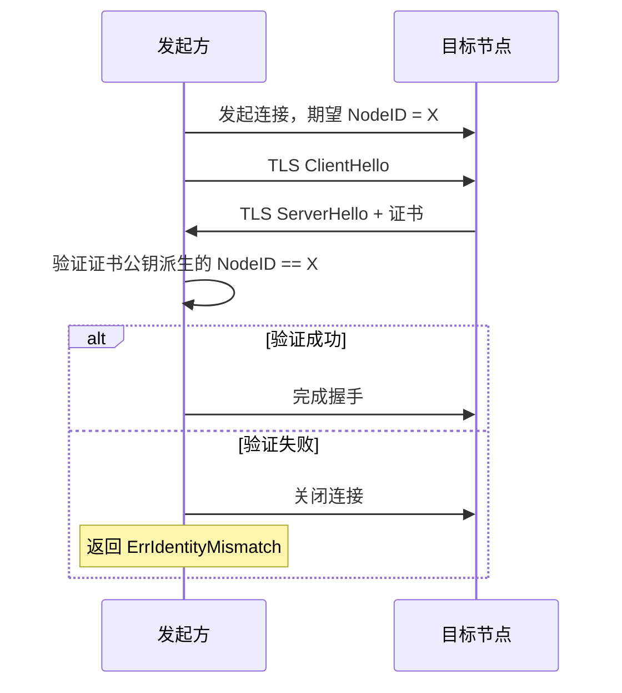

# 安全层编码规范

> 定义 DeP2P 安全层组件的编码约束

---

## 域职责

安全层负责身份验证、加密和访问控制。

```
┌─────────────────────────────────────────────────────────────┐
│                    安全层职责边界                            │
├─────────────────────────────────────────────────────────────┤
│                                                             │
│  负责：                                                     │
│    • 节点身份生成和验证                                      │
│    • 传输加密（TLS 1.3）                                    │
│    • 密钥生成和管理                                          │
│    • Realm PSK 认证                                         │
│    • 访问控制决策                                            │
│                                                             │
│  不负责：                                                   │
│    • 底层连接（传输层）                                      │
│    • 业务逻辑（应用层）                                      │
│                                                             │
└─────────────────────────────────────────────────────────────┘
```

---

## 身份验证

### NodeID 设计

```
NodeID 派生规则：

  私钥 → 公钥 → 哈希 → NodeID
  
  1. 生成 Ed25519 密钥对
  2. 公钥进行 SHA-256 哈希
  3. 取前 32 字节作为 NodeID
```

### 身份验证流程



### 验证规则

```
身份验证伪代码：

  FUNCTION verify_identity(conn, expected_id)
    remote_pubkey = conn.remote_certificate().public_key()
    remote_id = derive_node_id(remote_pubkey)
    
    IF remote_id != expected_id THEN
      conn.close()
      log.warn("identity mismatch", 
        "expected", expected_id, 
        "actual", remote_id)
      RETURN ErrIdentityMismatch
    END
    
    RETURN nil
  END
```

---

## 传输加密

### 加密要求

```
┌─────────────────────────────────────────────────────────────┐
│                    加密层次                                  │
├─────────────────────────────────────────────────────────────┤
│                                                             │
│  必须（QUIC 内置）：                                        │
│    • TLS 1.3                                                │
│    • 证书绑定 NodeID                                        │
│                                                             │
│  可选（应用层）：                                           │
│    • Noise XX 协议                                          │
│    • 端到端加密                                             │
│                                                             │
└─────────────────────────────────────────────────────────────┘
```

### TLS 配置

| 配置项 | 要求 |
|--------|------|
| 最低版本 | TLS 1.3 |
| 证书类型 | 自签名（绑定 NodeID） |
| 密码套件 | TLS_AES_256_GCM_SHA384 |
| ALPN | dep2p/1.0.0 |

### 证书管理

```
证书生成伪代码：

  FUNCTION generate_certificate(private_key)
    public_key = derive_public_key(private_key)
    node_id = derive_node_id(public_key)
    
    cert = create_self_signed_cert(
      public_key = public_key,
      subject = node_id,
      validity = 1 year,
      key_usage = [digital_signature, key_encipherment]
    )
    
    RETURN sign(cert, private_key)
  END
```

---

## 密钥管理

### 密钥类型

| 类型 | 算法 | 用途 |
|------|------|------|
| 节点密钥 | Ed25519 | 身份标识 |
| TLS 证书 | Ed25519 | 传输加密 |
| Realm PSK | 256-bit | 成员认证 |

### 密钥存储规则

```
密钥存储规则：

  存储：
    • 私钥必须加密存储
    • 使用操作系统密钥链（如可用）
    • 文件权限：600
    
  内存：
    • 使用后尽快清除
    • 避免日志打印
    • 避免字符串转换
```

### 密钥轮换

```
密钥轮换伪代码：

  FUNCTION rotate_key(key_type)
    old_key = load_current_key(key_type)
    new_key = generate_new_key(key_type)
    
    // 过渡期：同时接受新旧密钥
    store_key(new_key, status = PENDING)
    
    // 等待传播
    wait(propagation_time)
    
    // 切换
    activate_key(new_key)
    deactivate_key(old_key)
    
    // 清理
    schedule_delete(old_key, after = grace_period)
  END
```

---

## Realm 认证

### PSK 认证

```
PSK 认证流程：

  加入 Realm：
    1. 用户提供 RealmID 和 PSK
    2. 从 PSK 派生 RealmKey
    3. 使用 RealmKey 进行成员证明
    4. 其他成员验证证明
```

### 成员验证

```
成员验证伪代码：

  FUNCTION verify_realm_membership(peer, realm_id)
    proof = request_membership_proof(peer, realm_id)
    
    IF proof == nil THEN
      RETURN ErrNotMember
    END
    
    expected_key = derive_realm_key(realm_id, known_psk)
    
    IF not verify_proof(proof, expected_key) THEN
      RETURN ErrInvalidProof
    END
    
    RETURN nil
  END
```

---

## 访问控制

### 控制层次

| 层次 | 控制点 | 决策依据 |
|------|--------|----------|
| 连接层 | 接受/拒绝连接 | 节点 ID |
| Realm 层 | 业务 API 访问 | Realm 成员资格 |
| 协议层 | 协议权限 | 协议白名单 |

### 安全边界

```
┌─────────────────────────────────────────────────────────────┐
│                    安全边界检查                              │
├─────────────────────────────────────────────────────────────┤
│                                                             │
│  连接时：                                                   │
│    • 验证 RemoteID == ExpectedID                            │
│    • INV-001 强制执行                                       │
│                                                             │
│  业务操作时：                                                │
│    • 验证 CurrentRealm != nil                               │
│    • INV-002 强制执行                                       │
│                                                             │
│  中继时：                                                   │
│    • 验证协议前缀匹配中继类型                                │
│    • 协议与成员认证隔离                                      │
│                                                             │
└─────────────────────────────────────────────────────────────┘
```

---

## 安全编码实践

### 敏感数据处理

| 数据类型 | 处理方式 |
|----------|----------|
| 私钥 | 不记录日志，用后清除 |
| PSK | 不记录日志，哈希存储 |
| 密码 | 不明文存储 |
| 会话密钥 | 定期轮换 |

### 常见漏洞防护

```
安全检查清单：

  输入验证：
    • 验证消息长度
    • 验证协议格式
    • 验证 NodeID 格式
    
  防护措施：
    • 使用常量时间比较密钥
    • 避免时序攻击
    • 限制重试次数
```

---

## 错误处理

### 安全相关错误

| 错误 | 日志级别 | 处理 |
|------|----------|------|
| ErrIdentityMismatch | Warn | 关闭连接 |
| ErrNotMember | Info | 拒绝操作 |
| ErrInvalidCertificate | Error | 关闭连接 |
| ErrCryptoFailure | Error | 关闭连接 |

### 不泄露信息

```
错误信息原则：

  对外：
    返回通用错误，不暴露细节
    
  对内：
    记录详细日志，便于排查
```

---

## 验证清单

| 检查项 | 说明 |
|--------|------|
| 身份验证 | 所有连接验证 NodeID |
| 加密传输 | TLS 1.3 必须 |
| 密钥安全 | 私钥不记录日志 |
| 访问控制 | Realm 边界检查 |

---

## 相关文档

- [ADR-0001](../../../01_context/decisions/ADR-0001-identity-first.md): 身份优先
- [INV-001](../../../01_context/decisions/invariants/INV-001-identity-first.md): 身份第一性不变量
- [INV-002](../../../01_context/decisions/invariants/INV-002-realm-membership.md): Realm 成员资格不变量
- [REQ-SEC-001](../../../01_context/requirements/functional/F4_security/REQ-SEC-001.md): 传输加密需求
- [REQ-SEC-002](../../../01_context/requirements/functional/F4_security/REQ-SEC-002.md): 身份验证需求

---

**最后更新**：2026-01-11
