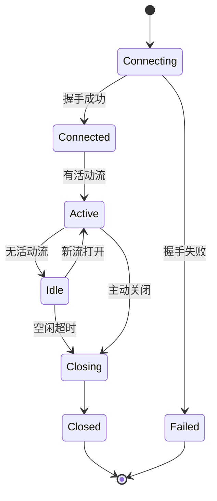

# 传输层编码规范

> 定义 DeP2P 传输层组件的编码约束

---

## 域职责

传输层负责底层网络连接的建立、维护和关闭。

```
┌─────────────────────────────────────────────────────────────┐
│                    传输层职责边界                            │
├─────────────────────────────────────────────────────────────┤
│                                                             │
│  负责：                                                     │
│    • QUIC 连接管理                                          │
│    • 流的创建和复用                                          │
│    • 连接池维护                                              │
│    • 超时和心跳                                              │
│                                                             │
│  不负责：                                                   │
│    • 协议协商（协议层）                                      │
│    • 节点发现（网络层）                                      │
│    • 身份验证逻辑（安全层）                                  │
│                                                             │
└─────────────────────────────────────────────────────────────┘
```

---

## 连接生命周期

### 状态机



### 状态管理规则

| 状态 | 允许操作 | 禁止操作 |
|------|----------|----------|
| Connecting | 等待、取消 | 打开流 |
| Connected | 打开流、关闭 | - |
| Active | 读写流、关闭 | - |
| Idle | 打开流、关闭 | - |
| Closing | 等待关闭完成 | 打开流 |
| Closed | 清理 | 任何操作 |

---

## 资源管理

### 连接池规范

```
连接池管理伪代码：

  FUNCTION get_connection(peer_id)
    conn = pool.get(peer_id)
    
    IF conn != nil AND conn.is_healthy() THEN
      RETURN conn
    END
    
    IF conn != nil THEN
      conn.close()
      pool.remove(peer_id)
    END
    
    RETURN dial_new(peer_id)
  END
```

### 资源释放清单

| 资源 | 释放时机 | 释放方式 |
|------|----------|----------|
| 连接 | 关闭时 | close() |
| 流 | 使用完毕 | close() 或 defer |
| 缓冲区 | 流关闭后 | 归还池 |
| 定时器 | 关闭时 | stop() |

### 泄漏防护

```
资源泄漏防护：

  规则：
    1. 所有打开操作必须有对应的关闭
    2. 使用 defer 确保清理
    3. 超时后强制释放
    4. 定期检查泄漏
```

---

## 超时处理

### 超时类型

| 超时 | 默认值 | 可配置 | 用途 |
|------|--------|--------|------|
| 握手超时 | 10s | 是 | QUIC 握手 |
| 空闲超时 | 30s | 是 | 无活动连接 |
| 操作超时 | 30s | 是 | 单次操作 |
| 心跳间隔 | 15s | 是 | 保活 |

### 超时处理规则

```
超时处理伪代码：

  FUNCTION do_operation_with_timeout(ctx, timeout)
    ctx = with_timeout(ctx, timeout)
    
    result, err = operation(ctx)
    
    IF err == context.DeadlineExceeded THEN
      cleanup()
      RETURN wrap(err, "operation timeout")
    END
    
    RETURN result, err
  END
```

---

## 流复用

### 流管理规则

```
┌─────────────────────────────────────────────────────────────┐
│                    流复用规则                                │
├─────────────────────────────────────────────────────────────┤
│                                                             │
│  单连接多流：                                                │
│    • 每个协议使用独立的流                                    │
│    • 流之间相互独立，无队头阻塞                              │
│    • 流用完即关闭                                            │
│                                                             │
│  流数量限制：                                                │
│    • 入站流上限：256                                         │
│    • 出站流上限：256                                         │
│    • 超限时等待或拒绝                                        │
│                                                             │
└─────────────────────────────────────────────────────────────┘
```

### 流使用模式

```
流使用伪代码：

  FUNCTION send_request(conn, protocol, data)
    stream = conn.open_stream()
    DEFER stream.close()
    
    write_protocol_header(stream, protocol)
    write_data(stream, data)
    
    response = read_response(stream)
    RETURN response
  END
```

---

## 错误处理

### 连接错误

| 错误 | 处理方式 | 重试 |
|------|----------|------|
| 握手失败 | 标记不可达 | 延迟重试 |
| 连接断开 | 清理资源 | 立即重试 |
| 流错误 | 关闭流 | 新流重试 |
| 超时 | 取消操作 | 可重试 |

### 错误恢复

```
错误恢复伪代码：

  FUNCTION connect_with_retry(peer_id, max_retries)
    FOR attempt = 1 TO max_retries
      conn, err = dial(peer_id)
      
      IF err == nil THEN
        RETURN conn
      END
      
      IF not_retryable(err) THEN
        RETURN nil, err
      END
      
      backoff_delay(attempt)
    END
    
    RETURN nil, ErrMaxRetriesExceeded
  END
```

---

## 并发安全

### 锁策略

| 操作 | 锁类型 | 范围 |
|------|--------|------|
| 读连接池 | 读锁 | 查找操作 |
| 写连接池 | 写锁 | 添加/删除 |
| 单连接操作 | 连接级锁 | 状态变更 |

### 竞态防护

```
并发安全规则：

  1. 连接池操作使用读写锁
  2. 连接状态变更原子化
  3. 避免在持锁时调用外部方法
  4. 使用 channel 进行 goroutine 协调
```

---

## 性能考虑

### 优化点

| 优化 | 方式 | 效果 |
|------|------|------|
| 连接复用 | 连接池 | 减少握手 |
| 0-RTT | QUIC 特性 | 低延迟 |
| 缓冲池 | sync.Pool | 减少分配 |
| 批量发送 | 合并写入 | 减少系统调用 |

### 监控指标

```
关键指标：

  连接：
    • 活跃连接数
    • 连接建立延迟
    • 连接失败率
    
  流：
    • 活跃流数
    • 流吞吐量
    • 流错误率
```

---

## 验证清单

| 检查项 | 说明 |
|--------|------|
| 资源释放 | 所有连接/流正确关闭 |
| 超时设置 | 所有操作有超时 |
| 并发安全 | 无竞态条件 |
| 错误处理 | 错误有上下文 |

---

## 相关文档

- [ADR-0006](../../../01_context/decisions/ADR-0006-quic-transport.md): QUIC 传输选择
- [REQ-TRANS-001](../../../01_context/requirements/functional/F2_transport/REQ-TRANS-001.md): 传输需求
- [L0 全局规范](../L0_global/)

---

**最后更新**：2026-01-11
