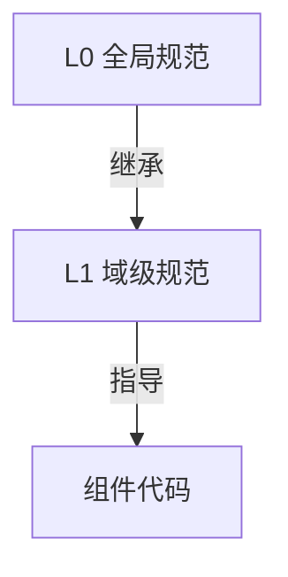
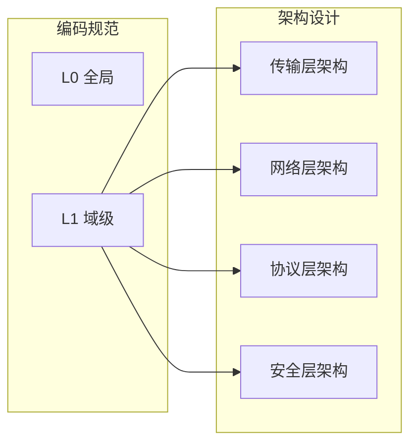

# 编码规范体系 (Coding Specs)

> 定义 DeP2P 的两层编码规范体系，确保代码风格一致性

---

## 设计理念



DeP2P 采用两层编码规范体系：

| 层级 | 职责 | 适用范围 |
|------|------|----------|
| **L0 全局** | 代码风格、错误处理、日志、测试 | 所有组件 |
| **L1 域级** | 传输、网络、协议、安全特有规范 | 按域划分 |

---

## 目录结构

```
coding_specs/
├── README.md                    # 本文件
├── L0_global/                   # 全局基础规范
│   ├── README.md
│   ├── code_style.md            # 代码风格
│   ├── error_handling.md        # 错误处理
│   ├── logging.md               # 日志规范
│   └── testing.md               # 测试规范
└── L1_domain/                   # 域级规范
    ├── README.md
    ├── transport_domain.md      # 传输层规范
    ├── network_domain.md        # 网络层规范
    ├── protocol_domain.md       # 协议层规范
    └── security_domain.md       # 安全层规范
```

---

## 规范继承机制

### L0 全局规范

所有代码必须遵守的基础约束：

```
┌─────────────────────────────────────────────────────────────┐
│                     L0 全局规范                              │
├─────────────────────────────────────────────────────────────┤
│                                                             │
│  代码风格      错误处理      日志规范      测试规范          │
│     │            │            │            │                │
│  格式化       错误包装     结构化日志    测试分类           │
│  导入规范     领域错误     日志级别      覆盖率             │
│  注释风格     panic规则    敏感信息      Mock策略           │
│                                                             │
└─────────────────────────────────────────────────────────────┘
```

### L1 域级规范

P2P 网络库的四个核心域：

```
┌─────────────────────────────────────────────────────────────┐
│                     L1 域级规范                              │
├───────────────┬───────────────┬───────────────┬─────────────┤
│   传输层      │    网络层     │    协议层     │   安全层    │
├───────────────┼───────────────┼───────────────┼─────────────┤
│ QUIC 连接     │ 发现机制      │ 协议协商      │ 身份验证    │
│ 流复用        │ NAT 穿透      │ 消息格式      │ 加密要求    │
│ 连接池        │ Relay 中继    │ 版本兼容      │ 密钥管理    │
│ 资源释放      │ 路径选择      │ 流量控制      │ 安全边界    │
└───────────────┴───────────────┴───────────────┴─────────────┘
```

---

## 使用方式

### 开发者编码参考

1. **先阅读 L0 全局规范** — 了解基础约束
2. **再阅读所属域的 L1 规范** — 了解域特有要求
3. **遵循规范编写代码** — 确保一致性

### 规范应用示例

```
编写传输层代码时：

1. 遵循 L0_global/code_style.md      → 格式化、命名
2. 遵循 L0_global/error_handling.md  → 错误处理
3. 遵循 L1_domain/transport_domain.md → QUIC、连接池
```

---

## 四域概览

| 域 | 核心职责 | 关键关注点 |
|----|----------|-----------|
| **传输层** | 底层连接 | 连接生命周期、资源管理、超时处理 |
| **网络层** | 节点发现 | 发现策略、NAT 穿透、路径优化 |
| **协议层** | 消息交换 | 协议版本、消息格式、兼容性 |
| **安全层** | 安全保障 | 身份验证、加密、访问控制 |

---

## 与架构的关联



---

## 快速导航

### L0 全局规范

| 文档 | 说明 |
|------|------|
| [code_style.md](L0_global/code_style.md) | 代码风格规范 |
| [error_handling.md](L0_global/error_handling.md) | 错误处理规范 |
| [logging.md](L0_global/logging.md) | 日志规范 |
| [testing.md](L0_global/testing.md) | 测试规范 |

### L1 域级规范

| 文档 | 说明 |
|------|------|
| [transport_domain.md](L1_domain/transport_domain.md) | 传输层编码规范 |
| [network_domain.md](L1_domain/network_domain.md) | 网络层编码规范 |
| [protocol_domain.md](L1_domain/protocol_domain.md) | 协议层编码规范 |
| [security_domain.md](L1_domain/security_domain.md) | 安全层编码规范 |

---

## 相关文档

| 文档 | 说明 |
|------|------|
| [工程标准](../standards/) | 代码规范、API 设计、命名约定 |
| [隔离约束](../isolation/) | 测试隔离、网络边界 |
| [架构设计](../../../03_architecture/) | 系统架构 |

---

**最后更新**：2026-01-11
