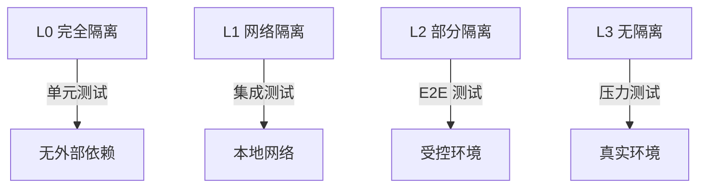

# 隔离约束 (Isolation)

> 定义 DeP2P 的测试隔离和网络边界约束

---

## 隔离原则

```
┌─────────────────────────────────────────────────────────────┐
│                    隔离核心原则                              │
├─────────────────────────────────────────────────────────────┤
│                                                             │
│  1. 默认离线：测试默认不连外网                               │
│  2. 显式声明：需要网络时显式标注                            │
│  3. 可禁用：网络依赖可被禁用                                │
│  4. 边界清晰：Realm 隔离严格执行                            │
│                                                             │
└─────────────────────────────────────────────────────────────┘
```

---

## 文档列表

| 文档 | 说明 |
|------|------|
| [testing_isolation.md](testing_isolation.md) | 测试隔离策略 |
| [network_boundary.md](network_boundary.md) | 网络边界约束 |

---

## 隔离级别

### 级别定义



| 级别 | 外网 | 文件系统 | 适用场景 |
|------|------|----------|----------|
| **L0** | 禁止 | 临时目录 | 单元测试 |
| **L1** | 禁止 | 临时目录 | 集成测试 |
| **L2** | 受控 | 隔离目录 | E2E 测试 |
| **L3** | 允许 | 真实目录 | 压力测试 |

---

## P2P 特有隔离

### Realm 隔离

```
┌─────────────────────────────────────────────────────────────┐
│                    Realm 隔离边界                            │
├─────────────────────────────────────────────────────────────┤
│                                                             │
│  ┌───────────────────┐     ┌───────────────────┐           │
│  │     Realm A       │     │     Realm B       │           │
│  │                   │     │                   │           │
│  │  Node1   Node2    │     │  Node3   Node4    │           │
│  │                   │     │                   │           │
│  └───────────────────┘     └───────────────────┘           │
│           │                         │                       │
│           └─────────┬───────────────┘                       │
│                     │                                       │
│                     ▼                                       │
│            ┌───────────────┐                               │
│            │ Infra Layer   │  ← 可跨 Realm 通信            │
│            └───────────────┘                               │
│                                                             │
└─────────────────────────────────────────────────────────────┘
```

### 控制面/数据面隔离

| 平面 | 承载 | Relay |
|------|------|-------|
| 控制面 | /dep2p/sys/* | 统一 Relay |
| 数据面 | /dep2p/realm/* | 统一 Relay（成员认证） |

---

## 测试中的隔离

### 节点测试隔离

```
测试节点隔离伪代码：

  SETUP
    // 创建隔离的测试网络
    test_network = create_isolated_network()
    
    // 在隔离网络中创建节点
    node_a = create_node(network = test_network)
    node_b = create_node(network = test_network)
  END
  
  TEST
    // 节点只能互相发现
    node_a.connect(node_b)
  END
  
  CLEANUP
    test_network.shutdown()
  END
```

### Realm 测试隔离

```
Realm 测试隔离伪代码：

  SETUP
    realm_a = create_test_realm("realm-a")
    realm_b = create_test_realm("realm-b")
    
    node1.join(realm_a)
    node2.join(realm_b)
  END
  
  TEST "cross realm communication blocked"
    err = node1.send(node2.id, "hello")
    ASSERT err == ErrNotMember
  END
```

---

## 依赖隔离

### Go 模块隔离

```
依赖隔离方式：

  1. 使用 go.mod/go.sum 锁定版本
  2. 支持 vendor 模式离线构建
  3. CI 中验证离线构建
```

### 离线构建

```
离线构建命令：

  go mod vendor
  go build -mod=vendor ./...
```

---

## 验证方式

| 隔离类型 | 验证方式 |
|----------|----------|
| 网络隔离 | 无外网请求 |
| Realm 隔离 | 跨 Realm 通信失败 |
| 依赖隔离 | vendor 构建成功 |

---

## 相关文档

| 文档 | 说明 |
|------|------|
| [测试规范](../coding_specs/L0_global/testing.md) | 测试编写标准 |
| [INV-002](../../01_context/decisions/invariants/INV-002-realm-membership.md) | Realm 成员资格不变量 |
| [ADR-0010](../../01_context/decisions/ADR-0010-relay-explicit-config.md) | Relay 明确配置 |

---

**最后更新**：2026-01-11
