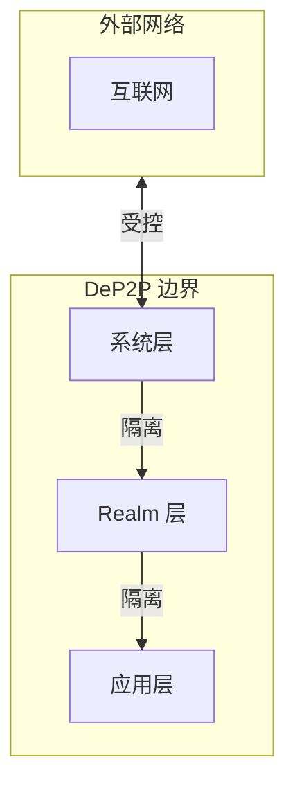

# 网络边界约束

> 定义 DeP2P 的网络隔离边界和访问控制

---

## 边界概述



---

## 三层边界

### 边界定义

```
┌─────────────────────────────────────────────────────────────┐
│                    网络边界层次                              │
├─────────────────────────────────────────────────────────────┤
│                                                             │
│  Layer 1：外网边界                                          │
│  ─────────────────                                          │
│  • DeP2P 与外部互联网的边界                                 │
│  • Bootstrap、Relay 节点位于此边界                          │
│  • 需要防火墙保护                                           │
│                                                             │
│  Layer 2：Realm 边界                                        │
│  ─────────────────                                          │
│  • 不同 Realm 之间的隔离                                    │
│  • PSK 成员认证                                             │
│  • 业务数据不跨 Realm                                       │
│                                                             │
│  Layer 3：协议边界                                          │
│  ─────────────────                                          │
│  • 控制面与数据面统一                                       │
│  • Relay 统一承载                                           │
│  • 协议前缀 + 成员认证强制检查                              │
│                                                             │
└─────────────────────────────────────────────────────────────┘
```

---

## Realm 边界

### 隔离规则

| 规则 | 说明 | 强制 |
|------|------|------|
| 单 Realm 成员 | 节点同时只属于一个 Realm | 是 |
| 业务 API 需 Realm | Send/Publish 需要 Realm | 是 |
| 跨 Realm 禁止 | 业务消息不跨 Realm | 是 |

### 边界检查点

```
Realm 边界检查伪代码：

  FUNCTION send_message(peer, data)
    // 检查点 1：是否加入 Realm
    IF current_realm() == nil THEN
      RETURN ErrNotMember
    END
    
    // 检查点 2：对端是否同 Realm
    IF not is_same_realm(peer) THEN
      RETURN ErrNotMember
    END
    
    // 通过检查，发送消息
    RETURN do_send(peer, data)
  END
```

### 边界图示

```
┌─────────────────────────────────────────────────────────────┐
│                    Realm 隔离示意                            │
├─────────────────────────────────────────────────────────────┤
│                                                             │
│  ┌───────────────────┐     ┌───────────────────┐           │
│  │     Realm A       │     │     Realm B       │           │
│  │  ┌─────┐ ┌─────┐  │     │  ┌─────┐ ┌─────┐  │           │
│  │  │  N1 │ │  N2 │  │     │  │  N3 │ │  N4 │  │           │
│  │  └─────┘ └─────┘  │     │  └─────┘ └─────┘  │           │
│  │      │     │      │     │      │     │      │           │
│  │      └──┬──┘      │     │      └──┬──┘      │           │
│  │         │         │     │         │         │           │
│  │     Relay A       │     │     Relay B       │           │
│  └─────────│─────────┘     └─────────│─────────┘           │
│            │                         │                      │
│            └──────────┬──────────────┘                      │
│                       │                                     │
│            ┌──────────▼──────────┐                         │
│            │   Infra Layer       │  业务数据不经过此层      │
│            │  (DHT, Bootstrap)   │                         │
│            └─────────────────────┘                         │
│                                                             │
└─────────────────────────────────────────────────────────────┘
```

---

## 控制面/数据面统一

### 协议路由

| 协议前缀 | 路由目标 | Relay |
|----------|----------|-------|
| /dep2p/sys/* | 控制面 | 允许 |
| /dep2p/realm/* | 数据面 | 仅匹配的 RealmID + 成员认证 |
| /dep2p/app/* | 数据面 | 仅匹配的 RealmID + 成员认证 |

### 路由检查

```
协议路由检查伪代码：

  FUNCTION route_message(protocol, message)
    IF protocol.starts_with("/dep2p/sys/") THEN
      RETURN forward(message)
    END

    IF protocol.starts_with("/dep2p/realm/") OR protocol.starts_with("/dep2p/app/") THEN
      IF not realm_id_matches(protocol) THEN
        RETURN ErrProtocolNotAllowed
      END
      IF not is_member(peer_id) THEN
        RETURN ErrNotMember
      END
      RETURN forward(message)
    END

    RETURN ErrProtocolNotAllowed
  END
```

---

## 外网边界

### 出站控制

| 目标 | 允许 | 条件 |
|------|------|------|
| Bootstrap 节点 | 是 | 预配置地址 |
| Relay 节点 | 是 | 预配置地址 |
| DHT 节点 | 是 | 已验证身份 |
| 任意地址 | 否 | - |

### 入站控制

| 来源 | 允许 | 条件 |
|------|------|------|
| 已知节点 | 是 | 地址簿中 |
| DHT 发现 | 是 | 身份验证后 |
| 未知来源 | 限制 | 速率限制 |

---

## 安全边界

### 身份边界

```
身份验证边界：

  连接建立时：
    1. 必须指定期望的 NodeID
    2. TLS 握手后验证身份
    3. RemoteID != ExpectedID → 拒绝
    
  INV-001 强制执行
```

### 访问控制边界

```
访问控制层次：

  L1 连接层：
    • 节点 ID 验证
    
  L2 Realm 层：
    • PSK 成员验证
    • 业务 API 权限
    
  L3 协议层：
    • 协议白名单
    • 消息格式验证
```

---

## 边界违规处理

### 违规类型

| 违规 | 处理 | 日志级别 |
|------|------|----------|
| 身份不匹配 | 关闭连接 | Warn |
| 跨 Realm 访问 | 拒绝操作 | Info |
| 协议路由错误 | 拒绝转发 | Warn |
| 速率超限 | 临时封禁 | Warn |

### 违规响应

```
边界违规响应伪代码：

  FUNCTION handle_boundary_violation(type, source, details)
    log.warn("boundary violation",
      "type", type,
      "source", source.short_id(),
      "details", details)
    
    SWITCH type
      CASE IDENTITY_MISMATCH:
        close_connection(source)
        
      CASE REALM_BOUNDARY:
        RETURN ErrNotMember
        
      CASE PROTOCOL_ROUTING:
        RETURN ErrProtocolNotAllowed
        
      CASE RATE_LIMIT:
        block_temporarily(source, duration = 5m)
    END
  END
```

---

## ★ 基础设施节点边界（来自实测验证）

> 以下要求来自 2026-01-22 Bootstrap/Relay 拆分部署测试，详见 [测试计划](../../../_discussions/20260122-split-infra-test-plan.md)

### 节点类型分类

```
┌─────────────────────────────────────────────────────────────────────────────┐
│                    节点类型与协议交互矩阵                                      │
├─────────────────────────────────────────────────────────────────────────────┤
│                                                                             │
│  节点类型        │ DHT │ Relay │ PubSub │ Realm │ 说明                      │
│  ═══════════════╪═════╪═══════╪════════╪═══════╪════════════════════════   │
│  Bootstrap      │  ✅  │  ❌   │   ❌   │  ❌   │ 仅提供 DHT 发现服务        │
│  Relay（基础设施）│  ✅  │  ✅   │   ❌   │  ❌   │ 仅提供中继转发服务         │
│  Relay（业务方） │  ✅  │  ✅   │   ✅   │  ✅   │ 业务方部署的 Relay         │
│  应用节点       │  ✅  │  ✅   │   ✅   │  ✅   │ 普通业务节点               │
│                                                                             │
└─────────────────────────────────────────────────────────────────────────────┘
```

### 基础设施节点边界规则

```
┌─────────────────────────────────────────────────────────────────────────────┐
│                    基础设施节点边界规则                                        │
├─────────────────────────────────────────────────────────────────────────────┤
│                                                                             │
│  规则 1：基础设施节点不参与 Realm 成员体系                                    │
│  ═══════════════════════════════════════                                    │
│  • Bootstrap/Relay 不加入任何 Realm                                          │
│  • 不执行 Realm 认证流程                                                     │
│  • 不被纳入 Realm 成员列表                                                   │
│                                                                             │
│  规则 2：基础设施节点不参与 PubSub Mesh                                       │
│  ════════════════════════════════════                                       │
│  • Bootstrap/Relay 不能作为 Mesh peer                                        │
│  • graftPeers 时过滤基础设施节点                                             │
│  • 避免消息发送时 Realm 成员校验失败                                          │
│                                                                             │
│  规则 3：基础设施节点认证跳过                                                  │
│  ══════════════════════════════                                             │
│  • 对基础设施节点跳过 Realm 认证尝试                                          │
│  • 避免不必要的认证失败日志                                                   │
│                                                                             │
│  实现：维护 InfrastructurePeers 列表                                         │
│    来源：Bootstrap.Peers + RelayAddr                                         │
│                                                                             │
└─────────────────────────────────────────────────────────────────────────────┘
```

### 实测问题参考

| BUG ID | 问题 | 边界违规类型 |
|--------|------|-------------|
| BUG-3 | Bootstrap 被加入 PubSub Mesh | 规则 2 违规 |
| BUG-4 | Realm 成员检查失败 | 规则 1 违规 |
| v0.2.8 | 对基础设施节点执行认证 | 规则 3 违规 |

---

## 监控指标

### 边界相关指标

| 指标 | 说明 | 告警阈值 |
|------|------|----------|
| identity_mismatch_total | 身份不匹配次数 | > 10/分钟 |
| realm_boundary_violations | Realm 边界违规 | > 100/分钟 |
| protocol_routing_errors | 协议路由错误 | > 50/分钟 |
| rate_limit_blocks | 速率限制封禁 | > 20/分钟 |
| infra_peer_mesh_attempts | 基础设施节点 Mesh 加入尝试 | > 0（新增） |

---

## 验证清单

| 检查项 | 说明 |
|--------|------|
| Realm 隔离 | 跨 Realm 通信被拒绝 |
| 协议路由 | 协议前缀正确路由 |
| 身份验证 | 连接必须验证身份 |
| 速率限制 | 有防滥用措施 |

---

## 相关文档

- [INV-001](../../../01_context/decisions/invariants/INV-001-identity-first.md): 身份第一性
- [INV-002](../../../01_context/decisions/invariants/INV-002-realm-membership.md): Realm 成员资格
- [ADR-0010](../../../01_context/decisions/ADR-0010-relay-explicit-config.md): Relay 明确配置
- [拆分部署测试计划](../../../_discussions/20260122-split-infra-test-plan.md)

---

**最后更新**：2026-01-23
