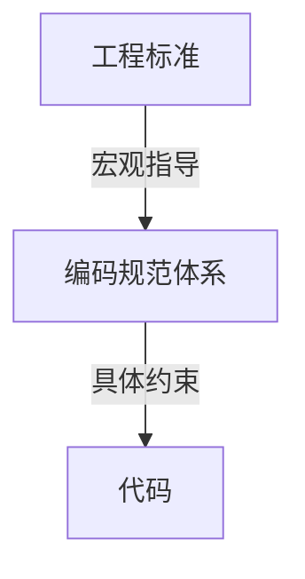

# 工程标准 (Standards)

> 定义 DeP2P 的代码规范、API 设计、命名约定和文档标准

---

## 标准列表

| 文档 | 说明 |
|------|------|
| [code_standards.md](code_standards.md) | 代码规范 |
| [api_standards.md](api_standards.md) | API 设计标准 |
| [naming_conventions.md](naming_conventions.md) | 命名规范 |
| [documentation.md](documentation.md) | 文档标准 |

---

## 标准化原则

```
┌─────────────────────────────────────────────────────────────┐
│                    标准化原则                                │
├─────────────────────────────────────────────────────────────┤
│                                                             │
│  一致性                                                     │
│  ──────                                                     │
│  相似场景使用相同模式                                        │
│                                                             │
│  可读性                                                     │
│  ──────                                                     │
│  代码是给人读的                                              │
│                                                             │
│  可维护性                                                   │
│  ────────                                                   │
│  易于理解和修改                                              │
│                                                             │
│  可追溯性                                                   │
│  ────────                                                   │
│  变更可追踪                                                 │
│                                                             │
└─────────────────────────────────────────────────────────────┘
```

---

## 标准执行

### 自动化检查

| 标准 | 工具 | 集成点 |
|------|------|--------|
| 代码格式 | gofmt | pre-commit |
| 代码规范 | golangci-lint | CI |
| 文档格式 | markdownlint | CI |

### 审查要求

| 变更类型 | 审查要求 |
|----------|----------|
| 核心代码 | 2+ 审查者 |
| API 变更 | 架构师审查 |
| 文档变更 | 1+ 审查者 |

---

## 与编码规范的关系



| 层级 | 职责 |
|------|------|
| 工程标准 | 宏观原则、设计指南 |
| 编码规范 | 具体编码约束 |

---

## 快速导航

- [代码规范](code_standards.md) — 模块结构、依赖管理
- [API 设计](api_standards.md) — 接口设计原则
- [命名规范](naming_conventions.md) — 命名规则
- [文档标准](documentation.md) — 文档编写要求

---

## 相关文档

| 文档 | 说明 |
|------|------|
| [编码规范](../coding_specs/) | L0/L1 编码规范 |
| [隔离约束](../isolation/) | 测试和网络隔离 |
| [架构设计](../../../03_architecture/) | 系统架构 |

---

**最后更新**：2026-01-11
