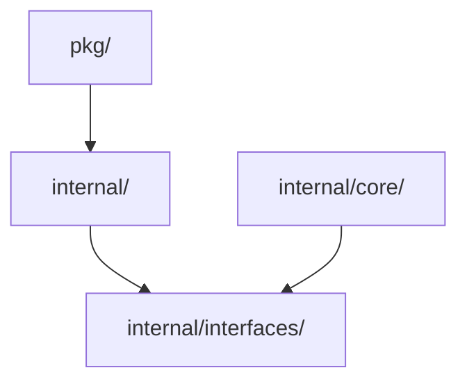

# 代码规范

> 定义 DeP2P 项目的代码组织和设计标准

---

## 模块结构

### 目录布局

```
dep2p/
├── cmd/                        # 可执行程序
│   └── dep2p-node/
├── pkg/                        # 公开 API
│   ├── types/                  # 公开类型
│   └── dep2p/                  # 主入口
├── internal/                   # 内部实现
│   ├── core/                   # 核心逻辑
│   │   ├── transport/          # 传输层
│   │   ├── network/            # 网络层
│   │   ├── protocol/           # 协议层
│   │   └── security/           # 安全层
│   └── interfaces/             # 内部接口
└── examples/                   # 示例代码
```

### 目录职责

| 目录 | 职责 | 可见性 |
|------|------|--------|
| cmd/ | 可执行程序入口 | - |
| pkg/ | 公开 API | 公开 |
| internal/ | 内部实现 | 私有 |
| examples/ | 使用示例 | - |

### pkg/ 层子包分类

```
┌─────────────────────────────────────────────────────────────┐
│                    pkg/ 层包分类                             │
├─────────────────────────────────────────────────────────────┤
│                                                             │
│  工具包（直接调用，无需接口）                                │
│  ────────────────────────────                               │
│  • pkg/types      - 公共类型定义                            │
│  • pkg/crypto     - 密码学工具                              │
│  • pkg/multiaddr  - 多地址解析                              │
│  • pkg/proto      - Protobuf 定义                           │
│                                                             │
│  特点：                                                     │
│    - 无状态或轻量状态                                       │
│    - 纯函数或工厂模式                                       │
│    - 直接调用，类似标准库                                   │
│    - 不需要依赖注入                                         │
│                                                             │
│  接口包（抽象系统组件）                                     │
│  ──────────────────────                                     │
│  • pkg/interfaces - 系统模块抽象接口                        │
│                                                             │
│  特点：                                                     │
│    - 定义系统组件的契约                                     │
│    - 供 internal/ 层实现                                    │
│    - 允许模块替换和测试                                     │
│    - 使用依赖注入                                           │
│                                                             │
└─────────────────────────────────────────────────────────────┘
```

**重要区别**：
- **工具包**：像 `crypto.GenerateKeyPair()` 一样直接调用
- **接口包**：像 `Host` 接口一样需要实现和注入

---

## 包设计

### 包原则

```
┌─────────────────────────────────────────────────────────────┐
│                    包设计原则                                │
├─────────────────────────────────────────────────────────────┤
│                                                             │
│  单一职责                                                   │
│  ────────                                                   │
│  每个包只做一件事                                            │
│                                                             │
│  最小暴露                                                   │
│  ────────                                                   │
│  只导出必要的 API                                           │
│                                                             │
│  无循环依赖                                                 │
│  ──────────                                                 │
│  依赖方向单一                                               │
│                                                             │
│  接口隔离                                                   │
│  ────────                                                   │
│  依赖接口而非实现                                           │
│                                                             │
└─────────────────────────────────────────────────────────────┘
```

### 包大小

| 指标 | 建议值 | 说明 |
|------|--------|------|
| 文件数 | < 20 | 超过考虑拆分 |
| 导出类型 | < 15 | 保持 API 简洁 |
| 导出函数 | < 30 | 避免过于庞大 |

---

## 依赖管理

### 依赖方向



### 依赖规则

| 规则 | 说明 |
|------|------|
| pkg → internal | 允许 |
| internal → pkg | 禁止 |
| 层间依赖 | 通过接口 |
| 第三方依赖 | 最小化 |

### 接口定义

```
接口放置规则：

  消费者定义接口：
    • 接口放在使用方包中
    • 实现方只需满足接口
    
  共享接口：
    • 放在 internal/interfaces/
    • 多个包共同使用
```

---

## 依赖注入

### fx 模块模式

```
fx 模块结构伪代码：

  Module = fx.Module("transport",
    // 提供构造函数
    fx.Provide(
      NewManager,
      NewConnectionPool,
    ),
    
    // 可选：提供接口实现
    fx.Provide(
      fx.Annotate(
        NewQUICTransport,
        fx.As(new(Transport)),
      ),
    ),
  )
```

### 依赖声明

```
依赖声明规则：

  结构体依赖：
    通过构造函数参数注入
    
  可选依赖：
    使用 fx.Optional
    
  多实现：
    使用 fx.Annotate + name
```

---

## 生命周期

### 启动/停止

```
生命周期管理伪代码：

  Component 结构
    FUNCTION Start(context)
      // 初始化资源
      initialize()
      
      // 启动后台任务
      start_background_tasks()
      
      RETURN nil
    END
    
    FUNCTION Stop(context)
      // 停止后台任务
      stop_background_tasks()
      
      // 释放资源
      cleanup()
      
      RETURN nil
    END
```

### 优雅关闭

```
┌─────────────────────────────────────────────────────────────┐
│                    优雅关闭流程                              │
├─────────────────────────────────────────────────────────────┤
│                                                             │
│  1. 收到关闭信号                                            │
│  2. 停止接受新请求                                          │
│  3. 等待进行中请求完成（有超时）                            │
│  4. 关闭连接                                                │
│  5. 释放资源                                                │
│  6. 退出                                                    │
│                                                             │
└─────────────────────────────────────────────────────────────┘
```

---

## 并发模式

### Goroutine 管理

```
Goroutine 管理规则：

  启动：
    • 有明确的退出条件
    • 使用 context 控制
    
  退出：
    • 响应 context.Done()
    • 使用 WaitGroup 等待
    
  恢复：
    • 每个 goroutine 有 recover
```

### 通道使用

| 场景 | 通道类型 | 容量 |
|------|----------|------|
| 信号传递 | struct{} | 0 |
| 数据传递 | 具体类型 | 有缓冲 |
| 错误通知 | error | 1 |

---

## 错误处理

### 错误传播

```
错误传播规则：

  边界处包装：
    调用外部包时添加上下文
    
  内部直接返回：
    包内调用可直接返回
    
  最终处理：
    顶层函数记录日志或返回用户
```

### 错误恢复

```
错误恢复规则：

  可重试错误：
    • 网络超时
    • 临时不可用
    
  不可重试错误：
    • 参数错误
    • 权限不足
    • 资源不存在
```

---

## 配置管理

### 配置层次

```
配置优先级（高到低）：

  1. 环境变量
  2. 命令行参数
  3. 配置文件
  4. 默认值
```

### 配置验证

```
配置验证规则：

  启动时验证：
    • 必需字段存在
    • 值在有效范围
    • 依赖关系满足
    
  验证失败：
    • 启动失败
    • 明确错误信息
```

---

## 测试标准

### 测试位置

| 测试类型 | 位置 | 后缀 |
|----------|------|------|
| 单元测试 | 同目录 | _test.go |
| 集成测试 | 同目录 | _integration_test.go |
| 示例测试 | 同目录 | _example_test.go |

### 测试覆盖

| 代码类型 | 目标覆盖率 |
|----------|-----------|
| 核心逻辑 | ≥ 80% |
| 工具函数 | ≥ 70% |
| 错误处理 | ≥ 60% |

---

## 验证清单

| 检查项 | 说明 |
|--------|------|
| 包职责清晰 | 单一职责 |
| 无循环依赖 | 依赖方向正确 |
| 接口隔离 | 依赖接口 |
| 生命周期正确 | 启动/停止完整 |

---

## 相关文档

- [编码规范](../coding_specs/)
- [API 设计](api_standards.md)
- [pkg/ 层设计原则](pkg_design.md)（**重要：工具包 vs 接口包**）
- [架构设计](../../../03_architecture/)

---

**最后更新**：2026-01-13
