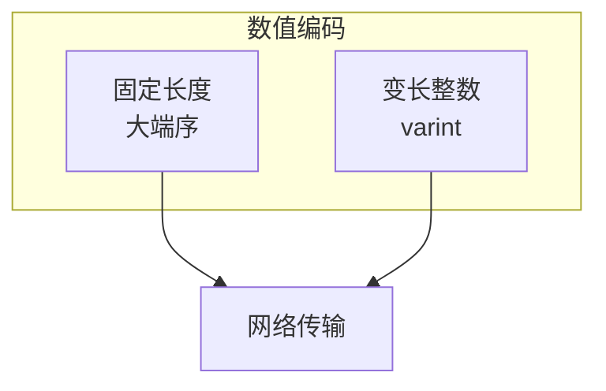

# 字节序规范

> 定义 DeP2P 协议的字节序和数值编码规则

---

## 概述

DeP2P 使用统一的字节序规范确保跨平台互操作性。



---

## 字节序规则

### 大端序 (Big-Endian)

所有固定长度的多字节数值使用**网络字节序（大端序）**：

```
大端序示例：

  数值：0x12345678 (32位)
  
  内存布局：
  ┌────┬────┬────┬────┐
  │ 12 │ 34 │ 56 │ 78 │
  └────┴────┴────┴────┘
    ↑高位            ↑低位
    地址 0          地址 3
```

### 适用范围

| 数据类型 | 字节序 | 说明 |
|----------|--------|------|
| 端口号 | 大端序 | 2 字节 |
| IPv4 地址 | 大端序 | 4 字节 |
| 固定长度字段 | 大端序 | 如 fixed32/fixed64 |
| 消息类型 | 大端序 | 协议头部 |

---

## Varint 编码

### 概述

变长整数（varint）用于高效编码非负整数，小数值使用更少字节。

```
Varint 原理：

  • 每字节 7 位数据 + 1 位延续标志
  • MSB = 1：后续还有字节
  • MSB = 0：最后一个字节
```

### 编码规则

```
Varint 编码伪代码：

  FUNCTION encode_varint(value)
    result = []
    
    WHILE value >= 0x80
      // 取低 7 位，设置延续标志
      result.append((value & 0x7F) | 0x80)
      value = value >> 7
    END
    
    // 最后一字节，无延续标志
    result.append(value & 0x7F)
    
    RETURN result
  END
```

### 编码示例

| 数值 | 二进制 | Varint 编码 | 字节数 |
|------|--------|-------------|--------|
| 1 | 0000 0001 | 01 | 1 |
| 127 | 0111 1111 | 7F | 1 |
| 128 | 1000 0000 | 80 01 | 2 |
| 300 | 0001 0010 1100 | AC 02 | 2 |
| 16384 | 0100 0000 0000 0000 | 80 80 01 | 3 |

### 字节数与范围

| 字节数 | 可表示范围 |
|--------|-----------|
| 1 | 0 - 127 |
| 2 | 128 - 16,383 |
| 3 | 16,384 - 2,097,151 |
| 4 | 2,097,152 - 268,435,455 |
| 5 | 268,435,456 - 34,359,738,367 |
| 10 | 完整 64 位范围 |

---

## 有符号整数

### ZigZag 编码

有符号整数使用 ZigZag 编码转换为无符号后再 varint 编码：

```
ZigZag 编码伪代码：

  FUNCTION zigzag_encode(signed_value)
    // 将负数映射到奇数，非负数映射到偶数
    RETURN (signed_value << 1) XOR (signed_value >> 63)
  END
  
  FUNCTION zigzag_decode(encoded_value)
    RETURN (encoded_value >> 1) XOR -(encoded_value & 1)
  END
```

### ZigZag 映射

| 原始值 | 编码值 |
|--------|--------|
| 0 | 0 |
| -1 | 1 |
| 1 | 2 |
| -2 | 3 |
| 2 | 4 |
| ... | ... |

---

## 长度前缀

### 格式

```
长度前缀格式：

  ┌──────────────────┬───────────────────────────────────────┐
  │   Length (N)     │           Data (N bytes)              │
  │   [varint]       │           [raw bytes]                 │
  └──────────────────┴───────────────────────────────────────┘
```

### 读取流程

```
读取长度前缀数据伪代码：

  FUNCTION read_length_prefixed(stream)
    // 读取长度
    length = read_varint(stream)
    
    // 边界检查
    IF length > MAX_SIZE THEN
      RETURN error("size limit exceeded")
    END
    
    // 读取数据
    RETURN read_bytes(stream, length)
  END
```

---

## 固定长度类型

### 类型定义

| 类型 | 大小 | 说明 |
|------|------|------|
| uint8 | 1 字节 | 无符号 8 位 |
| uint16 | 2 字节 | 无符号 16 位，大端序 |
| uint32 | 4 字节 | 无符号 32 位，大端序 |
| uint64 | 8 字节 | 无符号 64 位，大端序 |
| int8 | 1 字节 | 有符号 8 位 |
| int16 | 2 字节 | 有符号 16 位，大端序 |
| int32 | 4 字节 | 有符号 32 位，大端序 |
| int64 | 8 字节 | 有符号 64 位，大端序 |

### 编解码示例

```
固定长度编码伪代码：

  FUNCTION encode_uint32(value)
    bytes = []
    bytes[0] = (value >> 24) & 0xFF
    bytes[1] = (value >> 16) & 0xFF
    bytes[2] = (value >> 8) & 0xFF
    bytes[3] = value & 0xFF
    RETURN bytes
  END
  
  FUNCTION decode_uint32(bytes)
    RETURN (bytes[0] << 24) |
           (bytes[1] << 16) |
           (bytes[2] << 8) |
           bytes[3]
  END
```

---

## 特殊编码

### 布尔值

```
布尔编码：

  false = 0x00
  true  = 0x01
```

### 时间戳

```
时间戳编码：

  格式：int64 (varint + ZigZag)
  单位：Unix 毫秒
  范围：1970-01-01 至 远未来
```

---

## 验证规则

| 检查项 | 规则 |
|--------|------|
| Varint 长度 | ≤ 10 字节 |
| 长度前缀 | ≤ 最大消息大小 |
| 固定长度 | 完整读取 |
| 字节序 | 大端序 |

---

## 相关文档

- [序列化规范](serialization.md)
- [版本规范](versioning.md)

---

**最后更新**：2026-01-11
