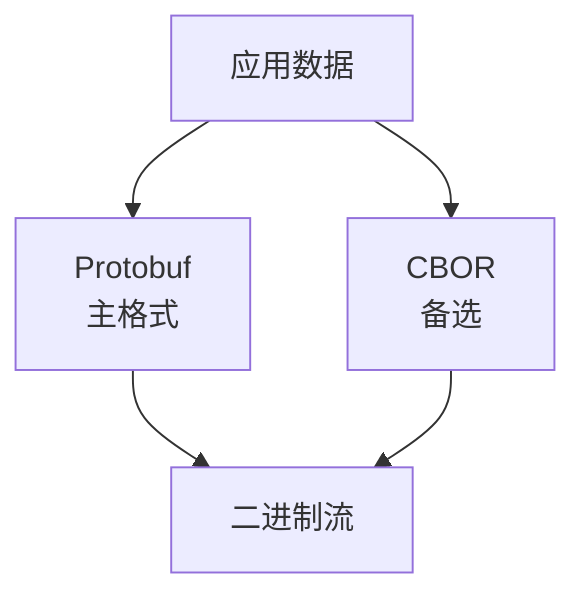
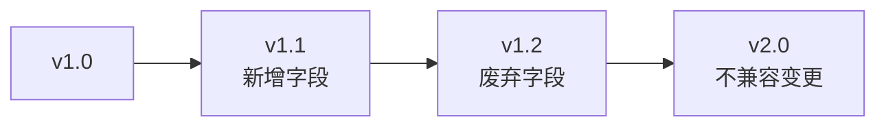

# 序列化规范

> 定义 DeP2P 协议的数据序列化格式

---

## 概述

DeP2P 采用 **Protocol Buffers (Protobuf)** 作为主要序列化格式，CBOR 作为备选。



---

## 为什么选择 Protobuf

| 特性 | Protobuf | JSON | CBOR |
|------|----------|------|------|
| **紧凑性** | 高 | 低 | 高 |
| **性能** | 高 | 中 | 高 |
| **类型安全** | 强 | 弱 | 中 |
| **跨语言** | 好 | 好 | 好 |
| **模式演进** | 好 | 无 | 有限 |
| **生态工具** | 丰富 | 丰富 | 一般 |

---

## Protobuf 使用规范

### 消息定义

```protobuf
// 消息定义规范（伪代码表示）

MESSAGE Identify
  // 必需字段使用小编号
  FIELD 1: public_key      BYTES     // 公钥
  FIELD 2: listen_addrs    BYTES[]   // 监听地址列表
  FIELD 3: protocols       STRING[]  // 支持的协议
  
  // 可选字段使用较大编号
  FIELD 10: agent_version  STRING    // 代理版本
  FIELD 11: observed_addr  BYTES     // 观察到的地址
END
```

### 字段编号规则

| 编号范围 | 用途 | 说明 |
|----------|------|------|
| 1-15 | 核心字段 | 1 字节编码，高频使用 |
| 16-2047 | 普通字段 | 2 字节编码 |
| 2048+ | 扩展字段 | 3+ 字节编码 |
| 19000-19999 | 保留 | Protobuf 内部使用 |

### 字段类型选择

```
类型选择指南：

  整数：
    • 非负数 → uint32/uint64
    • 可能为负 → sint32/sint64（ZigZag 编码）
    • 固定长度 → fixed32/fixed64
    
  字符串/二进制：
    • 文本 → string (UTF-8)
    • 二进制 → bytes
    
  集合：
    • 同类列表 → repeated
    • 键值对 → map
```

---

## 长度前缀

### 格式

所有消息使用 varint 编码的长度前缀：

```
┌──────────────────────────────────────────────────────────┐
│                    长度前缀消息                           │
├──────────────────┬───────────────────────────────────────┤
│   Length (N)     │           Message (N bytes)           │
│   [varint]       │           [protobuf]                  │
└──────────────────┴───────────────────────────────────────┘
```

### 读取流程

```
读取消息伪代码：

  FUNCTION read_message(stream)
    // 1. 读取长度前缀
    length = read_varint(stream)
    
    // 2. 验证长度
    IF length > MAX_MESSAGE_SIZE THEN
      RETURN error("message too large")
    END
    
    // 3. 读取消息体
    data = read_bytes(stream, length)
    
    // 4. 解码 Protobuf
    message = protobuf_decode(data)
    
    RETURN message
  END
```

### 最大消息大小

| 消息类型 | 最大大小 | 说明 |
|----------|----------|------|
| 控制消息 | 64 KB | 身份、心跳等 |
| 普通消息 | 4 MB | 默认上限 |
| 大块数据 | 16 MB | 需显式配置 |

---

## CBOR 备选

### 使用场景

| 场景 | 推荐格式 |
|------|----------|
| 节点间通信 | Protobuf |
| 配置存储 | CBOR |
| 动态数据 | CBOR |
| 调试日志 | CBOR (人类可读) |

### CBOR 规范

```
CBOR 使用规范：

  类型映射：
    • 整数 → CBOR integer
    • 字符串 → CBOR text string
    • 二进制 → CBOR byte string
    • 数组 → CBOR array
    • 映射 → CBOR map
    
  编码选项：
    • 使用确定性编码
    • 键按字典序排列
```

---

## 兼容性规则

### 向后兼容

```
向后兼容规则：

  允许的变更：
    ✅ 新增可选字段
    ✅ 新增枚举值
    ✅ 废弃字段（保留编号）
    
  禁止的变更：
    ❌ 删除必需字段
    ❌ 修改字段类型
    ❌ 修改字段编号
    ❌ 修改字段语义
```

### 版本演进



---

## 错误处理

### 解码错误

| 错误 | 处理方式 |
|------|----------|
| 长度过大 | 拒绝，返回错误 |
| 格式错误 | 拒绝，返回错误 |
| 未知字段 | 忽略 |
| 缺少必需字段 | 拒绝，返回错误 |

### 错误码

```
序列化错误码：

  ERR_MESSAGE_TOO_LARGE   = 0x01  // 消息过大
  ERR_INVALID_FORMAT      = 0x02  // 格式错误
  ERR_MISSING_FIELD       = 0x03  // 缺少必需字段
  ERR_INVALID_TYPE        = 0x04  // 类型错误
```

---

## 性能建议

### 优化策略

| 策略 | 说明 |
|------|------|
| 复用缓冲区 | 减少内存分配 |
| 预分配大小 | 已知大小时预分配 |
| 流式编解码 | 大消息分块处理 |
| 延迟解码 | 按需解码字段 |

---

## 相关文档

- [字节序规范](byte_order.md)
- [版本规范](versioning.md)
- [消息格式需求](../../../01_context/requirements/functional/F6_protocol/REQ-PROTO-002.md)

---

**最后更新**：2026-01-11
