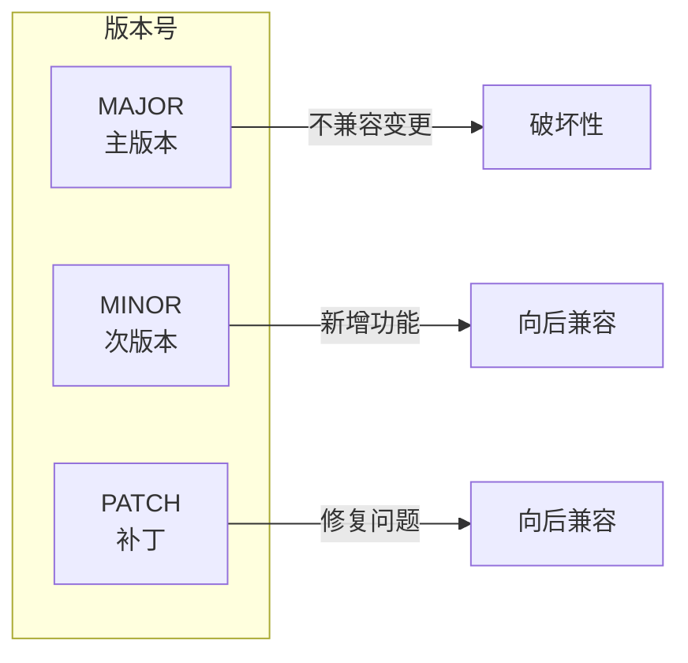
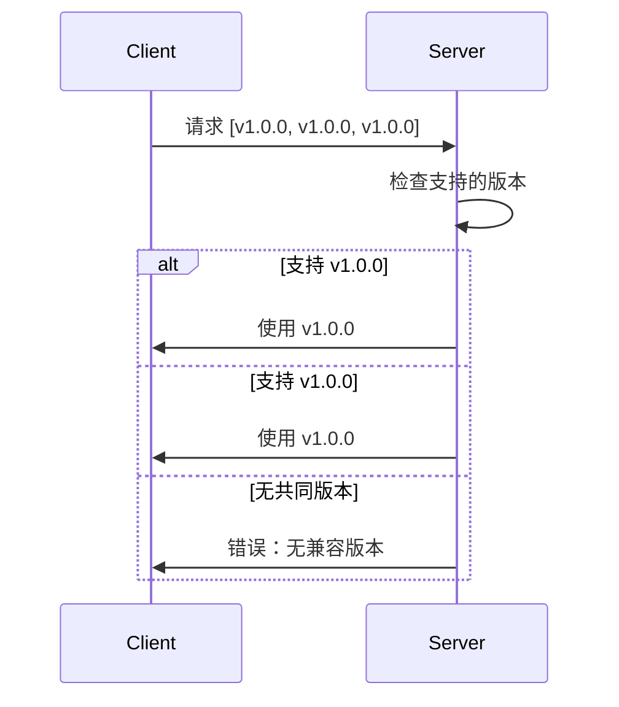
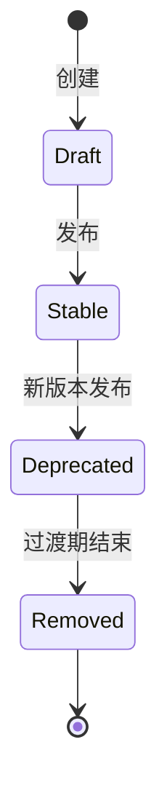
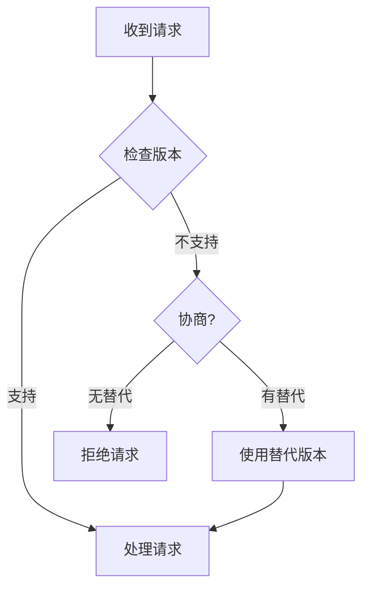

# 版本规范

> 定义 DeP2P 协议的版本控制规则

---

## 概述

DeP2P 采用**语义化版本 (Semantic Versioning)** 管理协议版本演进。



---

## 版本格式

### 基本格式

```
MAJOR.MINOR.PATCH

示例：
  1.0.0   - 首个稳定版本
  1.1.0   - 新增功能
  1.1.1   - 修复问题
  1.0.0   - 不兼容变更
```

### 协议 ID 中的版本

```
协议 ID 格式：

  /dep2p/{scope}/{protocol}/{version}
  
示例：
  /dep2p/sys/identify/1.0.0
  /dep2p/realm/abc123/chat/2.1.0
```

---

## 版本变更规则

### MAJOR（主版本）

不兼容的变更，必须递增 MAJOR：

```
需要递增 MAJOR 的变更：

  ❌ 删除必需字段
  ❌ 修改字段类型
  ❌ 修改字段编号
  ❌ 修改字段语义
  ❌ 删除协议支持
  ❌ 修改消息流程
```

### MINOR（次版本）

向后兼容的功能新增，递增 MINOR：

```
需要递增 MINOR 的变更：

  ✅ 新增可选字段
  ✅ 新增消息类型
  ✅ 新增枚举值
  ✅ 新增可选功能
```

### PATCH（补丁版本）

向后兼容的修复，递增 PATCH：

```
需要递增 PATCH 的变更：

  ✅ 修复文档错误
  ✅ 修复实现 bug
  ✅ 性能优化
  ✅ 安全修复
```

---

## 版本协商

### 协商流程



### 协商规则

```
版本协商伪代码：

  FUNCTION negotiate_version(client_versions, server_versions)
    // 按版本号降序排列
    client_sorted = sort_desc(client_versions)
    
    FOR EACH client_ver IN client_sorted
      FOR EACH server_ver IN server_versions
        IF is_compatible(client_ver, server_ver) THEN
          RETURN max(client_ver, server_ver)
        END
      END
    END
    
    RETURN error("no compatible version")
  END
  
  FUNCTION is_compatible(v1, v2)
    // 主版本必须相同
    RETURN v1.major == v2.major
  END
```

---

## 版本生命周期

### 状态定义



| 状态 | 说明 | 支持策略 |
|------|------|----------|
| **Draft** | 开发中 | 不保证稳定 |
| **Stable** | 稳定版 | 完全支持 |
| **Deprecated** | 已废弃 | 仅维护 |
| **Removed** | 已移除 | 不再支持 |

### 过渡期

```
版本过渡期规则：

  1. 废弃通知：提前至少 2 个 MINOR 版本通知
  2. 过渡期：废弃后保留至少 6 个月
  3. 移除通知：提前 1 个月通知
```

---

## 多版本支持

### 并行支持

```
多版本支持策略：

  节点应支持：
    • 当前稳定版本
    • 至少 1 个旧 MAJOR 版本
    • 废弃但未移除的版本
```

### 版本选择



---

## 协议注册

### 协议 ID 常量

```
协议 ID 定义规范（伪代码）：

  // 系统协议
  SYS_IDENTIFY_V1 = "/dep2p/sys/identify/1.0.0"
  SYS_IDENTIFY_V2 = "/dep2p/sys/identify/1.0.0"
  
  // 中继协议
  RELAY_CONTROL_V1 = "/dep2p/relay/1.0.0/{hop,stop}"
  
  // 发现协议
  DHT_V1 = "/dep2p/sys/dht/1.0.0"
```

### 版本注册

```
版本注册伪代码：

  FUNCTION register_protocol(id, version, handler)
    full_id = format("{}/{}", id, version)
    handlers[full_id] = handler
    
    // 记录版本信息
    versions[id].append(version)
  END
```

---

## 兼容性检查

### 自动检查

```
兼容性检查伪代码：

  FUNCTION check_compatibility(old_schema, new_schema)
    errors = []
    
    // 检查删除的字段
    FOR EACH field IN old_schema.fields
      IF field NOT IN new_schema.fields THEN
        IF field.required THEN
          errors.append("removed required field: " + field.name)
        END
      END
    END
    
    // 检查类型变更
    FOR EACH field IN new_schema.fields
      IF field IN old_schema.fields THEN
        IF field.type != old_schema.fields[field].type THEN
          errors.append("type changed: " + field.name)
        END
      END
    END
    
    RETURN errors
  END
```

---

## 版本文档

### 变更日志格式

```
变更日志格式：

  ## [版本号] - 日期
  
  ### Added
  - 新增功能描述
  
  ### Changed
  - 变更描述
  
  ### Deprecated
  - 废弃项描述
  
  ### Removed
  - 移除项描述
  
  ### Fixed
  - 修复描述
```

---

## 相关文档

- [序列化规范](serialization.md)
- [协议命名规范](../../../01_context/decisions/ADR-0007-protocol-naming.md)

---

**最后更新**：2026-01-11
