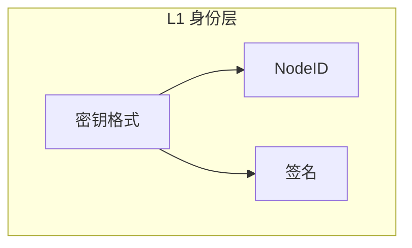
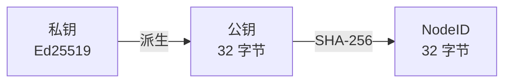
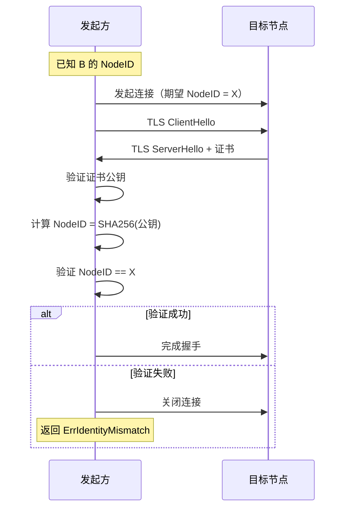

# L1 身份层规范

> 定义 DeP2P 的身份管理、密钥和签名规范

---

## 概述

身份层定义节点身份的生成、表示和验证规则，是 DeP2P 安全模型的基础。



---

## 规范列表

| 规范 | 文档 | 说明 |
|------|------|------|
| 密钥格式 | [key_format.md](key_format.md) | Ed25519 密钥编码 |
| NodeID | [nodeid.md](nodeid.md) | NodeID 计算规则 |
| 签名 | [signature.md](signature.md) | 签名算法和验证 |

---

## 核心概念

### 身份第一性原则

```
┌─────────────────────────────────────────────────────────────┐
│                    身份第一性原则                            │
├─────────────────────────────────────────────────────────────┤
│                                                             │
│  DeP2P 采用"身份第一"设计：                                  │
│                                                             │
│  1. 每个连接必须绑定预期的 NodeID                            │
│  2. 连接建立后验证 RemoteID == ExpectedID                   │
│  3. 不存在"纯 IP 地址连接"                                  │
│                                                             │
│  参见：INV-001 身份第一性不变量                              │
│                                                             │
└─────────────────────────────────────────────────────────────┘
```

### 身份派生链



---

## 密钥类型

### 支持的算法

| 算法 | 用途 | 密钥大小 | 状态 |
|------|------|----------|------|
| **Ed25519** | 身份密钥 | 32 字节 | 默认 |
| **Secp256k1** | 区块链兼容 | 33 字节 | 支持 |
| **RSA** | 传统兼容 | 2048/4096 位 | 支持 |
| X25519 | 密钥交换 | 32 字节 | 派生自 Ed25519 |

> **推荐**：新项目建议使用 Ed25519，它提供最佳的安全性和性能平衡。

### 密钥层次

```
密钥层次结构：

  节点密钥（长期）
    └── Ed25519 密钥对
        ├── 公钥 → NodeID
        ├── 签名身份消息
        └── 派生会话密钥
```

---

## 身份验证流程



---

## 与其他层的关系

| 层级 | 依赖身份层的功能 |
|------|------------------|
| L2 传输层 | TLS 证书绑定 NodeID |
| L3 网络层 | DHT 使用 NodeID 作为键 |
| L4 应用层 | Realm 成员身份验证 |

---

## 安全要求

### 密钥安全

| 要求 | 说明 |
|------|------|
| 私钥保护 | 加密存储，不导出 |
| 密钥备份 | 支持安全备份恢复 |
| 密钥轮换 | 支持密钥更新 |

### 验证要求

| 要求 | 说明 |
|------|------|
| 强制验证 | 每个连接必须验证 |
| 失败处理 | 验证失败必须关闭连接 |
| 日志记录 | 记录验证失败事件 |

---

## 相关文档

- [L0 编码层](../L0_encoding/)
- [L2 传输层](../L2_transport/)
- [ADR-0001 身份优先](../../../01_context/decisions/ADR-0001-identity-first.md)
- [INV-001 身份第一性](../../../01_context/decisions/invariants/INV-001-identity-first.md)

---

**最后更新**：2026-01-13
