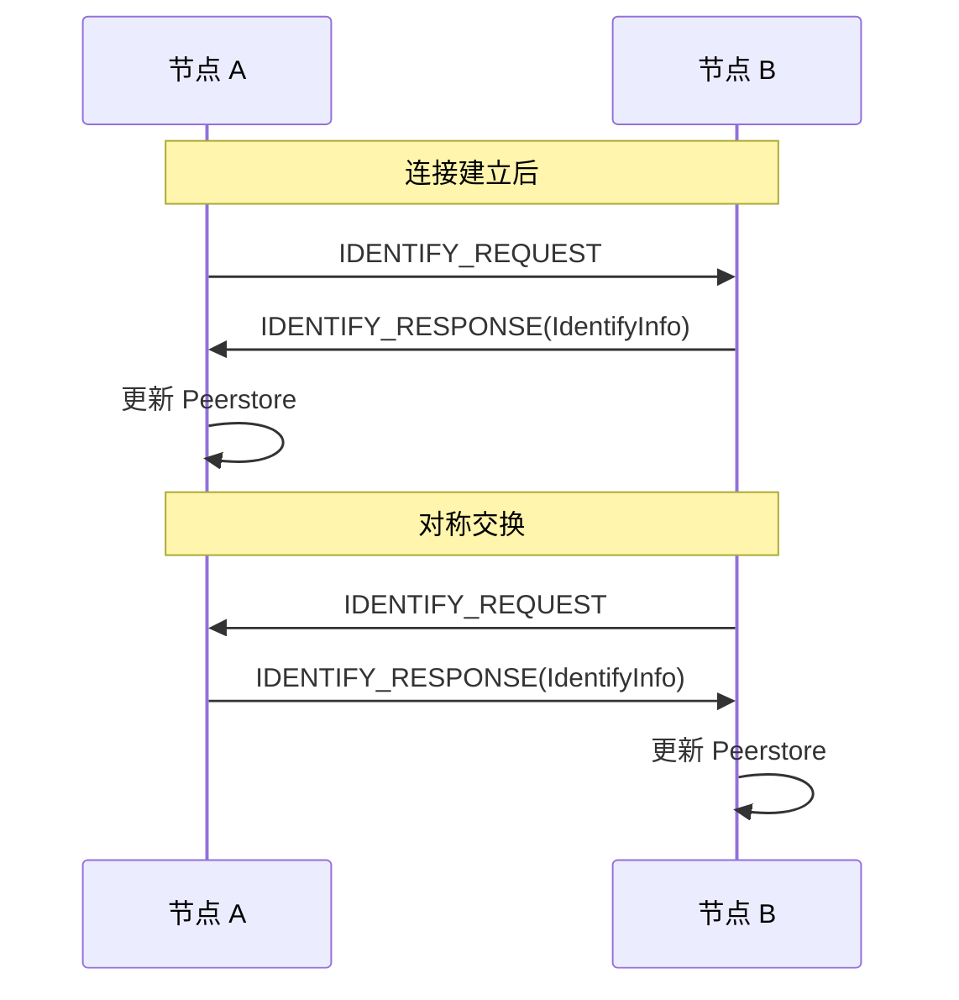

# Identify 协议规范

> 定义 DeP2P 的节点身份识别协议

---

## 概述

Identify 协议用于节点间交换身份信息，包括节点 ID、支持的协议列表、监听地址等。



---

## 协议 ID

| 协议 | ID | 说明 |
|------|-----|------|
| Identify | `/dep2p/sys/identify/1.0.0` | 节点身份识别 |
| Identify Push | `/dep2p/sys/identify/push/1.0.0` | 主动推送身份变更 |

---

## 消息格式

### IdentifyInfo 结构

```json
{
  "peer_id": "16Uiu2HAm...",
  "public_key": "CAESIAo1...",
  "listen_addrs": [
    "/ip4/0.0.0.0/tcp/4001",
    "/ip6/::/tcp/4001",
    "/ip4/0.0.0.0/udp/4001/quic-v1"
  ],
  "observed_addr": "/ip4/1.2.3.4/tcp/4001",
  "protocols": [
    "/dep2p/sys/identify/1.0.0",
    "/dep2p/relay/1.0.0/hop",
    "/dep2p/realm/abc123/join/1.0.0"
  ],
  "agent_version": "dep2p/1.0.0",
  "protocol_version": "dep2p/1.0.0"
}
```

### 字段定义

| 字段 | 类型 | 必需 | 说明 |
|------|------|------|------|
| `peer_id` | string | ✅ | 节点 ID（Base58 编码） |
| `public_key` | string | ✅ | 公钥（Base64 编码） |
| `listen_addrs` | []string | ✅ | 监听地址列表（multiaddr 格式） |
| `observed_addr` | string | ✅ | 观测到的远端地址（multiaddr 格式） |
| `protocols` | []string | ✅ | 支持的协议列表 |
| `agent_version` | string | ✅ | 客户端版本（如 `dep2p/1.0.0`） |
| `protocol_version` | string | ✅ | 协议版本（如 `dep2p/1.0.0`） |

---

## 协议流程

### 1. 连接后自动交换

```
连接建立后自动触发：

  1. 节点 A 连接到节点 B
  2. A 打开 identify 协议流
  3. A 发送 IDENTIFY_REQUEST
  4. B 响应 IDENTIFY_RESPONSE(IdentifyInfo)
  5. A 更新 Peerstore：
     - 添加 B 的 ListenAddrs
     - 记录 B 的 Protocols
  6. B 对 A 执行相同流程（对称交换）
```

### 2. ObservedAddr 语义

```
ObservedAddr 是节点 B 观测到的节点 A 的地址：

  • 场景：A 在 NAT 后，不知道自己的公网地址
  • B 通过 conn.RemoteAddr() 获取 A 的实际入站地址
  • B 在 IDENTIFY_RESPONSE 中填充 ObservedAddr
  • A 收到后，更新自己的外部地址缓存
  • A 可以将此地址广播给其他节点
```

### 3. Identify Push

```
主动推送身份变更：

  场景：节点网络变化（4G/WiFi 切换、IP 变更）
  
  1. 节点检测到 ListenAddrs 变化
  2. 向所有已连接节点推送 IDENTIFY_PUSH
  3. 对端更新 Peerstore
  
  Identify Push 实现主动推送身份变更
```

---

## 实现要求

### 客户端（请求方）

```
FUNCTION identify(peer)
  stream = open_stream(peer, "/dep2p/sys/identify/1.0.0")
  
  // 发送空请求（触发响应）
  send(stream, {})
  
  // 接收身份信息
  info = receive_identify_info(stream)
  
  // 更新 Peerstore
  peerstore.add_addrs(peer, info.listen_addrs, "identify")
  peerstore.add_protocols(peer, info.protocols)
  
  // 更新自己的外部地址
  IF info.observed_addr NOT EMPTY THEN
    update_external_addrs(info.observed_addr)
  END
  
  close(stream)
END
```

### 服务端（响应方）

```
FUNCTION handle_identify(stream, remote_peer)
  // 构造身份信息
  info = IdentifyInfo{
    peer_id: local_peer_id,
    public_key: encode_base64(local_public_key),
    listen_addrs: get_listen_addrs(),
    observed_addr: stream.conn().remote_multiaddr(), // 观测到的对端地址
    protocols: get_supported_protocols(),
    agent_version: "dep2p/1.0.0",
    protocol_version: "dep2p/1.0.0",
  }
  
  // 发送身份信息
  send_json(stream, info)
  
  close(stream)
END
```

---

## 地址传播链路

Identify 协议是**地址传播闭环**的关键一环：

```
┌─────────────────────────────────────────────────────────────────────────────┐
│                         地址传播闭环（Address Loop）                          │
├─────────────────────────────────────────────────────────────────────────────┤
│                                                                             │
│  1. Identify 交换 ListenAddrs / ObservedAddr                                 │
│     ↓                                                                       │
│  2. 写入 Peerstore (source="identify")                                       │
│     ↓                                                                       │
│  3. MemberSync V2 携带地址广播                                               │
│     ↓                                                                       │
│  4. Relay AddressBook 注册地址                                               │
│     ↓                                                                       │
│  5. 其他成员通过 Relay 查询地址                                              │
│     ↓                                                                       │
│  6. 建立直连，触发新的 Identify 交换                                         │
│                                                                             │
└─────────────────────────────────────────────────────────────────────────────┘
```

---

## 安全考虑

### 1. 身份验证

```
• PeerID 派生自公钥：无法伪造
• 连接建立时已通过 TLS 验证
• Identify 协议不再重复验证
```

### 2. 地址可信度

```
ListenAddrs 来源分级（Peerstore 记录来源）：

  1. Identify 交换（高可信）     ← 对端主动声明
  2. Relay AddressBook（中可信）  ← Relay 转发
  3. MemberList（中可信）        ← Gossip 传播
  4. DHT（低可信）               ← 全网发现
```

### 3. ObservedAddr 过滤

```
ObservedAddr 过滤规则：

  • 忽略私网地址（127.0.0.1, 192.168.*, 10.*, 172.16-31.*）
  • 忽略链路本地地址（169.254.*, fe80::）
  • 仅接受来自已验证节点的 ObservedAddr
  • 多个节点确认后才采纳（阈值：3 个节点）
```

### 4. 中继连接身份问题（来自实测验证）★

> 基于 2026-01-22 测试发现 (BUG-14/17)，详见 [测试计划](../../../_discussions/20260122-split-infra-test-plan.md)

```
中继连接时的 RemotePeer 问题：

  场景：WiFi (A) → Relay (R) → 4G (B)
  
  问题：
    • B 收到 STOP 流时，stream.Conn().RemotePeer() = R（Relay）
    • 实际应该返回 A（真正的发起方）
    • 导致 Identify 交换时记录了错误的 PeerID
  
  解决方案：
    1. Relay 在转发 STOP 消息时携带真正的发起方 PeerID
    2. 接收方使用包装流（RelayedStream），覆写 RemotePeer()
    3. 任何使用 stream.Conn().RemotePeer() 获取对端身份的代码
       必须考虑中继场景，可能需要从消息体解析真实 PeerID
  
  受影响的协议：
    • Identify 协议（需正确记录对端地址）
    • Realm 认证协议（需验证真正的对端身份）
    • 任何依赖 RemotePeer() 的身份相关逻辑
```

---

## 配置参数

| 参数 | 默认值 | 说明 |
|------|--------|------|
| `IdentifyTimeout` | 30s | Identify 请求超时 |
| `ObservedAddrActivationThresh` | 3 | ObservedAddr 激活阈值（几个节点确认） |
| `IdentifyPushEnabled` | true | 是否启用 Identify Push |

---

## 特性列表

| 特性 | 说明 |
|------|------|
| Identify 请求-响应 | 基础身份识别 |
| Identify Push | 地址变化主动推送 |
| ObservedAddr 激活阈值 | 多节点确认观察地址 |

---

## 关联文档

- [L1 Identity 层](README.md)
- [地址管理协议](../../L3_network/address.md)
- [Peerstore 设计](../../../03_architecture/L6_domains/core_peerstore/README.md)
- [Address Propagation Loop](../../../03_architecture/L3_behavioral/discovery_flow.md)
- [Relay 协议规范](../../L2_transport/relay.md)（中继连接身份问题）
- [传输层安全规范](../../L2_transport/security.md)（中继连接安全考量）

---

**最后更新**：2026-01-27
