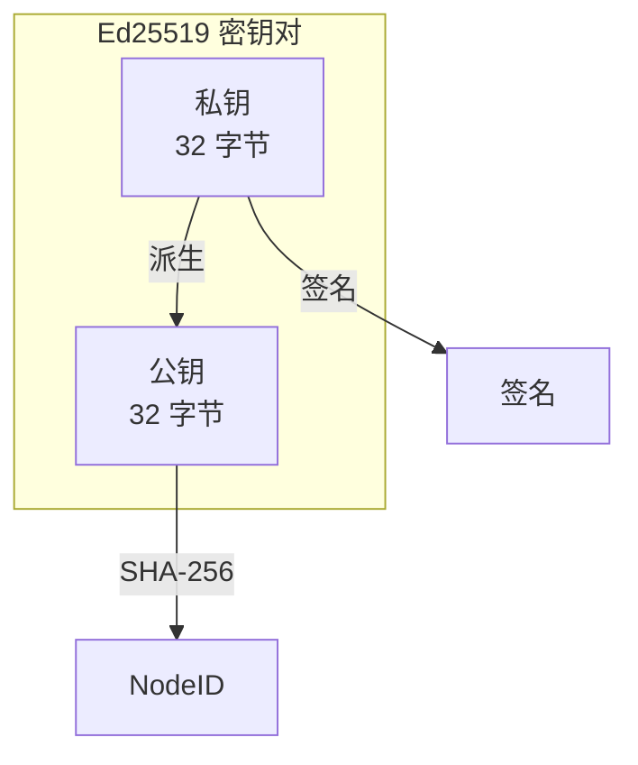

# 密钥格式规范

> 定义 DeP2P 的密钥编码和存储格式

---

## 概述

DeP2P 使用 **Ed25519** 作为主要密钥算法，提供高效、安全的数字签名能力。



---

## Ed25519 密钥

### 密钥大小

| 组件 | 大小 | 说明 |
|------|------|------|
| 私钥 | 32 字节 | 随机生成 |
| 公钥 | 32 字节 | 从私钥派生 |
| 签名 | 64 字节 | 消息签名 |

### 密钥生成

```
密钥生成伪代码：

  FUNCTION generate_keypair()
    // 生成 32 字节随机种子
    seed = random_bytes(32)
    
    // 派生私钥
    private_key = ed25519_private_from_seed(seed)
    
    // 派生公钥
    public_key = ed25519_public_from_private(private_key)
    
    RETURN (private_key, public_key)
  END
```

---

## 密钥编码

### 原始格式

最基本的密钥表示：

```
原始格式：

  公钥：32 字节裸数据
  私钥：32 字节种子 或 64 字节扩展私钥
```

### Protobuf 编码

用于网络传输：

```
Protobuf 密钥格式（伪代码）：

  MESSAGE PublicKey
    FIELD 1: type    ENUM      // 密钥类型
    FIELD 2: data    BYTES     // 密钥数据
  END
  
  ENUM KeyType
    Ed25519 = 0
    ECDSA   = 1
    RSA     = 2
  END
```

### 密钥类型标识

| 类型 | 值 | 公钥大小 |
|------|-----|----------|
| Ed25519 | 0 | 32 字节 |
| ECDSA (P-256) | 1 | 33/65 字节 |
| RSA | 2 | 变长 |

---

## 密钥存储

### 文件格式

```
密钥文件格式：

  ┌────────────────────────────────────────────────────────┐
  │                    密钥文件                             │
  ├────────────────────────────────────────────────────────┤
  │  Magic:     "DEP2P-KEY"  (9 bytes)                     │
  │  Version:   uint8                                       │
  │  Type:      uint8 (KeyType)                            │
  │  Encrypted: uint8 (0=否, 1=是)                          │
  │  Data:      密钥数据                                    │
  └────────────────────────────────────────────────────────┘
```

### 加密存储

```
加密存储伪代码：

  FUNCTION encrypt_private_key(private_key, password)
    // 派生加密密钥
    salt = random_bytes(16)
    encryption_key = argon2id(password, salt)
    
    // 加密私钥
    nonce = random_bytes(12)
    ciphertext = aes_gcm_encrypt(encryption_key, nonce, private_key)
    
    // 组装加密数据
    RETURN salt || nonce || ciphertext
  END
  
  FUNCTION decrypt_private_key(encrypted_data, password)
    // 解析数据
    salt = encrypted_data[0:16]
    nonce = encrypted_data[16:28]
    ciphertext = encrypted_data[28:]
    
    // 派生解密密钥
    encryption_key = argon2id(password, salt)
    
    // 解密
    RETURN aes_gcm_decrypt(encryption_key, nonce, ciphertext)
  END
```

### 文件权限

| 文件类型 | 权限 | 说明 |
|----------|------|------|
| 私钥文件 | 0600 | 仅所有者读写 |
| 公钥文件 | 0644 | 所有人可读 |

---

## Base58 编码

### 用途

用于人类可读的密钥显示：

```
Base58 编码规则：

  字符集：123456789ABCDEFGHJKLMNPQRSTUVWXYZabcdefghijkmnopqrstuvwxyz
  
  特点：
    • 无 0、O、I、l（避免混淆）
    • 无 +、/（URL 安全）
```

### 示例

```
公钥 Base58 示例：

  原始：[32 字节公钥]
  Base58：12D3KooWLbF67vRjEyVpKLMKSxhPq8Dq4i3tJjXHo...
```

---

## 密钥验证

### 公钥验证

```
公钥验证伪代码：

  FUNCTION validate_public_key(key_type, key_data)
    SWITCH key_type
      CASE Ed25519:
        IF length(key_data) != 32 THEN
          RETURN error("invalid Ed25519 key length")
        END
        IF NOT is_valid_curve_point(key_data) THEN
          RETURN error("invalid curve point")
        END
        
      CASE ECDSA:
        IF length(key_data) != 33 AND length(key_data) != 65 THEN
          RETURN error("invalid ECDSA key length")
        END
        
      DEFAULT:
        RETURN error("unsupported key type")
    END
    
    RETURN ok
  END
```

---

## 密钥派生

### X25519 派生

从 Ed25519 密钥派生 X25519 密钥用于密钥交换：

```
密钥派生伪代码：

  FUNCTION derive_x25519(ed25519_private)
    // Ed25519 私钥哈希
    h = sha512(ed25519_private.seed)
    
    // 取前 32 字节并调整
    x25519_private = h[0:32]
    x25519_private[0] &= 248
    x25519_private[31] &= 127
    x25519_private[31] |= 64
    
    RETURN x25519_private
  END
```

---

## 安全要求

### 生成要求

| 要求 | 说明 |
|------|------|
| 熵源 | 使用 CSPRNG |
| 种子长度 | 至少 256 位 |
| 不可预测 | 无确定性种子 |

### 存储要求

| 要求 | 说明 |
|------|------|
| 加密存储 | 生产环境必须加密 |
| 安全删除 | 内存清零 |
| 访问控制 | 限制文件权限 |

---

## 相关文档

- [NodeID 规范](nodeid.md)
- [签名规范](signature.md)
- [安全层规范](../L2_transport/security.md)

---

**最后更新**：2026-01-11
