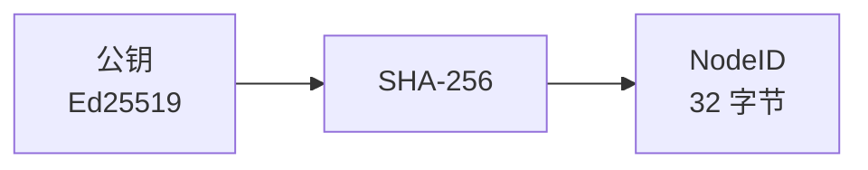
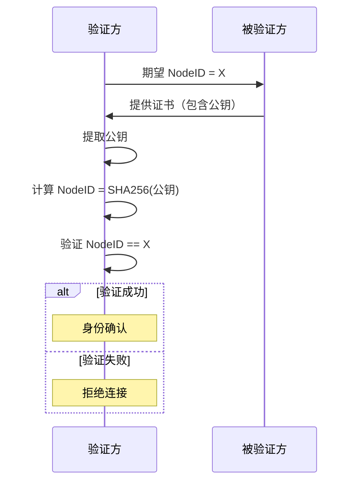

# NodeID 规范

> 定义 DeP2P 节点标识符的计算和表示规则

---

## 概述

NodeID 是 DeP2P 节点的唯一标识符，由公钥派生，用于在网络中标识和寻址节点。



---

## NodeID 计算

### 计算规则

```
NodeID 计算伪代码：

  FUNCTION compute_nodeid(public_key)
    // 获取公钥原始字节
    key_bytes = public_key.raw_bytes()
    
    // SHA-256 哈希
    hash = sha256(key_bytes)
    
    // NodeID 为完整哈希值
    RETURN hash  // 32 字节
  END
```

### 计算流程

```
┌────────────────────────────────────────────────────────────┐
│                    NodeID 计算流程                          │
├────────────────────────────────────────────────────────────┤
│                                                            │
│   公钥 (Ed25519, 32 字节)                                  │
│   ↓                                                        │
│   SHA-256 哈希                                             │
│   ↓                                                        │
│   NodeID (32 字节)                                         │
│                                                            │
└────────────────────────────────────────────────────────────┘
```

---

## NodeID 格式

### 二进制格式

| 属性 | 值 |
|------|-----|
| 长度 | 32 字节 (256 位) |
| 编码 | 原始二进制 |
| 字节序 | 不适用（字节数组） |

### 文本格式

使用 Base58 编码的人类可读格式：

```
文本格式示例：

  NodeID（二进制）: [32 字节]
  NodeID（Base58）: 12D3KooWLbF67vRjEyVpKLMKSxhPq8Dq4i3tJjXHoTZK...
  NodeID（短格式）: 12D3KooW...TZK (前8字符...后3字符)
```

### 编码规则

```
NodeID 编码伪代码：

  FUNCTION nodeid_to_string(nodeid)
    // 添加多编码前缀（identity）
    prefixed = MULTIHASH_IDENTITY_PREFIX || nodeid
    
    // Base58 编码
    RETURN base58_encode(prefixed)
  END
  
  FUNCTION string_to_nodeid(str)
    // Base58 解码
    data = base58_decode(str)
    
    // 移除前缀
    RETURN data[PREFIX_LENGTH:]
  END
```

---

## NodeID 属性

### 唯一性

```
唯一性保证：

  • NodeID 由公钥派生
  • 不同公钥产生不同 NodeID（碰撞概率可忽略）
  • 同一公钥始终产生相同 NodeID
```

### 不可伪造

```
不可伪造性：

  • 无法在不知道私钥的情况下证明拥有某 NodeID
  • 连接时通过 TLS 证书验证
  • 证书中的公钥必须派生出期望的 NodeID
```

---

## NodeID 验证

### 验证流程



### 验证伪代码

```
NodeID 验证伪代码：

  FUNCTION verify_nodeid(expected_id, certificate)
    // 提取公钥
    public_key = certificate.public_key()
    
    // 计算 NodeID
    actual_id = compute_nodeid(public_key)
    
    // 比较
    IF actual_id != expected_id THEN
      RETURN error("NodeID mismatch")
    END
    
    RETURN ok
  END
```

---

## NodeID 用途

### 网络层

| 用途 | 说明 |
|------|------|
| DHT 键 | 用于 Kademlia 路由 |
| 地址簿 | 索引节点地址 |
| 连接管理 | 标识连接对端 |

### 应用层

| 用途 | 说明 |
|------|------|
| 消息路由 | 点对点消息目标 |
| Realm 成员 | 成员身份标识 |
| 访问控制 | 权限验证 |

---

## 距离计算

### XOR 距离

用于 DHT 路由的距离计算：

```
XOR 距离伪代码：

  FUNCTION xor_distance(id1, id2)
    result = []
    FOR i = 0 TO 31
      result[i] = id1[i] XOR id2[i]
    END
    RETURN result
  END
  
  FUNCTION compare_distance(id, target, other)
    // 返回 id 与 target 的距离是否小于 other 与 target 的距离
    d1 = xor_distance(id, target)
    d2 = xor_distance(other, target)
    RETURN compare_bytes(d1, d2) < 0
  END
```

### 距离度量

```
距离比较伪代码：

  FUNCTION compare_bytes(a, b)
    FOR i = 0 TO length(a) - 1
      IF a[i] < b[i] THEN RETURN -1
      IF a[i] > b[i] THEN RETURN 1
    END
    RETURN 0
  END
```

---

## 短格式显示

### 格式

用于日志和用户界面的短格式：

```
短格式规则：

  完整：12D3KooWLbF67vRjEyVpKLMKSxhPq8Dq4i3tJjXHoTZKxyR5mJp
  短格式：12D3KooW...mJp
  
  规则：前 8 字符 + "..." + 后 3 字符
```

### 实现

```
短格式实现伪代码：

  FUNCTION short_id(nodeid_string)
    IF length(nodeid_string) <= 14 THEN
      RETURN nodeid_string
    END
    
    RETURN nodeid_string[0:8] + "..." + nodeid_string[-3:]
  END
```

---

## 相关文档

- [密钥格式](key_format.md)
- [签名规范](signature.md)
- [ADR-0001 身份优先](../../../01_context/decisions/ADR-0001-identity-first.md)
- [INV-001 身份第一性](../../../01_context/decisions/invariants/INV-001-identity-first.md)

---

**最后更新**：2026-01-11
