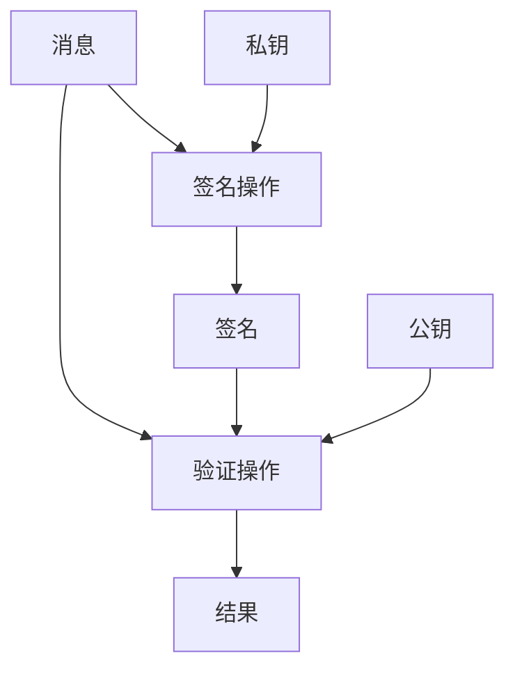
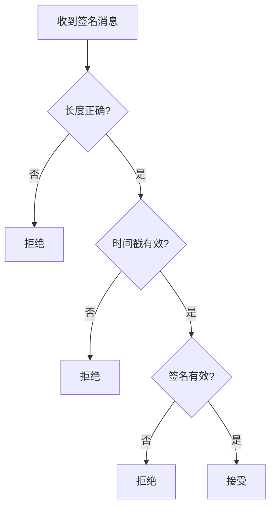

# 签名规范

> 定义 DeP2P 的数字签名算法和验证流程

---

## 概述

DeP2P 使用 **Ed25519** 签名算法提供消息认证和完整性保护。



---

## Ed25519 签名

### 算法参数

| 参数 | 值 |
|------|-----|
| 算法 | Ed25519 |
| 曲线 | Curve25519 |
| 私钥大小 | 32 字节 |
| 公钥大小 | 32 字节 |
| 签名大小 | 64 字节 |
| 安全级别 | 128 位 |

### 签名生成

```
签名生成伪代码：

  FUNCTION sign(private_key, message)
    // Ed25519 签名
    signature = ed25519_sign(private_key, message)
    
    // 返回 64 字节签名
    RETURN signature
  END
```

### 签名验证

```
签名验证伪代码：

  FUNCTION verify(public_key, message, signature)
    // 验证签名长度
    IF length(signature) != 64 THEN
      RETURN false
    END
    
    // Ed25519 验证
    RETURN ed25519_verify(public_key, message, signature)
  END
```

---

## 签名格式

### 原始格式

```
原始签名格式：

  ┌────────────────────────────────────────────────────────┐
  │                    签名 (64 字节)                       │
  ├─────────────────────────┬──────────────────────────────┤
  │      R (32 字节)        │      S (32 字节)             │
  └─────────────────────────┴──────────────────────────────┘
```

### 带类型签名

```
带类型签名格式（伪代码）：

  MESSAGE Signature
    FIELD 1: type      ENUM   // 签名类型
    FIELD 2: data      BYTES  // 签名数据
  END
  
  ENUM SignatureType
    Ed25519 = 0
    ECDSA   = 1
  END
```

---

## 签名场景

### DHT PeerRecord 签名

> DHT 是权威目录，PeerRecord 必须签名防投毒

```
PeerRecord 签名伪代码：

  FUNCTION sign_peer_record(private_key, peer_record)
    // 构造签名数据（序列化顺序固定）
    sign_data = concat(
      peer_record.NodeID,           // 32 bytes
      peer_record.RealmID,          // 32 bytes
      encode_addrs(peer_record.RelayAddrs),
      encode_addrs(peer_record.DirectAddrs),
      peer_record.NATType,          // 1 byte
      peer_record.Reachability,     // 1 byte
      peer_record.Seq,              // 8 bytes, big-endian
      peer_record.Timestamp,        // 8 bytes, big-endian
      peer_record.TTL               // 8 bytes, big-endian
    )
    
    // Ed25519 签名
    signature = sign(private_key, sign_data)
    
    RETURN signature
  END
  
  FUNCTION verify_peer_record(peer_record)
    // 从 NodeID 派生公钥
    public_key = derive_public_key(peer_record.NodeID)
    
    // 重构签名数据
    sign_data = reconstruct_sign_data(peer_record)
    
    // 验证签名
    IF NOT verify(public_key, sign_data, peer_record.Signature) THEN
      RETURN error("invalid signature")
    END
    
    // 检查序号（防重放）
    IF peer_record.Seq <= get_cached_seq(peer_record.NodeID) THEN
      RETURN error("stale record")
    END
    
    RETURN ok
  END
```

**DHT 验证规则**：
- 只接受合法签名的 PeerRecord
- 只接受序号递增的记录（防重放）
- 签名验证失败的记录被丢弃

### 身份消息签名

```
身份消息签名伪代码：

  FUNCTION sign_identity_message(private_key, identity_data)
    // 构造签名数据
    sign_data = concat(
      identity_data.public_key,
      identity_data.addrs,
      identity_data.protocols,
      identity_data.timestamp
    )
    
    // 签名
    signature = sign(private_key, sign_data)
    
    RETURN signature
  END
```

### 消息签名

```
通用消息签名伪代码：

  FUNCTION sign_message(private_key, message)
    // 消息摘要
    digest = sha256(message)
    
    // 签名摘要
    signature = sign(private_key, digest)
    
    RETURN signature
  END
```

---

## 时间戳签名

### 防重放

```
防重放签名伪代码：

  FUNCTION sign_with_timestamp(private_key, message)
    // 添加时间戳
    timestamp = current_time_ms()
    
    // 签名数据
    sign_data = concat(message, timestamp)
    signature = sign(private_key, sign_data)
    
    RETURN (signature, timestamp)
  END
  
  FUNCTION verify_with_timestamp(public_key, message, signature, timestamp)
    // 检查时间戳新鲜度
    IF abs(current_time_ms() - timestamp) > MAX_AGE THEN
      RETURN error("timestamp too old")
    END
    
    // 验证签名
    sign_data = concat(message, timestamp)
    RETURN verify(public_key, sign_data, signature)
  END
```

### 时间窗口

| 场景 | 最大时间偏差 |
|------|-------------|
| 身份交换 | 5 分钟 |
| 实时消息 | 30 秒 |
| 存储数据 | 无限制 |

---

## 批量验证

### 优化场景

当需要验证多个签名时，可使用批量验证优化：

```
批量验证伪代码：

  FUNCTION batch_verify(items)
    // items: [(public_key, message, signature), ...]
    
    // Ed25519 批量验证
    RETURN ed25519_batch_verify(items)
  END
```

### 性能对比

| 方式 | 100 个签名 | 说明 |
|------|-----------|------|
| 逐个验证 | ~3ms | 基线 |
| 批量验证 | ~1ms | 约 3x 加速 |

---

## 错误处理

### 签名错误

| 错误 | 说明 | 处理 |
|------|------|------|
| ErrInvalidSignature | 签名验证失败 | 拒绝消息 |
| ErrSignatureTooShort | 签名长度不足 | 拒绝消息 |
| ErrExpiredTimestamp | 时间戳过期 | 拒绝消息 |
| ErrFutureTimestamp | 时间戳在未来 | 拒绝消息 |

### 处理流程



---

## 安全要求

### 签名要求

| 要求 | 说明 |
|------|------|
| 确定性 | 相同输入产生相同签名 |
| 不可伪造 | 无私钥不能生成有效签名 |
| 不可抵赖 | 签名者不能否认签名 |

### 实现要求

| 要求 | 说明 |
|------|------|
| 常量时间 | 防止时序攻击 |
| 内存清理 | 签名后清除私钥副本 |
| 安全随机 | 不使用确定性随机 |

---

## 相关文档

- [密钥格式](key_format.md)
- [NodeID 规范](nodeid.md)
- [安全握手](../L2_transport/security.md)

---

**最后更新**：2026-01-27
