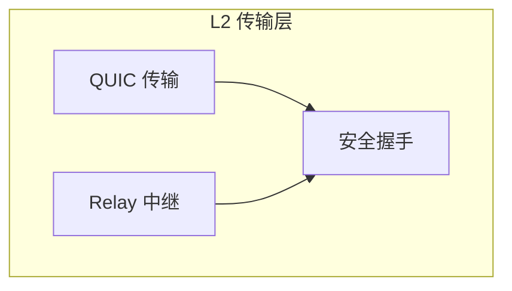
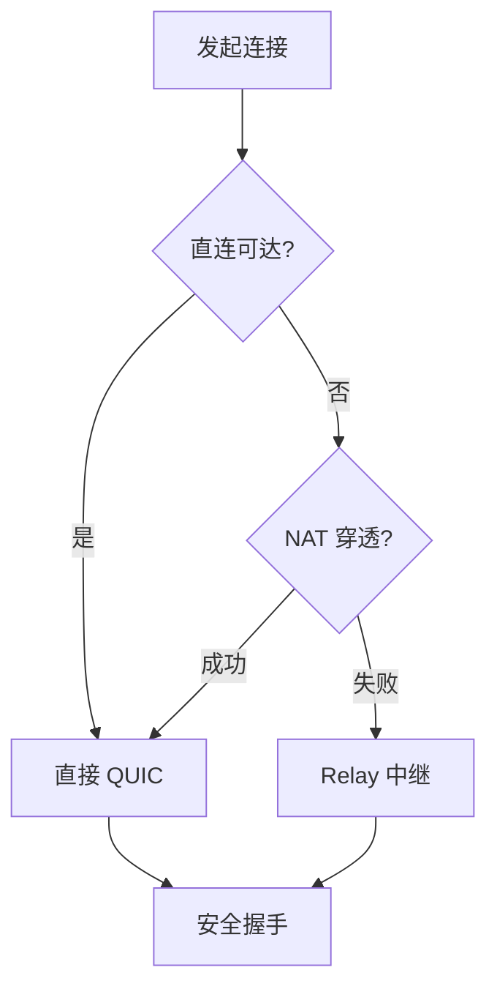
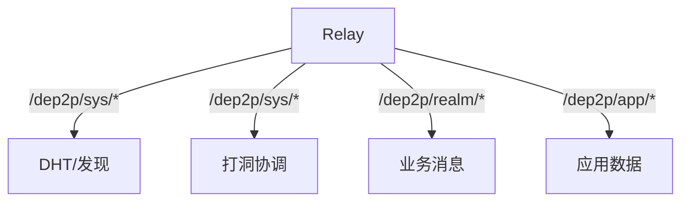
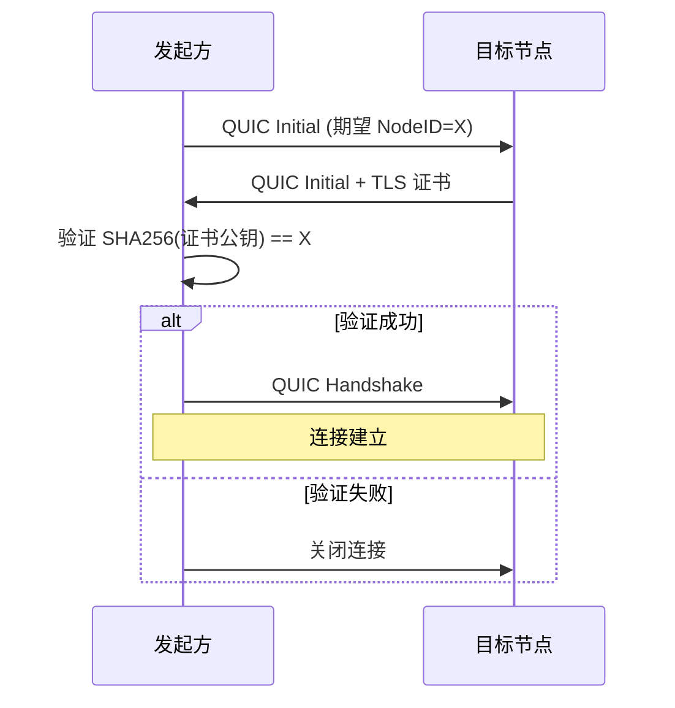

# L2 传输层规范

> 定义 DeP2P 的底层传输协议

---

## 概述

传输层提供安全、可靠的数据传输能力，是 DeP2P 网络通信的基础。



---

## 规范列表

| 规范 | 文档 | 说明 |
|------|------|------|
| QUIC 传输 | [quic.md](quic.md) | QUIC 协议配置 |
| Relay 中继 | [relay.md](relay.md) | 统一 Relay |
| 安全握手 | [security.md](security.md) | TLS 1.3 + NodeID 绑定 |

---

## 传输架构

### 协议选择



### 传输类型

| 类型 | 协议 | 特点 | 适用场景 |
|------|------|------|----------|
| **直连** | QUIC | 低延迟 | 公网/打洞成功 |
| **中继** | QUIC over Relay | 通用 | NAT 穿透失败 |

---

## QUIC 特性

### 核心优势

```
┌─────────────────────────────────────────────────────────────┐
│                    QUIC 优势                                 │
├─────────────────────────────────────────────────────────────┤
│                                                             │
│  内置加密                                                   │
│  ────────                                                   │
│  TLS 1.3 强制加密，无明文传输                                │
│                                                             │
│  多路复用                                                   │
│  ────────                                                   │
│  单连接多流，无队头阻塞                                      │
│                                                             │
│  低延迟                                                     │
│  ──────                                                     │
│  0-RTT 恢复，快速建连                                       │
│                                                             │
│  连接迁移                                                   │
│  ────────                                                   │
│  网络切换不断连                                              │
│                                                             │
└─────────────────────────────────────────────────────────────┘
```

---

## Relay 架构

### 统一 Relay



### Relay 类型

| 类型 | 转发协议 | 用途 |
|------|----------|------|
| **统一 Relay** | /dep2p/sys/*, /dep2p/realm/*, /dep2p/app/* | 控制面 + 数据面（协议与成员认证隔离） |

---

## 安全模型

### 安全要求

| 要求 | 实现 |
|------|------|
| 传输加密 | TLS 1.3 |
| 身份验证 | 证书绑定 NodeID |
| 前向保密 | ECDHE 密钥交换 |

### 验证流程



---

## 与其他层的关系

| 层级 | 依赖传输层的功能 |
|------|------------------|
| L3 网络层 | DHT 消息传输 |
| L4 应用层 | 业务消息传输 |

| 层级 | 传输层依赖 |
|------|-----------|
| L1 身份层 | TLS 证书生成 |
| L0 编码层 | 消息序列化 |

---

## 相关文档

- [L1 身份层](../L1_identity/)
- [L3 网络层](../L3_network/)
- [ADR-0003 中继优先连接](../../../01_context/decisions/ADR-0003-relay-first-connect.md)
- [ADR-0006 QUIC 传输](../../../01_context/decisions/ADR-0006-quic-transport.md)
- [ADR-0010 Relay 明确配置](../../../01_context/decisions/ADR-0010-relay-explicit-config.md)

---

**最后更新**：2026-01-11
