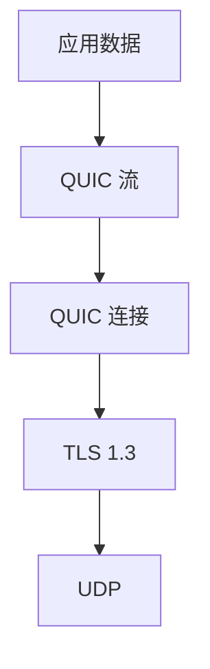
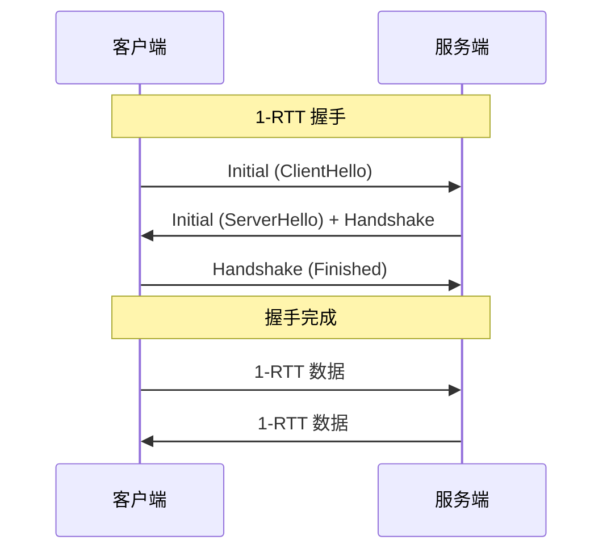
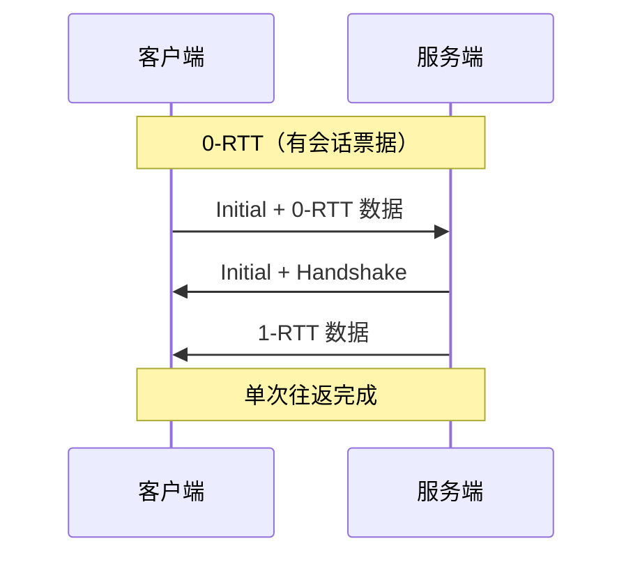
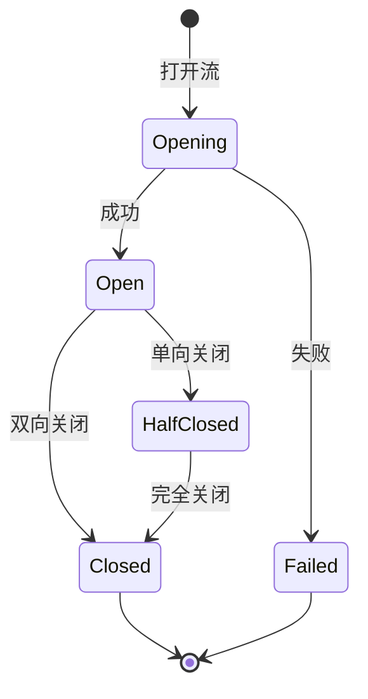
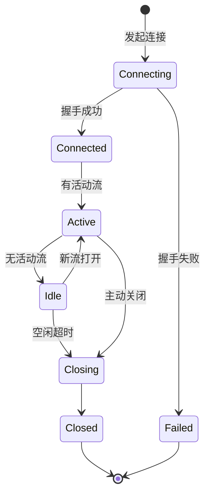
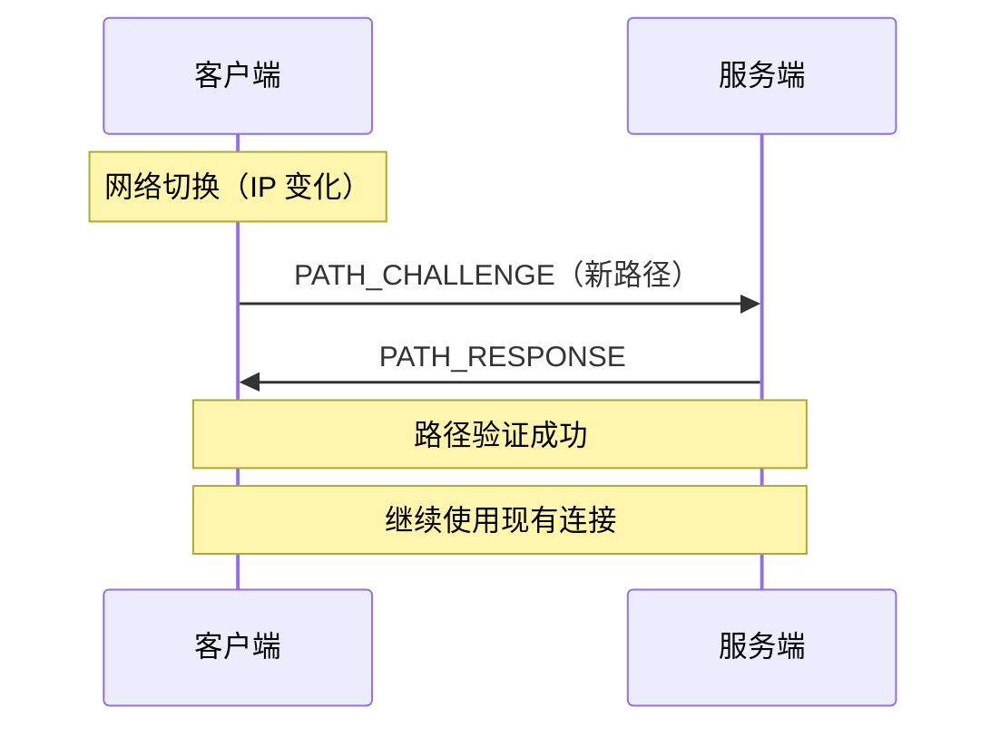

# QUIC 传输协议规范

> 定义 DeP2P 的 QUIC 传输层配置和行为

---

## 概述

DeP2P 使用 **QUIC** 作为主要传输协议，提供安全、可靠、低延迟的网络传输。



---

## 协议版本

| 版本 | RFC | 状态 |
|------|-----|------|
| QUIC v1 | RFC 9000 | 主要 |
| QUIC v2 | RFC 9369 | 支持 |

---

## 地址表示

### Multiaddr 格式

```
QUIC 地址格式：

  /ip4/{ipv4}/udp/{port}/quic-v1
  /ip6/{ipv6}/udp/{port}/quic-v1
  
示例：
  /ip4/192.168.1.1/udp/4001/quic-v1
  /ip6/::1/udp/4001/quic-v1
```

---

## 连接建立

### 握手流程



### 0-RTT 恢复



---

## 配置参数

### 核心参数

| 参数 | 默认值 | 说明 | 必需 |
|------|--------|------|------|
| MaxIncomingStreams | 256 | 最大入站并发流 | - |
| MaxIncomingUniStreams | 256 | 最大入站单向流 | - |
| MaxIdleTimeout | **6s** | 空闲超时（快速检测） | ★ |
| **KeepAlivePeriod** | **3s** | **保活间隔（快速检测）** | **★ 必需** |
| AllowConnectionMigration | true | 允许连接迁移 | - |

> **⚠️ 关键配置**：`KeepAlivePeriod` 是**必需**配置。如果不设置，QUIC 连接会在 `MaxIdleTimeout` 后自动断开，导致所有节点通信中断。

### 快速断开检测配置 ★

> v1.0.0 新增：优化非优雅断开的检测延迟

```
┌─────────────────────────────────────────────────────────────────────────────┐
│                    快速断开检测配置                                           │
├─────────────────────────────────────────────────────────────────────────────┤
│                                                                             │
│  检测延迟计算公式：                                                         │
│  ─────────────────                                                          │
│    最长检测延迟 ≈ KeepAlivePeriod + (2~3) × PTO                            │
│    PTO (Probe Timeout) 通常为 1-2s                                          │
│                                                                             │
│  推荐配置场景：                                                             │
│  ┌──────────────┬─────────────────┬────────────────┬───────────────┐       │
│  │ 场景         │ KeepAlivePeriod │ MaxIdleTimeout │ 最长检测延迟   │       │
│  ├──────────────┼─────────────────┼────────────────┼───────────────┤       │
│  │ 实时性优先   │ 2s              │ 4s             │ ~6s           │       │
│  │ 平衡配置★    │ 3s              │ 6s             │ ~9s           │       │
│  │ 资源节省     │ 5s              │ 10s            │ ~15s          │       │
│  └──────────────┴─────────────────┴────────────────┴───────────────┘       │
│                                                                             │
│  网络开销分析：                                                             │
│  ─────────────                                                              │
│    QUIC Keep-Alive 包大小: ~20 bytes (PING frame + header)                 │
│    场景：100 个连接，3s 间隔                                                │
│    每秒流量 = 100 × 20 / 3 ≈ 667 bytes/s ≈ 5.3 kbps                        │
│    结论：网络开销可忽略不计                                                 │
│                                                                             │
│  ⚠️ 误判风险说明：                                                          │
│  ─────────────────                                                          │
│    QUIC 超时可能由以下原因触发（并非真正离线）：                            │
│    • 网络拥塞导致丢包                                                       │
│    • 临时路由问题                                                           │
│    • 移动网络基站切换                                                       │
│    • 网络分区                                                               │
│                                                                             │
│    因此 QUIC_TIMEOUT 属于"低可信"检测方式，见证人机制需要多数确认。        │
│    仅 QUIC_CLOSE（对端主动关闭）才是"高可信"检测。                          │
│                                                                             │
└─────────────────────────────────────────────────────────────────────────────┘
```

### 流控参数

| 参数 | 默认值 | 说明 |
|------|--------|------|
| InitialStreamWindow | 512 KB | 初始流窗口 |
| MaxStreamWindow | 6 MB | 最大流窗口 |
| InitialConnWindow | 768 KB | 初始连接窗口 |
| MaxConnWindow | 15 MB | 最大连接窗口 |

### 配置示例

```
QUIC 配置伪代码：

  QUICConfig = {
    MaxIncomingStreams: 256,
    MaxIncomingUniStreams: 256,
    MaxIdleTimeout: 30 * SECOND,
    KeepAlivePeriod: 15 * SECOND,
    Allow0RTT: true,
    
    // 流控
    InitialStreamReceiveWindow: 512 * KB,
    MaxStreamReceiveWindow: 6 * MB,
  }
```

---

## 多层保活策略 ★

DeP2P 实现三层保活机制，确保连接稳定：

```
┌─────────────────────────────────────────────────────────────────────────────┐
│                          多层保活策略                                        │
├─────────────────────────────────────────────────────────────────────────────┤
│                                                                             │
│  Layer 1: QUIC 传输层保活 (KeepAlivePeriod) ★ 必需                          │
│  ═════════════════════════════════════════════                              │
│  • QUIC 自动发送 PING 帧                                                    │
│  • 配置: IdleTimeout/2 (如 30s idle → 15s keepalive)                        │
│  • 无需应用层参与                                                           │
│                                                                             │
│  Layer 2: Liveness 心跳服务 (HeartbeatInterval)                             │
│  ═════════════════════════════════════════════════                          │
│  • 应用层定期 Ping 检测                                                      │
│  • 协议: /dep2p/sys/heartbeat/1.0.0                                         │
│  • 用途: 节点健康评估、RTT 测量                                              │
│                                                                             │
│  Layer 3: GossipSub 心跳 (gossipsub heartbeat)                              │
│  ═════════════════════════════════════════════                              │
│  • 1 秒间隔的 Gossip 控制消息                                                │
│  • 用途: Mesh 维护、消息传播                                                 │
│                                                                             │
└─────────────────────────────────────────────────────────────────────────────┘
```

### 预设配置

| 预设 | IdleTimeout | KeepAlivePeriod | HeartbeatInterval | 适用场景 |
|------|-------------|-----------------|-------------------|----------|
| Mobile | 2 分钟 | 60 秒 | 30 秒 | 省电优先 |
| Desktop | 5 分钟 | 150 秒 | 15 秒 | 平衡 |
| Server | 10 分钟 | 300 秒 | 10 秒 | 稳定性优先 |
| Test | 30 秒 | 15 秒 | 5 秒 | 快速检测 |

---

## 流管理

### 流类型

| 类型 | 方向 | 用途 |
|------|------|------|
| 双向流 | 双方读写 | 请求响应 |
| 单向流 | 发起方写 | 推送通知 |

### 流复用

```
流复用示意：

  ┌─────────────────────────────────────────────────────────┐
  │                    QUIC 连接                             │
  ├─────────────────────────────────────────────────────────┤
  │  流 0: /dep2p/sys/identify/1.0.0                        │
  │  流 1: /dep2p/sys/ping/1.0.0                            │
  │  流 2: /dep2p/realm/abc/chat/1.0.0                      │
  │  流 3: /dep2p/app/abc/file/1.0.0                        │
  └─────────────────────────────────────────────────────────┘
                              ↓
  ┌─────────────────────────────────────────────────────────┐
  │                    单个 UDP 端口                         │
  └─────────────────────────────────────────────────────────┘
```

### 流生命周期



---

## 连接生命周期

### 状态机



### 状态转换规则

| 当前状态 | 事件 | 目标状态 |
|----------|------|----------|
| Connecting | 握手成功 | Connected |
| Connecting | 握手失败 | Failed |
| Connected | 打开流 | Active |
| Active | 所有流关闭 | Idle |
| Idle | 空闲超时 | Closing |
| * | 主动关闭 | Closing |

---

## NAT 穿透与 QUIC ★

> 基于 2026-01-22/23 测试反馈补充，详见 [NAT/Relay 概念澄清](../../../_discussions/20260123-nat-relay-concept-clarification.md)

### QUIC 与 NAT 的关系

```
┌─────────────────────────────────────────────────────────────────────────────┐
│                    QUIC 对 NAT 穿透的影响                                     │
├─────────────────────────────────────────────────────────────────────────────┤
│                                                                             │
│  优势：                                                                     │
│  ──────                                                                     │
│  • 基于 UDP：NAT 映射维持时间通常比 TCP 长                                 │
│  • 连接迁移：IP 变化时可保持会话                                           │
│  • 单端口多流：减少 NAT 端口占用                                           │
│                                                                             │
│  挑战：                                                                     │
│  ──────                                                                     │
│  • 部分防火墙/NAT 对 UDP 限制更严格                                        │
│  • Symmetric NAT 下 UDP 打洞成功率低                                       │
│  • 需要 KeepAlive 维持 NAT 映射                                            │
│                                                                             │
│  策略：                                                                     │
│  ──────                                                                     │
│  • KeepAlivePeriod 必须配置（维持 NAT 映射）                               │
│  • 结合 STUN 获取外部地址                                                  │
│  • 打洞失败时使用 Relay 回退                                               │
│                                                                             │
└─────────────────────────────────────────────────────────────────────────────┘
```

### NAT 保活与 QUIC KeepAlive 的关系

```
保活间隔设置原则：

  NAT UDP 映射超时：通常 30-120 秒
  推荐 KeepAlivePeriod：NAT 超时的 1/2 - 1/3
  
  示例：
    • 假设 NAT 超时 60 秒
    • 设置 KeepAlivePeriod = 20-30 秒
    • 确保在 NAT 映射过期前发送保活包
```

---

## 连接迁移

### 迁移场景

```
连接迁移场景：

  • WiFi → 移动网络
  • 移动网络 → WiFi
  • IP 地址变化
  • 端口变化
```

### 迁移流程



### 连接迁移配置

```
配置要求：

  quicConfig := &quic.Config{
      AllowConnectionMigration: true,  // 允许连接迁移（默认 true）
  }

限制条件：
  • NAT 后的节点可能因 NAT 映射变化而无法迁移
  • 某些防火墙可能阻止迁移
  • 需要双方 QUIC 实现都支持
```

---

## 共享 Socket 打洞机制 ★

> v1.0.0 新增：提高对称 NAT 下的打洞成功率

### 问题背景

```
┌─────────────────────────────────────────────────────────────────────────────┐
│                    对称 NAT 打洞失败问题                                     │
├─────────────────────────────────────────────────────────────────────────────┤
│                                                                             │
│  问题场景：                                                                 │
│  ──────────                                                                 │
│  节点 A 尝试打洞连接节点 B，但失败：                                        │
│                                                                             │
│    观察者        │ 观察到的 A 的端口 │ 说明                                 │
│    ─────────────┼──────────────────┼──────────                              │
│    Relay        │ 52413            │ 连接 Relay 时 NAT 分配                 │
│    Bootstrap    │ 57155            │ 连接 Bootstrap 时 NAT 分配             │
│    STUN         │ 50205            │ STUN 查询时 NAT 分配                   │
│    本地监听     │ 9002             │ 实际监听端口                           │
│                                                                             │
│  根因：对称 NAT 为每个目标分配不同端口，交换的地址在打洞时已失效            │
│                                                                             │
└─────────────────────────────────────────────────────────────────────────────┘
```

### 解决方案：quic.Transport 共享 Socket

```
┌─────────────────────────────────────────────────────────────────────────────┐
│                    共享 Socket 架构                                          │
├─────────────────────────────────────────────────────────────────────────────┤
│                                                                             │
│  改进前（问题）：                                                           │
│  ────────────────                                                           │
│  ┌────────────┐                                                             │
│  │  Listen()  │──▶ Socket A :9002                                           │
│  └────────────┘                                                             │
│  ┌────────────┐                                                             │
│  │   Dial()   │──▶ Socket B :随机端口  ← 问题：NAT 分配新端口！             │
│  └────────────┘                                                             │
│                                                                             │
│  改进后（解决）：                                                           │
│  ────────────────                                                           │
│  ┌────────────┐                                                             │
│  │  Listen()  │──┐                                                          │
│  └────────────┘  │                                                          │
│                  ├──▶ quic.Transport ──▶ 共享 Socket :9002                 │
│  ┌────────────┐  │                                                          │
│  │   Dial()   │──┘     ↑ 关键：Dial 和 Listen 使用同一端口                  │
│  └────────────┘                                                             │
│                                                                             │
│  效果：                                                                     │
│  ──────                                                                     │
│  • 对端观察到的地址与 STUN 查询结果一致                                     │
│  • 打洞请求从同一端口发出，NAT 映射可复用                                   │
│  • 对称 NAT 下打洞成功率显著提升                                            │
│                                                                             │
└─────────────────────────────────────────────────────────────────────────────┘
```

### 实现要点

```
实现伪代码：

  TYPE Transport struct {
      // 共享的 QUIC Transport 和 UDP socket
      quicTransport *quic.Transport
      udpConn       *net.UDPConn
      
      listeners     map[string]*Listener
  }
  
  FUNCTION (t *Transport) Listen(addr)
      IF t.udpConn == nil THEN
          // 首次监听时创建共享 UDP socket
          conn, err = net.ListenUDP("udp", addr)
          t.udpConn = conn
          t.quicTransport = &quic.Transport{Conn: conn}
      END
      
      // 使用共享 quicTransport 监听
      listener, err = t.quicTransport.Listen(tlsConf, quicConf)
      RETURN listener
  END
  
  FUNCTION (t *Transport) Dial(ctx, addr, peerID)
      IF t.quicTransport != nil THEN
          // 使用共享 quicTransport 拨号（关键！）
          conn, err = t.quicTransport.Dial(ctx, addr, tlsConf, quicConf)
      ELSE
          // 没有 Listen 时，创建独立 quicTransport
          conn, err = quic.Dial(ctx, addr, tlsConf, quicConf)
      END
      RETURN conn
  END
```

### 适用场景

| NAT 类型 | 不使用共享 Socket | 使用共享 Socket |
|----------|------------------|-----------------|
| Full Cone | 高成功率 | 高成功率 |
| Restricted Cone | 中成功率 | 高成功率 |
| Port Restricted | 低成功率 | 中成功率 |
| Symmetric | 极低成功率 | 低-中成功率 |

> **注意**：对称 NAT 下即使使用共享 Socket，也无法保证 100% 成功，最终仍需 Relay 作为保底。

---

## 错误处理

### 错误码

| 错误码 | 说明 | 处理 |
|--------|------|------|
| NO_ERROR | 正常关闭 | 清理资源 |
| INTERNAL_ERROR | 内部错误 | 重试 |
| CONNECTION_REFUSED | 拒绝连接 | 检查配置 |
| FLOW_CONTROL_ERROR | 流控错误 | 调整窗口 |
| STREAM_LIMIT_ERROR | 流数超限 | 等待或关闭 |
| CRYPTO_ERROR | TLS 错误 | 检查证书 |

### 错误恢复

```
错误恢复策略伪代码：

  FUNCTION handle_error(error)
    SWITCH error.code
      CASE NO_ERROR:
        cleanup()
        
      CASE INTERNAL_ERROR, FLOW_CONTROL_ERROR:
        IF retry_count < MAX_RETRIES THEN
          backoff_delay()
          retry()
        ELSE
          close()
        END
        
      CASE CONNECTION_REFUSED, CRYPTO_ERROR:
        log_error()
        close()
        
      CASE STREAM_LIMIT_ERROR:
        wait_for_stream_close()
    END
  END
```

---

## 性能优化

### 优化策略

| 策略 | 说明 |
|------|------|
| 0-RTT | 已知对端使用 0-RTT |
| 连接复用 | 使用连接池 |
| 流复用 | 单连接多流 |
| 调整窗口 | 根据带宽调整 |

### 监控指标

```
关键指标：

  连接指标：
    • 活跃连接数
    • 连接建立延迟
    • 连接失败率
    
  流指标：
    • 活跃流数
    • 流吞吐量
    • RTT
    • 丢包率
```

---

## 相关文档

- [安全握手](security.md)
- [Relay 中继](relay.md)
- [NAT 穿透规范](../L3_network/nat.md)
- [ADR-0006 QUIC 传输](../../../01_context/decisions/ADR-0006-quic-transport.md)
- [断开检测行为](../../../03_architecture/L3_behavioral/disconnect_detection.md)

---

**最后更新**：2026-01-28（新增快速断开检测配置、共享 Socket 打洞机制）
