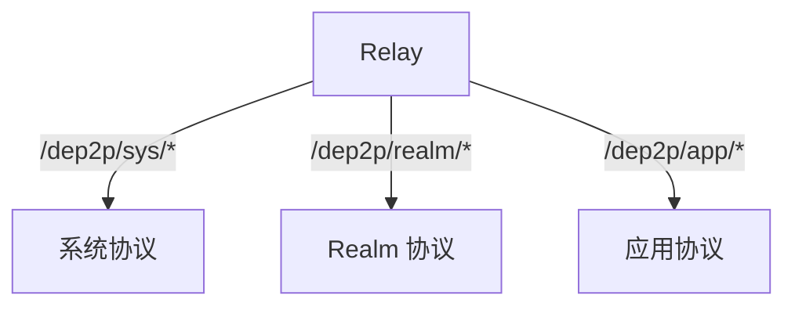
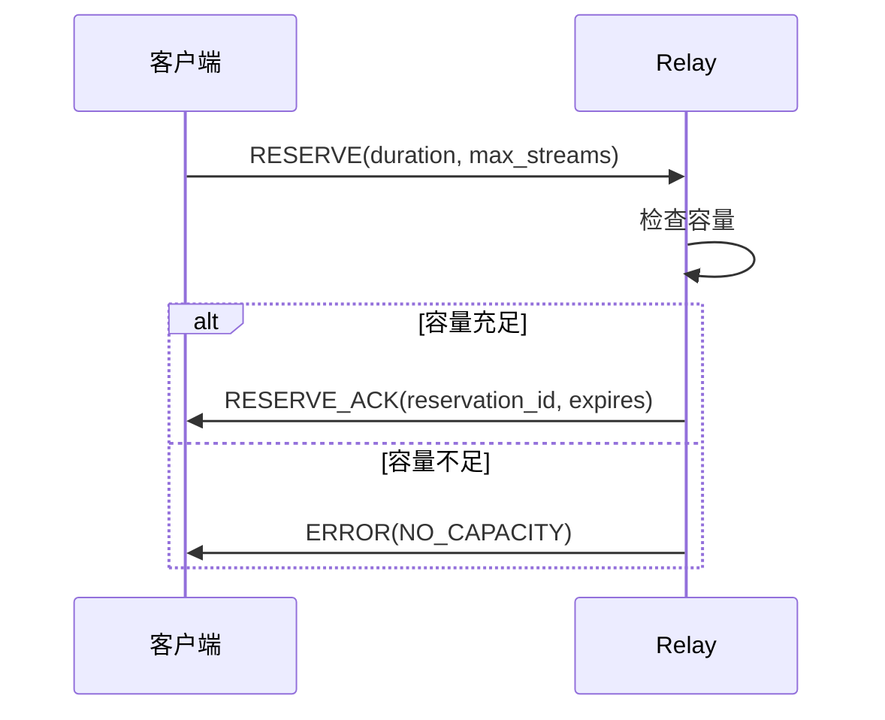
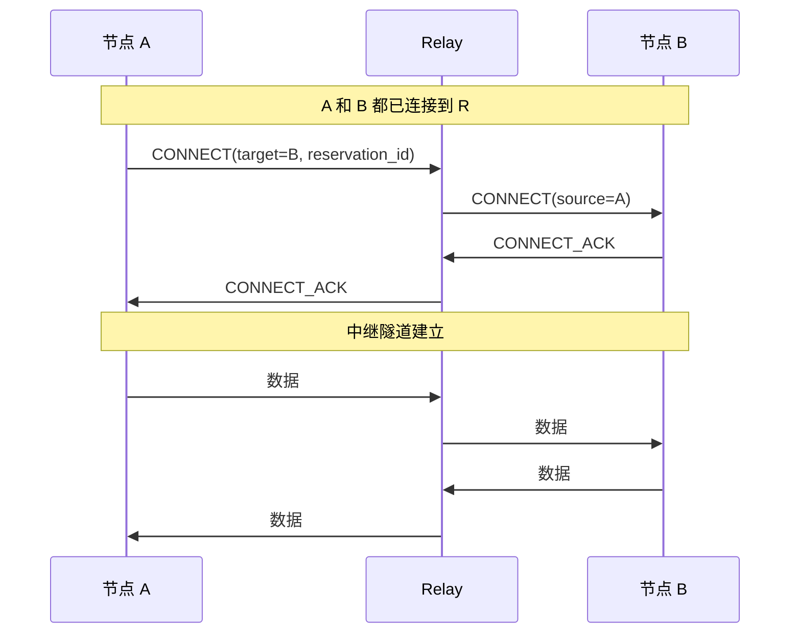
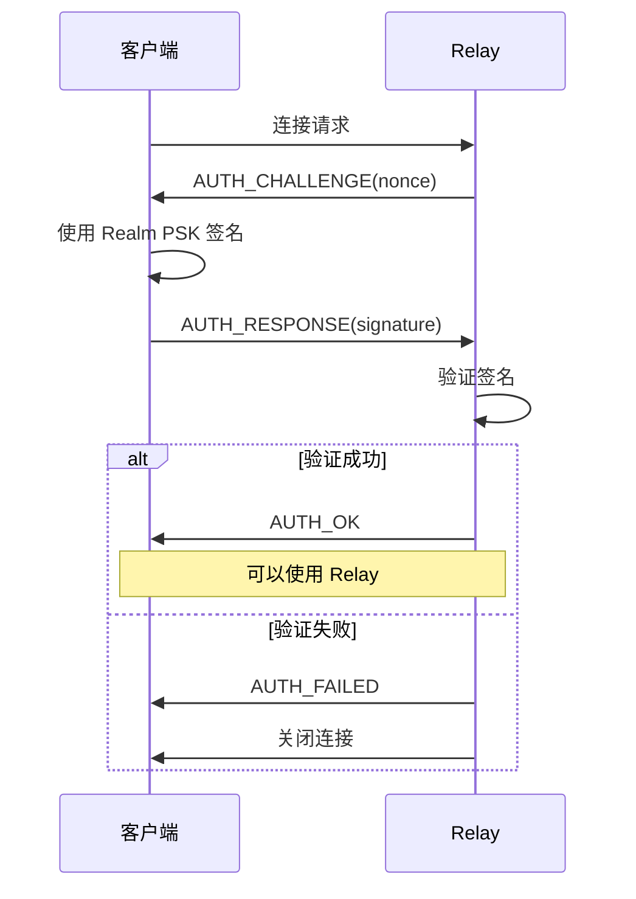
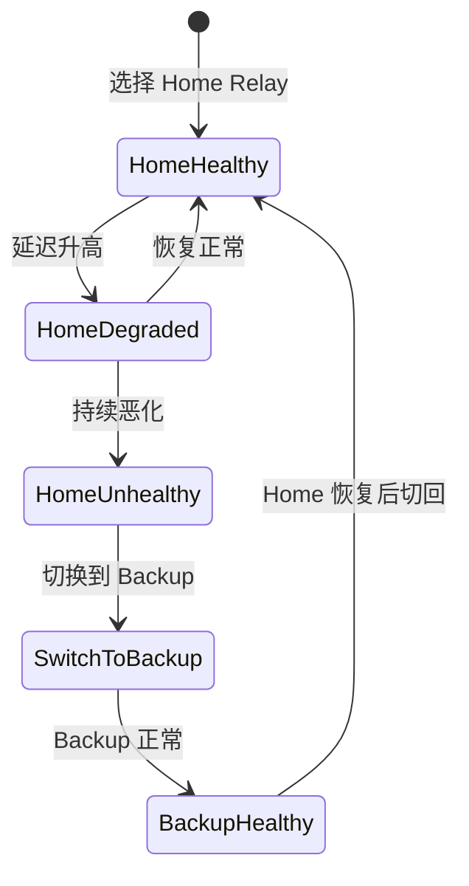

# Relay 中继协议规范

> 定义 DeP2P 的 Relay 中继架构和协议

---

## 概述

DeP2P 采用**统一 Relay 架构**，由同一 Relay 组件承载控制面与数据面流量，
通过协议前缀和 Realm 成员认证实现访问边界，而非通过中继分层。



---

## Relay 三大职责

> DHT 是权威目录，Relay 地址簿是本地缓存加速层

```
┌─────────────────────────────────────────────────────────────────────────────┐
│                    Relay 三大职责                                            │
├─────────────────────────────────────────────────────────────────────────────┤
│                                                                             │
│  三层架构                                                                   │
│  ═══════════════════                                                        │
│  Layer 1: DHT（权威目录） — 存储签名 PeerRecord                             │
│  Layer 2: 缓存加速层 — Peerstore / MemberList / Relay 地址簿                │
│  Layer 3: 连接策略 — 直连 → 打洞 → Relay 兜底                               │
│                                                                             │
│  职责一：缓存加速层（Address Cache Acceleration）                           │
│  ═══════════════════════════════════════════════════                        │
│  • Relay 维护连接成员的地址信息（MemberAddressBook）                        │
│  • 作为 DHT 的本地缓存，仅在 DHT 查询失败时回退使用                         │
│  • 设计目标：加速本地 Relay 范围内的地址查询                                │
│                                                                             │
│  职责二：打洞协调信令（Hole Punch Coordination）                            │
│  ═══════════════════════════════════════════════════                        │
│  • 提供打洞协调的信令通道                                                   │
│  • 交换双方的外部地址信息                                                   │
│                                                                             │
│  职责三：数据通信保底（Data Relay Fallback）                                │
│  ═══════════════════════════════════════════════                            │
│  • 只有直连和打洞都失败时才使用 Relay 转发                                  │
│  • 确保 Realm 成员总是可达（真正的保底）                                    │
│                                                                             │
│  地址发现优先级                                                             │
│  ═══════════════════════════                                                │
│  Peerstore → MemberList → DHT（权威） → Relay 地址簿（缓存回退）            │
│                                                                             │
└─────────────────────────────────────────────────────────────────────────────┘
```

---

## 明确配置原则

Relay 采用**明确配置**设计（详见 [ADR-0010](../../../01_context/decisions/ADR-0010-relay-explicit-config.md)）：

```
┌─────────────────────────────────────────────────────────────────────────────┐
│                    Relay 明确配置原则                                         │
├─────────────────────────────────────────────────────────────────────────────┤
│                                                                             │
│  核心原则：明确知道中继是谁                                                  │
│  ═══════════════════════════════                                            │
│  • 移除 Relay 自动发现机制                                                   │
│  • Relay 由部署方提供（项目方或业务方）                                      │
│  • 地址通过配置下发或显式告知，避免隐式发现                                  │
│                                                                             │
│  配置方式（极简开关）                                                        │
│  ═════════════════════                                                      │
│  Relay（项目方部署）:                                                        │
│    • 服务端: dep2p.EnableRelay(true)                                         │
│    • 客户端: dep2p.WithRelayAddr("/ip4/relay.dep2p.io/...")                 │
│                                                                             │
│  Relay（业务方部署）:                                                        │
│    • 服务端: realm.EnableRelay(ctx)     (沿用历史命名)                        │
│    • 客户端: realm.SetRelay("/ip4/1.2.3.4/...")                             │
│                                                                             │
│  设计理由                                                                    │
│  ═══════════                                                                │
│  • 便于问题定位：知道中继是谁，出问题直接检查                                 │
│  • 信任边界清晰：中继由可信方提供                                            │
│  • 符合兜底原则：兜底机制应简单可靠，不应复杂化                              │
│                                                                             │
└─────────────────────────────────────────────────────────────────────────────┘
```

---

## Relay 类型

### 统一 Relay

| 属性 | 值 |
|------|-----|
| 用途 | 控制面与数据面流量 |
| 协议前缀 | `/dep2p/sys/*`, `/dep2p/realm/<realmID>/*`, `/dep2p/app/<realmID>/*` |
| 认证 | Realm/应用协议需要成员资格；系统协议不要求 Realm 认证 |
| 部署 | 可由项目方或业务方部署 |
| **配置责任** | **部署方** |

### 内置默认值（用户不可配置）

**Relay（基础设施部署）默认值**:

| 参数 | 默认值 | 说明 |
|------|--------|------|
| MaxReservations | 100 | 最大预留连接数 |
| MaxDuration | 60s | 单次中继最大时长 |
| MaxDataRate | 10KB/s | 最大数据速率 |
| IdleTimeout | 30s | 空闲超时 |

**Relay（业务方部署）默认值**:

| 参数 | 默认值 | 说明 |
|------|--------|------|
| MaxMembers | 1000 | 最大成员数 |
| MaxDataRate | 无限制 | 数据速率（业务方决定） |
| MemberTTL | 24h | 成员信息过期时间 |
| AddressBookSize | 10000 | 地址簿大小 |

---

## 协议路由

### 路由规则

```
协议路由规则：

  ┌──────────────────────────────┬───────────────────────────────┐
  │        协议前缀              │            Relay              │
  ├──────────────────────────────┼───────────────────────────────┤
  │ /dep2p/sys/*                 │ 允许                          │
  │ /dep2p/realm/<realmID>/*     │ 仅匹配的 RealmID + 成员验证   │
  │ /dep2p/app/<realmID>/*       │ 仅匹配的 RealmID + 成员验证   │
  └──────────────────────────────┴───────────────────────────────┘
```

> **关键设计**：RealmID 嵌入协议路径，Relay 解析路径并验证成员资格。

Relay 服务端通过扩展 HOP 协议的 CONNECT/RESERVE 消息，携带目标协议前缀和 RealmID，实现服务端强制校验和拒绝。

### 路由验证

```
路由验证伪代码：

  FUNCTION validate_protocol(protocol_id, relay_realm_id)
    IF protocol_id.starts_with("/dep2p/sys/") THEN
      RETURN ok
    END

    IF protocol_id.starts_with("/dep2p/realm/") OR protocol_id.starts_with("/dep2p/app/") THEN
      // 提取协议路径中的 RealmID
      path_realm_id = extract_realm_id(protocol_id)
      IF path_realm_id != relay_realm_id THEN
        RETURN error("realm id mismatch")
      END
      IF NOT is_member(relay_realm_id, peer_id) THEN
        RETURN error("not a realm member")
      END
      RETURN ok
    END
    
    RETURN error("unknown protocol")
  END
```

---

## 中继协议

### 协议 ID

```
Relay 协议 ID：

  HOP： /dep2p/relay/1.0.0/hop
  STOP：/dep2p/relay/1.0.0/stop
```

> **注意**：DeP2P 使用 Circuit v2 协议，Relay 统一承载控制面与数据面流量。

### 消息类型

```
Relay 消息类型：

  // 控制消息
  RESERVE        = 0x01  // 预留中继槽
  RESERVE_ACK    = 0x02  // 预留确认
  CONNECT        = 0x03  // 请求中继连接
  CONNECT_ACK    = 0x04  // 连接确认
  DISCONNECT     = 0x05  // 断开连接
  
  // 状态消息
  STATUS         = 0x10  // 状态查询
  STATUS_RESP    = 0x11  // 状态响应
```

---

## 地址簿协议

> 地址簿是**本地缓存**，不是权威目录。DHT 是权威目录。

### 协议 ID

```
/dep2p/realm/<realmID>/addressbook/1.0.0
```

### 消息封装

- AddressBookMessage（protobuf）：
  - REGISTER / REGISTER_RESPONSE
  - QUERY / RESPONSE
  - BATCH_QUERY / BATCH_RESPONSE
  - UPDATE

### 关键字段

- MemberEntry：`node_id`, `addrs`, `nat_type`, `capabilities`, `online`, `last_seen`
- AddressRegister：`node_id`, `addrs`, `nat_type`, `capabilities`, `signature`, `timestamp`
- AddressUpdate：`node_id`, `new_addrs`, `old_addrs`, `update_type`, `signature`

详见：`pkg/lib/proto/addressbook/addressbook.proto`

---

## 中继流程

### 预留中继槽



### 建立中继连接



---

## 消息格式

### 控制消息

```
RESERVE 消息格式：

  ┌────────────────────────────────────────────────────────┐
  │  Type (1)  │  Duration (4)  │  MaxStreams (2)         │
  └────────────────────────────────────────────────────────┘
  
  Type: 0x01 (RESERVE)
  Duration: 预留时长（秒，大端序）
  MaxStreams: 最大并发流数
```

```
CONNECT 消息格式：

  ┌────────────────────────────────────────────────────────┐
  │  Type (1)  │  TargetID (32)  │  ReservationID (16)    │
  └────────────────────────────────────────────────────────┘
  
  Type: 0x03 (CONNECT)
  TargetID: 目标节点 NodeID
  ReservationID: 预留标识
```

### 数据消息

```
数据帧格式：

  ┌────────────────────────────────────────────────────────┐
  │  Length (varint)  │  StreamID (4)  │  Payload          │
  └────────────────────────────────────────────────────────┘
  
  Length: 帧总长度
  StreamID: 流标识
  Payload: 中继数据
```

---

## 资源限制

### 每连接限制

| 限制 | 默认值 | 说明 |
|------|--------|------|
| MaxReservations | 10 | 最大预留数 |
| MaxStreamsPerReservation | 100 | 每预留最大流 |
| ReservationDuration | 1 小时 | 预留有效期 |
| MaxBandwidth | 1 MB/s | 每连接带宽 |

### 每 Relay 限制

| 限制 | 默认值 | 说明 |
|------|--------|------|
| MaxConnections | 10000 | 最大连接数 |
| MaxActiveRelays | 5000 | 最大活跃中继 |
| TotalBandwidth | 100 MB/s | 总带宽 |

---

## Relay 认证（Realm 维度）

### 认证流程



### 认证消息

```
认证挑战：

  ┌────────────────────────────────────────────────────────┐
  │  Type (1)  │  RealmID (32)  │  Nonce (32)             │
  └────────────────────────────────────────────────────────┘

认证响应：

  ┌────────────────────────────────────────────────────────┐
  │  Type (1)  │  NodeID (32)  │  Signature (64)          │
  └────────────────────────────────────────────────────────┘
```

---

## ★ Home/Backup Relay 策略 (计划中)

从旧代码库发现的增强 Relay 管理策略：

### Relay 角色

```
Relay 角色定义：

  Home Relay (主中继)
  ├── 每个节点有一个 Home Relay
  ├── 作为节点的"地址锚点"
  ├── 其他节点通过 Home Relay 找到该节点
  └── 优先选择延迟最低的 Relay
  
  Backup Relay (备用中继)
  ├── Home Relay 故障时自动切换
  ├── 建议配置 2-3 个 Backup
  └── 按延迟排序的候选列表
```

### Relay 健康状态

```
健康状态定义：

  Healthy   = 0  // 健康：连接正常，延迟 < 阈值
  Degraded  = 1  // 降级：延迟升高或偶发错误
  Unhealthy = 2  // 不健康：连接失败或频繁超时
  Unknown   = 3  // 未知：初始状态或长时间无探测
```

### 自动故障转移



---

## 错误处理

### 错误码

| 错误码 | 说明 |
|--------|------|
| NO_CAPACITY | 容量不足 |
| RESERVATION_EXPIRED | 预留过期 |
| TARGET_NOT_FOUND | 目标不存在 |
| AUTH_FAILED | 认证失败 |
| PROTOCOL_NOT_ALLOWED | 协议不允许 |

### 错误恢复

```
错误恢复策略：

  NO_CAPACITY:
    • 等待后重试
    • 切换到其他 Relay
    
  RESERVATION_EXPIRED:
    • 重新预留
    
  TARGET_NOT_FOUND:
    • 更新地址簿
    • 通过发现服务查找
    
  AUTH_FAILED:
    • 检查 Realm 成员资格
    • 更新 PSK
```

---

## 相关文档

- [QUIC 传输](quic.md)
- [安全握手](security.md)
- [ADR-0003 中继优先连接](../../../01_context/decisions/ADR-0003-relay-first-connect.md)
- [ADR-0010 Relay 明确配置](../../../01_context/decisions/ADR-0010-relay-explicit-config.md)

---

## ★ 实现要求（来自实测验证）

> 以下要求来自 2026-01-22 Bootstrap/Relay 拆分部署测试，详见 [测试计划](../../../_discussions/20260122-split-infra-test-plan.md)

### 协议处理器注册（BUG-7 修复）

```
┌─────────────────────────────────────────────────────────────────────────────┐
│                    协议处理器注册要求                                         │
├─────────────────────────────────────────────────────────────────────────────┤
│                                                                             │
│  Relay 服务端必须在 Start() 之前调用 SetHost()                              │
│  否则协议处理器不会注册，客户端预留时报：                                     │
│    "远端不支持 Relay 协议"                                                   │
│                                                                             │
│  正确顺序：                                                                  │
│    1. server = NewServer(swarm, limiter)                                    │
│    2. server.SetHost(host)           ← 必须在 Start 之前                    │
│    3. server.Start()                                                        │
│                                                                             │
│  验证日志：                                                                  │
│    ✅ "中继预留成功 relay=..."                                               │
│    ❌ "预留失败: 远端不支持 Relay 协议"                                       │
│                                                                             │
└─────────────────────────────────────────────────────────────────────────────┘
```

### Peerstore 地址存储（BUG-6 修复）

```
┌─────────────────────────────────────────────────────────────────────────────┐
│                    Relay 地址存储要求                                         │
├─────────────────────────────────────────────────────────────────────────────┤
│                                                                             │
│  配置 RelayAddr 时，必须同时将地址写入 Peerstore                            │
│  否则 AutoRelay 无法连接到 Relay 节点                                        │
│                                                                             │
│  实现：                                                                      │
│    ai, _ := AddrInfoFromString(RelayAddr)                                   │
│    peerstore.AddAddrs(ai.ID, ai.Addrs, 24*time.Hour)                        │
│                                                                             │
│  验证日志：                                                                  │
│    ✅ "从 PeerStore 获取地址 peerID=... addrCount=1"                         │
│    ❌ "从 PeerStore 获取地址 peerID=... addrCount=0"                         │
│                                                                             │
└─────────────────────────────────────────────────────────────────────────────┘
```

### Relay 注入 Swarm（BUG-A 修复）

```
┌─────────────────────────────────────────────────────────────────────────────┐
│                    Relay 注入要求                                            │
├─────────────────────────────────────────────────────────────────────────────┤
│                                                                             │
│  RelayManager 必须在 Start() 结束时将自身注入到 Swarm                        │
│  否则 Swarm 直连失败后无法回退到 Relay                                        │
│                                                                             │
│  实现：                                                                      │
│    // Manager.Start() 末尾                                                  │
│    swarm.SetRelayDialer(manager)                                            │
│                                                                             │
│  验证日志：                                                                  │
│    ✅ "Relay 连接尝试 target=... relay=..."                                  │
│    ❌ "未配置 Relay，无法回退"                                                │
│                                                                             │
└─────────────────────────────────────────────────────────────────────────────┘
```

### STOP 流处理（BUG-13 修复）

```
┌─────────────────────────────────────────────────────────────────────────────┐
│                    STOP 流处理要求                                            │
├─────────────────────────────────────────────────────────────────────────────┤
│                                                                             │
│  收到 STOP CONNECT 并响应 OK 后，必须将流交给 Host 处理协议协商               │
│  否则后续协议（如 Realm auth）会收到 EOF                                      │
│                                                                             │
│  数据流：                                                                    │
│    WiFi ─── HOP CONNECT ──→ Relay ─── STOP CONNECT ──→ 4G                  │
│    WiFi ◄── HOP OK ─────── Relay ◄─── STOP OK ──────── 4G                  │
│    WiFi ─── Protocol Negotiation (Realm auth) ────────→ 4G                  │
│                                                                             │
│  实现：                                                                      │
│    // STOP 处理器响应 OK 后                                                  │
│    host.HandleInboundStream(wrappedStream)                                  │
│                                                                             │
│  注意：Host 接口需要公开 HandleInboundStream 方法                            │
│                                                                             │
└─────────────────────────────────────────────────────────────────────────────┘
```

### 中继连接流包装（BUG-14/17 修复）

```
┌─────────────────────────────────────────────────────────────────────────────┐
│                    中继连接流包装要求                                         │
├─────────────────────────────────────────────────────────────────────────────┤
│                                                                             │
│  问题：中继连接的 stream.Conn().RemotePeer() 返回 Relay 的 ID                │
│                                                                             │
│    WiFi (GGJgPFyQ) ──→ Relay (8QmeKhG3) ──→ 4G (C1Qmo9Mf)                  │
│                                                                             │
│    4G 收到 STOP 流时：                                                       │
│      stream.Conn().RemotePeer() = 8QmeKhG3 (Relay)  ← 错误！               │
│      应该是 GGJgPFyQ (WiFi)                                                 │
│                                                                             │
│  解决：包装流，覆写 RemotePeer() 方法返回真实对端 ID                         │
│                                                                             │
│    type RelayedStream struct {                                              │
│      Stream                                                                 │
│      remotePeer peer.ID  // 真实对端 ID，从 STOP 消息解析                    │
│    }                                                                        │
│                                                                             │
│    func (s *RelayedStream) RemotePeer() peer.ID {                           │
│      return s.remotePeer                                                    │
│    }                                                                        │
│                                                                             │
└─────────────────────────────────────────────────────────────────────────────┘
```

### Relay 节点 DHT 可发现性（BUG-2/C 修复）

```
┌─────────────────────────────────────────────────────────────────────────────┐
│                    Relay 节点 DHT 要求                                        │
├─────────────────────────────────────────────────────────────────────────────┤
│                                                                             │
│  Relay 节点必须配置 Bootstrap peers 并加入 DHT                               │
│  否则 DHT 路由表为空，无法被 AutoRelay/DHT 发现                               │
│                                                                             │
│  配置要求：                                                                  │
│    relay.config.json:                                                       │
│      "bootstrap": {                                                         │
│        "peers": ["/ip4/BOOTSTRAP_IP/udp/4001/quic-v1/p2p/BOOTSTRAP_ID"]    │
│      }                                                                      │
│                                                                             │
│  验证日志：                                                                  │
│    ✅ "routingTableSize>=1"                                                  │
│    ❌ "routingTableSize=0"                                                   │
│                                                                             │
│  DHT 发现过滤：                                                              │
│    DHT.FindPeers(namespace="relay/1.0.0") 应只返回 Relay 节点               │
│    实现时需检查节点能力标记，过滤非 Relay 节点                                │
│                                                                             │
└─────────────────────────────────────────────────────────────────────────────┘
```

---

## ★ 中继电路多路复用架构 (v0.2.26)

> 根据 [ADR-0011](../../../01_context/decisions/ADR-0011-relay-circuit-muxer.md) 定义的中继电路架构

### 问题背景

旧实现存在设计意图与实际实现的鸿沟：

```
┌─────────────────────────────────────────────────────────────────────────────────┐
│                    设计意图 vs 实际实现的鸿沟                                     │
├─────────────────────────────────────────────────────────────────────────────────┤
│                                                                                 │
│  设计意图：                                                                      │
│  ───────────                                                                    │
│  "Relay 建立的是透明双向隧道，具体协议协商在 stream 建立后才发生"               │
│                                                                                 │
│  旧实现（错误）：                                                                │
│  ─────────────────                                                              │
│  func (c *RelayClient) Connect(...) (transportif.Conn, error) {                 │
│      stream, err := conn.OpenStream(ctx, ProtocolRelayHop)                     │
│      // ... STOP 握手 ...                                                       │
│      return &relayedConn{                                                       │
│          stream: stream,  // ⚠️ 单流！协议协商后流被关闭！                       │
│      }, nil                                                                     │
│  }                                                                              │
│                                                                                 │
│  问题：设计说"透明隧道"，但实现是"单流连接"                                      │
│       流关闭后，"隧道"就断了，无法再次使用                                       │
│                                                                                 │
└─────────────────────────────────────────────────────────────────────────────────┘
```

### 正确架构：RelayCircuit

```
┌───────────────────────────────────────────────────────────────────────────┐
│                     RelayCircuit（多路复用架构）                           │
│                                                                            │
│  ┌─────────────────────────────────────────────────────────────────────┐  │
│  │  Control Channel (控制通道)                                          │  │
│  │  ─────────────────────────                                           │  │
│  │  • STOP 握手完成后保持                                               │  │
│  │  • KeepAlive 心跳                                                    │  │
│  │  • 电路状态同步                                                      │  │
│  └─────────────────────────────────────────────────────────────────────┘  │
│                                                                            │
│  ┌─────────────────────────────────────────────────────────────────────┐  │
│  │  Data Channel (数据通道) - 通过 Muxer 实现                           │  │
│  │  ──────────────────────────────────────────                          │  │
│  │                                                                      │  │
│  │  ┌────────────┐ ┌────────────┐ ┌────────────┐                       │  │
│  │  │  Stream 1  │ │  Stream 2  │ │  Stream N  │  ← 独立生命周期        │  │
│  │  │  (chat)    │ │  (pubsub)  │ │  (dht)     │                       │  │
│  │  └────────────┘ └────────────┘ └────────────┘                       │  │
│  │                                                                      │  │
│  │  • 每个流可以独立 CloseWrite/CloseRead                               │  │
│  │  • 流关闭不影响电路                                                  │  │
│  │  • 可以随时 OpenStream() 创建新流                                    │  │
│  └─────────────────────────────────────────────────────────────────────┘  │
│                                                                            │
│  ┌─────────────────────────────────────────────────────────────────────┐  │
│  │  Circuit State Machine (状态机)                                      │  │
│  │  ─────────────────────────────                                       │  │
│  │                                                                      │  │
│  │   ┌────────┐   STOP OK   ┌────────┐   心跳超时   ┌────────┐         │  │
│  │   │Creating│ ─────────→ │ Active │ ─────────→  │ Stale  │         │  │
│  │   └────────┘             └────────┘             └────────┘         │  │
│  │                               │                      │              │  │
│  │                               │ 配额耗尽/主动关闭     │ 重连成功     │  │
│  │                               ▼                      │              │  │
│  │                          ┌────────┐                  │              │  │
│  │                          │ Closed │ ←────────────────┘              │  │
│  │                          └────────┘   重连失败                       │  │
│  │                                                                      │  │
│  └─────────────────────────────────────────────────────────────────────┘  │
└───────────────────────────────────────────────────────────────────────────┘
```

### 核心数据结构

```go
// RelayCircuit 中继电路（实现 Connection 接口）
type RelayCircuit struct {
    // 控制通道
    controlStream pkgif.Stream  // STOP 握手后保持
    
    // 数据通道 Muxer（关键改动！）
    muxer         muxerif.MuxedConn  // yamux over relay stream
    
    // 电路元信息
    relayPeer     types.PeerID
    remotePeer    types.PeerID
    localPeer     types.PeerID
    
    // 状态
    state         CircuitState
    stateMu       sync.RWMutex
    
    // 配额
    bytesUsed     int64
    maxBytes      int64
    deadline      time.Time
    
    // 心跳
    lastActivity  time.Time
    keepAliveTick *time.Ticker
}

// CircuitState 电路状态
type CircuitState int
const (
    CircuitStateCreating CircuitState = iota
    CircuitStateActive
    CircuitStateStale
    CircuitStateClosed
)
```

### 流与电路的语义不变量

```
┌─────────────────────────────────────────────────────────────────────────────────┐
│                    流与电路的正确语义                                             │
├─────────────────────────────────────────────────────────────────────────────────┤
│                                                                                 │
│  1. 流的 CloseWrite() 只影响该流，不影响电路                                     │
│     stream.CloseWrite()  →  对端 Read() 返回 EOF                               │
│     电路状态不变，其他流不受影响                                                 │
│                                                                                 │
│  2. 流的 Close() 只影响该流，不影响电路                                          │
│     stream.Close()  →  该流完全关闭                                             │
│     电路状态不变，可以继续 OpenStream()                                          │
│                                                                                 │
│  3. 电路的 Close() 关闭所有流                                                    │
│     circuit.Close()  →  所有流收到 EOF/Reset                                   │
│     Swarm 中该连接被移除                                                        │
│                                                                                 │
│  4. 电路只有在以下情况才关闭：                                                   │
│     • 显式调用 circuit.Close()                                                  │
│     • 配额耗尽（MaxBytes/MaxDuration）                                          │
│     • 心跳超时（连续 N 次无响应）                                               │
│     • Relay Server 主动关闭                                                     │
│     • 底层网络故障                                                              │
│                                                                                 │
└─────────────────────────────────────────────────────────────────────────────────┘
```

### 实现要点

#### Client 端创建电路

```go
func (c *Client) Connect(ctx context.Context, target types.PeerID) (*RelayCircuit, error) {
    // ... STOP 握手 ...
    
    // 创建流到 net.Conn 的适配器
    netConn := newStreamNetConn(stream)
    
    // 创建 yamux muxer（关键！）
    transport := muxer.NewTransport()
    muxedConn, err := transport.NewConn(netConn, false /* isClient */, nil)
    if err != nil {
        stream.Close()
        return nil, err
    }
    
    circuit := NewRelayCircuit(stream, muxedConn, localPeer, target, relayPeer)
    return circuit, nil
}
```

#### Server 端处理 STOP

```go
func (s *Server) HandleStopConnect(stream pkgif.Stream) {
    // ... STOP 握手 ...
    
    // 握手后创建 muxer，而不是直接使用 stream
    netConn := newStreamNetConn(stream)
    transport := muxer.NewTransport()
    muxedConn, err := transport.NewConn(netConn, true /* isServer */, nil)
    if err != nil {
        stream.Close()
        return
    }
    
    circuit := NewRelayCircuit(stream, muxedConn, localPeer, remotePeer, relayPeer)
    
    // 投递电路，而不是流
    s.DeliverInboundCircuit(circuit)
}
```

#### Swarm 集成

```go
// Swarm 管理直连和中继电路
type Swarm struct {
    conns    map[types.NodeID][]pkgif.Connection  // 直连
    circuits map[types.NodeID][]*RelayCircuit     // 中继电路
}

// ConnsToPeer 返回所有连接（直连 + 中继）
func (s *Swarm) ConnsToPeer(peerID types.NodeID) []pkgif.Connection {
    var result []pkgif.Connection
    result = append(result, s.conns[peerID]...)
    for _, circuit := range s.circuits[peerID] {
        if circuit.State() == CircuitStateActive {
            result = append(result, circuit)
        }
    }
    return result
}
```

### 生命周期管理

```
┌────────────────────────────────────────────────────────────────────┐
│  CircuitHealthChecker（与 NodeLifecycle 集成）                      │
│                                                                     │
│  间隔: 30s                                                          │
│  任务:                                                              │
│  1. 检查所有电路的 lastActivity                                     │
│  2. 发送 KeepAlive 到 Stale 电路                                    │
│  3. 关闭无响应的电路                                                 │
│  4. 如果 Active 电路 < 阈值，触发 RelayManager 重建                  │
└────────────────────────────────────────────────────────────────────┘
```

### 修复清单

| Phase | 任务 | 状态 |
|-------|------|------|
| 1.1 | 修复 MaxCircuitsPerPeer=0 导致 CONNECT 全部失败 | ✅ 完成 |
| 1.2 | 定义 RelayCircuit 结构（控制通道 + Muxer） | ✅ 完成 |
| 1.3 | 修改 Client.Connect 返回 RelayCircuit | ✅ 完成 |
| 1.4 | 修改 Server 端 HandleStopConnect | □ 待完成 |
| 1.5 | 修改 Swarm 管理 RelayCircuit | □ 待完成 |
| 2.1 | 电路心跳（KeepAlive 协议） | □ 待完成 |
| 2.2 | 配额管理（流量计数、超限关闭） | □ 待完成 |
| 2.3 | 集成 NodeLifecycle | □ 待完成 |

---

## 相关文档

- [QUIC 传输](quic.md)
- [安全握手](security.md)
- [ADR-0003 中继优先连接](../../../01_context/decisions/ADR-0003-relay-first-connect.md)
- [ADR-0010 Relay 明确配置](../../../01_context/decisions/ADR-0010-relay-explicit-config.md)
- [ADR-0011 中继电路多路复用架构](../../../01_context/decisions/ADR-0011-relay-circuit-muxer.md)
- [拆分部署测试计划](../../../_discussions/20260122-split-infra-test-plan.md)
- [节点生命周期横切面](../../../_discussions/20260125-node-lifecycle-cross-cutting.md)
- [NAT/Relay 概念澄清](../../../_discussions/20260123-nat-relay-concept-clarification.md)

---

**最后更新**：2026-01-27
