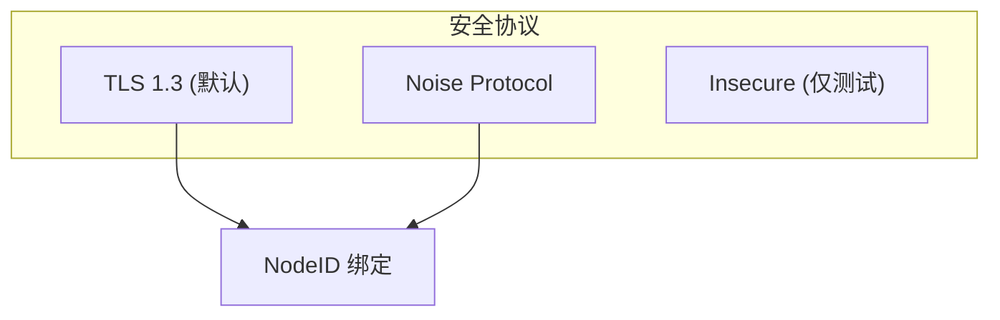
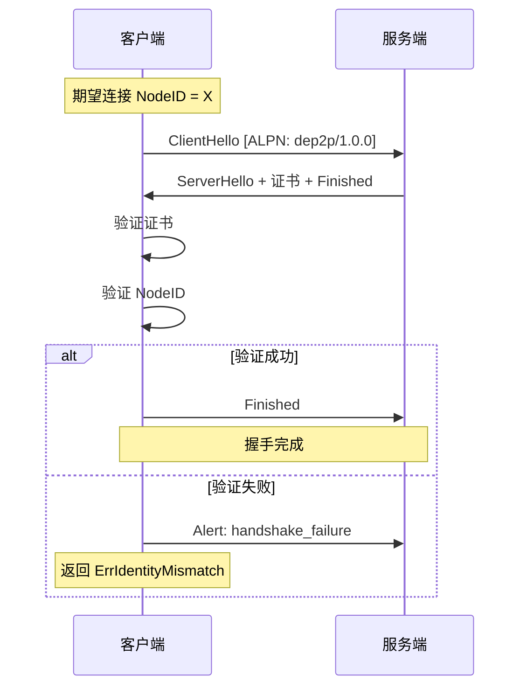
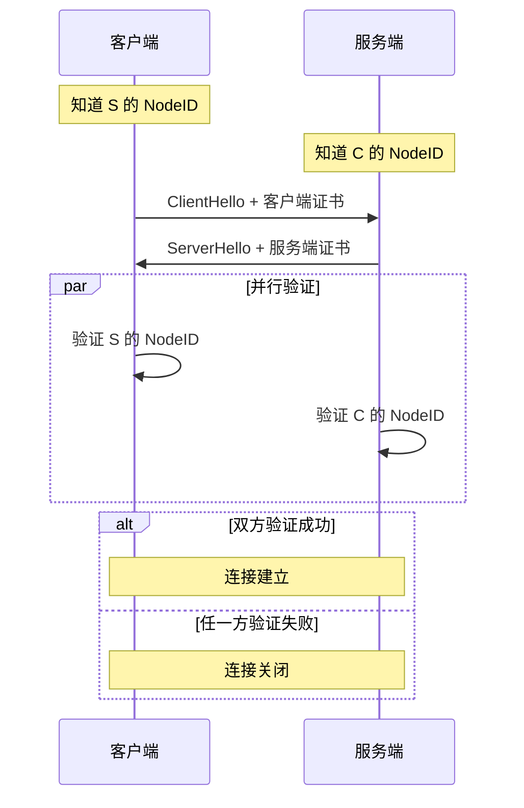
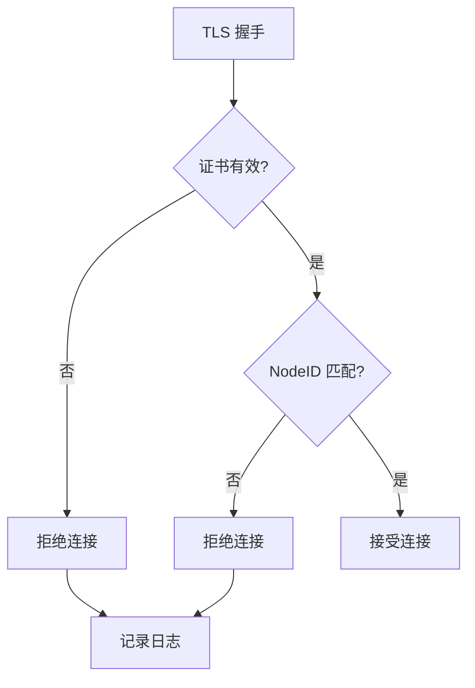

# 安全握手协议规范

> 定义 DeP2P 的传输层安全机制

---

## 概述

DeP2P 支持多种安全协议，将证书/密钥与 NodeID 绑定。



### 支持的安全协议

| 协议 | 说明 | 适用场景 |
|------|------|----------|
| **TLS 1.3** | QUIC 内置，默认选项 | 生产环境 |
| **Noise** | 轻量级，适合 IoT | 资源受限环境 |
| **Insecure** | 无加密 | 仅测试环境 |

---

## 安全目标

```
┌─────────────────────────────────────────────────────────────┐
│                    安全目标                                  │
├─────────────────────────────────────────────────────────────┤
│                                                             │
│  机密性                                                     │
│  ──────                                                     │
│  所有传输数据加密                                            │
│                                                             │
│  完整性                                                     │
│  ──────                                                     │
│  检测数据篡改                                               │
│                                                             │
│  身份验证                                                   │
│  ────────                                                   │
│  验证对端身份（NodeID）                                      │
│                                                             │
│  前向保密                                                   │
│  ────────                                                   │
│  会话密钥泄露不影响历史通信                                   │
│                                                             │
└─────────────────────────────────────────────────────────────┘
```

---

## TLS 1.3 配置

### 必需配置

| 配置项 | 值 |
|--------|-----|
| 最低版本 | TLS 1.3 |
| ALPN | dep2p/1.0.0 |
| 证书类型 | 自签名（绑定 NodeID） |

### 密码套件

| 套件 | 优先级 |
|------|--------|
| TLS_AES_256_GCM_SHA384 | 1 |
| TLS_CHACHA20_POLY1305_SHA256 | 2 |
| TLS_AES_128_GCM_SHA256 | 3 |

### 密钥交换

```
密钥交换算法：

  优先级 1: X25519
  优先级 2: P-256 (secp256r1)
```

---

## 证书规范

### 证书结构

```
DeP2P 证书结构：

  证书版本: X.509 v3
  
  Subject:
    CN = NodeID (Base58)
    
  公钥:
    算法: Ed25519
    数据: 节点公钥
    
  有效期:
    不早于: 证书生成时间
    不晚于: 证书生成时间 + 1年
    
  扩展:
    Key Usage: digitalSignature, keyEncipherment
    Extended Key Usage: serverAuth, clientAuth
```

### 证书生成

```
证书生成伪代码：

  FUNCTION generate_certificate(private_key)
    // 派生公钥
    public_key = derive_public_key(private_key)
    
    // 计算 NodeID
    node_id = sha256(public_key)
    
    // 创建证书
    cert = create_x509_cert(
      subject: "CN=" + base58(node_id),
      public_key: public_key,
      not_before: now(),
      not_after: now() + 1_YEAR,
      key_usage: [digitalSignature, keyEncipherment],
      ext_key_usage: [serverAuth, clientAuth]
    )
    
    // 自签名
    cert.signature = sign(private_key, cert.tbs_certificate)
    
    RETURN cert
  END
```

---

## 握手流程

### TLS 握手



### NodeID 验证

```
NodeID 验证伪代码：

  FUNCTION verify_peer_identity(expected_id, peer_certificate)
    // 提取公钥
    public_key = peer_certificate.public_key
    
    // 计算 NodeID
    actual_id = sha256(public_key)
    
    // 比较
    IF actual_id != expected_id THEN
      RETURN error("ErrIdentityMismatch")
    END
    
    RETURN ok
  END
```

---

## 双向验证

### 验证模式



---

## 会话恢复

### 0-RTT

```
0-RTT 安全考虑：

  允许：
    ✅ 读操作
    ✅ 幂等操作
    
  禁止：
    ❌ 状态变更操作（首次）
    ❌ 需要强防重放的操作
    
  原因：
    0-RTT 数据可能被重放
```

### 会话票据

```
会话票据处理伪代码：

  // 服务端：生成票据
  FUNCTION create_session_ticket(session)
    ticket = encrypt(
      server_ticket_key,
      session.master_secret || session.peer_id || expiry
    )
    RETURN ticket
  END
  
  // 客户端：使用票据
  FUNCTION resume_session(ticket)
    IF ticket.valid AND NOT ticket.expired THEN
      RETURN establish_0rtt_connection(ticket)
    ELSE
      RETURN establish_1rtt_connection()
    END
  END
```

---

## 密钥派生

### 会话密钥

```
密钥派生流程：

  主密钥 (ECDHE)
    ├── 客户端写密钥
    ├── 服务端写密钥
    ├── 客户端写 IV
    ├── 服务端写 IV
    └── 会话票据密钥
```

### 应用层密钥

```
应用层密钥派生伪代码：

  FUNCTION derive_app_keys(master_secret, context)
    // HKDF 扩展
    app_key = hkdf_expand(
      master_secret,
      "dep2p app key" || context,
      key_length
    )
    RETURN app_key
  END
```

---

## 错误处理

### 安全错误

| 错误 | 说明 | 处理 |
|------|------|------|
| ErrIdentityMismatch | NodeID 不匹配 | 关闭连接 |
| ErrCertificateInvalid | 证书无效 | 关闭连接 |
| ErrCertificateExpired | 证书过期 | 关闭连接 |
| ErrHandshakeFailed | 握手失败 | 重试或放弃 |

### 错误处理流程



---

## 安全要求

### 实现要求

| 要求 | 说明 |
|------|------|
| 常量时间比较 | NodeID 比较使用常量时间 |
| 安全随机 | 使用 CSPRNG |
| 密钥保护 | 私钥不导出 |
| 证书轮换 | 支持证书更新 |

### 禁止事项

```
安全禁止事项：

  ❌ 禁用证书验证
  ❌ 接受过期证书
  ❌ 接受不匹配的 NodeID
  ❌ 使用弱密码套件
  ❌ 禁用 TLS
```

---

## Noise 协议

### Noise 简介

Noise Protocol Framework 是一种轻量级的密钥协商协议，适合资源受限的环境。

### Noise 配置

| 配置项 | 值 |
|--------|-----|
| 握手模式 | XX (双向认证) |
| DH 函数 | X25519 |
| 密码函数 | ChaChaPoly |
| 哈希函数 | SHA256 |

### Noise 使用场景

- IoT 设备
- 移动端
- 内网环境

---

---

## ★ 中继连接安全考量（来自实测验证）

> 以下要求来自 2026-01-22 Bootstrap/Relay 拆分部署测试，详见 [测试计划](../../../_discussions/20260122-split-infra-test-plan.md)

### RemotePeer 身份问题（BUG-14/17）

```
┌─────────────────────────────────────────────────────────────────────────────┐
│                    中继连接的身份验证问题                                      │
├─────────────────────────────────────────────────────────────────────────────┤
│                                                                             │
│  问题场景：                                                                  │
│    WiFi (GGJgPFyQ) ──→ Relay (8QmeKhG3) ──→ 4G (C1Qmo9Mf)                  │
│                                                                             │
│  通过中继建立的连接：                                                         │
│    stream.Conn().RemotePeer() = 8QmeKhG3 (Relay)  ← 返回 Relay ID           │
│    期望值 = GGJgPFyQ (WiFi)                       ← 真实对端 ID             │
│                                                                             │
│  安全影响：                                                                  │
│    1. 依赖连接属性验证身份会误判                                              │
│    2. 认证流程可能授权错误的节点                                              │
│    3. 成员列表可能记录 Relay 而非真实对端                                     │
│                                                                             │
│  解决方案：                                                                  │
│    身份验证必须基于消息内容，而非连接属性                                      │
│                                                                             │
└─────────────────────────────────────────────────────────────────────────────┘
```

### 中继连接身份验证规范

```
中继连接身份验证伪代码：

  FUNCTION verify_peer_over_relay(stream)
    // ❌ 错误：依赖连接属性
    // remote_peer = stream.Conn().RemotePeer()
    
    // ✅ 正确：从消息体解析
    request = read_request(stream)
    claimed_peer = request.NodeID
    
    // 验证签名确保 claimed_peer 真实拥有对应私钥
    IF NOT verify_signature(request, claimed_peer) THEN
      RETURN error("signature verification failed")
    END
    
    // 可选：验证 claimed_peer 是否是预期对端
    IF expected_peer != nil AND claimed_peer != expected_peer THEN
      RETURN error("peer id mismatch")
    END
    
    RETURN claimed_peer
  END
```

### 流包装解决方案

```
┌─────────────────────────────────────────────────────────────────────────────┐
│                    中继连接流包装                                             │
├─────────────────────────────────────────────────────────────────────────────┤
│                                                                             │
│  为解决 RemotePeer 返回 Relay ID 的问题，                                    │
│  STOP 处理器应使用包装流：                                                    │
│                                                                             │
│    type RelayedStream struct {                                              │
│      Stream                                                                 │
│      remotePeer peer.ID  // 从 STOP 消息解析的真实对端 ID                    │
│    }                                                                        │
│                                                                             │
│    func (s *RelayedStream) RemotePeer() peer.ID {                           │
│      return s.remotePeer                                                    │
│    }                                                                        │
│                                                                             │
│  使用：                                                                      │
│    // STOP 处理器                                                           │
│    realPeerID = parseFromStopMessage(stopMsg)                               │
│    wrappedStream = &RelayedStream{                                          │
│      Stream:     rawStream,                                                 │
│      remotePeer: realPeerID,                                                │
│    }                                                                        │
│    host.HandleInboundStream(wrappedStream)                                  │
│                                                                             │
└─────────────────────────────────────────────────────────────────────────────┘
```

---

## 相关文档

- [QUIC 传输](quic.md)
- [Relay 中继](relay.md)
- [密钥格式](../L1_identity/key_format.md)
- [NodeID 规范](../L1_identity/nodeid.md)
- [ADR-0001 身份优先](../../../01_context/decisions/ADR-0001-identity-first.md)
- [INV-001 身份第一性](../../../01_context/decisions/invariants/INV-001-identity-first.md)
- [拆分部署测试计划](../../../_discussions/20260122-split-infra-test-plan.md)

---

**最后更新**：2026-01-23
