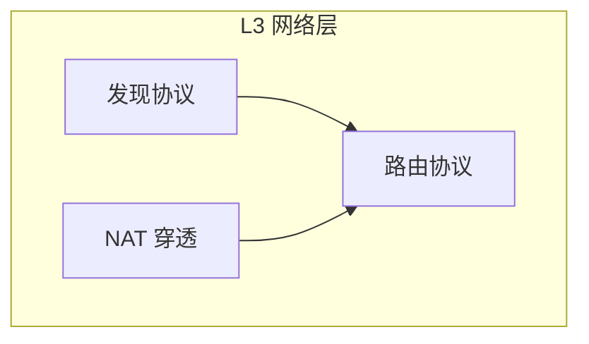
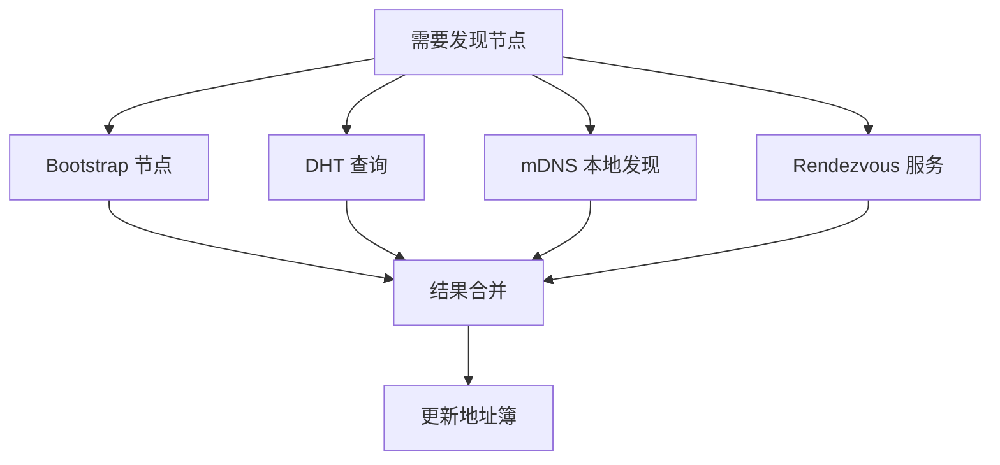
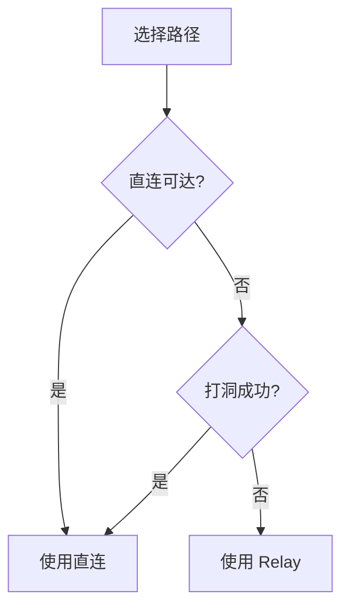

# L3 网络层规范

> 定义 DeP2P 的节点发现、NAT 穿透和路由协议

---

## 概述

网络层负责在 P2P 网络中定位和连接节点。



---

## 规范列表

| 规范 | 文档 | 说明 |
|------|------|------|
| 发现协议 | [discovery.md](discovery.md) | DHT/mDNS/Bootstrap |
| NAT 穿透 | [nat.md](nat.md) | 打洞/端口映射 |
| 路由协议 | [routing.md](routing.md) | 路径选择/地址管理 |

---

## 发现机制

### 多机制策略



### 发现优先级

| 机制 | 优先级 | 适用场景 |
|------|--------|----------|
| 地址簿缓存 | 最高 | 已知节点 |
| mDNS | 高 | 局域网 |
| DHT | 中 | 全网发现 |
| Rendezvous | 中 | 特定场景 |
| Bootstrap | 低 | 冷启动 |

---

## NAT 穿透

### 穿透策略

```
┌─────────────────────────────────────────────────────────────┐
│                    NAT 穿透策略                              │
├─────────────────────────────────────────────────────────────┤
│                                                             │
│  1. 检测 NAT 类型                                           │
│  2. 尝试 UPnP/NAT-PMP 端口映射                              │
│  3. 尝试 UDP 打洞                                           │
│  4. 回退到 Relay 中继                                       │
│                                                             │
└─────────────────────────────────────────────────────────────┘
```

### 策略选择

| NAT 类型 | 策略 |
|----------|------|
| Full Cone | 直连 |
| Restricted Cone | 打洞 |
| Port Restricted | 打洞 |
| Symmetric | Relay |

---

## 路由选择

### 路径类型

| 类型 | 延迟 | 优先级 |
|------|------|--------|
| 直连 IPv4 | 最低 | 最高 |
| 直连 IPv6 | 低 | 高 |
| Relay | 高 | 低 |

### 选择流程



---

## 与其他层的关系

| 层级 | 依赖网络层的功能 |
|------|------------------|
| L4 应用层 | 节点发现、消息路由 |

| 层级 | 网络层依赖 |
|------|-----------|
| L2 传输层 | QUIC 连接、Relay 中继 |
| L1 身份层 | NodeID 作为 DHT 键 |

---

## 相关文档

- [L2 传输层](../L2_transport/)
- [L4 应用层](../L4_application/)
- [ADR-0008 发现策略](../../../01_context/decisions/ADR-0008-discovery-strategy.md)

---

**最后更新**：2026-01-11
