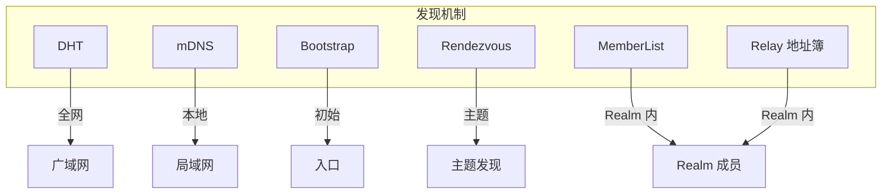
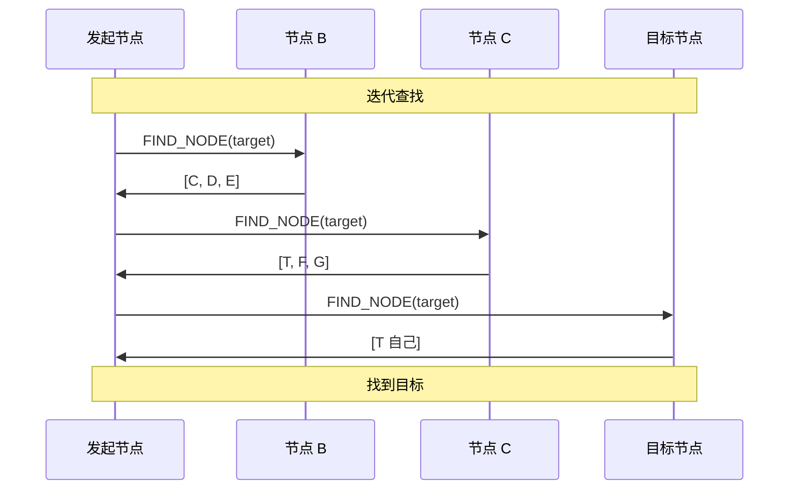
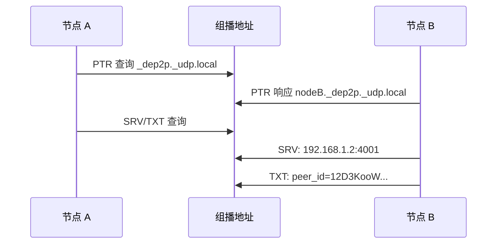
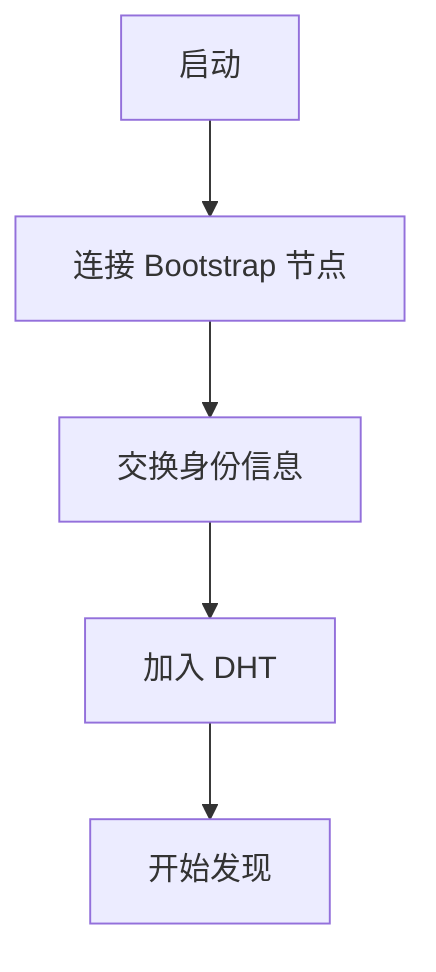
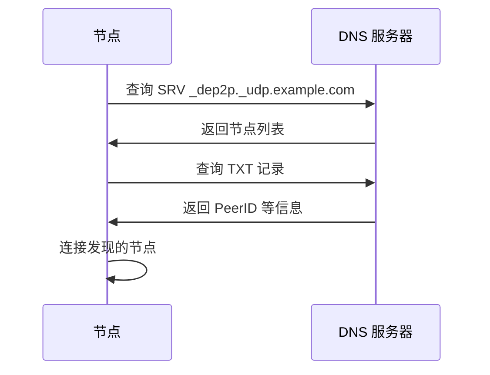

# 发现协议规范

> 定义 DeP2P 的节点发现机制

---

## 概述

DeP2P 支持多种发现机制，适应不同网络环境。



---

## Realm 内地址发现（"仅 ID 连接"支持）

### 概述

Realm 内支持"仅 ID 连接"（ID-only Connection），即使用纯 NodeID 连接而无需预先知道地址。

> DHT 是权威目录，Relay 地址簿是缓存加速层

```
┌─────────────────────────────────────────────────────────────────────────────┐
│                    Realm 内地址发现优先级                                     │
├─────────────────────────────────────────────────────────────────────────────┤
│                                                                             │
│  三层架构                                                                   │
│  Layer 1: DHT（权威目录） — 存储签名 PeerRecord                             │
│  Layer 2: 缓存加速层 — Peerstore / MemberList / Relay 地址簿                │
│  Layer 3: 连接策略 — 直连 → 打洞 → Relay 兜底                               │
│                                                                             │
│  realm.Connect(ctx, targetNodeID) 地址发现流程：                             │
│                                                                             │
│  优先级 1: Peerstore 查询      → 本地缓存，最快                             │
│      ↓ 无结果                                                               │
│  优先级 2: MemberList 查询     → Gossip 同步的成员列表                      │
│      ↓ 无结果                                                               │
│  优先级 3: DHT 查询            → 权威来源，签名 PeerRecord                  │
│      ↓ 无结果或超时                                                         │
│  优先级 4: Relay 地址簿查询    → 缓存回退，仅在 DHT 失败时使用              │
│      ↓ 无结果                                                               │
│  优先级 5: Relay 保底转发      → 始终可达                                   │
│                                                                             │
│  DHT Key 格式：/dep2p/v2/realm/<H(RealmID)>/peer/<NodeID>                   │
│                                                                             │
└─────────────────────────────────────────────────────────────────────────────┘
```

### PeerRecord 模型

```
PeerRecord 结构（签名记录）：

  {
    NodeID:       节点身份
    RealmID:      Realm 标识（用于 DHT Key 隔离）
    RelayAddrs:   Relay 地址（稳定，主路径）
    DirectAddrs:  直连地址（需验证后才发布）
    NATType:      NAT 类型
    Reachability: 可达性状态
    Seq:          递增序号（防重放）
    Timestamp:    时间戳
    TTL:          动态 TTL（根据 NAT 类型调整）
    Signature:    Ed25519 签名
  }
  
  防投毒：DHT 验证只接受合法签名 + 最新序号
```

### MemberList 发现

MemberList 是基于 Gossip 协议的成员列表同步机制。

| 属性 | 值 |
|------|-----|
| 协议 ID | /dep2p/realm/<realmID>/memberlist/1.0.0 |
| 同步间隔 | 30 秒 |
| 信息包含 | NodeID, Addrs, NAT 类型, 最后在线 |

### DHT 发现（权威来源）

当 MemberList 无法提供地址时，查询 DHT 获取签名 PeerRecord。

| 属性 | 值 |
|------|-----|
| DHT Key 格式 | `/dep2p/v2/realm/<H(RealmID)>/peer/<NodeID>` |
| Provider Key | `/dep2p/v2/realm/<H(RealmID)>/members` |
| 记录类型 | 签名 PeerRecord |
| 验证规则 | 合法签名 + 最新序号 |
| TTL | 动态（根据 NAT 类型 30min~4h） |

### Relay 地址簿发现（缓存回退）

> Relay 地址簿是**本地缓存**，仅在 DHT 查询失败时回退使用

当 DHT 查询失败或超时时，向 Relay 查询地址簿。

| 属性 | 值 |
|------|-----|
| 协议 ID | /dep2p/realm/<realmID>/addressbook/1.0.0 |
| 消息类型 | REGISTER / QUERY / RESPONSE / BATCH / UPDATE |
| 响应内容 | MemberEntry（NodeID, Addrs, NAT 类型, 最后在线） |
| **权威性** | **缓存层（非权威）** |

详见：[Relay 地址簿协议](../L2_transport/relay.md#地址簿协议)

### "仅 ID 连接"边界

```
┌─────────────────────────────────────────────────────────────────────────────┐
│                    "仅 ID 连接"的严格边界                                     │
├─────────────────────────────────────────────────────────────────────────────┤
│                                                                             │
│  Realm 内（✅ 允许"仅 ID 连接"）                                            │
│  ═══════════════════════════════                                            │
│  realm.Connect(ctx, targetNodeID)   ← ✅ 系统自动发现地址                   │
│                                                                             │
│  跨 Realm / 节点级（❌ 禁止"仅 ID 连接"）                                   │
│  ═══════════════════════════════════════                                    │
│  node.Connect(ctx, targetNodeID)    ← ❌ 返回 ErrAddressRequired           │
│  node.Connect(ctx, multiaddr)       ← ✅ 必须提供地址                       │
│                                                                             │
│  原因：无共享的发现机制、无共享的 Relay 保底、无信任基础                    │
│                                                                             │
└─────────────────────────────────────────────────────────────────────────────┘
```

---

## ★ 基础设施节点处理（来自实测验证）

> 以下要求来自 2026-01-22 Bootstrap/Relay 拆分部署测试，详见 [测试计划](../../../_discussions/20260122-split-infra-test-plan.md)

### 基础设施节点互联要求

```
┌─────────────────────────────────────────────────────────────────────────────┐
│                    基础设施节点互联要求（BUG-2 修复）                          │
├─────────────────────────────────────────────────────────────────────────────┤
│                                                                             │
│  问题：Relay 节点 routingTableSize=0，无法被 DHT 发现                        │
│                                                                             │
│  根因：Bootstrap/Relay 节点未互相连接，DHT 路由表为空                         │
│                                                                             │
│  要求：                                                                      │
│    1. Relay 节点必须配置 Bootstrap peers                                     │
│    2. Bootstrap 与 Relay 需互联形成有效 DHT 网络                              │
│    3. 基础设施节点至少与一个 Bootstrap 互联                                   │
│                                                                             │
│  配置示例：                                                                  │
│    // relay.config.json                                                     │
│    "bootstrap": {                                                           │
│      "peers": ["/ip4/BOOTSTRAP_IP/udp/4001/quic-v1/p2p/BOOTSTRAP_ID"]      │
│    }                                                                        │
│                                                                             │
│  验证日志：                                                                  │
│    ✅ "引导节点连接成功 peerID=..."                                          │
│    ✅ "routingTableSize>=1"                                                  │
│    ❌ "routingTableSize=0"                                                   │
│                                                                             │
└─────────────────────────────────────────────────────────────────────────────┘
```

### DHT 发现过滤（BUG-C 修复）

```
┌─────────────────────────────────────────────────────────────────────────────┐
│                    DHT 发现过滤要求                                           │
├─────────────────────────────────────────────────────────────────────────────┤
│                                                                             │
│  问题：DHT FindPeers(namespace=relay/1.0.0) 返回非 Relay 节点              │
│        包括 Bootstrap 和普通 Chat 节点                                       │
│                                                                             │
│  要求：                                                                      │
│    DHT 发现 Relay 时应过滤非 Relay 节点：                                    │
│    1. 检查节点能力标记（Capability）                                         │
│    2. 仅返回具备 Relay 能力的节点                                            │
│                                                                             │
│  实现：                                                                      │
│    FUNCTION FindRelays()                                                    │
│      peers = dht.FindPeers(namespace="relay/1.0.0")                         │
│                                                                             │
│      // 过滤非 Relay 节点                                                   │
│      relays = []                                                            │
│      FOR EACH peer IN peers                                                 │
│        IF has_relay_capability(peer) THEN                                   │
│          relays.append(peer)                                                │
│        END                                                                  │
│      END                                                                    │
│                                                                             │
│      RETURN relays                                                          │
│    END                                                                      │
│                                                                             │
└─────────────────────────────────────────────────────────────────────────────┘
```

### 明确配置 vs DHT 发现

```
┌─────────────────────────────────────────────────────────────────────────────┐
│                    Relay 发现策略                                             │
├─────────────────────────────────────────────────────────────────────────────┤
│                                                                             │
│  原则：明确配置优先（ADR-0010）                                              │
│                                                                             │
│  优先级：                                                                    │
│    1. 明确配置的 RelayAddr                       ← 最高优先级               │
│    2. 明确配置的 StaticRelays 列表                                           │
│    3. DHT 发现（仅作为临时 fallback）             ← 最低优先级               │
│                                                                             │
│  DHT 发现条件（仅当以下全部满足时）：                                         │
│    - 无明确配置的 Relay                                                      │
│    - Relay 节点已正确加入 DHT 网络                                           │
│    - DHT 路由表非空                                                          │
│                                                                             │
│  注意：                                                                      │
│    DHT 发现仅作为 Relay 的临时 fallback                                      │
│    明确配置优先，避免把 Relay 发现变成默认路径                                │
│                                                                             │
└─────────────────────────────────────────────────────────────────────────────┘
```

---

## DHT 发现

### 协议信息

| 属性 | 值 |
|------|-----|
| 协议 ID | /dep2p/sys/dht/1.0.0 |
| 基础算法 | Kademlia |
| K 值 | 20 |
| Alpha | 3 |

### Kademlia 参数

| 参数 | 值 | 说明 |
|------|-----|------|
| K | 20 | 每桶节点数 |
| Alpha | 3 | 并发查询数 |
| ID 长度 | 256 位 | NodeID 长度 |
| 刷新间隔 | 10 分钟 | 路由表刷新 |

### 消息类型

```
DHT 消息类型：

  FIND_NODE      = 0  // 查找节点
  FIND_NODE_RESP = 1  // 查找响应
  PING           = 2  // 心跳
  PONG           = 3  // 心跳响应
  GET_PROVIDERS  = 4  // 获取提供者
  ADD_PROVIDER   = 5  // 添加提供者
```

### 查找流程



### 查找算法

```
迭代查找伪代码：

  FUNCTION find_peer(target_id)
    // 从路由表获取初始节点
    closest = routing_table.nearest_peers(target_id, ALPHA)
    
    seen = {}
    result = []
    
    WHILE closest NOT empty
      // 并发查询
      responses = parallel_query(closest, target_id)
      
      // 处理响应
      FOR EACH resp IN responses
        FOR EACH peer IN resp.closer_peers
          IF peer.id NOT IN seen THEN
            seen[peer.id] = true
            result.append(peer)
          END
        END
      END
      
      // 选择最近的继续
      closest = select_closest(result, target_id, ALPHA)
    END
    
    RETURN result
  END
```

---

## mDNS 发现

### 协议信息

| 属性 | 值 |
|------|-----|
| 协议 | DNS-SD over mDNS |
| 端口 | 5353/UDP |
| 组播地址 | 224.0.0.251 (IPv4) |
| 服务名 | _dep2p._udp.local |

### 发现流程



### TXT 记录

| 字段 | 说明 |
|------|------|
| peer_id | NodeID (Base58) |
| realm | 当前 Realm (可选) |

---

## Bootstrap 发现

### ★ 极简配置原则

Bootstrap 节点采用**极简配置**设计（详见 [ADR-0009](../../../01_context/decisions/ADR-0009-bootstrap-simplified.md)）：

```
┌─────────────────────────────────────────────────────────────────────────────┐
│                    Bootstrap 极简配置原则                                     │
├─────────────────────────────────────────────────────────────────────────────┤
│                                                                             │
│  用户配置：仅一个开关                                                        │
│  ═══════════════════════                                                    │
│  • 启动时: dep2p.EnableBootstrap(true)                                      │
│  • 运行时: node.EnableBootstrap(ctx) / node.DisableBootstrap(ctx)           │
│                                                                             │
│  参数管理：内置默认值，用户不可配置                                           │
│  ═════════════════════════════════════                                      │
│  • 所有参数使用经过验证的默认值                                               │
│  • 保证所有 Bootstrap 节点行为一致                                           │
│  • 避免错误配置导致的网络问题                                                │
│                                                                             │
│  概念变更：能力开关而非节点角色                                               │
│  ═══════════════════════════════════                                        │
│  • 不是"成为 Bootstrap 节点"                                                │
│  • 而是"启用 Bootstrap 能力"                                                │
│                                                                             │
└─────────────────────────────────────────────────────────────────────────────┘
```

### 内置默认值（用户不可配置）

| 参数 | 默认值 | 说明 |
|------|--------|------|
| MaxNodes | 50000 | 最大存储节点数 |
| PersistPath | `${DataDir}/bootstrap.db` | 持久化路径 |
| ProbeInterval | 5 分钟 | 存活探测间隔 |
| DiscoveryInterval | 10 分钟 | 主动发现间隔 |
| NodeExpireTime | 24 小时 | 节点过期时间 |
| ResponseK | 20 | FIND_NODE 返回节点数 |
| MinBootstrapPeers | 3 | 最小连接数 |
| ConnectTimeout | 30s | 连接超时 |

### 配置（作为客户端连接 Bootstrap）

```
Bootstrap 客户端配置：

  预设节点：
    /dnsaddr/bootstrap.dep2p.io/p2p/12D3KooW...
    /ip4/203.0.113.1/udp/4001/quic-v1/p2p/12D3KooW...
```

### Bootstrap 流程



### Bootstrap 策略

```
Bootstrap 策略伪代码：

  FUNCTION bootstrap()
    connected = 0
    
    FOR EACH peer IN bootstrap_peers
      IF connect(peer) THEN
        connected += 1
      END
      
      IF connected >= MIN_PEERS THEN
        BREAK
      END
    END
    
    IF connected < MIN_PEERS THEN
      RETURN error("insufficient bootstrap peers")
    END
    
    // 刷新 DHT
    RETURN dht.bootstrap()
  END
```

---

## Rendezvous 发现

### 协议信息

| 属性 | 值 |
|------|-----|
| 协议 ID | /dep2p/sys/rendezvous/1.0.0 |
| 用途 | 基于命名空间的发现 |

### 命名空间

```
命名空间格式：

  /dep2p/rendezvous/{namespace}
  
示例：
  /dep2p/rendezvous/realm/abc123
  /dep2p/rendezvous/topic/general
```

### 操作

```
Rendezvous 操作：

  REGISTER(namespace, ttl)
    注册到命名空间
    
  UNREGISTER(namespace)
    取消注册
    
  DISCOVER(namespace, limit)
    发现命名空间中的节点
```

---

## 地址更新

### TTL 策略

| 来源 | TTL | 说明 |
|------|-----|------|
| 直接交换 | 1 小时 | 直接从节点获取 |
| DHT 查找 | 30 分钟 | 从 DHT 获取 |
| mDNS | 5 分钟 | 局域网发现 |
| 中继 | 10 分钟 | 中继地址 |

### 地址管理

```
地址管理伪代码：

  FUNCTION add_address(peer_id, addr, source)
    ttl = get_ttl(source)
    
    address_book.add(peer_id, addr, ttl)
    
    // 验证地址
    schedule_validation(peer_id, addr)
  END
  
  FUNCTION garbage_collect()
    now = current_time()
    
    FOR EACH (peer_id, addrs) IN address_book
      FOR EACH addr IN addrs
        IF addr.expires < now THEN
          address_book.remove(peer_id, addr)
        END
      END
    END
  END
```

---

## 错误处理

### 错误类型

| 错误 | 说明 | 处理 |
|------|------|------|
| ErrPeerNotFound | 未找到节点 | 使用其他机制 |
| ErrNoBootstrapPeers | 无 Bootstrap | 检查配置 |
| ErrLookupTimeout | 查找超时 | 重试 |
| ErrDHTNotReady | DHT 未就绪 | 等待初始化 |

---

---

## DNS-SD 发现

### DNS-SD 简介

DNS-SD (DNS Service Discovery) 是基于 DNS 的服务发现机制，适用于广域网环境。

### DNS 记录格式

```
DNS 记录格式：

  SRV 记录：
    _dep2p._udp.example.com. IN SRV 0 0 4001 node1.example.com.
    
  TXT 记录：
    _dep2p._udp.example.com. IN TXT "peer_id=12D3KooW..." "realm=abc123"
```

### DNS 发现流程



---

## 相关文档

- [命名空间规范](../namespace.md)
- [NAT 穿透](nat.md)
- [路由协议](routing.md)
- [ADR-0008 发现策略](../../../01_context/decisions/ADR-0008-discovery-strategy.md)
- [ADR-0009 Bootstrap 极简配置](../../../01_context/decisions/ADR-0009-bootstrap-simplified.md)
- [ADR-0010 Relay 明确配置](../../../01_context/decisions/ADR-0010-relay-explicit-config.md)

---

**最后更新**：2026-01-27
