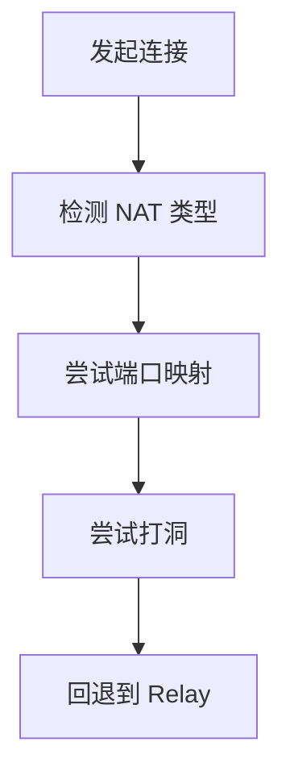
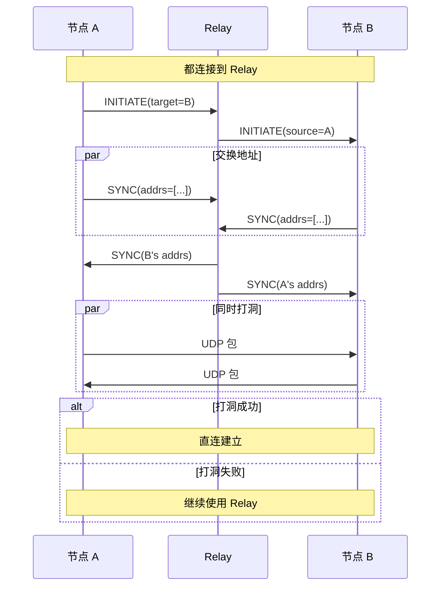
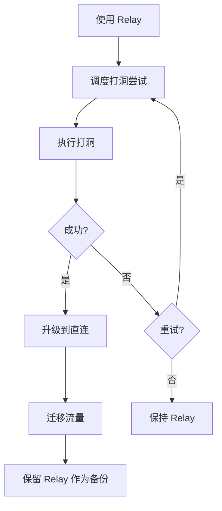
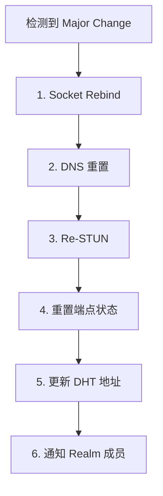
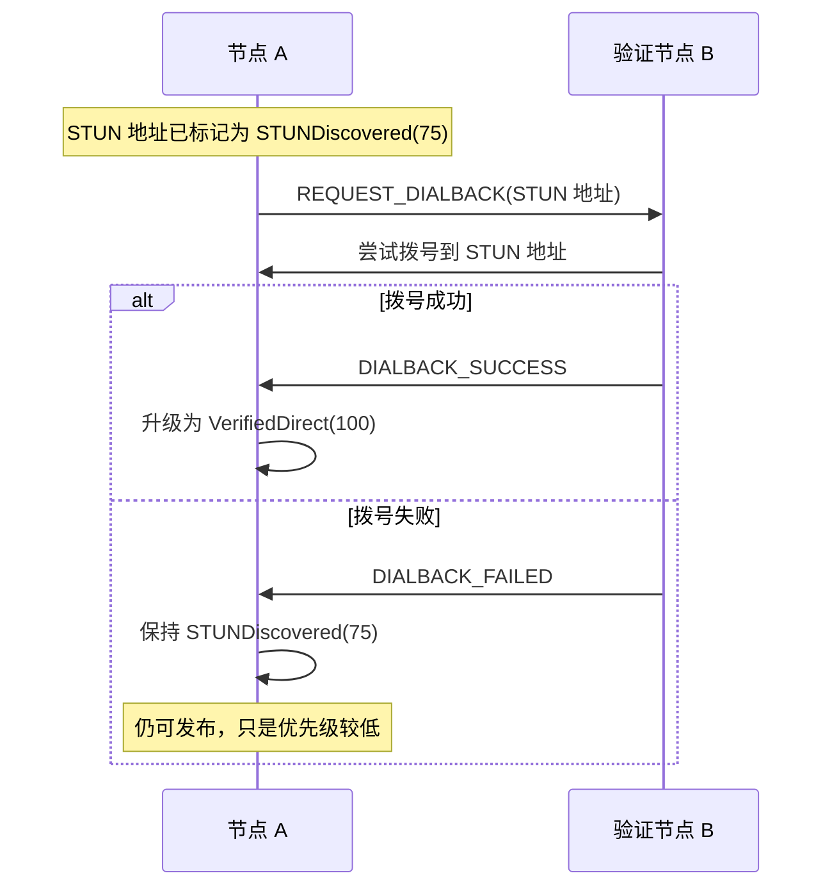
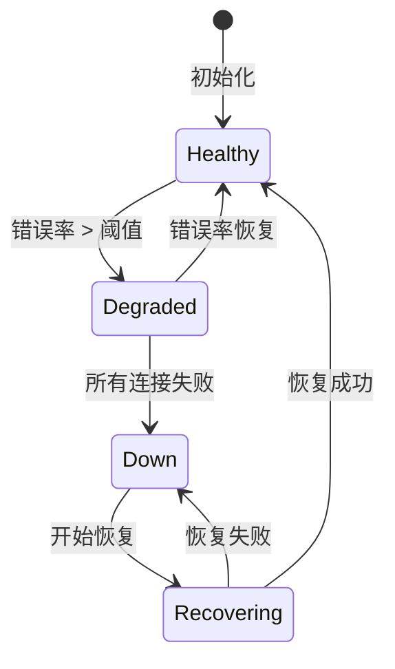

# NAT 穿透规范

> 定义 DeP2P 的 NAT 穿透机制

---

## 概述

NAT 穿透是 P2P 网络连接的关键挑战，DeP2P 采用多层策略应对。



---

## NAT 类型

### 分类

| 类型 | 特点 | 直连可能性 |
|------|------|-----------|
| **Full Cone** | 任何外部主机可访问 | 高 |
| **Restricted Cone** | 限制源 IP | 中 |
| **Port Restricted** | 限制源 IP + 端口 | 中 |
| **Symmetric** | 每连接不同映射 | 低 |

### 类型检测

```
NAT 类型检测伪代码：

  FUNCTION detect_nat_type()
    // 第一步：发送到 STUN 服务器 1
    mapped_addr_1 = stun_query(STUN_SERVER_1)
    
    // 第二步：发送到 STUN 服务器 2（不同 IP）
    mapped_addr_2 = stun_query(STUN_SERVER_2)
    
    IF mapped_addr_1 != mapped_addr_2 THEN
      RETURN SYMMETRIC_NAT
    END
    
    // 第三步：测试端口限制
    can_receive = test_port_restriction()
    
    IF NOT can_receive THEN
      RETURN PORT_RESTRICTED_NAT
    END
    
    // 第四步：测试 IP 限制
    can_receive_any = test_ip_restriction()
    
    IF can_receive_any THEN
      RETURN FULL_CONE_NAT
    ELSE
      RETURN RESTRICTED_CONE_NAT
    END
  END
```

---

## 端口映射

### UPnP

```
UPnP 端口映射伪代码：

  FUNCTION upnp_map_port(internal_port, external_port, protocol)
    // 发现 IGD 设备
    igd = discover_igd()
    
    IF igd == nil THEN
      RETURN error("no IGD found")
    END
    
    // 请求端口映射
    result = igd.add_port_mapping(
      internal_port: internal_port,
      external_port: external_port,
      protocol: protocol,  // UDP
      lease_duration: 3600,  // 1 小时
      description: "DeP2P"
    )
    
    RETURN result
  END
```

### NAT-PMP / PCP

```
NAT-PMP 端口映射伪代码：

  FUNCTION natpmp_map_port(internal_port, external_port)
    // 获取网关地址
    gateway = get_default_gateway()
    
    // 发送映射请求
    request = NATPMPRequest{
      opcode: MAP_UDP,
      internal_port: internal_port,
      external_port: external_port,
      lifetime: 3600
    }
    
    response = send_natpmp(gateway, request)
    
    RETURN response.mapped_port
  END
```

---

## UDP 打洞

### 打洞协议

| 属性 | 值 |
|------|-----|
| 协议 ID | /dep2p/sys/holepunch/1.0.0 |
| 传输 | 通过 Relay 协调 |

### 打洞流程



### 打洞消息

```
打洞消息类型：

  INITIATE   = 0x01  // 发起打洞
  SYNC       = 0x02  // 同步地址
  CONNECT    = 0x03  // 尝试连接
  SUCCESS    = 0x04  // 打洞成功
  FAILURE    = 0x05  // 打洞失败
```

### 打洞算法

```
打洞算法伪代码：

  FUNCTION hole_punch(target_id)
    // 通过 Relay 交换地址
    local_addrs = get_external_addrs()
    remote_addrs = exchange_via_relay(target_id, local_addrs)
    
    // 同时尝试连接
    results = parallel_connect(remote_addrs)
    
    // 等待任一成功
    FOR EACH result IN results
      IF result.success THEN
        RETURN result.connection
      END
    END
    
    RETURN error("hole punch failed")
  END
  
  FUNCTION parallel_connect(addrs)
    results = []
    
    FOR EACH addr IN addrs
      spawn {
        // 发送多个 UDP 包
        FOR i = 0 TO 3
          send_udp(addr, PUNCH_PACKET)
          sleep(50ms)
        END
        
        // 等待响应
        response = wait_response(timeout = 2s)
        results.append(response)
      }
    END
    
    RETURN results
  END
```

### ★ 增强打洞协议 (计划中)

> 相关需求：[REQ-NET-006](../../../01_context/requirements/functional/F3_network/REQ-NET-006.md)

从旧代码库吸收的增强打洞能力：

```
增强打洞特性：

  1. UDP/TCP 同时发送
     ├── 同时尝试 UDP 和 TCP 打洞
     ├── 优先使用先成功的连接
     └── 自动选择最优路径
     
  2. 多地址并行尝试
     ├── 同时向所有候选地址发送探测包
     ├── 每个地址最多重试 3 次
     └── 使用首个成功的地址
     
  3. 预测端口
     ├── 对于 Symmetric NAT
     ├── 基于端口增量预测下一个映射端口
     └── 增加打洞成功率
```

---

## 连接升级

### 升级流程（已更新）

> 基于 2026-01-22 测试反馈更新，详见 [测试计划](../../../_discussions/20260122-split-infra-test-plan.md)



**重要变更**：升级成功后**保留 Relay 连接作为备份**，而非立即关闭。
详见 [NAT/Relay 概念澄清](../../../_discussions/20260123-nat-relay-concept-clarification.md) 设计决策。

### 升级策略

```
升级策略伪代码：

  FUNCTION schedule_upgrade(peer_id)
    // 只对 Relay 连接尝试升级
    IF NOT is_relayed(peer_id) THEN
      RETURN
    END
    
    // 延迟执行，避免频繁尝试
    schedule_after(30s) {
      IF can_upgrade(peer_id) THEN
        result = attempt_hole_punch(peer_id)
        
        IF result.success THEN
          migrate_to_direct(peer_id, result.connection)
        END
      END
    }
  END
```

---

## 外部地址发现

### STUN 探测策略

#### 多服务器并行探测

为提高可靠性和速度，采用多服务器并行探测策略：

```
并行探测流程：

  1. 初始探测（ProbeCount = 5）
     ↓
     并行向 5 个 STUN 服务器发送请求
     ↓
     等待首个成功响应（超时 ProbeTimeout = 5s）
     ↓
  2. 结果评估
     ├─ 有响应 → 使用结果，标记 STUNIPv4Failed=false
     └─ 全部超时 → 触发兜底探测
     
  3. 兜底探测（FallbackCount = 2）
     ↓
     并行向 2 个 STUN 服务器发送请求
     ↓
     等待首个成功响应（超时 FallbackTimeout = 8s）
     ↓
  4. 最终结果
     ├─ 有响应 → 使用结果，标记 STUNFallbackUsed=true
     └─ 全部超时 → 标记 STUNIPv4Failed=true，记录 STUNLastError
```

#### STUN 服务器选择策略

```
服务器列表优先级：

  1. 国内服务器（低延迟）
     - stun.miwifi.com
     - stun.chat.bilibili.com
     
  2. 国际服务器（高可靠）
     - stun.l.google.com:19302
     - stun1.l.google.com:19302
     - stun2.l.google.com:19302
     
  并行探测时混合选择，确保容错
```

#### STUN 查询伪代码

```
STUN 查询伪代码（简化版）：

  FUNCTION discover_external_addr()
    // 发送 STUN Binding 请求
    request = create_stun_binding_request()
    
    response = send_stun(STUN_SERVER, request)
    
    // 解析 XOR-MAPPED-ADDRESS
    mapped_addr = parse_xor_mapped_address(response)
    
    RETURN mapped_addr
  END
  
完整探测伪代码（实际实现）：

  FUNCTION probe_stun_parallel()
    // 1. 初始探测
    results = []
    FOR i = 0 TO ProbeCount - 1
      server = STUN_SERVERS[i]
      GO probe_one_server(server, ProbeTimeout, results)
    END
    
    // 等待首个成功响应
    result = wait_first_success(results, ProbeTimeout)
    
    IF result != nil THEN
      RETURN result, STUNFallbackUsed=false
    END
    
    // 2. 兜底探测
    fallback_results = []
    FOR i = 0 TO FallbackCount - 1
      server = STUN_SERVERS[i]
      GO probe_one_server(server, FallbackTimeout, fallback_results)
    END
    
    // 等待首个成功响应
    fallback_result = wait_first_success(fallback_results, FallbackTimeout)
    
    IF fallback_result != nil THEN
      RETURN fallback_result, STUNFallbackUsed=true
    END
    
    // 3. 全部失败
    RETURN nil, STUNIPv4Failed=true, STUNLastError="all servers timeout"
  END
```

### 地址收集

```
外部地址收集：

  来源：
    1. STUN 服务器反馈
    2. 对端观察到的地址
    3. UPnP/NAT-PMP 映射
    4. 本地接口地址
```

### ★ STUN 地址验证策略（v1.2 架构优化）

#### 架构决策：STUN 作为第三方验证机制

**核心认知**：STUN 协议本身就是**第三方验证机制**，STUN 服务器返回的地址已经过协议验证，是节点的真实外部地址。

```
┌─────────────────────────────────────────────────────────────────────────────┐
│                    STUN 地址验证策略（v1.2 架构优化）                         │
├─────────────────────────────────────────────────────────────────────────────┤
│                                                                             │
│  ★ 旧架构问题（v1.1 及之前）——"鸡和蛋"问题                                 │
│  ═════════════════════════════════════════════                              │
│  STUN 发现地址 → 存入 candidateAddrs → 需要 dial-back 验证                  │
│                                            ↓                                │
│                                    需要其他节点协助                          │
│                                            ↓                                │
│                                  冷启动阶段无协助节点                        │
│                                            ↓                                │
│                                  ❌ 永远无法发布地址！                       │
│                                                                             │
│  ★ 新架构（v1.2）——STUN 即验证                                             │
│  ═══════════════════════════════════                                        │
│  STUN 发现地址 → 直接标记为已验证 → 可发布到 DHT                            │
│                                                                             │
│  原理：                                                                     │
│  • STUN 协议本身验证了外部地址的存在                                        │
│  • STUN 服务器是公正的第三方                                                │
│  • 无需额外的 dial-back 验证（过度设计）                                    │
│                                                                             │
└─────────────────────────────────────────────────────────────────────────────┘
```

#### 地址优先级体系

```
┌─────────────────────────────────────────────────────────────────────────────┐
│                    地址优先级体系                                            │
├─────────────────────────────────────────────────────────────────────────────┤
│                                                                             │
│  优先级值    名称                      来源                                 │
│  ──────────────────────────────────────────────────────────────────────    │
│  150        PriorityConfiguredAdvertise   用户配置 WithPublicAddr()         │
│  100        PriorityVerifiedDirect        dial-back 验证（可选增强）        │
│  75         ★ PrioritySTUNDiscovered      STUN 协议验证（v1.2 新增）        │
│  50         PriorityRelayGuarantee        Relay 地址（保证可达）            │
│  10         PriorityLocalListen           本地监听地址                      │
│  0          PriorityUnverified            未验证地址                        │
│                                                                             │
│  ★ PrioritySTUNDiscovered 设计说明：                                        │
│  • STUN 地址优先级高于 Relay，低于 dial-back 验证                          │
│  • 这是合理的：STUN 验证可靠性高，但不如真正的入站测试                      │
│  • TrustSTUNAddresses=true 时，STUN 地址升级为 PriorityVerifiedDirect      │
│                                                                             │
└─────────────────────────────────────────────────────────────────────────────┘
```

#### TrustSTUNAddresses 配置（可选增强）

对于云服务器等确定性环境，可启用完全信任模式：

```go
// 默认模式：STUN 地址使用 PrioritySTUNDiscovered（已足够大多数场景）
node, _ := dep2p.NewNode(ctx)

// 增强模式：STUN 地址升级为 PriorityVerifiedDirect
node, _ := dep2p.NewNode(ctx,
    dep2p.TrustSTUNAddresses(true),
)
```

| 模式 | STUN 地址优先级 | 适用场景 |
|------|----------------|---------|
| 默认 | `PrioritySTUNDiscovered` (75) | 通用场景，NAT 环境 |
| 信任 | `PriorityVerifiedDirect` (100) | 云服务器，稳定公网 IP |

#### 日志监控

```bash
# 查看 STUN 地址验证
grep "STUN 公网地址已验证" your.log

# 正常输出示例（v1.2）
level=INFO msg="STUN 公网地址已验证" addr=/ip4/x.x.x.x/udp/4001/quic-v1 priority=stun_discovered

# 信任模式输出
level=INFO msg="STUN 公网地址已验证" addr=/ip4/x.x.x.x/udp/4001/quic-v1 priority=verified_direct
```

---

## NetReport 诊断字段

NetReport 提供完整的网络诊断信息，用于故障排查和网络质量评估。

### 字段定义

| 字段类别 | 字段名 | 类型 | 说明 |
|---------|--------|------|------|
| **网络连通性** | `UDPv4` | bool | IPv4 UDP 可用性 |
| | `UDPv6` | bool | IPv6 UDP 可用性 |
| | `GlobalV4` | net.IP | 全局 IPv4 地址 |
| | `GlobalV6` | net.IP | 全局 IPv6 地址 |
| **NAT 类型** | `NATType` | enum | NAT 类型（None/FullCone/Restricted/PortRestricted/Symmetric） |
| **STUN 诊断** | `STUNIPv4Failed` | bool | STUN IPv4 探测失败 |
| | `STUNIPv6Failed` | bool | STUN IPv6 探测失败 |
| | `STUNFallbackUsed` | bool | 是否触发 STUN 兜底探测 |
| | `STUNLastError` | string | STUN 最后错误信息 |
| **Relay 延迟** | `RelayLatencies` | map[string]time.Duration | 各 Relay 节点的 RTT 延迟 |
| **端口映射** | `UPnPAvailable` | bool | UPnP 可用性 |
| | `NATPMPAvailable` | bool | NAT-PMP 可用性 |
| | `PCPAvailable` | bool | PCP 可用性 |

### 字段语义与应用场景

```
字段语义说明：

  UDPv4 / UDPv6：
  • true: 节点可以发送和接收 UDP 包
  • false: UDP 被防火墙阻断或网络不可用
  
  GlobalV4 / GlobalV6：
  • 非 nil: 节点具有公网 IP 地址（可能是 STUN 探测结果）
  • nil: 节点在 NAT 后，无公网 IP
  
  NATType：
  • None: 公网直连，无 NAT
  • FullCone: 打洞成功率高
  • Restricted/PortRestricted: 打洞成功率中等
  • Symmetric: 打洞成功率低，建议使用 Relay
  
  STUNIPv4Failed / STUNIPv6Failed：
  • true: STUN 探测失败（服务器不可达或超时）
  • false: STUN 探测成功
  
  STUNFallbackUsed：
  • true: 初始探测失败，触发兜底策略（更长超时）
  • false: 初始探测成功，未触发兜底
  
  STUNLastError：
  • 记录最后一次 STUN 探测的错误信息
  • 用于调试和故障排查
  
  RelayLatencies：
  • 记录到各 Relay 节点的 RTT
  • 用于选择最优 Relay（最低延迟）
  
  UPnPAvailable / NATPMPAvailable / PCPAvailable：
  • 端口映射协议的可用性
  • 用于决定是否可以自动配置端口转发
```

### 应用场景示例

```go
// 场景 1: 判断节点是否可公网直达
if report.GlobalV4 != nil && report.NATType == "None" {
    // 公网节点，优先作为 Relay
}

// 场景 2: 判断打洞成功率
switch report.NATType {
case "FullCone", "Restricted":
    // 优先尝试打洞
case "Symmetric":
    // 跳过打洞，直接使用 Relay
}

// 场景 3: 选择最优 Relay
minLatency := time.Hour
var bestRelay string
for relayID, latency := range report.RelayLatencies {
    if latency < minLatency {
        minLatency = latency
        bestRelay = relayID
    }
}

// 场景 4: 诊断 STUN 问题
if report.STUNIPv4Failed {
    if report.STUNFallbackUsed {
        log.Warn("STUN 初始探测失败，兜底成功", "error", report.STUNLastError)
    } else {
        log.Error("STUN 完全失败", "error", report.STUNLastError)
    }
}
```

---

## 配置参数

| 参数 | 默认值 | 说明 |
|------|--------|------|
| **STUN 探测** | | |
| `STUNServers` | [见下表] | STUN 服务器列表（混合国内外服务器） |
| `ProbeTimeout` | 5s | 单个 STUN 探测超时 |
| `ProbeCount` | 5 | 初始并行探测服务器数量 |
| `FallbackTimeout` | 8s | 兜底探测超时（更长） |
| `FallbackCount` | 2 | 兜底探测服务器数量 |
| **打洞策略** | | |
| `PunchTimeout` | 10s | 打洞超时 |
| `PunchRetries` | 3 | 打洞重试次数 |
| `UpgradeDelay` | 30s | 升级尝试延迟 |
| **网络监控** | | |
| `Timeout` | 30s | NetReport 整体超时 |

### 默认 STUN 服务器列表

| 优先级 | 服务器地址 | 类型 | 说明 |
|--------|------------|------|------|
| 1 | `stun.miwifi.com:3478` | 国内 | 小米路由器 STUN |
| 2 | `stun.chat.bilibili.com:3478` | 国内 | Bilibili STUN |
| 3 | `stun.l.google.com:19302` | 国际 | Google STUN 1 |
| 4 | `stun1.l.google.com:19302` | 国际 | Google STUN 2 |
| 5 | `stun2.l.google.com:19302` | 国际 | Google STUN 3 |

---

## 网络变化处理

### 网络变化类型

| 类型 | 触发条件 | 处理级别 |
|------|----------|----------|
| **Major** | 网络接口变化（4G→WiFi） | 完整重建 |
| **Minor** | IP 地址微调 | 仅重新 STUN |

### 检测机制

```
检测机制优先级：

  1. 主动检测（平台原生）
     - Linux: netlink
     - macOS: SCNetworkReachability
     - Windows: NotifyAddrChange
     
  2. 外部通知 API
     - Android: 应用接收系统广播后调用 NetworkChange()
     - iOS: 应用接收 NWPathMonitor 通知后调用
     
  3. 被动检测（兜底）
     - 连接断开时触发
     - JitterTolerance 抖动容忍
```

### Major Change 处理流程



### 抖动容忍参数

| 参数 | 默认值 | 说明 |
|------|--------|------|
| ToleranceWindow | 5s | 容错窗口 |
| StateHoldTime | 30s | 状态保持时间 |
| InitialReconnectDelay | 1s | 初始重连延迟 |
| MaxReconnectDelay | 60s | 最大重连延迟 |
| MaxReconnectAttempts | 5 | 最大重连次数 |
| BackoffMultiplier | 2.0 | 退避乘数 |

### Socket Rebind 规范

```
Socket Rebind 伪代码：

  FUNCTION rebind_sockets()
    // 保存当前监听端口
    old_port = current_socket.local_port
    
    // 关闭旧 Socket
    current_socket.close()
    
    // 创建新 Socket 绑定到新接口
    new_socket = create_udp_socket()
    new_socket.bind(ANY_ADDR, old_port)
    
    // 如果端口被占用，使用新端口
    IF bind_failed THEN
      new_socket.bind(ANY_ADDR, 0)
    END
    
    // 更新本地地址缓存
    update_local_addrs(new_socket.local_addr)
    
    RETURN new_socket
  END
```

---

## ★ 可达性验证（v1.2 架构优化）

> 相关需求：[REQ-NET-006](../../../01_context/requirements/functional/F3_network/REQ-NET-006.md)

### 地址分类与优先级

```
┌─────────────────────────────────────────────────────────────────────────────┐
│                    地址分类（v1.2 架构优化）                                  │
├─────────────────────────────────────────────────────────────────────────────┤
│                                                                             │
│  优先级    状态                   来源              验证方式                 │
│  ──────────────────────────────────────────────────────────────────────    │
│  150      ConfiguredAdvertise    用户配置           用户负责                 │
│  100      VerifiedDirect         dial-back 成功     入站连接测试            │
│  75       ★ STUNDiscovered       STUN 查询          STUN 协议验证           │
│  50       RelayGuarantee         Relay 服务         Relay 连接              │
│  10       LocalListen            本地监听           无验证                  │
│  0        Unverified             其他来源           待验证                  │
│                                                                             │
│  ★ v1.2 关键变更：                                                          │
│  • STUN 地址直接标记为 STUNDiscovered（已验证）                             │
│  • 无需等待 dial-back 验证                                                  │
│  • 解决冷启动"鸡和蛋"问题                                                  │
│                                                                             │
└─────────────────────────────────────────────────────────────────────────────┘
```

### STUN 验证 vs Dial-Back 验证

```
┌─────────────────────────────────────────────────────────────────────────────┐
│                    验证机制对比                                              │
├─────────────────────────────────────────────────────────────────────────────┤
│                                                                             │
│  STUN 验证（默认路径）                                                      │
│  ═════════════════════                                                      │
│  • 原理：STUN 服务器返回节点的外部地址                                      │
│  • 验证者：STUN 服务器（公正第三方）                                        │
│  • 优点：无需其他节点协助，冷启动可用                                       │
│  • 缺点：不验证入站可达性                                                   │
│  • 优先级：75                                                               │
│                                                                             │
│  Dial-Back 验证（可选增强）                                                 │
│  ════════════════════════                                                   │
│  • 原理：请求其他节点回拨到候选地址                                         │
│  • 验证者：P2P 网络中的其他节点                                            │
│  • 优点：真正验证入站可达性                                                 │
│  • 缺点：需要协助节点，冷启动不可用                                         │
│  • 优先级：100                                                              │
│                                                                             │
│  ★ 设计决策：                                                               │
│  • STUN 验证作为默认路径（解决冷启动问题）                                  │
│  • Dial-Back 验证作为可选增强（提升优先级）                                 │
│                                                                             │
└─────────────────────────────────────────────────────────────────────────────┘
```

### Dial-Back 验证（可选增强）



### Witness 验证

通过多个 Witness 节点确认地址可达性：

```
Witness 验证伪代码：

  FUNCTION verify_with_witnesses(addr, witnesses)
    success_count = 0
    required = len(witnesses) / 2 + 1  // 多数确认
    
    FOR EACH witness IN witnesses
      result = request_verification(witness, addr)
      IF result.success THEN
        success_count++
      END
    END
    
    IF success_count >= required THEN
      mark_verified(addr)
      RETURN true
    END
    
    RETURN false
  END
```

---

## ★ 网络弹性恢复 (计划中)

> 相关需求：[REQ-NET-005](../../../01_context/requirements/functional/F3_network/REQ-NET-005.md)

### 网络状态机



### 自动恢复流程

```
网络恢复伪代码：

  FUNCTION on_network_down()
    // 1. Socket 重建
    rebind_all_transports()
    
    // 2. 地址重新发现
    new_addrs = rediscover_addresses()
    
    // 3. 重连关键节点
    reconnect_critical_peers()
    
    // 4. 更新 DHT
    update_dht_addresses()
  END
```

---

---

## ★ Swarm 拨号流程集成（来自实测验证）

> 以下要求来自 2026-01-22 Bootstrap/Relay 拆分部署测试，详见 [测试计划](../../../_discussions/20260122-split-infra-test-plan.md)

### HolePunch 集成到 Swarm（BUG-15 修复 + BUG-27 澄清）

```
┌─────────────────────────────────────────────────────────────────────────────┐
│                    Swarm.DialPeer 完整流程（★ BUG-27 澄清）                   │
├─────────────────────────────────────────────────────────────────────────────┤
│                                                                             │
│  ★ 关键理解：打洞需要信令通道，信令通道通常是 Relay 连接                     │
│                                                                             │
│  实际流程：                                                                  │
│  ══════════                                                                 │
│                                                                             │
│  1. 尝试直连（使用 Peerstore 的 directAddrs）                                │
│     ↓ 失败                                                                  │
│                                                                             │
│  2. 建立 Relay 连接（作为信令通道）                                          │
│     • 调用 RelayDialer.DialViaRelay()                                       │
│     • 此连接有两个用途：                                                    │
│       ① 作为打洞协商的信令通道                                              │
│       ② 作为打洞失败后的数据兜底                                            │
│     ↓ 成功                                                                  │
│                                                                             │
│  3. 在 Relay 连接上进行打洞协商（DCUtR）                                     │
│     • 调用 HolePuncher.DirectConnect(ctx, peerID, nil)                      │
│     • ★ BUG-27 修复：传 nil 而非 directAddrs                                │
│     • 打洞协议通过 CONNECT 消息交换双方的 ShareableAddrs                    │
│     ↓                                                                       │
│                                                                             │
│  4. 结果处理                                                                 │
│     • 打洞成功 → 返回新建立的直连连接                                        │
│     • 打洞失败 → 返回步骤 2 建立的 Relay 连接                               │
│                                                                             │
│  实现伪代码：                                                                │
│  ─────────────                                                              │
│    conn, err := s.directDial(ctx, peerID, directAddrs)                      │
│    if err == nil { return conn, nil }                                       │
│                                                                             │
│    // 先建立 Relay 连接（信令通道 + 兜底）                                   │
│    relayConn, err := s.relayDialer.DialViaRelay(ctx, peerID)                │
│    if err != nil { return nil, err }                                        │
│    s.addConn(relayConn)                                                     │
│                                                                             │
│    // 在 Relay 上进行打洞协商                                                │
│    // ★ BUG-27 修复：传 nil，地址通过 CONNECT 消息交换                       │
│    err = s.holePuncher.DirectConnect(ctx, peerID, nil)                      │
│    if err == nil {                                                          │
│      if directConns := s.getDirectConns(peerID); len(directConns) > 0 {     │
│        return directConns[0], nil  // 打洞成功，返回直连                    │
│      }                                                                      │
│    }                                                                        │
│    return relayConn, nil  // 打洞失败，返回 Relay 连接兜底                  │
│                                                                             │
└─────────────────────────────────────────────────────────────────────────────┘
```

### ★ 打洞地址来源（BUG-27 修复说明）

```
┌─────────────────────────────────────────────────────────────────────────────┐
│                    打洞地址来源（★ BUG-27 修复）                              │
├─────────────────────────────────────────────────────────────────────────────┤
│                                                                             │
│  ❌ 错误实现（旧）：                                                         │
│  ════════════════════                                                       │
│  getObservedAddrs() 返回 Host.Addrs()                                       │
│  • Addrs() 返回监听地址（如 192.168.0.107:9002）                            │
│  • 这是私网地址，对方无法连接                                               │
│  • 打洞永远失败                                                              │
│                                                                             │
│  ✅ 正确实现（新）：                                                         │
│  ════════════════════                                                       │
│  getObservedAddrs() 返回 Host.ShareableAddrs()                              │
│  • ShareableAddrs() 返回已验证的外部地址                                    │
│  • 包含：STUN 观测地址、Relay 地址、公网直连地址                            │
│  • 这些地址是对方可以连接的                                                  │
│                                                                             │
│  回退策略：                                                                  │
│  ──────────                                                                 │
│  ShareableAddrs() → AdvertisedAddrs() → Addrs()                            │
│                                                                             │
│  地址类型对比：                                                              │
│  ┌─────────────────────────────────────────────────────────────────────┐   │
│  │   方法               返回内容                 适合打洞？             │   │
│  ├─────────────────────────────────────────────────────────────────────┤   │
│  │   Addrs()           监听地址（私网）          ❌ 不适合              │   │
│  │   AdvertisedAddrs() 宣告地址（含 Relay）      ⚠️ 部分适合            │   │
│  │   ShareableAddrs()  已验证的外部地址          ✅ 适合                │   │
│  └─────────────────────────────────────────────────────────────────────┘   │
│                                                                             │
└─────────────────────────────────────────────────────────────────────────────┘
```

### Relay 可发现性前置条件

```
┌─────────────────────────────────────────────────────────────────────────────┐
│                    Relay 兜底机制前置条件                                     │
├─────────────────────────────────────────────────────────────────────────────┤
│                                                                             │
│  NAT/Relay 兜底机制要求 Relay 节点可发现：                                    │
│                                                                             │
│  前置条件：                                                                  │
│    1. Relay 节点必须加入 DHT 网络（连接 Bootstrap）                           │
│    2. Relay 地址必须存入 Peerstore                                           │
│    3. RelayManager 必须注入 Swarm                                            │
│                                                                             │
│  实测失败场景（BUG-5 根因链）：                                               │
│    直连超时 → Relay 未配置 → 无回退路径 → 连接失败                            │
│                                                                             │
│  验证检查表：                                                                │
│    ✅ Relay 节点 routingTableSize >= 1                                       │
│    ✅ 客户端 Peerstore 有 Relay 地址                                         │
│    ✅ RelayDialer 已注入 Swarm                                               │
│                                                                             │
└─────────────────────────────────────────────────────────────────────────────┘
```

---

## ★ QUIC 共享 Socket 打洞优化 (v1.1 新增)

> 提高对称 NAT 下的打洞成功率

### 问题背景

```
┌─────────────────────────────────────────────────────────────────────────────┐
│                    对称 NAT 打洞失败问题                                     │
├─────────────────────────────────────────────────────────────────────────────┤
│                                                                             │
│  问题场景：                                                                 │
│  ──────────                                                                 │
│  节点 A 尝试打洞连接节点 B，但失败：                                        │
│                                                                             │
│    观察者        │ 观察到的 A 的端口 │ 说明                                 │
│    ─────────────┼──────────────────┼──────────                              │
│    Relay        │ 52413            │ 连接 Relay 时 NAT 分配                 │
│    Bootstrap    │ 57155            │ 连接 Bootstrap 时 NAT 分配             │
│    STUN         │ 50205            │ STUN 查询时 NAT 分配                   │
│    本地监听     │ 9002             │ 实际监听端口                           │
│                                                                             │
│  根因：对称 NAT 为每个目标分配不同端口，交换的地址在打洞时已失效            │
│                                                                             │
└─────────────────────────────────────────────────────────────────────────────┘
```

### 解决方案：quic.Transport 共享 Socket

```
┌─────────────────────────────────────────────────────────────────────────────┐
│                    共享 Socket 架构                                          │
├─────────────────────────────────────────────────────────────────────────────┤
│                                                                             │
│  改进前（问题）：                                                           │
│  ────────────────                                                           │
│  ┌────────────┐                                                             │
│  │  Listen()  │──▶ Socket A :9002                                           │
│  └────────────┘                                                             │
│  ┌────────────┐                                                             │
│  │   Dial()   │──▶ Socket B :随机端口  ← 问题：NAT 分配新端口！             │
│  └────────────┘                                                             │
│                                                                             │
│  改进后（解决）：                                                           │
│  ────────────────                                                           │
│  ┌────────────┐                                                             │
│  │  Listen()  │──┐                                                          │
│  └────────────┘  │                                                          │
│                  ├──▶ quic.Transport ──▶ 共享 Socket :9002                 │
│  ┌────────────┐  │                                                          │
│  │   Dial()   │──┘     ↑ 关键：Dial 和 Listen 使用同一端口                  │
│  └────────────┘                                                             │
│                                                                             │
│  效果：                                                                     │
│  ──────                                                                     │
│  • 对端观察到的地址与 STUN 查询结果一致                                     │
│  • 打洞请求从同一端口发出，NAT 映射可复用                                   │
│  • 对称 NAT 下打洞成功率显著提升                                            │
│                                                                             │
└─────────────────────────────────────────────────────────────────────────────┘
```

### NAT 类型与共享 Socket 效果

| NAT 类型 | 不使用共享 Socket | 使用共享 Socket |
|----------|------------------|-----------------|
| Full Cone | 高成功率 | 高成功率 |
| Restricted Cone | 中成功率 | 高成功率 |
| Port Restricted | 低成功率 | 中成功率 |
| Symmetric | 极低成功率 | 低-中成功率 |

> **注意**：对称 NAT 下即使使用共享 Socket，也无法保证 100% 成功，最终仍需 Relay 作为保底。

### 实现要点

```
实现伪代码：

  TYPE Transport struct {
      // 共享的 QUIC Transport 和 UDP socket
      quicTransport *quic.Transport
      udpConn       *net.UDPConn
      
      listeners     map[string]*Listener
  }
  
  FUNCTION (t *Transport) Listen(addr)
      IF t.udpConn == nil THEN
          // 首次监听时创建共享 UDP socket
          conn, err = net.ListenUDP("udp", addr)
          t.udpConn = conn
          t.quicTransport = &quic.Transport{Conn: conn}
      END
      
      // 使用共享 quicTransport 监听
      listener, err = t.quicTransport.Listen(tlsConf, quicConf)
      RETURN listener
  END
  
  FUNCTION (t *Transport) Dial(ctx, addr, peerID)
      IF t.quicTransport != nil THEN
          // 使用共享 quicTransport 拨号（关键！）
          conn, err = t.quicTransport.Dial(ctx, addr, tlsConf, quicConf)
      ELSE
          // 没有 Listen 时，创建独立 quicTransport
          conn, err = quic.Dial(ctx, addr, tlsConf, quicConf)
      END
      RETURN conn
  END
```

---

## 相关文档

- [发现协议](discovery.md)
- [路由协议](routing.md)
- [Relay 中继](../L2_transport/relay.md)
- [QUIC 传输协议](../L2_transport/quic.md)
- [REQ-NET-005 网络弹性与恢复](../../../01_context/requirements/functional/F3_network/REQ-NET-005.md)
- [REQ-NET-006 可达性验证](../../../01_context/requirements/functional/F3_network/REQ-NET-006.md)

---

**最后更新**：2026-01-29（v1.2 架构优化：STUN 即验证，ADR-0013）
