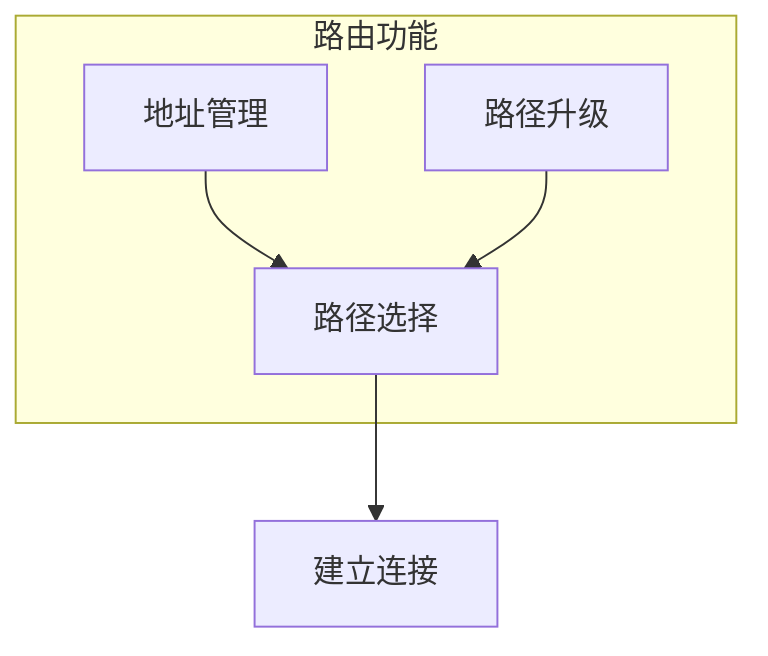
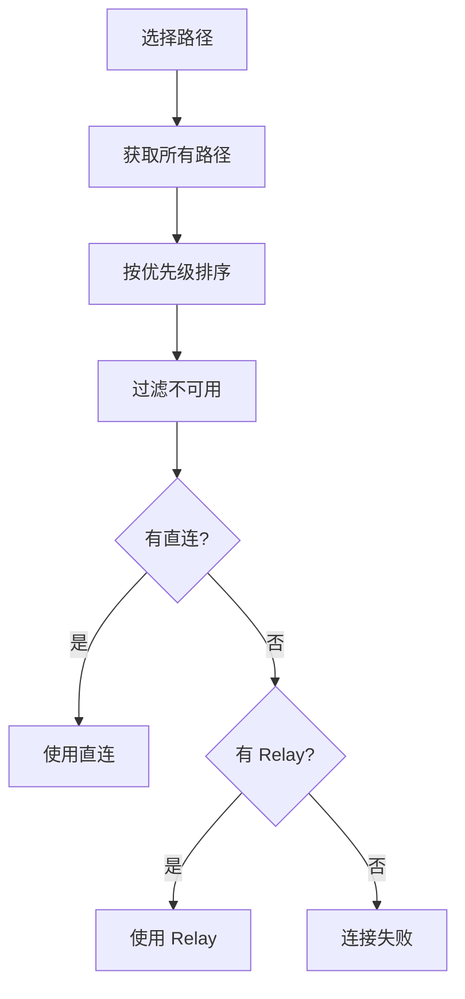
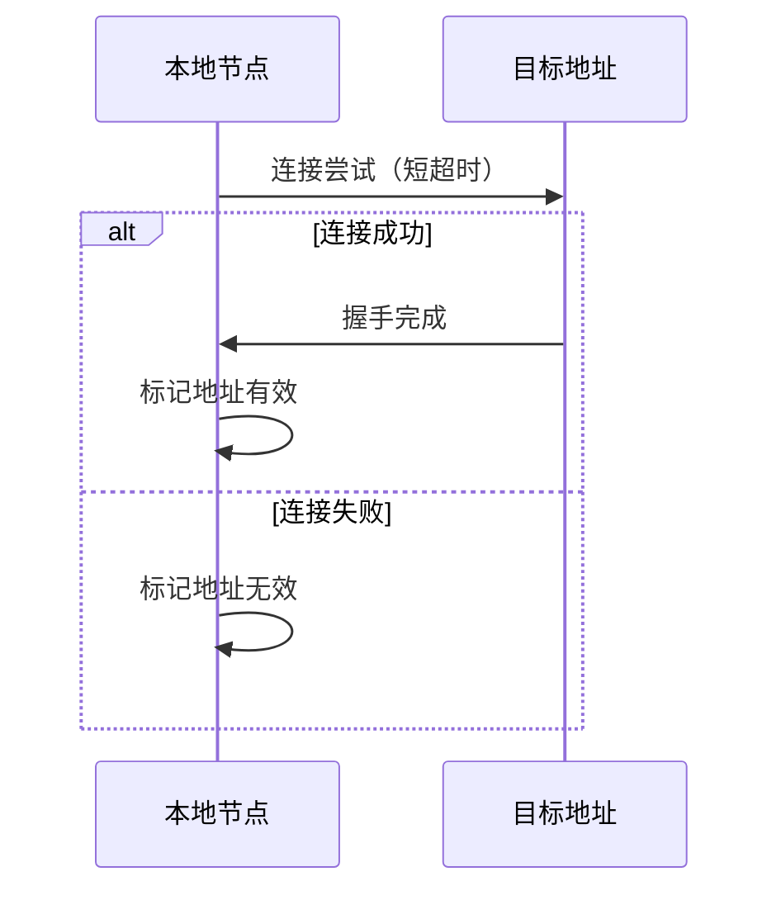
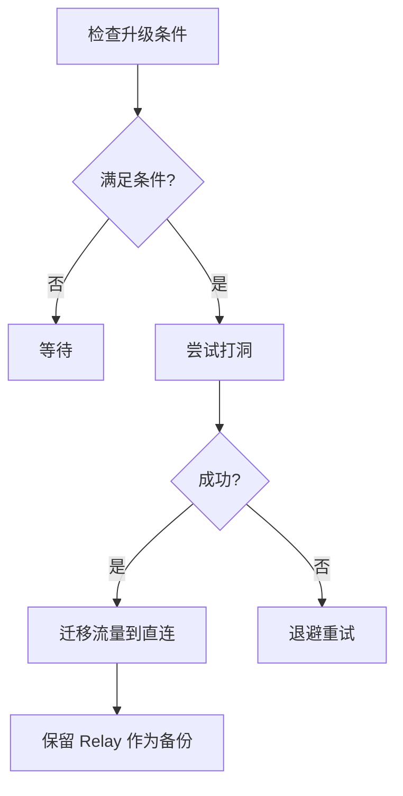

# 路由协议规范

> 定义 DeP2P 的路径选择和地址管理

---

## 概述

路由协议负责选择最优路径和管理节点地址。



---

## 路径类型

### 类型定义

| 类型 | 说明 | 延迟 | 优先级 |
|------|------|------|--------|
| **Direct-IPv4** | IPv4 直连 | 最低 | 1 |
| **Direct-IPv6** | IPv6 直连 | 低 | 2 |
| **Relay** | Relay 中继 | 高 | 3 |

### 路径特性

```
┌─────────────────────────────────────────────────────────────┐
│                    路径类型特性                              │
├─────────────────────────────────────────────────────────────┤
│                                                             │
│  直连 (Direct)                                              │
│  ────────────                                               │
│  • 最低延迟                                                 │
│  • 最高优先级                                               │
│  • 需要 NAT 穿透                                            │
│                                                             │
│  中继 (Relay)                                               │
│  ────────────                                               │
│  • 较高延迟                                                 │
│  • 兜底方案                                                 │
│  • 始终可用                                                 │
│                                                             │
└─────────────────────────────────────────────────────────────┘
```

---

## 路径选择

### 选择算法



### 选择伪代码

```
路径选择伪代码：

  FUNCTION select_path(peer_id)
    paths = get_all_paths(peer_id)
    
    // 按优先级排序
    sort_by_priority(paths)
    
    // 过滤不可用路径
    available = filter_available(paths)
    
    IF empty(available) THEN
      RETURN error("no available path")
    END
    
    // 选择最优路径
    RETURN available[0]
  END
  
  FUNCTION get_path_priority(path)
    SWITCH path.type
      CASE DIRECT_IPV4: RETURN 1
      CASE DIRECT_IPV6: RETURN 2
      CASE RELAY: RETURN 3
    END
  END
```

### 延迟考虑

```
延迟优化伪代码：

  FUNCTION select_lowest_latency(paths)
    // 只考虑直连路径
    direct_paths = filter(paths, is_direct)
    
    IF empty(direct_paths) THEN
      RETURN paths[0]  // 使用 Relay
    END
    
    // 按 RTT 排序
    sort_by_rtt(direct_paths)
    
    RETURN direct_paths[0]
  END
```

---

## 地址管理

### 地址簿

```
地址簿结构：

  AddressBook = {
    peer_id_1: [
      { addr: /ip4/.../udp/4001/quic-v1, expires: ..., source: DHT },
      { addr: /ip6/.../udp/4001/quic-v1, expires: ..., source: mDNS },
    ],
    peer_id_2: [
      ...
    ],
    ...
  }
```

### 地址来源

| 来源 | TTL | 可信度 |
|------|-----|--------|
| 直接交换 | 1 小时 | 高 |
| DHT 查找 | 30 分钟 | 中 |
| mDNS | 5 分钟 | 高（局域网） |
| Relay | 10 分钟 | 低 |

### 地址操作

```
地址操作伪代码：

  FUNCTION add_address(peer_id, addr, source)
    entry = AddressEntry{
      addr: addr,
      expires: now() + get_ttl(source),
      source: source,
      validated: false
    }
    
    address_book[peer_id].append(entry)
    
    // 触发验证
    validate_address_async(peer_id, addr)
  END
  
  FUNCTION get_addresses(peer_id)
    entries = address_book[peer_id]
    
    // 过滤过期地址
    valid = filter(entries, e => e.expires > now())
    
    // 按可信度排序
    sort_by_trust(valid)
    
    RETURN map(valid, e => e.addr)
  END
```

---

## 地址验证

### 验证流程



### 验证策略

```
地址验证伪代码：

  FUNCTION validate_address(peer_id, addr)
    // 短超时连接测试
    result = connect_with_timeout(addr, 5s)
    
    IF result.success THEN
      // 验证身份
      IF result.remote_id == peer_id THEN
        mark_valid(peer_id, addr)
        RETURN true
      ELSE
        // 身份不匹配
        remove_address(peer_id, addr)
        RETURN false
      END
    ELSE
      mark_invalid(peer_id, addr)
      RETURN false
    END
  END
```

---

## 路径升级

### 升级条件

```
升级条件：

  当前使用 Relay 且：
    1. 存在未验证的直连地址
    2. 上次升级尝试超过 5 分钟
    3. 连接活跃（有流量）
```

### 升级流程（已更新）

> 基于 2026-01-22 测试反馈更新，详见 [测试计划](../../../_discussions/20260122-split-infra-test-plan.md)



**重要变更**：升级成功后**保留 Relay 连接作为备份路径**，而非立即关闭。

### 升级伪代码（已更新）

```
路径升级伪代码：

  FUNCTION try_upgrade(peer_id)
    current_path = get_current_path(peer_id)
    
    IF current_path.type != RELAY THEN
      RETURN  // 已是直连
    END
    
    IF last_upgrade_attempt(peer_id) < 5min THEN
      RETURN  // 最近尝试过
    END
    
    // 尝试打洞
    result = hole_punch(peer_id)
    
    IF result.success THEN
      // 迁移流量到直连
      migrate_streams(peer_id, result.connection)
      
      // ★ 保留 Relay 作为备份（不关闭）
      // close_relay_path(peer_id)  ← 移除！
      set_backup_path(peer_id, current_path)
      
      log.info("路径升级成功，保留 Relay 备份",
        "peer", peer_id,
        "direct", result.connection.RemoteAddr(),
        "backup", current_path.RelayAddr())
    ELSE
      // 记录尝试时间
      record_upgrade_attempt(peer_id)
    END
  END
```

### ★ 保留 Relay 备份的原因

```
┌─────────────────────────────────────────────────────────────────────────────┐
│                    保留 Relay 备份的原因                                      │
├─────────────────────────────────────────────────────────────────────────────┤
│                                                                             │
│  1. 直连路径可能不稳定                                                       │
│     打洞成功不代表路径长期稳定，NAT 映射可能超时或被重新分配                    │
│                                                                             │
│  2. 快速故障切换                                                             │
│     直连路径故障时，可立即切换到备份 Relay，无需重新建立连接                    │
│                                                                             │
│  3. 其他节点可能仍需 Relay                                                    │
│     A-B 打洞成功，但 A-C 可能仍需通过 Relay                                   │
│     保持 Relay 连接对整体网络有益                                             │
│                                                                             │
│  4. 资源开销可接受                                                           │
│     Relay 连接仅需少量心跳维护，不影响性能                                    │
│                                                                             │
│  参考：NAT/Relay 概念澄清 设计决策 §17.3                                      │
│                                                                             │
└─────────────────────────────────────────────────────────────────────────────┘
```

---

## 多路径

### 并行使用

```
多路径策略：

  主路径：
    • 承载主要流量
    • 使用最优路径
    
  备用路径：
    • 保持连接（心跳）
    • 主路径失败时切换
```

### 故障切换

```
故障切换伪代码：

  FUNCTION handle_path_failure(peer_id, failed_path)
    // 获取备用路径
    backup = get_backup_path(peer_id)
    
    IF backup != nil THEN
      // 切换到备用路径
      switch_path(peer_id, backup)
      
      // 尝试恢复主路径
      schedule_recovery(peer_id, failed_path)
    ELSE
      // 无备用路径
      handle_disconnect(peer_id)
    END
  END
```

---

## 相关文档

- [发现协议](discovery.md)
- [NAT 穿透](nat.md)
- [Relay 中继](../L2_transport/relay.md)
- [NAT/Relay 概念澄清](../../../_discussions/20260123-nat-relay-concept-clarification.md)
- [拆分部署测试计划](../../../_discussions/20260122-split-infra-test-plan.md)

---

**最后更新**：2026-01-23
