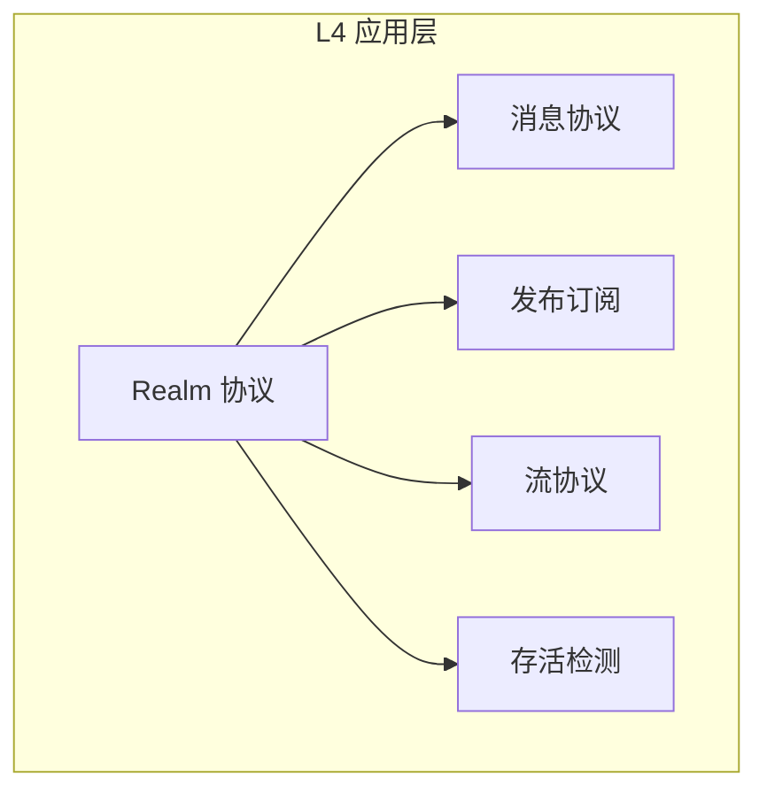
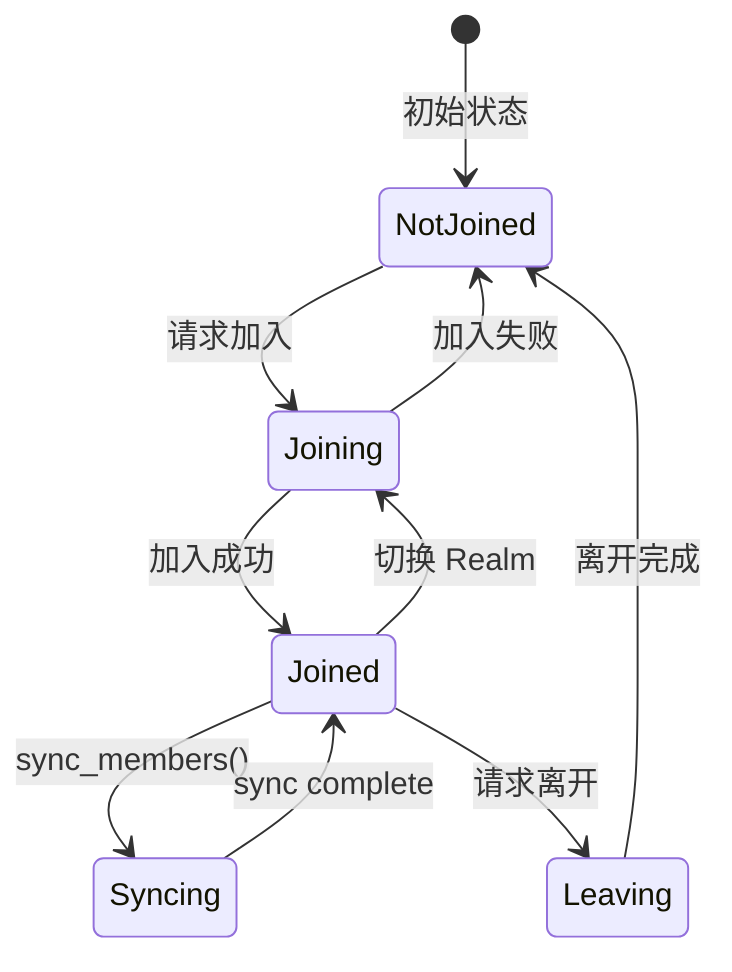
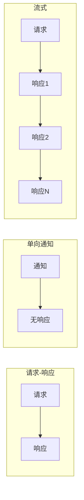

# L4 应用层规范

> 定义 DeP2P 的应用层协议

---

## 概述

应用层提供面向业务的协议，包括 Realm 管理、消息传递、发布订阅、流和存活检测。



---

## 规范列表

| 规范 | 文档 | 说明 |
|------|------|------|
| Realm 协议 | [realm.md](realm.md) | Realm join/auth/sync/route |
| 消息协议 | [messaging.md](messaging.md) | 请求响应/单向通知 |
| 发布订阅 | [pubsub.md](pubsub.md) | GossipSub |
| 流协议 | [streams.md](streams.md) | 双向流 |
| 存活检测 | [liveness.md](liveness.md) | 成员存活检测服务 |

---

## Realm 概念

### Realm 模型

```
┌─────────────────────────────────────────────────────────────┐
│                    Realm 模型                                │
├─────────────────────────────────────────────────────────────┤
│                                                             │
│  单 Realm 成员：                                            │
│    • 节点同时只属于一个 Realm                               │
│    • 加入新 Realm 自动离开旧 Realm                          │
│                                                             │
│  多种认证方式：                                             │
│    • PSK (预共享密钥)                                       │
│    • 证书 (X.509)                                          │
│    • 自定义认证器                                           │
│                                                             │
│  隔离边界：                                                 │
│    • 业务 API 需要 Realm 成员资格 (INV-002)                 │
│    • 跨 Realm 通信需显式处理                                │
│                                                             │
│  Realm 组件：                                               │
│    • Lifecycle - 生命周期管理                               │
│    • Auth - 认证器 (PSK/证书/自定义)                        │
│    • Members - 成员发现和同步                               │
│    • Routing - 域内路由                                     │
│    • Gateway - 跨域网关（可选）                             │
│                                                             │
└─────────────────────────────────────────────────────────────┘
```

### Realm 状态



---

## 协议命名

### 协议 ID 格式

Realm 协议和应用协议**嵌入 RealmID**，实现协议级别的显式隔离：

```
Realm 协议格式：/dep2p/realm/<realmID>/<protocol>/<version>
应用协议格式：/dep2p/app/<realmID>/<protocol>/<version>
```

> **关键设计**：RealmID 嵌入协议路径，提供协议级别的隔离边界，无法伪造。

### Realm 协议 (/dep2p/realm/\<realmID\>/*)

| 协议 ID 格式 | 说明 |
|-------------|------|
| `/dep2p/realm/<realmID>/join/1.0.0` | 加入 Realm |
| `/dep2p/realm/<realmID>/auth/1.0.0` | Realm 认证 |
| `/dep2p/realm/<realmID>/sync/1.0.0` | 成员同步 |
| `/dep2p/realm/<realmID>/route/1.0.0` | 域内路由 |

### 应用协议 (/dep2p/app/\<realmID\>/*)

| 协议 ID 格式 | 说明 |
|-------------|------|
| `/dep2p/app/<realmID>/messaging/1.0.0` | 消息传递 |
| `/dep2p/app/<realmID>/pubsub/1.0.0` | 发布订阅 |
| `/dep2p/app/<realmID>/streams/1.0.0` | 双向流 |
| `/dep2p/app/<realmID>/liveness/1.0.0` | 存活检测服务 |

### RealmID 格式

| 属性 | 值 |
|------|-----|
| 长度 | 32 字节 |
| 编码 | Base58（约 44 字符） |
| 派生 | HKDF(PSK, salt="dep2p-realm-id-v1") |

### 访问控制

| 前缀 | 用途 | 需要 Realm | Relay 转发 |
|------|------|-----------|-----------|
| `/dep2p/realm/<realmID>/*` | Realm 控制协议 | 是 | Relay（仅匹配的 ID + 成员验证） |
| `/dep2p/app/<realmID>/*` | 业务应用协议 | 是 | Relay（仅匹配的 ID + 成员验证） |

---

## 消息模式

### 支持的模式

| 模式 | 说明 | 适用场景 |
|------|------|----------|
| **请求-响应** | 一问一答 | RPC 调用 |
| **单向通知** | 只发不回 | 事件通知 |
| **服务端流** | 请求后多响应 | 数据同步 |
| **双向流** | 持续交互 | 实时通信 |

### 消息流程



---

## 发布订阅

### GossipSub

```
┌─────────────────────────────────────────────────────────────┐
│                    GossipSub 特性                            │
├─────────────────────────────────────────────────────────────┤
│                                                             │
│  高效传播：                                                 │
│    • 基于 gossip 的消息传播                                 │
│    • 局部视图，全局传播                                     │
│                                                             │
│  弹性网络：                                                 │
│    • 容忍节点动态加入/离开                                  │
│    • 自动修复网络拓扑                                       │
│                                                             │
│  主题隔离：                                                 │
│    • 消息按主题隔离                                         │
│    • 订阅者只收到感兴趣的主题                               │
│                                                             │
└─────────────────────────────────────────────────────────────┘
```

---

## 与其他层的关系

| 层级 | 应用层依赖 |
|------|-----------|
| L3 网络层 | 节点发现、路由 |
| L2 传输层 | QUIC 流、Relay |
| L1 身份层 | NodeID、签名 |

---

## 相关文档

- [L3 网络层](../L3_network/)
- [ADR-0002 Realm 隔离](../../../01_context/decisions/ADR-0002-realm-isolation.md)
- [INV-002 Realm 成员资格](../../../01_context/decisions/invariants/INV-002-realm-membership.md)

---

**最后更新**：2026-01-13
