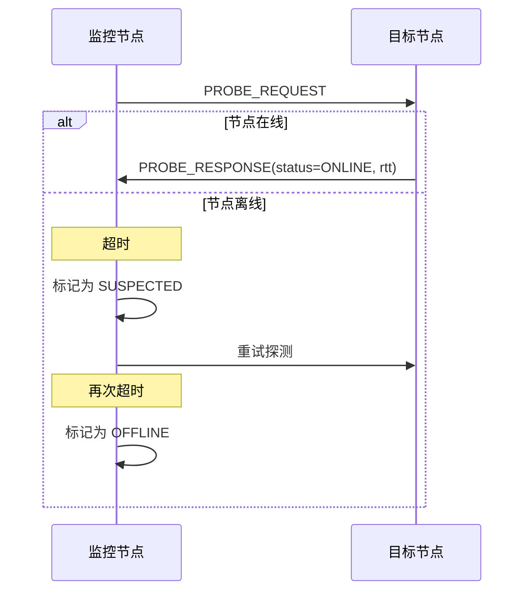
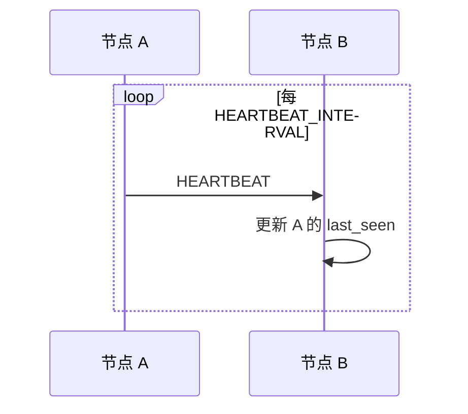
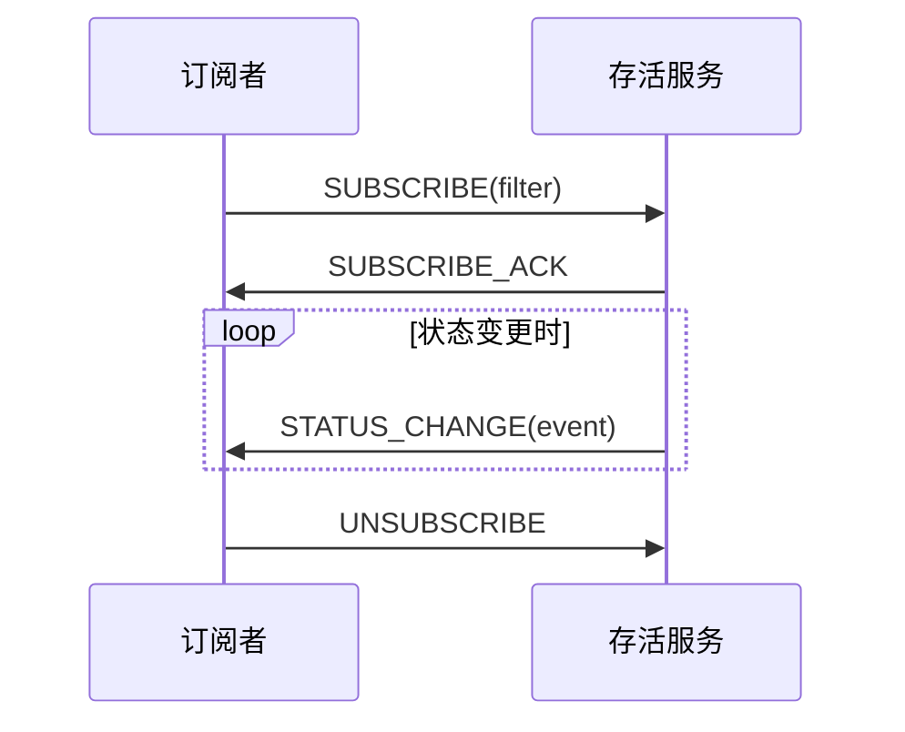

# 存活检测协议规范

> 定义 DeP2P 的存活检测服务协议

---

## 概述

存活检测服务用于监控 Realm 成员的在线状态，区别于系统层的 Ping 协议，它提供 Realm 级别的成员存活状态管理。

```mermaid
flowchart TB
    subgraph Liveness[存活检测服务]
        Probe[探测]
        Report[状态报告]
        Subscribe[订阅变更]
    end
    
    subgraph SystemPing[系统 Ping]
        SysPing[/dep2p/sys/ping/1.0.0]
    end
    
    Liveness --> |底层使用| SystemPing
```

---

## 协议 ID

| 协议 | ID | 说明 |
|------|-----|------|
| 存活检测 | `/dep2p/app/liveness/1.0.0` | Realm 成员存活检测 |

> **与系统 Ping 的区别**：
> - 系统 Ping (`/dep2p/sys/ping/1.0.0`)：底层连接级别的存活检测
> - 应用 Liveness (`/dep2p/app/liveness/1.0.0`)：Realm 成员级别的状态管理

---

## 功能特性

### 核心功能

| 功能 | 说明 |
|------|------|
| **成员探测** | 主动检测成员是否在线 |
| **状态订阅** | 订阅成员上下线事件 |
| **批量查询** | 一次查询多个成员状态 |
| **心跳机制** | 定期心跳维持在线状态 |

### 状态定义

```
成员状态定义：

  ONLINE     = 0  // 在线
  OFFLINE    = 1  // 离线
  UNKNOWN    = 2  // 未知
  SUSPECTED  = 3  // 疑似离线（正在探测）
```

---

## 消息格式

### 探测请求

```
PROBE_REQUEST 消息：

  ┌────────────────────────────────────────────────────────┐
  │  Type (1)  │  NodeCount (2)  │  NodeIDs [...]         │
  └────────────────────────────────────────────────────────┘
```

### 探测响应

```
PROBE_RESPONSE 消息：

  ┌────────────────────────────────────────────────────────┐
  │  Type (1)  │  NodeCount (2)  │  Results [...]         │
  └────────────────────────────────────────────────────────┘
  
Result 结构：
  ┌────────────────────────────────────────────────────────┐
  │  NodeID (32)  │  Status (1)  │  RTT (4)  │  LastSeen (8) │
  └────────────────────────────────────────────────────────┘
```

### 状态变更事件

```
STATUS_CHANGE 消息：

  ┌────────────────────────────────────────────────────────┐
  │  Type (1)  │  NodeID (32)  │  OldStatus (1)           │
  │  NewStatus (1)  │  Timestamp (8)                       │
  └────────────────────────────────────────────────────────┘
```

### 心跳消息

```
HEARTBEAT 消息：

  ┌────────────────────────────────────────────────────────┐
  │  Type (1)  │  NodeID (32)  │  Timestamp (8)           │
  └────────────────────────────────────────────────────────┘
```

---

## 探测机制

### 探测流程



### 探测伪代码

```
探测伪代码：

  CONST PROBE_TIMEOUT = 5s
  CONST PROBE_RETRIES = 3
  CONST PROBE_INTERVAL = 30s
  
  FUNCTION probe_member(peer_id)
    FOR attempt = 1 TO PROBE_RETRIES
      start = now()
      
      response, err = send_probe(peer_id, timeout = PROBE_TIMEOUT)
      
      IF err == nil THEN
        rtt = now() - start
        update_status(peer_id, ONLINE, rtt)
        RETURN ONLINE
      END
      
      IF attempt == 1 THEN
        update_status(peer_id, SUSPECTED)
      END
      
      sleep(1s * attempt)  // 退避
    END
    
    update_status(peer_id, OFFLINE)
    emit_status_change(peer_id, ONLINE, OFFLINE)
    RETURN OFFLINE
  END
```

---

## 心跳机制

### 心跳流程



### 心跳配置

| 参数 | 默认值 | 说明 |
|------|--------|------|
| HEARTBEAT_INTERVAL | 30s | 心跳发送间隔 |
| HEARTBEAT_TIMEOUT | 90s | 心跳超时时间 |
| HEARTBEAT_MISS_THRESHOLD | 3 | 允许丢失心跳数 |

### 心跳伪代码

```
心跳伪代码：

  FUNCTION heartbeat_loop()
    WHILE is_member_of_realm()
      // 向所有已知成员发送心跳
      FOR EACH peer IN known_members
        GO send_heartbeat(peer)
      END
      
      // 检查过期成员
      check_expired_members()
      
      sleep(HEARTBEAT_INTERVAL)
    END
  END
  
  FUNCTION check_expired_members()
    now = current_time()
    
    FOR EACH peer, last_seen IN member_last_seen
      IF now - last_seen > HEARTBEAT_TIMEOUT THEN
        // 触发探测
        probe_member(peer)
      END
    END
  END
```

---

## 状态订阅

### 订阅流程



### 订阅伪代码

```
订阅伪代码：

  TYPE Subscription
    filter: Filter
    channel: chan Event
  END
  
  FUNCTION subscribe(filter)
    sub = Subscription{
      filter: filter,
      channel: make(chan Event, 100),
    }
    
    add_subscriber(sub)
    
    RETURN sub.channel
  END
  
  FUNCTION notify_subscribers(event)
    FOR EACH sub IN subscribers
      IF sub.filter.matches(event) THEN
        SELECT
          CASE sub.channel <- event:
            // 发送成功
          DEFAULT:
            // 通道满，跳过
        END
      END
    END
  END
```

---

## API 接口

### 查询接口

```
查询接口：

  // 查询单个成员状态（返回增强的 LivenessStatus）
  FUNCTION GetStatus(peer_id) -> LivenessStatus
  
  // 批量查询
  FUNCTION GetStatuses(peer_ids) -> []LivenessStatus
  
  // 获取所有在线成员
  FUNCTION GetOnlineMembers() -> []PeerID
  
  // 订阅状态变更
  FUNCTION Subscribe(filter) -> chan StatusEvent
  
  // 取消订阅
  FUNCTION Unsubscribe(subscription)
```

### LivenessStatus 增强结构

```
LivenessStatus 结构：

  基础字段：
  ┌────────────────────────────────────────────────────────┐
  │  Alive: bool           // 是否存活                      │
  │  LastSeen: Time        // 最后一次确认存活时间           │
  │  LastRTT: Duration     // 最后一次 RTT                  │
  │  AvgRTT: Duration      // 平均 RTT（滑动窗口）           │
  │  FailCount: int        // 连续失败次数                  │
  └────────────────────────────────────────────────────────┘
  
  增强统计字段：
  ┌────────────────────────────────────────────────────────┐
  │  MinRTT: Duration      // 历史最小 RTT（最佳延迟）       │
  │  MaxRTT: Duration      // 历史最大 RTT（最差延迟）       │
  │  TotalPings: int       // 总 Ping 次数                  │
  │  SuccessCount: int     // 成功次数                      │
  │  SuccessRate: float64  // 成功率 (0.0 - 1.0)            │
  └────────────────────────────────────────────────────────┘
```

增强字段用途：
- **MinRTT/MaxRTT**: 用于评估网络稳定性和抖动
- **TotalPings/SuccessCount**: 用于计算历史可靠性
- **SuccessRate**: 用于快速判断节点质量

### 使用示例

```
使用示例伪代码：

  // 查询成员状态
  status, rtt, last_seen = liveness.GetStatus(peer_id)
  IF status == ONLINE THEN
    log.info("peer is online", "rtt", rtt)
  END
  
  // 订阅状态变更
  events = liveness.Subscribe(Filter{status: [ONLINE, OFFLINE]})
  
  FOR event IN events
    log.info("status changed", 
      "peer", event.peer_id,
      "old", event.old_status,
      "new", event.new_status)
  END
```

---

## 错误处理

### 错误码

| 错误码 | 说明 |
|--------|------|
| ERR_NOT_MEMBER | 不是 Realm 成员 |
| ERR_PROBE_TIMEOUT | 探测超时 |
| ERR_SUBSCRIPTION_FULL | 订阅队列满 |
| ERR_INVALID_FILTER | 无效过滤器 |

---

## 成员离线通知协议（MemberLeave）

> v1.0.0 新增：用于优雅断开时的主动通知

### 协议 ID

| 协议 | ID | 说明 |
|------|-----|------|
| 成员离开 | `/dep2p/app/member-leave/1.0.0` | 优雅断开时广播 |

### 消息格式

```
MemberLeave 消息：

  ┌────────────────────────────────────────────────────────────────┐
  │  peer_id (32)  │  realm_id (32)  │  reason (1)  │             │
  │  timestamp (8) │  signature (64)                               │
  └────────────────────────────────────────────────────────────────┘

LeaveReason 枚举：
  UNKNOWN  = 0    // 未知
  GRACEFUL = 1    // 主动关闭
  KICKED   = 2    // 被踢出
  WITNESS  = 3    // 见证人报告触发
```

### 发送时机

1. 应用调用 `Node.Stop()` 或 `Realm.Leave()`
2. 收到 SIGTERM/SIGINT 信号
3. 优雅关闭流程启动时

### 安全约束

| 约束 | 规则 |
|------|------|
| **签名** | 消息必须由发送者私钥签名 |
| **时间戳** | 接收方拒绝 >30s 过期的消息 |
| **防重放** | 相同 (peer_id, timestamp) 组合只处理一次 |

### 处理流程

```
接收处理伪代码：

  FUNCTION handle_member_leave(msg)
    // 1. 验证签名
    IF NOT verify_signature(msg) THEN
      RETURN ERR_INVALID_SIGNATURE
    END
    
    // 2. 检查时间戳
    IF now() - msg.timestamp > 30s THEN
      RETURN ERR_MESSAGE_EXPIRED
    END
    
    // 3. 检查防重放
    IF is_processed(msg.peer_id, msg.timestamp) THEN
      RETURN nil  // 静默忽略
    END
    mark_processed(msg.peer_id, msg.timestamp)
    
    // 4. 移除成员
    member_manager.Remove(msg.peer_id)
    
    RETURN nil
  END
```

---

## 见证人协议（Witness Protocol）

> v1.0.0 新增：用于非优雅断开的快速检测

### 协议 ID

| 协议 | ID | 说明 |
|------|-----|------|
| 见证报告 | `/dep2p/app/witness-report/1.0.0` | 见证人广播离线报告 |
| 见证确认 | `/dep2p/app/witness-confirm/1.0.0` | 其他节点确认/反驳 |

### WitnessReport 消息格式

```
WitnessReport 消息：

  ┌────────────────────────────────────────────────────────────────┐
  │  witness_id (32)  │  target_id (32)  │  realm_id (32)         │
  │  method (1)       │  detected_at (8) │  reported_at (8)       │
  │  signature (64)   │  last_contact_proof (var, optional)       │
  └────────────────────────────────────────────────────────────────┘

DetectionMethod 枚举：

  高可信（明确关闭信号）:
  ─────────────────────
    QUIC_CLOSE        = 1   // QUIC CONNECTION_CLOSE 帧
    TCP_RST           = 5   // TCP RST（连接重置）
    TCP_FIN           = 6   // TCP FIN（正常关闭）
    GRACEFUL_SHUTDOWN = 7   // 应用层优雅关闭

  低可信（可能因网络问题触发）:
  ─────────────────────────────
    QUIC_TIMEOUT      = 2   // QUIC 超时 ⚠️
    PING_FAILED       = 3   // Ping 失败
    STREAM_ERROR      = 4   // 流错误
    RELAY_TIMEOUT     = 8   // Relay Circuit 超时
```

### WitnessConfirmation 消息格式

```
WitnessConfirmation 消息：

  ┌────────────────────────────────────────────────────────────────┐
  │  confirmer_id (32)  │  target_id (32)  │  type (1)            │
  │  timestamp (8)      │  signature (64)                          │
  └────────────────────────────────────────────────────────────────┘

ConfirmationType 枚举：
  UNKNOWN  = 0    // 未知
  AGREE    = 1    // 同意（我也检测到离线）
  DISAGREE = 2    // 不同意（我仍能连接到目标）
  ABSTAIN  = 3    // 弃权（我与目标无连接）
```

### 见证人资格

```
见证人资格规则：

  1. 必须与断开节点有 **直连**（非 Relay）
  2. 必须是同一 Realm 的认证成员
  3. 发现后，按延迟广播策略等待广播
```

### 延迟广播策略

```
延迟广播伪代码：

  CONST MAX_DELAY = 500ms
  
  FUNCTION calculate_broadcast_delay(witness_id, target_id)
    // 基于哈希的伪随机延迟
    hash = SHA256(witness_id + target_id + timestamp_second())
    delay_ms = hash[0:8] % MAX_DELAY
    RETURN delay_ms * millisecond
  END
  
  FUNCTION on_peer_disconnected(target_id, method)
    // 检查是否已有待处理报告
    IF pending_reports[target_id] EXISTS THEN
      RETURN
    END
    
    delay = calculate_broadcast_delay(self_id, target_id)
    
    // 延迟后广播
    timer = after(delay, FUNCTION()
      broadcast_witness_report(target_id, method)
    END)
    
    pending_reports[target_id] = timer
  END
  
  FUNCTION on_witness_report_received(report)
    // 收到他人报告，取消自己的待广播
    IF pending_reports[report.target_id] EXISTS THEN
      cancel(pending_reports[report.target_id])
      DELETE pending_reports[report.target_id]
    END
    
    // 处理收到的报告
    process_witness_report(report)
  END
```

### Quorum 投票规则

```
Quorum 规则：

  确认超时: 2s
  
  有效票数 = AGREE + DISAGREE （排除 ABSTAIN）
  同意比例 = AGREE / 有效票数
  
  确认离线条件（满足任一）：
  ─────────────────────────
  
  1. 常规路径
     有效票数 >= 2 且 同意比例 > 50%
  
  2. 快速路径（小型 Realm）
     - 成员数 < FastPathThreshold (默认 10)
     - 见证人是受信任节点
     - 检测方式是高可信（QUIC_CLOSE, TCP_RST, GRACEFUL_SHUTDOWN）
     - → 单票即可确认
  
  拒绝条件：
  ─────────
  - 任一节点发送 DISAGREE 且提供可达性证明
  - 票数不足且超时
```

### 安全约束

| 约束 | 规则 |
|------|------|
| **签名** | 所有消息必须签名 |
| **时间戳** | 拒绝 >10s 过期的报告（比 MemberLeave 更严格） |
| **防重放** | 同一 (witness_id, target_id, detected_at) 只处理一次 |
| **限速** | 每个见证人每分钟最多 10 个报告 |

### 防攻击机制

```
防攻击机制：

  1. 伪造报告攻击
     防御: 签名验证 + 多数确认
  
  2. 重放攻击
     防御: 时间戳检查 + 处理记录缓存
  
  3. 见证人风暴
     防御: 随机延迟广播 + 收到他人报告后取消
  
  4. 拒绝服务攻击
     防御: 限速 + 签名验证在前
  
  5. 女巫攻击
     防御: 只有 Realm 认证成员可投票
```

---

## 相关文档

- [消息协议](messaging.md)
- [流协议](streams.md)
- [Realm 协议](realm.md)
- [断开检测行为](../../../03_architecture/L3_behavioral/disconnect_detection.md)

---

**最后更新**：2026-01-28（新增 MemberLeave、Witness 协议）
