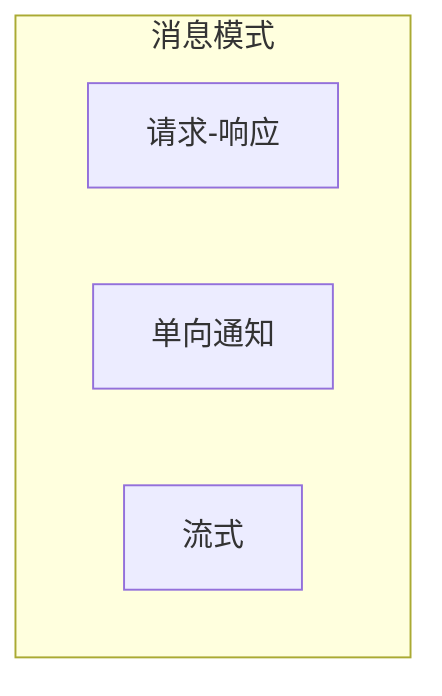
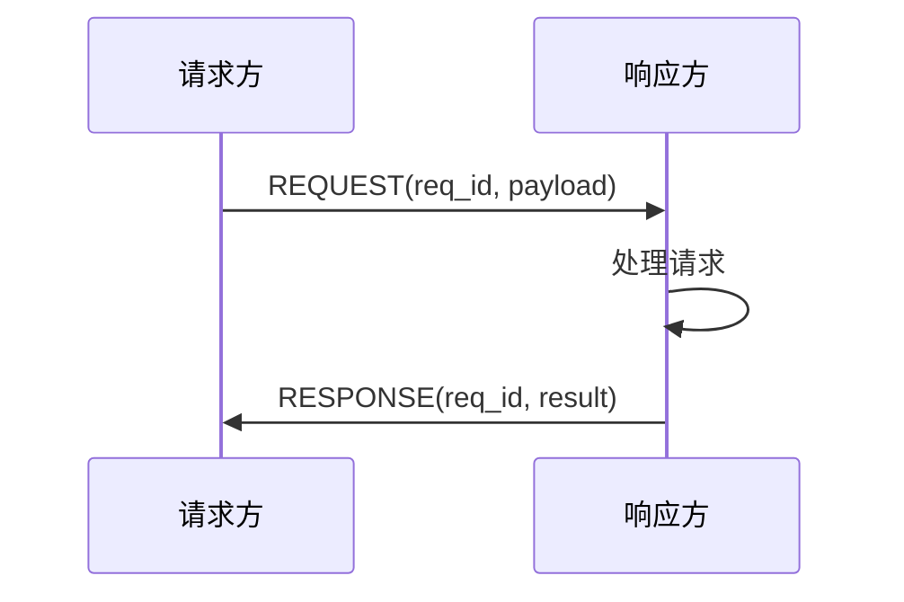
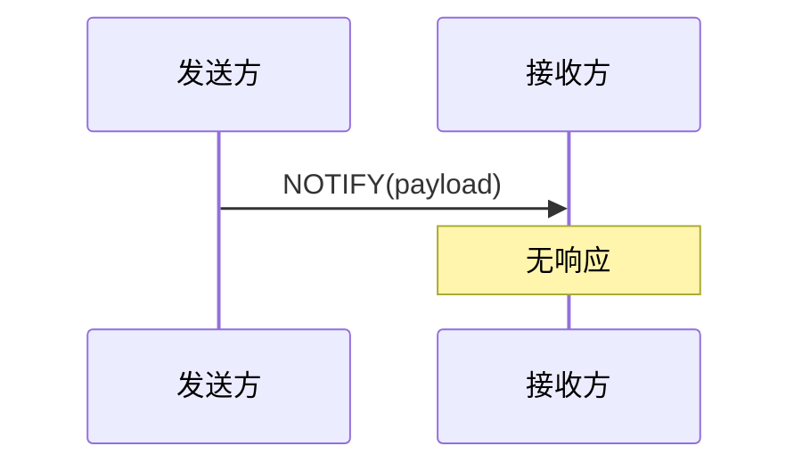
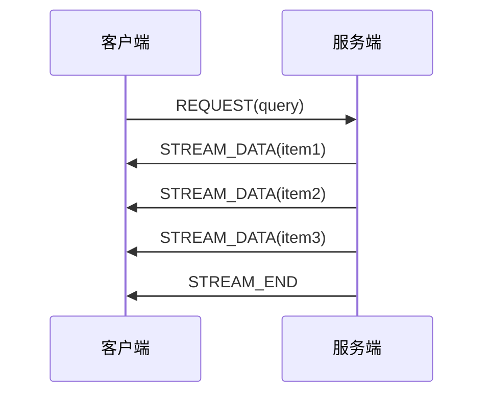
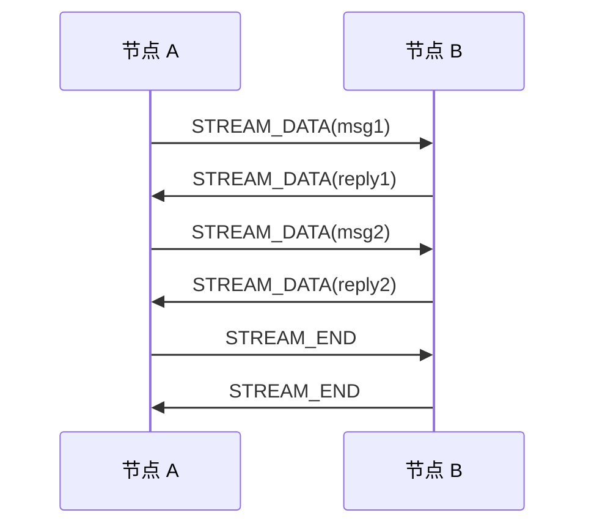
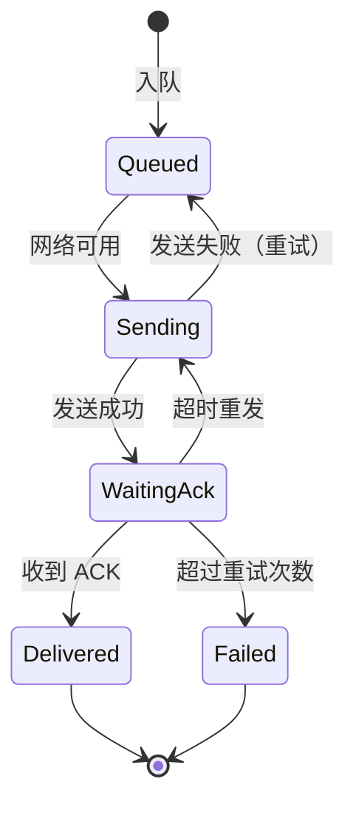

# 消息协议规范

> 定义 DeP2P 的点对点消息传递协议

---

## 概述

消息协议提供节点间的可靠消息传递能力。



---

## 协议 ID

| 协议 | ID | 说明 |
|------|-----|------|
| 消息 | `/dep2p/app/messaging/1.0.0` | 统一消息协议 |

消息协议支持多种模式：请求-响应、单向通知、流式消息。

> **注意**：双向流的完整实现参见 [streams.md](streams.md)

---

## 消息格式

### 消息头

```
消息头格式：

  ┌─────────────────────────────────────────────────────────┐
  │  Version (1)  │  Type (1)  │  Flags (2)  │  ReqID (4)  │
  │  Length (4)                                              │
  └─────────────────────────────────────────────────────────┘
  
  总长度：12 字节
```

### 字段说明

| 字段 | 大小 | 说明 |
|------|------|------|
| Version | 1 字节 | 协议版本 |
| Type | 1 字节 | 消息类型 |
| Flags | 2 字节 | 标志位 |
| ReqID | 4 字节 | 请求标识 |
| Length | 4 字节 | 负载长度 |

### 消息类型

```
消息类型：

  REQUEST     = 0x01  // 请求
  RESPONSE    = 0x02  // 响应
  NOTIFY      = 0x03  // 通知
  STREAM_DATA = 0x04  // 流数据
  STREAM_END  = 0x05  // 流结束
  ERROR       = 0x06  // 错误
```

### 标志位

```
标志位定义：

  FLAG_COMPRESSED = 0x0001  // 压缩
  FLAG_ENCRYPTED  = 0x0002  // 端到端加密
  FLAG_FINAL      = 0x0004  // 最后一帧
```

---

## 请求-响应

### 流程



### 伪代码

```
请求-响应伪代码：

  FUNCTION request(peer_id, protocol, data, timeout)
    // 验证 Realm 成员资格
    IF NOT is_same_realm(peer_id) THEN
      RETURN error("ErrNotMember")
    END
    
    // 生成请求 ID
    req_id = generate_request_id()
    
    // 打开流
    stream = open_stream(peer_id, protocol)
    DEFER stream.close()
    
    // 发送请求
    msg = Message{
      type: REQUEST,
      req_id: req_id,
      payload: encode(data)
    }
    write_message(stream, msg)
    
    // 等待响应
    response = read_message_with_timeout(stream, timeout)
    
    IF response.type == ERROR THEN
      RETURN error(response.payload)
    END
    
    IF response.req_id != req_id THEN
      RETURN error("request ID mismatch")
    END
    
    RETURN decode(response.payload)
  END
```

---

## 单向通知

### 流程



### 伪代码

```
单向通知伪代码：

  FUNCTION notify(peer_id, protocol, data)
    // 验证 Realm 成员资格
    IF NOT is_same_realm(peer_id) THEN
      RETURN error("ErrNotMember")
    END
    
    // 打开流
    stream = open_stream(peer_id, protocol)
    DEFER stream.close()
    
    // 发送通知
    msg = Message{
      type: NOTIFY,
      payload: encode(data)
    }
    write_message(stream, msg)
    
    RETURN ok
  END
```

---

## 流式消息

### 服务端流



### 双向流



### 流式伪代码

```
流式接收伪代码：

  FUNCTION receive_stream(stream)
    items = []
    
    WHILE true
      msg = read_message(stream)
      
      SWITCH msg.type
        CASE STREAM_DATA:
          items.append(decode(msg.payload))
          
        CASE STREAM_END:
          RETURN items
          
        CASE ERROR:
          RETURN error(msg.payload)
      END
    END
  END
```

---

## 超时处理

### 超时配置

| 场景 | 默认超时 | 说明 |
|------|----------|------|
| 请求响应 | 30s | 单次请求 |
| 流开始 | 10s | 首个响应 |
| 流数据 | 60s | 数据间隔 |

### 超时处理

```
超时处理伪代码：

  FUNCTION request_with_timeout(peer_id, data, timeout)
    ctx = with_timeout(context, timeout)
    
    result, err = request(ctx, peer_id, data)
    
    IF err == DEADLINE_EXCEEDED THEN
      log.warn("request timeout", "peer", peer_id)
      RETURN error("ErrTimeout")
    END
    
    RETURN result, err
  END
```

---

## 重试策略

### 可重试错误

| 错误 | 可重试 | 策略 |
|------|--------|------|
| ErrTimeout | 是 | 指数退避 |
| ErrConnectionClosed | 是 | 重新连接 |
| ErrStreamClosed | 是 | 新流重试 |
| ErrNotMember | 否 | - |
| ErrInvalidMessage | 否 | - |

### 重试伪代码

```
重试伪代码：

  FUNCTION request_with_retry(peer_id, data, max_retries)
    FOR attempt = 1 TO max_retries
      result, err = request(peer_id, data)
      
      IF err == nil THEN
        RETURN result
      END
      
      IF NOT is_retryable(err) THEN
        RETURN error(err)
      END
      
      // 指数退避
      delay = min(1s * (2 ^ attempt), 30s)
      sleep(delay)
    END
    
    RETURN error("max retries exceeded")
  END
```

---

## ★ 可靠消息投递 (计划中)

> 相关需求：[REQ-PROTO-004](../../../01_context/requirements/functional/F6_protocol/REQ-PROTO-004.md)

对于关键消息（如 Realm 状态同步、重要通知），需要可靠投递机制：

### ACK 确认机制

```
ACK 消息类型：

  ACK         = 0x10  // 确认收到
  ACK_REQUEST = 0x11  // 请求确认
```

### 消息队列

```
消息队列设计：

  ┌─────────────────────────────────────────────────────────┐
  │                   ReliablePublisher                     │
  ├─────────────────────────────────────────────────────────┤
  │  MessageQueue (FIFO + LRU 淘汰)                         │
  │    • MaxSize: 1000 条                                   │
  │    • MaxAge: 5 分钟                                     │
  │                                                         │
  │  PendingAcks (等待确认的消息)                            │
  │    • AckTimeout: 5 秒                                   │
  │    • MaxRetries: 3 次                                   │
  │                                                         │
  │  CriticalPeers (关键节点列表)                            │
  │    • 必须收到这些节点的 ACK 才算成功                      │
  └─────────────────────────────────────────────────────────┘
```

### 投递状态机



---

## 错误响应

### 错误格式

```
ERROR 消息格式：

  ┌────────────────────────────────────────────────────────┐
  │  Header (12)  │  ErrorCode (4)  │  Message (变长)     │
  └────────────────────────────────────────────────────────┘
```

### 错误码

| 错误码 | 说明 |
|--------|------|
| 1 | 未知错误 |
| 2 | 无效请求 |
| 3 | 处理失败 |
| 4 | 超时 |
| 5 | 未授权 |

---

## 相关文档

- [Realm 协议](realm.md)
- [发布订阅](pubsub.md)
- [流协议](streams.md)
- [存活检测](liveness.md)
- [REQ-PROTO-004 可靠消息投递](../../../01_context/requirements/functional/F6_protocol/REQ-PROTO-004.md)
- [INV-002 Realm 成员资格](../../../01_context/decisions/invariants/INV-002-realm-membership.md)

---

**最后更新**：2026-01-18
