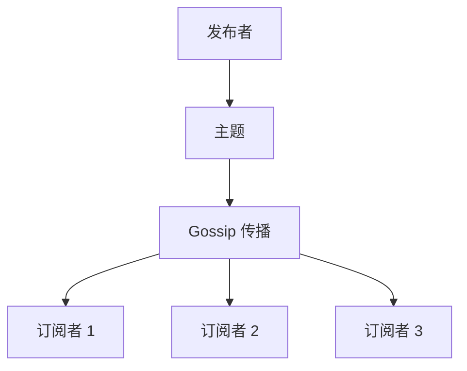
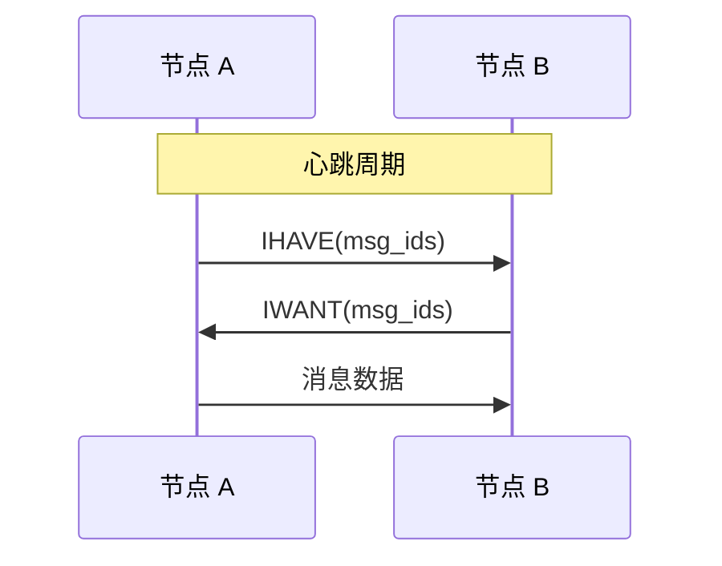
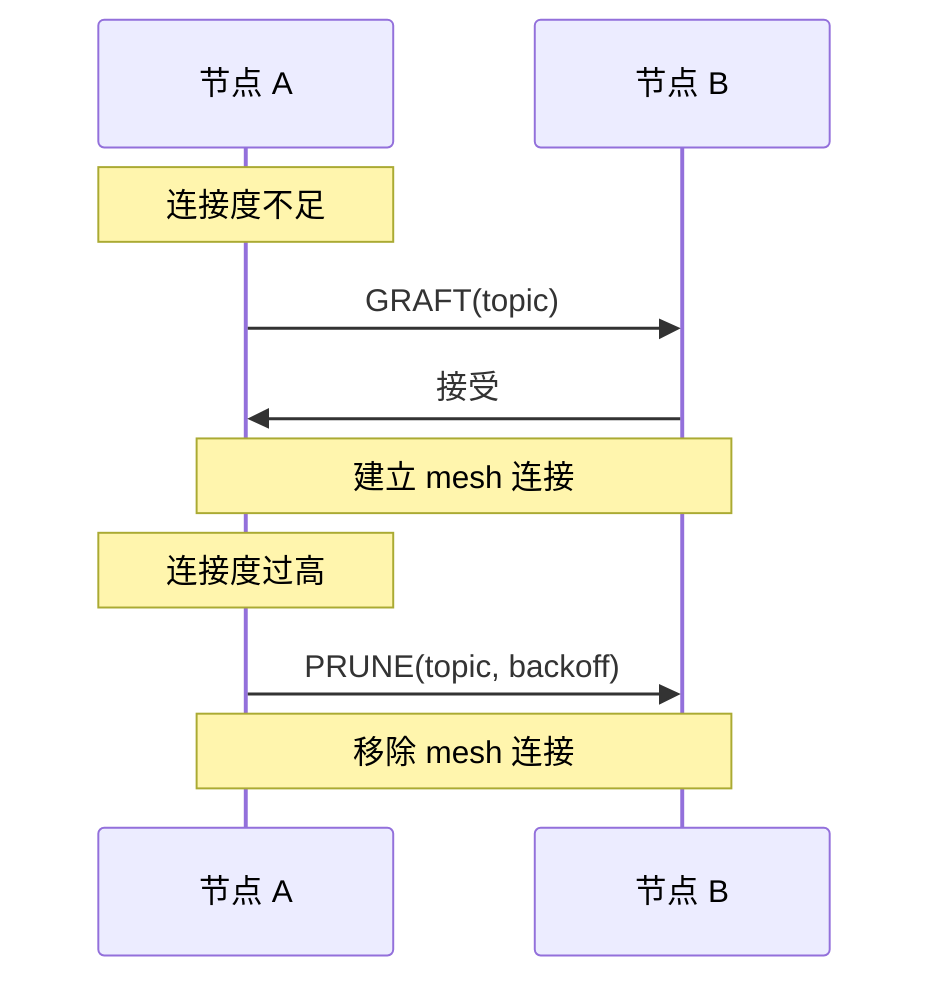
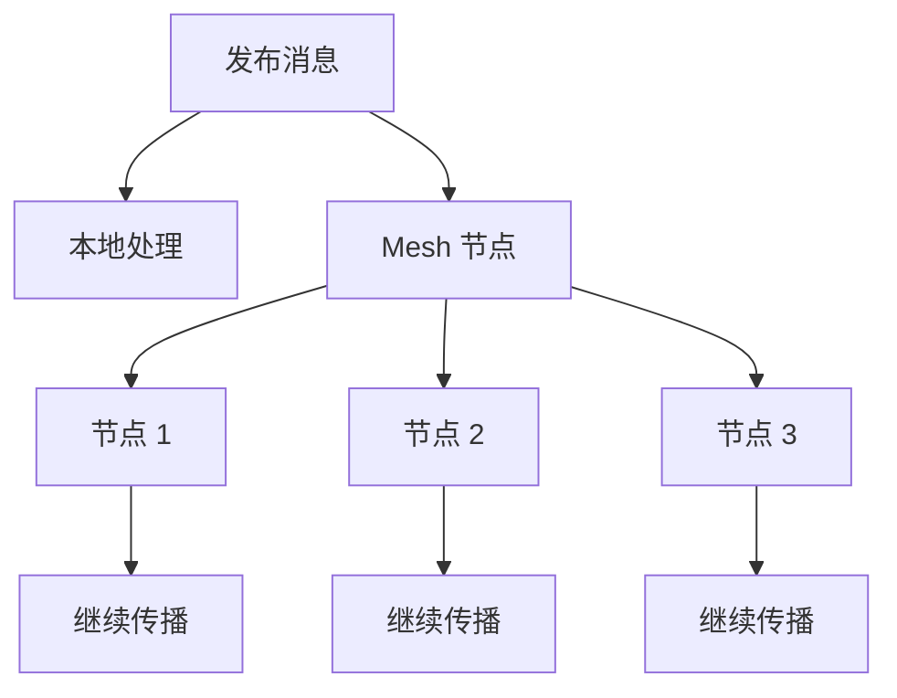

# 发布订阅协议规范

> 定义 DeP2P 的发布订阅机制

---

## 概述

DeP2P 使用 **GossipSub** 作为发布订阅协议，提供高效、弹性的消息传播。



---

## 协议 ID

| 协议 | ID | 说明 |
|------|-----|------|
| GossipSub | /dep2p/realm/{realm}/pubsub/1.0.0 | 发布订阅 |
| 控制 | /dep2p/realm/{realm}/pubsub/control/1.0.0 | 控制消息 |

---

## GossipSub 参数

### 核心参数

| 参数 | 默认值 | 说明 |
|------|--------|------|
| D | 6 | 目标连接度 |
| D_lo | 4 | 最低连接度 |
| D_hi | 12 | 最高连接度 |
| D_lazy | 6 | lazy push 度 |
| heartbeat_interval | 1s | 心跳间隔 |
| fanout_ttl | 60s | fanout 超时 |
| mcache_len | 5 | 消息缓存长度 |
| mcache_gossip | 3 | gossip 窗口 |

### 评分参数

| 参数 | 说明 |
|------|------|
| P1 | 主题时间评分 |
| P2 | 首次投递评分 |
| P3 | 消息投递评分 |
| P4 | 无效消息惩罚 |

---

## 主题管理

### 主题格式

```
主题格式：

  /dep2p/{realm_id}/{topic_name}
  
示例：
  /dep2p/abc123/chat
  /dep2p/abc123/events
  /dep2p/abc123/sync
```

### 订阅操作

```
订阅操作伪代码：

  FUNCTION subscribe(topic)
    // 验证 Realm 成员资格
    IF current_realm == nil THEN
      RETURN error("ErrNotMember")
    END
    
    // 构造完整主题
    full_topic = format("/dep2p/{}/{}", current_realm, topic)
    
    // 加入主题
    subscription = pubsub.join(full_topic)
    
    // 启动消息接收
    spawn {
      FOR EACH msg IN subscription.messages()
        handle_message(msg)
      END
    }
    
    RETURN subscription
  END
  
  FUNCTION unsubscribe(subscription)
    subscription.cancel()
  END
```

---

## 消息格式

### PubSub 消息

```
PubSub 消息格式：

  ┌────────────────────────────────────────────────────────┐
  │  From (32)  │  SeqNo (8)  │  Topic (变长)              │
  │  Data (变长)  │  Signature (64)                        │
  └────────────────────────────────────────────────────────┘
```

### 字段说明

| 字段 | 说明 |
|------|------|
| From | 发布者 NodeID |
| SeqNo | 序列号 |
| Topic | 主题名 |
| Data | 消息数据 |
| Signature | 消息签名 |

---

## ★ 基础设施节点处理（来自实测验证）

> 以下规则来自 2026-01-22 Bootstrap/Relay 拆分部署测试中发现的 BUG-3/4

### 节点分类

```
┌─────────────────────────────────────────────────────────────────────────────┐
│                    PubSub 节点分类                                            │
├─────────────────────────────────────────────────────────────────────────────┤
│                                                                             │
│  基础设施节点（Infra-Only）                                                  │
│  ════════════════════════                                                   │
│  • Bootstrap 节点：仅提供 DHT 服务                                           │
│  • Relay 节点：仅提供中继服务                                                │
│  • 不参与 Realm 成员体系                                                     │
│  • 不应加入 PubSub Mesh                                                      │
│                                                                             │
│  应用节点                                                                    │
│  ════════                                                                   │
│  • Chat 节点、业务节点等                                                     │
│  • 参与 Realm 成员体系                                                       │
│  • 可以加入 PubSub Mesh                                                      │
│                                                                             │
└─────────────────────────────────────────────────────────────────────────────┘
```

### Mesh Graft 过滤规则

```
┌─────────────────────────────────────────────────────────────────────────────┐
│                    Mesh Graft 过滤（BUG-3 修复）                              │
├─────────────────────────────────────────────────────────────────────────────┤
│                                                                             │
│  问题：Bootstrap 节点被错误加入 PubSub Mesh                                   │
│        导致消息发送时 Realm 成员校验失败                                      │
│                                                                             │
│  日志证据：                                                                  │
│    Peer 加入主题 topic=chat/general peer=2y4G889P totalPeers=1              │
│    graftPeers 添加节点到 Mesh topic=chat/general grafted=1 meshCount=1      │
│    成员检查: 非成员 peerID=2y4G889P totalMembers=1                           │
│    sendMessage 失败 error="pubsub: peer is not realm member"                │
│                                                                             │
│  解决方案：                                                                  │
│    在 graftPeers 逻辑中，将节点加入 Mesh 前检查：                             │
│    1. 节点是否在 InfrastructurePeers 列表中                                  │
│    2. 节点是否是 Realm 成员或具备 Relay 能力                                  │
│                                                                             │
└─────────────────────────────────────────────────────────────────────────────┘
```

### 过滤伪代码

```
Mesh Graft 过滤伪代码：

  FUNCTION should_graft_peer(peer_id, topic)
    // 检查是否是基础设施节点
    IF is_infrastructure_peer(peer_id) THEN
      log.debug("跳过基础设施节点", "peer", peer_id)
      RETURN false
    END
    
    // 检查是否是 Realm 成员（仅对 Realm 主题）
    realm_id = extract_realm_from_topic(topic)
    IF realm_id != "" AND NOT is_realm_member(peer_id, realm_id) THEN
      log.debug("非 Realm 成员，不加入 Mesh", "peer", peer_id, "realm", realm_id)
      RETURN false
    END
    
    RETURN true
  END
  
  FUNCTION is_infrastructure_peer(peer_id)
    // 从配置获取基础设施节点列表
  // InfrastructurePeers = Bootstrap.Peers + RelayAddr 提取的 PeerID
    RETURN peer_id IN infrastructure_peers
  END
```

### InfrastructurePeers 配置

```
InfrastructurePeers 配置来源：

  1. Bootstrap.Peers 配置
     从引导节点地址提取 PeerID
     
  2. RelayAddr 配置
     从中继地址提取 PeerID
     
  3. 自动提取（Manager 初始化时）
     // internal/realm/manager.go
     for _, addr := range config.Bootstrap.Peers {
       ai, _ := AddrInfoFromString(addr)
       infrastructurePeers.Add(ai.ID)
     }
    if config.Relay.RelayAddr != "" {
      ai, _ := AddrInfoFromString(config.Relay.RelayAddr)
       infrastructurePeers.Add(ai.ID)
     }
```

---

## Gossip 协议

### 消息类型

```
控制消息类型：

  IHAVE     = 1  // 有这些消息
  IWANT     = 2  // 想要这些消息
  GRAFT     = 3  // 建立 mesh 连接
  PRUNE     = 4  // 移除 mesh 连接
```

### Gossip 流程



### Mesh 管理



---

## 消息传播

### 传播流程



### 发布伪代码

```
发布消息伪代码：

  FUNCTION publish(topic, data)
    // 验证 Realm 成员资格
    IF current_realm == nil THEN
      RETURN error("ErrNotMember")
    END
    
    // 构造消息
    msg = PubSubMessage{
      from: local_node_id,
      seq_no: next_seq_no(),
      topic: format("/dep2p/{}/{}", current_realm, topic),
      data: data,
    }
    
    // 签名
    msg.signature = sign(private_key, msg)
    
    // 广播到 mesh
    FOR EACH peer IN mesh_peers(topic)
      send_message(peer, msg)
    END
    
    // 缓存消息（用于 gossip）
    message_cache.add(msg)
    
    RETURN ok
  END
```

---

## 消息验证

### 验证规则

```
消息验证伪代码：

  FUNCTION validate_message(msg)
    // 1. 验证签名
    IF NOT verify_signature(msg.from, msg, msg.signature) THEN
      RETURN REJECT
    END
    
    // 2. 验证发送者是 Realm 成员
    IF NOT is_realm_member(msg.from, extract_realm(msg.topic)) THEN
      RETURN REJECT
    END
    
    // 3. 检查重复
    IF seen_before(msg.id) THEN
      RETURN IGNORE
    END
    
    // 4. 应用自定义验证
    RETURN custom_validate(msg)
  END
```

### 验证结果

| 结果 | 说明 | 处理 |
|------|------|------|
| ACCEPT | 接受并传播 | 正常处理 |
| IGNORE | 忽略但不惩罚 | 跳过 |
| REJECT | 拒绝并惩罚 | 评分惩罚 |

---

## 流量控制

### 速率限制

| 限制 | 默认值 | 说明 |
|------|--------|------|
| 消息大小 | 1 MB | 单条消息 |
| 发布速率 | 100/s | 每秒发布数 |
| 订阅数 | 100 | 每节点订阅数 |

### 背压处理

```
背压处理伪代码：

  FUNCTION handle_backpressure(topic)
    IF message_queue.full() THEN
      // 选项 1：丢弃旧消息
      message_queue.drop_oldest()
      
      // 选项 2：暂停接收
      pause_subscription(topic)
    END
  END
```

---

## 错误处理

### 错误类型

| 错误 | 说明 | 处理 |
|------|------|------|
| ErrNotMember | 不是 Realm 成员 | 拒绝操作 |
| ErrTopicNotFound | 主题不存在 | 创建或报错 |
| ErrMessageTooLarge | 消息过大 | 拒绝发布 |
| ErrRateLimited | 速率超限 | 等待重试 |

---

## 相关文档

- [Realm 协议](realm.md)
- [消息协议](messaging.md)
- [INV-002 Realm 成员资格](../../../01_context/decisions/invariants/INV-002-realm-membership.md)
- [拆分部署测试计划](../../../_discussions/20260122-split-infra-test-plan.md)

---

**最后更新**：2026-01-23
