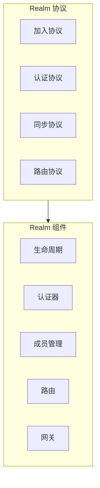
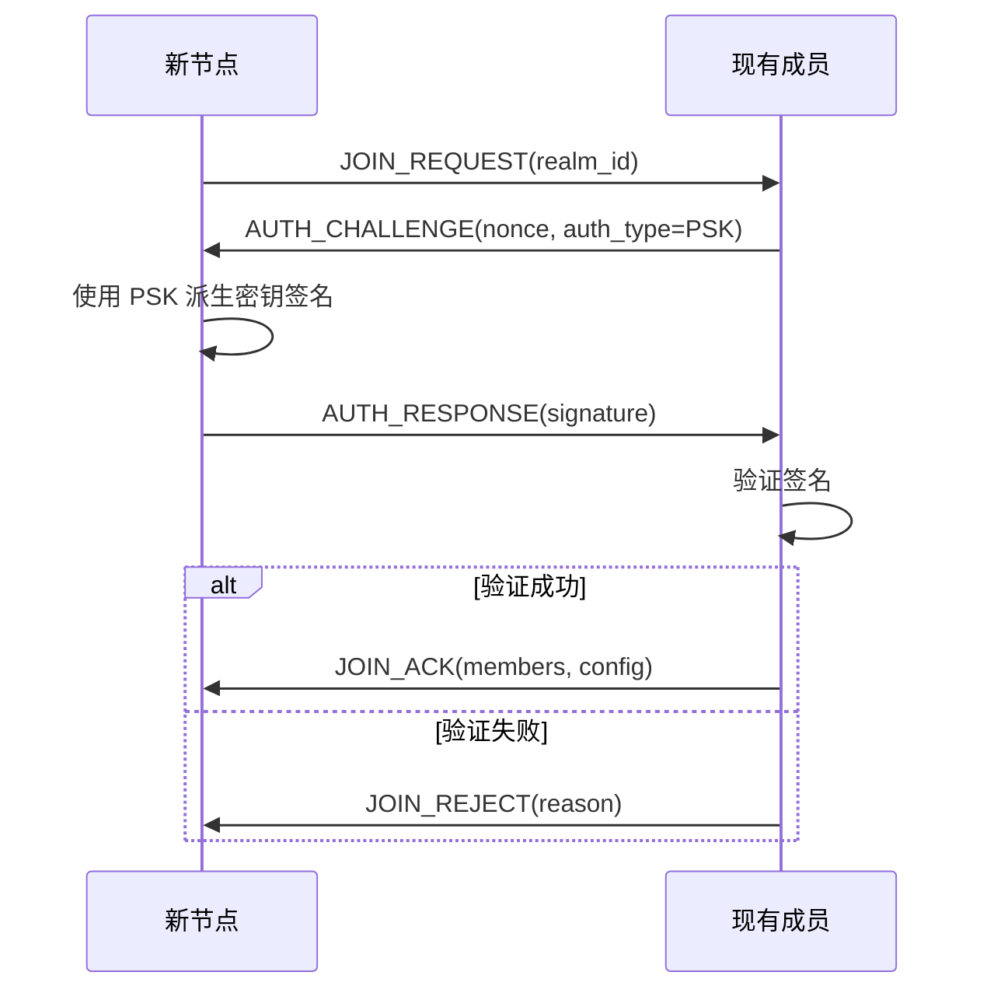
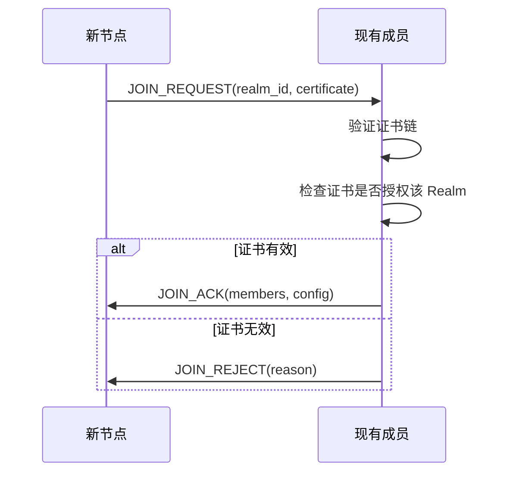
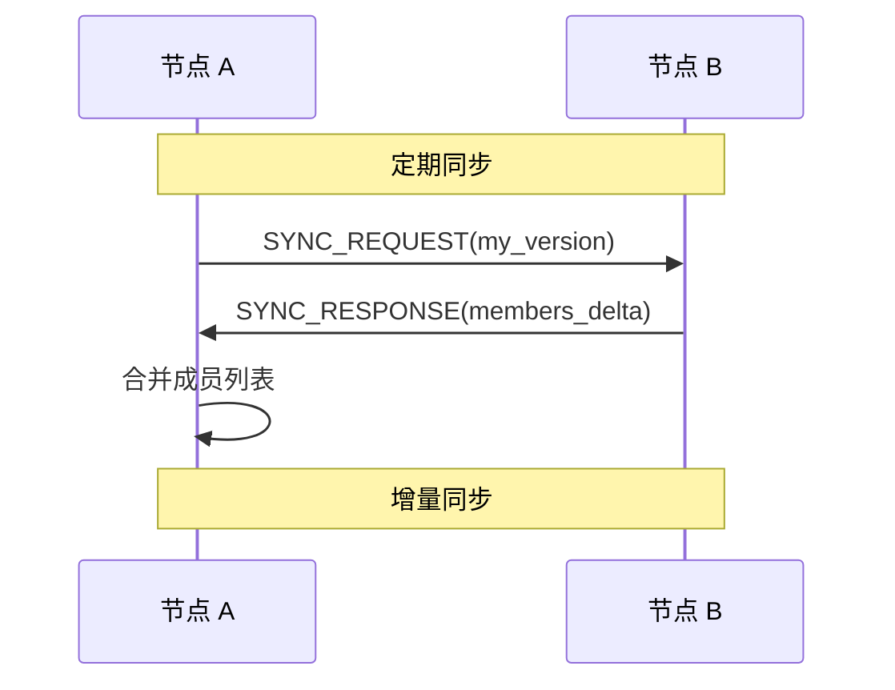
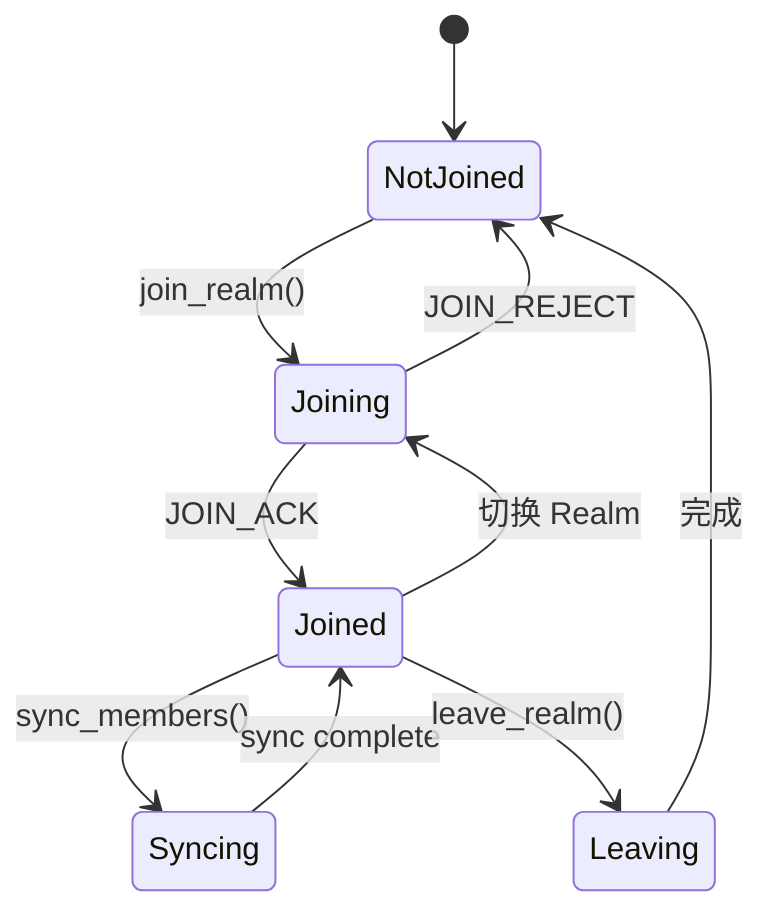

# Realm 协议规范

> 定义 DeP2P 的 Realm 管理协议

---

## 概述

Realm 是 DeP2P 的隔离域概念，提供成员管理和访问控制。



---

## 协议 ID

Realm 协议**嵌入 RealmID**，实现协议级别的显式隔离：

| 协议 | ID 格式 | 说明 |
|------|---------|------|
| 加入 | `/dep2p/realm/<realmID>/join/1.0.0` | 请求加入 Realm |
| 认证 | `/dep2p/realm/<realmID>/auth/1.0.0` | 成员认证 |
| 同步 | `/dep2p/realm/<realmID>/sync/1.0.0` | 成员列表同步 |
| 路由 | `/dep2p/realm/<realmID>/route/1.0.0` | 域内消息路由 |
| 成员列表 | `/dep2p/realm/<realmID>/memberlist/1.0.0` | Gossip 成员发现 |

---

## "仅 ID 连接"支持

### 概述

Realm 提供 `Connect()` 方法支持"仅 ID 连接"，即使用纯 NodeID 连接而无需预先知道地址。

> DHT 是权威目录，Relay 地址簿是缓存加速层

```
┌─────────────────────────────────────────────────────────────────────────────┐
│                    realm.Connect(ctx, targetNodeID)                          │
├─────────────────────────────────────────────────────────────────────────────┤
│                                                                             │
│  三层架构                                                                   │
│  Layer 1: DHT（权威目录） — 存储签名 PeerRecord                             │
│  Layer 2: 缓存加速层 — Peerstore / MemberList / Relay 地址簿                │
│  Layer 3: 连接策略 — 直连 → 打洞 → Relay 兜底                               │
│                                                                             │
│  1. 地址发现（系统自动完成）                                                │
│     • 优先级 1: Peerstore 本地缓存                                          │
│     • 优先级 2: MemberList 成员列表                                         │
│     • 优先级 3: DHT 查询（权威来源）                                        │
│     • 优先级 4: Relay 地址簿查询（缓存回退）                                │
│                                                                             │
│  2. 连接尝试（优先级顺序）                                                   │
│     • 直接连接 → NAT 打洞 → Relay 保底                                      │
│                                                                             │
│  3. 返回                                                                     │
│     • 成功：已建立的连接                                                    │
│     • 失败：错误原因                                                        │
│                                                                             │
└─────────────────────────────────────────────────────────────────────────────┘
```

### "仅 ID 连接"边界（INV-004）

```
┌─────────────────────────────────────────────────────────────────────────────┐
│                    "仅 ID 连接"的严格边界                                     │
├─────────────────────────────────────────────────────────────────────────────┤
│                                                                             │
│  关键认知：Realm 是业务边界，"仅 ID 连接"严格限制在 Realm 内                │
│                                                                             │
│  Realm 内（✅ 允许"仅 ID 连接"）                                            │
│  ═══════════════════════════════                                            │
│  realm.Connect(ctx, targetNodeID)   ← ✅ 允许                               │
│                                                                             │
│  跨 Realm / 节点级（❌ 禁止"仅 ID 连接"）                                   │
│  ═══════════════════════════════════════                                    │
│  node.Connect(ctx, targetNodeID)    ← ❌ 返回 ErrAddressRequired           │
│  node.Connect(ctx, multiaddr)       ← ✅ 必须提供地址                       │
│                                                                             │
│  原因：                                                                      │
│  • 无共享的发现机制                                                         │
│  • 无共享的 Relay 保底                                                      │
│  • 无信任基础                                                               │
│                                                                             │
│  这是刻意的设计限制，体现 Realm 作为业务边界的核心理念                      │
│                                                                             │
└─────────────────────────────────────────────────────────────────────────────┘
```

---

## Realm 组件

### 组件架构

```
┌─────────────────────────────────────────────────────────────────────────────┐
│                              Realm 组件                                      │
├─────────────────────────────────────────────────────────────────────────────┤
│                                                                             │
│  ┌───────────┐ ┌───────────┐ ┌───────────┐ ┌───────────┐ ┌───────────┐     │
│  │ Lifecycle │ │   Auth    │ │  Members  │ │  Routing  │ │  Gateway  │     │
│  │ 生命周期  │ │ 认证器    │ │ 成员管理  │ │ 域内路由  │ │ 跨域网关  │     │
│  └───────────┘ └───────────┘ └───────────┘ └───────────┘ └───────────┘     │
│                                                                             │
│  Lifecycle: 管理 Realm 的创建、加入、离开、销毁                             │
│  Auth:      支持 PSK、证书、自定义认证器                                    │
│  Members:   成员发现、缓存、同步                                            │
│  Routing:   域内消息路由和转发                                              │
│  Gateway:   跨域通信网关（可选）                                            │
│                                                                             │
└─────────────────────────────────────────────────────────────────────────────┘
```

---

## Realm 标识

### RealmID 格式

```
RealmID 格式：

  长度：32 字节
  编码：Base58（约 44 字符）
  
  派生规则：
    RealmID = HKDF(
      ikm:    PSK,
      salt:   "dep2p-realm-id-v1",
      info:   realm_name,
      length: 32
    )
```

> **重要**：RealmID 从 PSK 派生，确保同一 PSK 产生相同的 RealmID。

### RealmKey 派生

```
RealmKey 派生伪代码：

  FUNCTION derive_realm_key(psk, realm_id)
    // HKDF 派生
    realm_key = hkdf_expand(
      salt: realm_id,
      ikm: psk,
      info: "dep2p realm key",
      length: 32
    )
    RETURN realm_key
  END
```

---

## 认证方式

DeP2P 支持多种 Realm 认证方式：

### 认证类型

| 类型 | 说明 | 适用场景 |
|------|------|----------|
| **PSK** | 预共享密钥 | 简单场景，快速部署 |
| **证书** | X.509 证书 | 企业级，需要 CA |
| **自定义** | 自定义认证器 | 特殊需求 |

### PSK 认证流程



### 证书认证流程



### 自定义认证器

```
自定义认证器接口：

  INTERFACE Authenticator
    // 生成挑战
    FUNCTION GenerateChallenge(realm_id) -> Challenge
    
    // 验证响应
    FUNCTION VerifyResponse(challenge, response) -> bool
    
    // 创建凭证
    FUNCTION CreateCredential(realm_id) -> Credential
  END
```

---

## 加入协议

### 加入消息

```
JOIN_REQUEST 消息：

  ┌────────────────────────────────────────────────────────┐
  │  Type (1)  │  RealmID (32)  │  NodeID (32)            │
  │  AuthType (1)  │  Credential [...]                     │
  └────────────────────────────────────────────────────────┘
  
  AuthType: 0=PSK, 1=Certificate, 2=Custom

JOIN_ACK 消息：

  ┌────────────────────────────────────────────────────────┐
  │  Type (1)  │  Success (1)  │  Reason (string)          │
  │  MemberCount (2)  │  Members [...]                     │
  └────────────────────────────────────────────────────────┘
  
  Members 编码格式（每个成员）：
  ┌────────────────────────────────────────────────────────┐
  │  PeerID (string)  │  RealmID (string)  │  Role (1)    │
  │  Online (1)  │  AddrCount (2)  │  Addrs [...]         │
  └────────────────────────────────────────────────────────┘
  
  Members 包含成员地址列表，用于初始同步
```

### 加入伪代码

> 详见 [DHT-Realm 架构重构方案](../../../_discussions/20260126-dht-realm-architecture-redesign.md)

```
加入 Realm 伪代码（先发布后发现）：

  FUNCTION join_realm(psk)
    // 1. 派生 RealmID
    realm_id = HKDF(psk, "dep2p-realm-id")
    
    // 2. 检查当前状态（单 Realm 模式）
    IF current_realm != nil THEN
      leave_realm(current_realm)
    END
    
    // 3. 立即发布 Provider（无需入口节点）
    provider_key = "/dep2p/v2/realm/" + H(realm_id) + "/members"
    dht.Provide(provider_key, self_id)
    
    // 4. 发布 PeerRecord
    record = build_signed_realm_peer_record(realm_id)
    peer_key = "/dep2p/v2/realm/" + H(realm_id) + "/peer/" + self_id
    dht.Put(peer_key, record)
    
    // 5. 设置当前 Realm（立即返回，不阻塞）
    set_current_realm(realm_id, {}, config)
    
    // 6. 启动后台发现循环（goroutine）
    GO discovery_loop(realm_id, psk)
    
    RETURN ok
  END
  
  FUNCTION discovery_loop(realm_id, psk)
    backoff = 2s  // 初始退避
    max_backoff = 60s
    
    LOOP
      // 查询 Provider
      provider_key = "/dep2p/v2/realm/" + H(realm_id) + "/members"
      providers = dht.FindProviders(provider_key)
      
      FOR EACH provider IN providers
        IF provider == self_id THEN CONTINUE END
        IF already_authenticated(provider) THEN CONTINUE END
        
        // 获取 PeerRecord
        peer_key = "/dep2p/v2/realm/" + H(realm_id) + "/peer/" + provider
        record = dht.Get(peer_key)
        
        // 连接并认证
        conn = connect(record.addrs)
        IF mutual_psk_auth(conn, psk) THEN
          add_member(provider)
          backoff = 2s  // 成功后重置退避
        END
      END
      
      SLEEP(backoff)
      backoff = MIN(backoff * 2, max_backoff)
    END
  END
```

---

## 同步协议

### 成员同步

成员同步协议用于保持 Realm 成员列表的一致性。

⚠️ **实现方式**：
- 成员同步通过 **GossipSub PubSub Topic** 实现，而非独立的请求-响应协议
- Topic 名称：`/dep2p/realm/<realmID>/members`（Realm 作用域隔离）
  - 旧格式 `__sys__/members` 已废弃
- 消息类型：`join2:`（加入公告）、`sync2:`（全量同步）
- Topic 天然隔离：不同 Realm 使用不同 Topic，无需应用层过滤
- 基于 Discovery 的发现：节点启动时向 Rendezvous 注册，支持跨网段发现



### 同步消息

```
SYNC_REQUEST 消息：

  ┌────────────────────────────────────────────────────────┐
  │  Type (1)  │  RealmID (32)  │  Version (8)            │
  └────────────────────────────────────────────────────────┘

SYNC_RESPONSE 消息：

  ┌────────────────────────────────────────────────────────┐
  │  Type (1)  │  Version (8)  │  AddCount (4)            │
  │  Added [...]  │  RemoveCount (4)  │  Removed [...]    │
  └────────────────────────────────────────────────────────┘
```

### 同步策略

```
同步策略伪代码：

  FUNCTION sync_members()
    // 选择同步对象（随机选择几个成员）
    peers = select_random_members(3)
    
    FOR EACH peer IN peers
      response = send_sync_request(peer, local_version)
      
      IF response.version > local_version THEN
        // 应用增量
        apply_member_delta(response.added, response.removed)
        local_version = response.version
      END
    END
  END
  
  // 定期执行
  SCHEDULE sync_members() EVERY 30s
```

---

## 路由协议

### 域内路由

路由协议用于在 Realm 内部转发消息。

```
路由消息格式：

  ┌────────────────────────────────────────────────────────┐
  │  Type (1)  │  SrcID (32)  │  DstID (32)               │
  │  TTL (1)   │  Payload [...]                           │
  └────────────────────────────────────────────────────────┘
```

### 路由伪代码

```
路由伪代码：

  FUNCTION route_message(msg)
    IF msg.dst == local_id THEN
      // 本地处理
      handle_message(msg)
      RETURN
    END
    
    IF msg.ttl == 0 THEN
      // TTL 耗尽
      RETURN error("TTL expired")
    END
    
    // 查找下一跳
    next_hop = find_next_hop(msg.dst)
    
    IF next_hop != nil THEN
      msg.ttl -= 1
      forward_message(next_hop, msg)
    ELSE
      // 无法路由
      RETURN error("no route to destination")
    END
  END
```

---

## 状态管理

### Realm 状态

```
Realm 状态结构：

  RealmState = {
    realm_id: bytes,
    auth_type: AuthType,
    credential: Credential,
    members: [
      { node_id: bytes, addrs: [...], last_seen: timestamp, role: Role },
      ...
    ],
    version: uint64,
    joined_at: timestamp,
    relay: RelayInfo,
    config: RealmConfig,
  }
```

### 状态转换



---

## 中继连接处理

> 以下要求来自 2026-01-22 Bootstrap/Relay 拆分部署测试，详见 [测试计划](../../../_discussions/20260122-split-infra-test-plan.md)

### RemotePeer 身份问题（BUG-14/17）

```
┌─────────────────────────────────────────────────────────────────────────────┐
│                    中继连接的 RemotePeer 问题                                 │
├─────────────────────────────────────────────────────────────────────────────┤
│                                                                             │
│  问题场景：                                                                  │
│    WiFi (GGJgPFyQ) ──→ Relay (8QmeKhG3) ──→ 4G (C1Qmo9Mf)                  │
│                                                                             │
│  4G 收到认证流时：                                                           │
│    stream.Conn().RemotePeer() = 8QmeKhG3 (Relay)  ← 错误！                 │
│    期望值 = GGJgPFyQ (WiFi)                                                 │
│                                                                             │
│  影响：                                                                      │
│    1. auth.go 获取的 remotePeer 是 Relay 的 ID                              │
│    2. 认证成功后回调传入 Relay ID                                            │
│    3. Realm 把 Relay 当成已认证成员，WiFi 不在列表中                         │
│    4. /peers 看不到真正对端，/msg 发送失败                                   │
│                                                                             │
│  解决方案：                                                                  │
│    认证流程必须从消息体解析真实 PeerID，而非依赖连接属性                       │
│                                                                             │
└─────────────────────────────────────────────────────────────────────────────┘
```

### 认证流程修正

```
认证流程修正伪代码：

  FUNCTION handle_auth_request(stream)
    // ❌ 错误：直接使用连接的 RemotePeer
    // remote_peer = stream.Conn().RemotePeer()
    
    // ✅ 正确：从认证请求消息体解析 PeerID
    request = read_auth_request(stream)
    remote_peer = request.NodeID
    
    // 验证消息签名确保 PeerID 真实性
    IF NOT verify_signature(request, remote_peer) THEN
      RETURN error("signature verification failed")
    END
    
    // 继续认证流程
    ...
  END
  
  FUNCTION HandleChallenge(stream, request) -> (peer.ID, error)
    // 返回从消息解析的真实 PeerID
    RETURN request.NodeID, nil
  END
```

### 连接事件处理（BUG-16）

```
┌─────────────────────────────────────────────────────────────────────────────┐
│                    连接事件处理要求                                           │
├─────────────────────────────────────────────────────────────────────────────┤
│                                                                             │
│  问题：handleConnectionEvents 因 disconnSub 为 nil 而退出                    │
│                                                                             │
│  要求：                                                                      │
│    FUNCTION handleConnectionEvents()                                        │
│      // 必须检查 nil                                                        │
│      IF m.disconnSub == nil THEN                                            │
│        log.warn("disconnSub is nil, exiting event handler")                 │
│        RETURN                                                               │
│      END                                                                    │
│      ...                                                                    │
│    END                                                                      │
│                                                                             │
└─────────────────────────────────────────────────────────────────────────────┘
```

### 基础设施节点跳过认证

```
┌─────────────────────────────────────────────────────────────────────────────┐
│                    基础设施节点认证跳过                                       │
├─────────────────────────────────────────────────────────────────────────────┤
│                                                                             │
│  基础设施节点（Bootstrap/Relay）不参与 Realm 成员体系                        │
│  对这些节点跳过 Realm 认证，避免不必要的认证尝试和失败日志                     │
│                                                                             │
│  实现：                                                                      │
│    // ManagerConfig 中添加 InfrastructurePeers 配置                         │
│    type ManagerConfig struct {                                              │
│      InfrastructurePeers []peer.ID  // 基础设施节点列表                      │
│    }                                                                        │
│                                                                             │
│    // handleConnectionEvents 中跳过                                         │
│    FUNCTION handleConnectionEvents()                                        │
│      FOR EACH event IN connection_events                                    │
│        peer_id = event.RemotePeer()                                         │
│                                                                             │
│        IF is_infrastructure_peer(peer_id) THEN                              │
│          log.debug("跳过基础设施节点认证", "peer", peer_id)                   │
│          CONTINUE                                                           │
│        END                                                                  │
│                                                                             │
│        // 对非基础设施节点执行认证                                            │
│        authenticate(peer_id)                                                │
│      END                                                                    │
│    END                                                                      │
│                                                                             │
│  InfrastructurePeers 来源：                                                  │
│    - 从 Bootstrap.Peers 提取                                                │
│    - 从 RelayAddr 提取                                                     │
│                                                                             │
└─────────────────────────────────────────────────────────────────────────────┘
```

---

## ★ 成员状态与连接状态绑定 (v1.1 新增, v1.2 修正)

> 详见 [INV-003 连接即成员](../../../01_context/decisions/invariants/INV-003-connection-membership.md)

### 核心原则

```
成员可见性 = (有活跃连接 ∨ 由可信成员广播) ∧ 通过 PSK 认证

等价表述：
  1. 信任链传递：已认证成员广播的其他成员信息应被信任
  2. 断开即离开：连接断开时，成员状态必须同步更新为离线
  3. 多重保护：断开保护期 + 防误判机制防止竞态重新添加
```

> ⚠️ **v1.2 修正 (BUG-34.1)**：原"有连接才能是成员"设计过于严格，
> 阻止了正常的 PubSub 成员同步，已移除"必须有活跃连接"检查。

### 添加成员约束

```
MemberManager.Add() 约束：

  1. 检查防误判机制（震荡检测、断开保护期）
     ─────────────────────────────────────────
     IF antiFalsePositive.ShouldRejectAdd(peerID) THEN
       RETURN nil  // 静默忽略
     END

  2. 检查断开保护期
     ─────────────────
     IF recentlyDisconnected[peerID] EXISTS THEN
       IF time.Since(disconnectTime) < DisconnectProtection THEN
         RETURN nil  // 静默忽略
       END
     END
     
  ★ BUG-34.1 修正：移除"必须有活跃连接"检查
  ─────────────────────────────────────────────
  原因：成员同步通过 PubSub 广播传递，A 通过 B 收到 C 的信息，
        A 与 C 可能没有直接连接，但 C 是合法成员。
  保护机制：
    1. 断开保护期 - 已断开的成员在保护期内不会被重新添加
    2. 防误判机制 - 震荡检测 + 宽限期
    3. PubSub 验证 - 只接受来自已知成员的广播
     
  3. 正常添加流程
     ─────────────────
     ...
```

### 断开保护期

```
目的: 防止 PubSub/DHT 缓存数据导致刚断开的成员被重新添加

机制:
  1. 检测到断开时，记录 peerID 到 recentlyDisconnected 列表
  2. Add() 时检查是否在保护期内
  3. 保护期内的 Add() 被静默忽略
  4. 保护期默认 30s，超时后自动清理

配置参数:
  | 参数 | 默认值 | 说明 |
  |------|--------|------|
  | DisconnectProtection | 30s | 断开保护期时长 |
  | ReconnectGracePeriod | 15s | 重连宽限期时长 |
```

### 重连宽限期

```
状态转换:
  CONNECTED ─(断开)─▶ DISCONNECTING ─(15s超时)─▶ DISCONNECTED
                           │
                           └─(重连成功)─▶ CONNECTED

说明:
  - 断开后进入 DISCONNECTING 状态
  - DISCONNECTING 期间成员仍被视为"在线"
  - 15s 内重连成功，状态恢复为 CONNECTED
  - 15s 超时，状态变为 DISCONNECTED，移除成员
```

---

## 错误处理

### 错误码

| 错误码 | 说明 |
|--------|------|
| ERR_ALREADY_JOINED | 已加入该 Realm |
| ERR_AUTH_FAILED | 认证失败 |
| ERR_INVALID_CREDENTIAL | 凭证无效 |
| ERR_REALM_NOT_FOUND | Realm 不存在 |
| ERR_NOT_MEMBER | 不是成员 |
| ERR_SYNC_FAILED | 同步失败 |
| ERR_ROUTE_FAILED | 路由失败 |
| ERR_TIMEOUT | 操作超时 |
| ERR_PROTOCOL_NEGOTIATION_EOF | 协议协商 EOF（中继连接问题） |
| ERR_DISCONNECT_PROTECTION | 在断开保护期内，拒绝添加 |

---

## 相关文档

- [命名空间规范](../namespace.md)
- [消息协议](messaging.md)
- [发布订阅](pubsub.md)
- [流协议](streams.md)
- [存活检测](liveness.md)
- [断开检测流程](../../../03_architecture/L3_behavioral/disconnect_detection.md)
- [ADR-0002 Realm 隔离](../../../01_context/decisions/ADR-0002-realm-isolation.md)
- [ADR-0012 断开检测架构](../../../01_context/decisions/ADR-0012-disconnect-detection.md)
- [INV-002 Realm 成员资格](../../../01_context/decisions/invariants/INV-002-realm-membership.md)
- [INV-003 连接即成员](../../../01_context/decisions/invariants/INV-003-connection-membership.md)

---

**最后更新**：2026-01-29（BUG-34.1 修正：移除必须有活跃连接检查）
