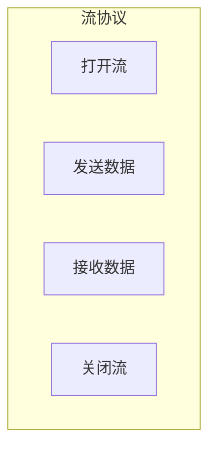
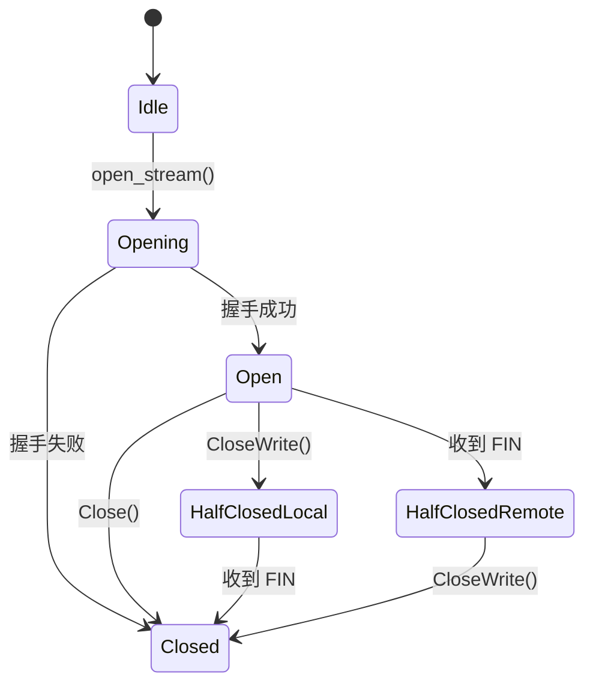
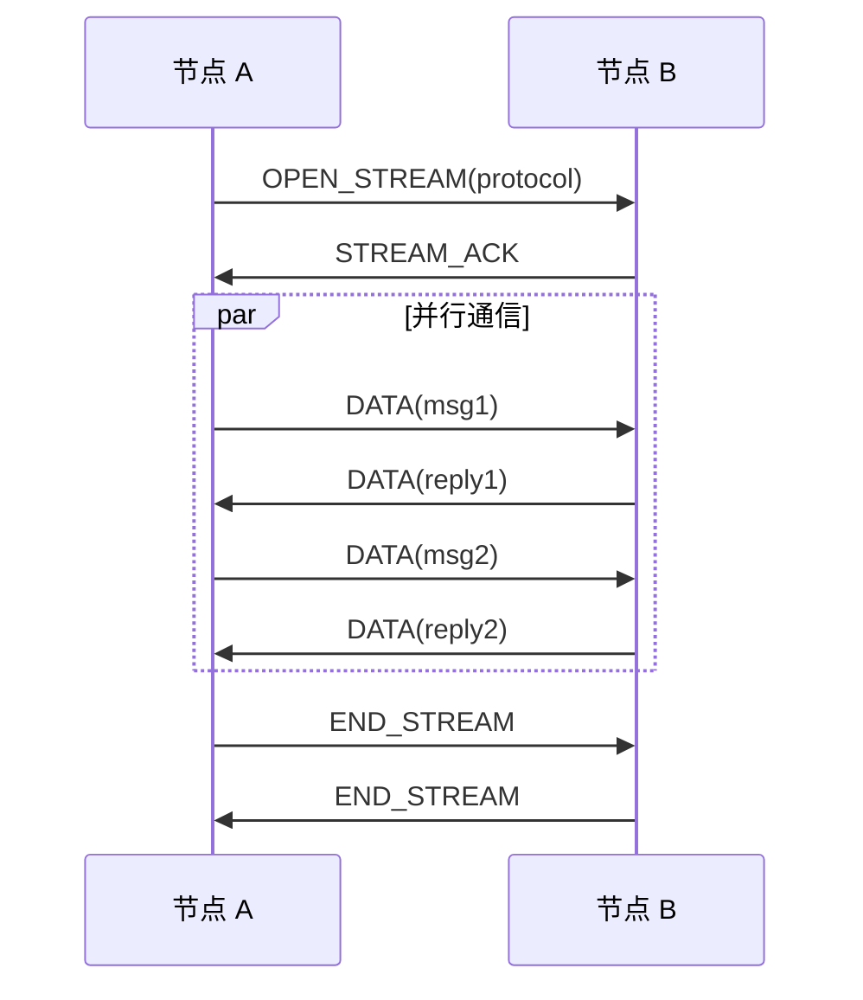
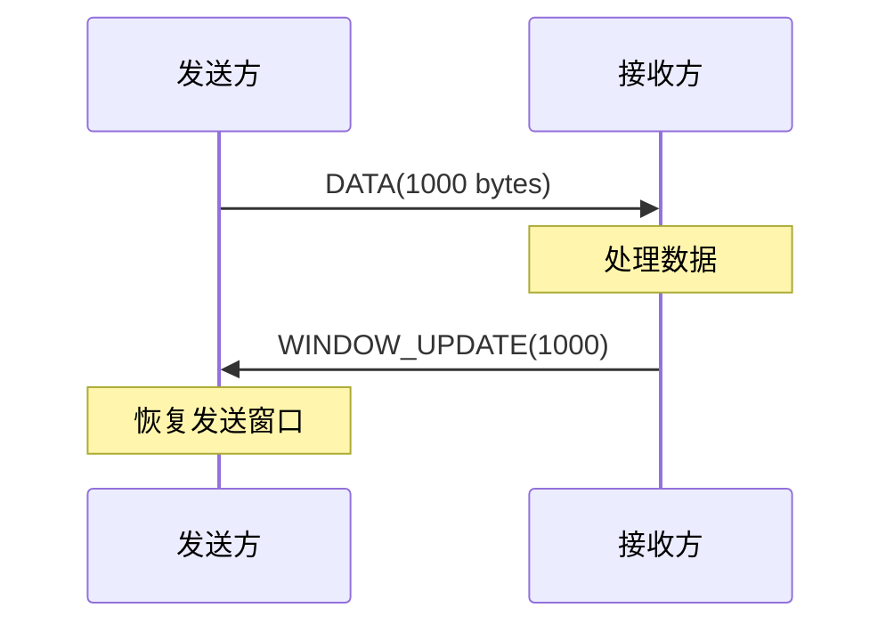

# 流协议规范

> 定义 DeP2P 的双向流协议

---

## 概述

流协议提供节点间的持久双向通信能力，适用于需要持续数据交换的场景。



---

## 协议 ID

| 协议 | ID | 说明 |
|------|-----|------|
| 流协议 | `/dep2p/app/streams/1.0.0` | 双向流协议 |

---

## 流类型

### 支持的流类型

| 类型 | 说明 | 适用场景 |
|------|------|----------|
| **单向流** | 单向数据传输 | 日志推送、文件上传 |
| **双向流** | 双向数据交换 | 实时通信、游戏 |
| **服务端流** | 请求后多响应 | 数据同步、监控 |
| **客户端流** | 多请求后响应 | 批量处理 |

---

## 流生命周期

### 状态转换



### 半关闭能力

半关闭是实现请求-响应模式的关键能力。发送方使用 `CloseWrite()` 表示请求发送完毕，但仍可以接收响应。

```
半关闭方法：

  CloseWrite()  // 关闭写端，发送 FIN，仍可读取
  CloseRead()   // 关闭读端，停止接收数据
  Close()       // 完全关闭（等同于 CloseWrite + CloseRead）
```

**典型用法**：

```
请求-响应模式：

  // 发送方
  stream.Write(request)
  stream.CloseWrite()      // ★ 关键：表示请求结束
  response = stream.Read() // 等待响应
  stream.Close()
  
  // 接收方
  request = stream.Read()  // 读取直到 EOF (对方 CloseWrite)
  process(request)
  stream.Write(response)
  stream.Close()
```

**修复前的问题**：
- `Stream` 接口缺少 `CloseWrite()` 方法
- 使用 `Close()` 替代会完全关闭流，导致无法接收响应
- 跨机器私聊失败，接收方报 `error=EOF`

### 生命周期伪代码

```
流生命周期伪代码：

  FUNCTION open_stream(peer_id, protocol)
    // 验证 Realm 成员资格
    IF NOT is_same_realm(peer_id) THEN
      RETURN error("ErrNotMember")
    END
    
    // 获取连接
    conn = get_or_create_connection(peer_id)
    
    // 打开新流
    stream = conn.open_stream()
    
    // 发送协议协商
    stream.write_protocol(protocol)
    
    // 等待确认
    ack = stream.read_ack(timeout = 10s)
    
    IF ack.success THEN
      RETURN stream
    ELSE
      stream.close()
      RETURN error(ack.reason)
    END
  END
```

---

## 消息格式

### 流帧格式

```
流帧格式：

  ┌─────────────────────────────────────────────────────────┐
  │  Type (1)  │  Flags (1)  │  StreamID (4)  │  Length (4) │
  │  Payload [...]                                           │
  └─────────────────────────────────────────────────────────┘
```

### 帧类型

```
帧类型定义：

  DATA         = 0x00  // 数据帧
  HEADERS      = 0x01  // 头部帧
  RST_STREAM   = 0x02  // 重置流
  WINDOW_UPDATE = 0x03  // 窗口更新
  PING         = 0x04  // 心跳
```

### 标志位

```
标志位定义：

  FLAG_END_STREAM   = 0x01  // 流结束
  FLAG_END_HEADERS  = 0x04  // 头部结束
  FLAG_PADDED       = 0x08  // 有填充
```

---

## 双向流

### 流程



### 双向流伪代码

```
双向流伪代码：

  FUNCTION bidirectional_stream(peer_id, handler)
    stream = open_stream(peer_id, "/dep2p/app/streams/1.0.0")
    DEFER stream.close()
    
    // 启动读取协程
    GO read_loop(stream, handler)
    
    // 返回写入接口
    RETURN StreamWriter{
      send: func(data) { stream.write(DATA, data) },
      close: func() { stream.write(END_STREAM, nil) },
    }
  END
  
  FUNCTION read_loop(stream, handler)
    WHILE true
      frame = stream.read()
      
      SWITCH frame.type
        CASE DATA:
          handler.on_data(frame.payload)
          
        CASE END_STREAM:
          handler.on_close()
          RETURN
          
        CASE RST_STREAM:
          handler.on_error(frame.error_code)
          RETURN
      END
    END
  END
```

---

## 流量控制

### 窗口机制

```
流量控制伪代码：

  CONST INITIAL_WINDOW_SIZE = 65535
  CONST MAX_WINDOW_SIZE = 2147483647
  
  TYPE FlowController
    send_window: int
    recv_window: int
  END
  
  FUNCTION (fc *FlowController) can_send(size int) bool
    RETURN fc.send_window >= size
  END
  
  FUNCTION (fc *FlowController) consume_send(size int)
    fc.send_window -= size
  END
  
  FUNCTION (fc *FlowController) update_recv(size int)
    fc.recv_window += size
    send_window_update(size)
  END
```

### 窗口更新



---

## 错误处理

### 错误码

| 错误码 | 说明 |
|--------|------|
| NO_ERROR | 无错误 |
| PROTOCOL_ERROR | 协议错误 |
| INTERNAL_ERROR | 内部错误 |
| FLOW_CONTROL_ERROR | 流量控制错误 |
| STREAM_CLOSED | 流已关闭 |
| FRAME_SIZE_ERROR | 帧大小错误 |
| REFUSED_STREAM | 拒绝流 |
| CANCEL | 取消 |

### 错误处理伪代码

```
错误处理伪代码：

  FUNCTION handle_stream_error(stream, err)
    SWITCH err.code
      CASE FLOW_CONTROL_ERROR:
        // 等待窗口更新
        wait_window_update(stream)
        
      CASE STREAM_CLOSED:
        // 流已关闭，清理资源
        cleanup_stream(stream)
        
      CASE PROTOCOL_ERROR:
        // 协议错误，关闭连接
        close_connection(stream.conn)
        
      DEFAULT:
        // 发送重置帧
        send_rst_stream(stream, err.code)
    END
  END
```

---

## 超时控制 ★

### 超时配置

| 场景 | 默认超时 | 说明 |
|------|----------|------|
| 打开流 | 10s | 流建立超时 |
| 空闲流 | 5m | 无数据超时 |
| 读取数据 | 30s | 单次读取超时 |
| 关闭流 | 5s | 优雅关闭超时 |

### Deadline 方法

`Stream` 接口提供完整的超时控制能力：

```
超时控制方法：

  SetDeadline(t Time)       // 设置读写超时
  SetReadDeadline(t Time)   // 设置读取超时
  SetWriteDeadline(t Time)  // 设置写入超时
  
  // 清除超时（使用零值 Time）
  stream.SetDeadline(Time{})
```

**典型用法**：

```
带超时的请求-响应：

  // 设置 10 秒写入超时
  stream.SetWriteDeadline(now() + 10s)
  stream.Write(request)
  stream.CloseWrite()
  
  // 设置 30 秒读取超时
  stream.SetReadDeadline(now() + 30s)
  response, err = stream.Read()
  IF err == TIMEOUT THEN
    handle_timeout()
  END
```

---

## ★ 流与连接/电路的关系 (v0.2.26)

### 核心原则

流的生命周期**独立于**连接/电路的生命周期。

```
┌─────────────────────────────────────────────────────────────────────────────────┐
│                    流与连接/电路的关系                                           │
├─────────────────────────────────────────────────────────────────────────────────┤
│                                                                                 │
│  核心不变量：                                                                    │
│  ══════════                                                                     │
│                                                                                 │
│  1. 流的 CloseWrite() 只影响该流                                                 │
│     stream.CloseWrite()  →  对端 Read() 返回 EOF                               │
│     连接/电路状态不变，其他流不受影响                                            │
│                                                                                 │
│  2. 流的 Close() 只影响该流                                                      │
│     stream.Close()  →  该流完全关闭                                             │
│     连接/电路状态不变，可以继续 OpenStream()                                     │
│                                                                                 │
│  3. 连接/电路的 Close() 关闭所有流                                               │
│     conn.Close()  →  所有流收到 EOF/Reset                                      │
│                                                                                 │
└─────────────────────────────────────────────────────────────────────────────────┘
```

### 直连场景

```
直连时流与连接的关系：

  ┌─────────────────────────────────────────┐
  │  QUIC Connection                        │
  │                                          │
  │  ┌──────────┐ ┌──────────┐ ┌──────────┐ │
  │  │ Stream 1 │ │ Stream 2 │ │ Stream N │ │
  │  │ (closed) │ │ (active) │ │ (active) │ │
  │  └──────────┘ └──────────┘ └──────────┘ │
  │                                          │
  │  Stream 1 关闭 → 连接仍然活跃              │
  │  可以继续打开 Stream N+1                   │
  └─────────────────────────────────────────┘
```

### 中继电路场景

```
中继时流与电路的关系：

  ┌─────────────────────────────────────────┐
  │  RelayCircuit (通过 Muxer)               │
  │                                          │
  │  ┌──────────┐ ┌──────────┐ ┌──────────┐ │
  │  │ Stream 1 │ │ Stream 2 │ │ Stream N │ │
  │  │ (chat)   │ │ (pubsub) │ │ (dht)    │ │
  │  └──────────┘ └──────────┘ └──────────┘ │
  │                                          │
  │  Chat 流关闭 → 电路仍然活跃                │
  │  PubSub/DHT 继续正常工作                  │
  │  可以继续打开新的 Chat 流                  │
  └─────────────────────────────────────────┘
```

### 错误的做法 vs 正确的做法

| 场景 | 错误做法 | 正确做法 |
|------|---------|---------|
| 协议处理完成 | `stream.Close()` 导致连接失效 | 流关闭不影响连接/电路 |
| 需要新通信 | 重新建立连接/电路 | 调用 `conn.OpenStream()` |
| 检查可用性 | 检查单流状态 | 检查连接/电路状态 |

详见 [ADR-0011 中继电路多路复用架构](../../../01_context/decisions/ADR-0011-relay-circuit-muxer.md)。

---

## 相关文档

- [消息协议](messaging.md)
- [Realm 协议](realm.md)
- [存活检测](liveness.md)
- [QUIC 传输](../L2_transport/quic.md)
- [Relay 中继协议](../L2_transport/relay.md)
- [ADR-0011 中继电路多路复用架构](../../../01_context/decisions/ADR-0011-relay-circuit-muxer.md)
- [REQ-TRANS-003 流多路复用](../../../01_context/requirements/functional/F2_transport/REQ-TRANS-003.md)

---

**最后更新**：2026-01-27
