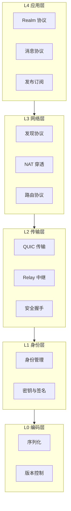

# 协议规范 (Protocol Specifications)

> DeP2P 网络协议栈的完整规范

---

## 协议分层

DeP2P 协议规范采用 **L0-L4 五层协议栈**：



> **注意**：协议规范层次 (L0-L4) 与软件架构层次 (五层) 是不同维度的分层。

---

## 目录结构

```
protocol/
├── README.md                    # 本文件
├── SPEC_INDEX.md                # 规范索引
│
├── L0_encoding/                 # 编码规范
│   ├── README.md
│   ├── serialization.md         # 序列化格式
│   ├── byte_order.md            # 字节序规范
│   └── versioning.md            # 版本号规范
│
├── L1_identity/                 # 身份规范
│   ├── README.md
│   ├── key_format.md            # 密钥格式
│   ├── nodeid.md                # NodeID 计算
│   └── signature.md             # 签名算法
│
├── L2_transport/                # 传输层协议
│   ├── README.md
│   ├── quic.md                  # QUIC 传输协议
│   ├── relay.md                 # Relay 中继协议（统一 Relay）
│   └── security.md              # 安全握手协议
│
├── L3_network/                  # 网络层协议
│   ├── README.md
│   ├── discovery.md             # 发现协议
│   ├── nat.md                   # NAT 穿透
│   └── routing.md               # 路由协议
│
└── L4_application/              # 应用层协议
    ├── README.md
    ├── realm.md                 # Realm 协议
    ├── messaging.md             # 消息协议
    └── pubsub.md                # 发布订阅协议
```

---

## 协议命名规范

DeP2P 协议按访问控制需求分为 **三类**，通过协议前缀进行区分：

### 协议分类

| 类别 | 协议前缀 | 需要 Realm | 说明 |
|------|---------|-----------|------|
| **系统协议** | `/dep2p/sys/*` | 否 | 基础设施协议，任何节点可用 |
| **Realm 协议** | `/dep2p/realm/<realmID>/*` | 是 | Realm 控制协议 |
| **应用协议** | `/dep2p/app/<realmID>/*` | 是 | 业务应用协议 |

> **关键设计**：Realm 协议和应用协议的路径中 **嵌入 RealmID**，实现协议级别的显式隔离。

### 协议命名格式

```
┌─────────────────────────────────────────────────────────────────────────────┐
│                          协议命名规范                                         │
├─────────────────────────────────────────────────────────────────────────────┤
│                                                                             │
│  系统协议（无需 Realm）                                                      │
│  ─────────────────────                                                      │
│  格式：/dep2p/sys/<protocol>/<version>                                      │
│                                                                             │
│  示例：                                                                     │
│    /dep2p/sys/identify/1.0.0                                               │
│    /dep2p/sys/ping/1.0.0                                                   │
│    /dep2p/relay/1.0.0/hop                                                  │
│    /dep2p/relay/1.0.0/stop                                                 │
│                                                                             │
│  ────────────────────────────────────────────────────────────────────────   │
│                                                                             │
│  Realm 协议（嵌入 RealmID）                                                  │
│  ─────────────────────────                                                  │
│  格式：/dep2p/realm/<realmID>/<protocol>/<version>                          │
│                                                                             │
│  示例：                                                                     │
│    /dep2p/realm/QmYwAPJz.../join/1.0.0                                     │
│    /dep2p/realm/QmYwAPJz.../auth/1.0.0                                     │
│                                                                             │
│  ────────────────────────────────────────────────────────────────────────   │
│                                                                             │
│  应用协议（嵌入 RealmID）                                                    │
│  ───────────────────────                                                    │
│  格式：/dep2p/app/<realmID>/<protocol>/<version>                            │
│                                                                             │
│  示例：                                                                     │
│    /dep2p/app/QmYwAPJz.../messaging/1.0.0                                  │
│    /dep2p/app/QmYwAPJz.../pubsub/1.0.0                                     │
│                                                                             │
└─────────────────────────────────────────────────────────────────────────────┘
```

> 说明：Relay 的 HOP/STOP 使用 `/dep2p/relay/1.0.0/*`，作为系统协议特例。

### RealmID 格式

| 属性 | 值 |
|------|-----|
| 长度 | 32 字节 |
| 编码 | Base58（约 44 字符） |
| 派生 | `HKDF(PSK, salt="dep2p-realm-id-v1")` |

---

## 规范索引

### L0: 编码层

| 规范 | 状态 | 说明 |
|------|------|------|
| [serialization.md](L0_encoding/serialization.md) | ✅ | Protobuf + CBOR |
| [byte_order.md](L0_encoding/byte_order.md) | ✅ | 大端序 + varint |
| [versioning.md](L0_encoding/versioning.md) | ✅ | 语义化版本 |

### L1: 身份层

| 规范 | 状态 | 说明 |
|------|------|------|
| [key_format.md](L1_identity/key_format.md) | ✅ | Ed25519 密钥格式 |
| [nodeid.md](L1_identity/nodeid.md) | ✅ | NodeID = SHA256(公钥) |
| [signature.md](L1_identity/signature.md) | ✅ | Ed25519 签名 |

### L2: 传输层

| 规范 | 状态 | 说明 |
|------|------|------|
| [quic.md](L2_transport/quic.md) | ✅ | QUIC 传输规范 |
| [relay.md](L2_transport/relay.md) | ✅ | 统一 Relay，缓存加速层 |
| [security.md](L2_transport/security.md) | ✅ | TLS 1.3 + NodeID 绑定 |

### L3: 网络层

| 规范 | 状态 | 说明 |
|------|------|------|
| [discovery.md](L3_network/discovery.md) | ✅ | DHT/mDNS/Bootstrap/Rendezvous |
| [nat.md](L3_network/nat.md) | ✅ | 打洞/端口映射/AutoNAT |
| [routing.md](L3_network/routing.md) | ✅ | 路径选择 |

### L4: 应用层

| 规范 | 状态 | 说明 |
|------|------|------|
| [realm.md](L4_application/realm.md) | ✅ | Realm 加入/认证（RealmID 嵌入路径） |
| [messaging.md](L4_application/messaging.md) | ✅ | 请求响应/通知 |
| [pubsub.md](L4_application/pubsub.md) | ✅ | GossipSub |

---

## 协议 ID 汇总

### 系统协议 `/dep2p/sys/*`

| 协议 ID | 说明 | 规范文档 |
|---------|------|----------|
| `/dep2p/sys/identify/1.0.0` | 身份识别，交换节点信息 | [L1 身份层](L1_identity/) |
| `/dep2p/sys/identify/push/1.0.0` | 主动推送节点变更 | [L1 身份层](L1_identity/) |
| `/dep2p/sys/ping/1.0.0` | 存活检测，RTT 测量 | - |
| `/dep2p/sys/autonat/1.0.0` | NAT 类型自动检测 | [nat.md](L3_network/nat.md) |
| `/dep2p/sys/holepunch/1.0.0` | NAT 打洞协调 | [nat.md](L3_network/nat.md) |
| `/dep2p/relay/1.0.0/hop` | Relay HOP (Circuit v2) | [relay.md](L2_transport/relay.md) |
| `/dep2p/relay/1.0.0/stop` | Relay STOP (Circuit v2) | [relay.md](L2_transport/relay.md) |
| `/dep2p/sys/dht/1.0.0` | Kademlia DHT | [discovery.md](L3_network/discovery.md) |
| `/dep2p/sys/rendezvous/1.0.0` | 命名空间发现 | [discovery.md](L3_network/discovery.md) |
| `/dep2p/sys/reachability/1.0.0` | 可达性验证 (dial-back) | [nat.md](L3_network/nat.md) |
| `/dep2p/sys/reachability/witness/1.0.0` | 入站见证协议 | [nat.md](L3_network/nat.md) |
| `/dep2p/sys/addr-mgmt/1.0.0` | 地址管理协议 | - |
| `/dep2p/sys/delivery/ack/1.0.0` | 消息投递确认 | - |
| `/dep2p/sys/gateway/relay/1.0.0` | Gateway 中继 | - |
| `/dep2p/sys/heartbeat/1.0.0` | 心跳检测 | - |

### Realm 协议 `/dep2p/realm/<realmID>/*`

| 协议 ID 格式 | 说明 | 规范文档 |
|-------------|------|----------|
| `/dep2p/realm/<id>/join/1.0.0` | 加入域请求 | [realm.md](L4_application/realm.md) |
| `/dep2p/realm/<id>/auth/1.0.0` | 域认证 (PSK/证书) | [realm.md](L4_application/realm.md) |
| `/dep2p/realm/<id>/sync/1.0.0` | 成员同步 | [realm.md](L4_application/realm.md) |
| `/dep2p/realm/<id>/route/1.0.0` | 域内路由 | [realm.md](L4_application/realm.md) |
| `/dep2p/realm/<id>/announce/1.0.0` | 节点能力公告 | [realm.md](L4_application/realm.md) |
| `/dep2p/realm/<id>/addressbook/1.0.0` | 地址簿服务 | [relay.md](L2_transport/relay.md) |

### 应用协议 `/dep2p/app/<realmID>/*`

| 协议 ID 格式 | 说明 | 规范文档 |
|-------------|------|----------|
| `/dep2p/app/<id>/messaging/1.0.0` | 请求/响应模式 | [messaging.md](L4_application/messaging.md) |
| `/dep2p/app/<id>/pubsub/1.0.0` | 发布/订阅 (GossipSub) | [pubsub.md](L4_application/pubsub.md) |
| `/dep2p/app/<id>/streams/1.0.0` | 双向流 | [messaging.md](L4_application/messaging.md) |
| `/dep2p/app/<id>/liveness/1.0.0` | 存活检测服务 | - |

---

## 协议路由规则

DeP2P 的统一 Relay 架构强制执行以下路由规则：

```
┌──────────────────────────────┬──────────────────────────────────┐
│        协议前缀              │              Relay               │
├──────────────────────────────┼──────────────────────────────────┤
│ /dep2p/sys/*                 │ ✅ 允许                          │
│ /dep2p/realm/<realmID>/*     │ ✅ 仅匹配的 ID + 成员验证         │
│ /dep2p/app/<realmID>/*       │ ✅ 仅匹配的 ID + 成员验证         │
└──────────────────────────────┴──────────────────────────────────┘
```

违反规则的请求将被拒绝，Relay 通过协议与成员认证实现隔离。

详见：[relay.md](L2_transport/relay.md)

---

## 设计原则

```
┌─────────────────────────────────────────────────────────────────┐
│                    协议设计原则                                  │
├─────────────────────────────────────────────────────────────────┤
│                                                                 │
│  身份第一                                                       │
│  ────────                                                       │
│  所有连接必须验证身份（INV-001）                                │
│                                                                 │
│  Realm 隔离                                                     │
│  ──────────                                                     │
│  业务 API 需要 Realm 成员资格（INV-002）                        │
│  RealmID 嵌入协议路径，实现协议级隔离                           │
│                                                                 │
│  控制面/数据面统一                                              │
│  ────────────────                                               │
│  Relay 统一承载，通过协议与成员认证隔离                        │
│                                                                 │
│  版本兼容                                                       │
│  ────────                                                       │
│  协议支持向后兼容演进                                           │
│                                                                 │
└─────────────────────────────────────────────────────────────────┘
```

---

## 相关文档

| 文档 | 说明 |
|------|------|
| [完整规范索引](SPEC_INDEX.md) | 所有协议规范索引 |
| [工程标准](../engineering/) | 编码规范和工程标准 |
| [ADR 架构决策](../../01_context/decisions/) | 架构决策记录 |
| [系统不变量](../../01_context/decisions/invariants/) | INV-001/002/003 |

---

## 变更记录

| 日期 | 版本 | 变更内容 |
|------|------|----------|
| 2026-01-27 | 1.0 | 统一规范重构，消除版本分裂 |

---

**最后更新**：2026-01-27
