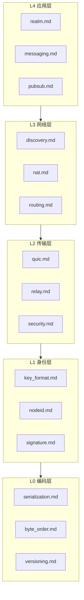

# 协议规范索引

> DeP2P 所有协议规范的完整索引

---

## 规范目录



---

## L0 编码层

| 规范 | 文档 | 状态 | 说明 |
|------|------|------|------|
| 序列化 | [serialization.md](L0_encoding/serialization.md) | ✅ | Protobuf + CBOR |
| 字节序 | [byte_order.md](L0_encoding/byte_order.md) | ✅ | 大端序 + varint |
| 版本控制 | [versioning.md](L0_encoding/versioning.md) | ✅ | 语义化版本 |

---

## L1 身份层

| 规范 | 文档 | 状态 | 说明 |
|------|------|------|------|
| 密钥格式 | [key_format.md](L1_identity/key_format.md) | ✅ | Ed25519 密钥 |
| NodeID | [nodeid.md](L1_identity/nodeid.md) | ✅ | SHA256(公钥) |
| 签名 | [signature.md](L1_identity/signature.md) | ✅ | Ed25519 签名 |

---

## L2 传输层

| 规范 | 文档 | 状态 | 说明 |
|------|------|------|------|
| QUIC 传输 | [quic.md](L2_transport/quic.md) | ✅ | QUIC 传输规范 |
| Relay 中继 | [relay.md](L2_transport/relay.md) | ✅ | 统一 Relay，缓存加速层 |
| 安全握手 | [security.md](L2_transport/security.md) | ✅ | TLS 1.3 + NodeID |

---

## L3 网络层

| 规范 | 文档 | 状态 | 说明 |
|------|------|------|------|
| 发现协议 | [discovery.md](L3_network/discovery.md) | ✅ | DHT/mDNS/Bootstrap/Rendezvous（DHT 权威目录） |
| NAT 穿透 | [nat.md](L3_network/nat.md) | ✅ | 打洞/AutoNAT/端口映射 |
| 路由协议 | [routing.md](L3_network/routing.md) | ✅ | 路径选择 |

---

## L4 应用层

| 规范 | 文档 | 状态 | 说明 |
|------|------|------|------|
| Realm | [realm.md](L4_application/realm.md) | ✅ | 加入/离开/认证 (RealmID 嵌入路径) |
| 消息协议 | [messaging.md](L4_application/messaging.md) | ✅ | 请求响应/通知 |
| 发布订阅 | [pubsub.md](L4_application/pubsub.md) | ✅ | GossipSub |

---

## 协议 ID 索引

### 系统协议 `/dep2p/sys/*`

系统协议是基础设施协议，**无需 Realm 成员资格**，任何节点可用。

| 协议 ID | 规范文档 | 说明 |
|---------|----------|------|
| `/dep2p/sys/identify/1.0.0` | [L1 身份层](L1_identity/) | 身份识别，交换节点信息 |
| `/dep2p/sys/identify/push/1.0.0` | [L1 身份层](L1_identity/) | 主动推送节点变更 |
| `/dep2p/sys/ping/1.0.0` | - | 存活检测，RTT 测量 |
| `/dep2p/sys/autonat/1.0.0` | [nat.md](L3_network/nat.md) | NAT 类型自动检测 |
| `/dep2p/sys/holepunch/1.0.0` | [nat.md](L3_network/nat.md) | NAT 打洞协调 |
| `/dep2p/relay/1.0.0/hop` | [relay.md](L2_transport/relay.md) | Relay HOP (Circuit v2) |
| `/dep2p/relay/1.0.0/stop` | [relay.md](L2_transport/relay.md) | Relay STOP (Circuit v2) |
| `/dep2p/sys/dht/1.0.0` | [discovery.md](L3_network/discovery.md) | Kademlia DHT |
| `/dep2p/sys/rendezvous/1.0.0` | [discovery.md](L3_network/discovery.md) | 命名空间发现 |
| `/dep2p/sys/reachability/1.0.0` | [nat.md](L3_network/nat.md) | 可达性验证 (dial-back) |
| `/dep2p/sys/reachability/witness/1.0.0` | [nat.md](L3_network/nat.md) | 入站见证协议 |
| `/dep2p/sys/addr-mgmt/1.0.0` | - | 地址管理协议 |
| `/dep2p/sys/delivery/ack/1.0.0` | - | 消息投递确认 |
| `/dep2p/sys/gateway/relay/1.0.0` | - | Gateway 中继 |
| `/dep2p/sys/heartbeat/1.0.0` | - | 心跳检测 |

### Realm 协议 `/dep2p/realm/<realmID>/*`

Realm 协议是控制协议，**RealmID 嵌入协议路径**，需要 Realm 成员资格。

| 协议 ID 格式 | 规范文档 | 说明 |
|-------------|----------|------|
| `/dep2p/realm/<id>/join/1.0.0` | [realm.md](L4_application/realm.md) | 加入域请求 |
| `/dep2p/realm/<id>/auth/1.0.0` | [realm.md](L4_application/realm.md) | 域认证 (PSK/证书/自定义) |
| `/dep2p/realm/<id>/sync/1.0.0` | [realm.md](L4_application/realm.md) | 成员同步 |
| `/dep2p/realm/<id>/route/1.0.0` | [realm.md](L4_application/realm.md) | 域内路由 |
| `/dep2p/realm/<id>/announce/1.0.0` | [realm.md](L4_application/realm.md) | 节点能力公告 |
| `/dep2p/realm/<id>/addressbook/1.0.0` | [relay.md](L2_transport/relay.md) | 地址簿服务 |

### 应用协议 `/dep2p/app/<realmID>/*`

应用协议是业务协议，**RealmID 嵌入协议路径**，需要 Realm 成员资格。

| 协议 ID 格式 | 规范文档 | 说明 |
|-------------|----------|------|
| `/dep2p/app/<id>/messaging/1.0.0` | [messaging.md](L4_application/messaging.md) | 请求/响应模式 |
| `/dep2p/app/<id>/pubsub/1.0.0` | [pubsub.md](L4_application/pubsub.md) | 发布/订阅 (GossipSub) |
| `/dep2p/app/<id>/streams/1.0.0` | [messaging.md](L4_application/messaging.md) | 双向流 |
| `/dep2p/app/<id>/liveness/1.0.0` | - | 存活检测服务 |

---

## 协议路由规则

```
┌──────────────────────────────┬──────────────────────────────────┐
│        协议前缀              │              Relay               │
├──────────────────────────────┼──────────────────────────────────┤
│ /dep2p/sys/*                 │ ✅ 允许                          │
│ /dep2p/realm/<realmID>/*     │ ✅ 仅匹配的 ID + 成员验证         │
│ /dep2p/app/<realmID>/*       │ ✅ 仅匹配的 ID + 成员验证         │
└──────────────────────────────┴──────────────────────────────────┘
```

> 违反规则的请求将被拒绝，Relay 通过协议与成员认证实现隔离。

Relay 服务端通过扩展 CONNECT/RESERVE 消息格式，携带协议前缀和 RealmID，实现服务端强制校验。

---

## 关联文档

### 架构决策 (ADR)

| ADR | 说明 | 相关规范 |
|-----|------|----------|
| [ADR-0001](../../01_context/decisions/ADR-0001-identity-first.md) | 身份优先 | L1 身份层 |
| [ADR-0002](../../01_context/decisions/ADR-0002-realm-isolation.md) | Realm 隔离 | L4 Realm |
| [ADR-0003](../../01_context/decisions/ADR-0003-relay-first-connect.md) | 中继优先 | L2 Relay |
| [ADR-0010](../../01_context/decisions/ADR-0010-relay-explicit-config.md) | Relay 明确配置 | L2 Relay |
| [ADR-0006](../../01_context/decisions/ADR-0006-quic-transport.md) | QUIC 传输 | L2 QUIC |
| [ADR-0007](../../01_context/decisions/ADR-0007-protocol-naming.md) | 协议命名 | 协议 ID |
| [ADR-0008](../../01_context/decisions/ADR-0008-discovery-strategy.md) | 发现策略 | L3 发现 |

### 系统不变量 (INV)

| INV | 说明 | 相关规范 |
|-----|------|----------|
| [INV-001](../../01_context/decisions/invariants/INV-001-identity-first.md) | 身份第一性 | L1, L2 安全 |
| [INV-002](../../01_context/decisions/invariants/INV-002-realm-membership.md) | Realm 成员资格 | L4 Realm |

---

## 快速导航

### 按功能

| 功能 | 相关规范 |
|------|----------|
| 建立连接 | [quic.md](L2_transport/quic.md), [security.md](L2_transport/security.md) |
| 节点发现 | [discovery.md](L3_network/discovery.md) |
| NAT 穿透 | [nat.md](L3_network/nat.md), [relay.md](L2_transport/relay.md) |
| Realm 管理 | [realm.md](L4_application/realm.md) |
| 消息传递 | [messaging.md](L4_application/messaging.md) |
| 发布订阅 | [pubsub.md](L4_application/pubsub.md) |

### 按层级

| 层级 | 目录 |
|------|------|
| L0 编码层 | [L0_encoding/](L0_encoding/) |
| L1 身份层 | [L1_identity/](L1_identity/) |
| L2 传输层 | [L2_transport/](L2_transport/) |
| L3 网络层 | [L3_network/](L3_network/) |
| L4 应用层 | [L4_application/](L4_application/) |

---

## 变更记录

| 日期 | 版本 | 变更内容 |
|------|------|----------|
| 2026-01-27 | 1.0 | 统一规范重构，消除版本分裂 |

---

**最后更新**：2026-01-27
