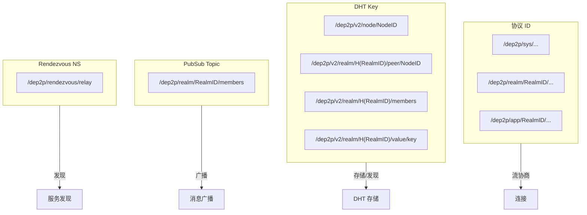

# 命名空间规范

> 定义 DeP2P 所有命名空间的统一格式和约束

---

## 概述

DeP2P 使用四类命名空间，每类有不同的格式和用途：

| 命名空间类型 | 用途 | 格式前缀 |
|--------------|------|----------|
| **协议 ID** | QUIC/流协商 | `/dep2p/{sys\|realm\|app}/...` |
| **DHT Key** | 分布式存储 | `/dep2p/v2/{realm\|node\|sys}/...` |
| **PubSub Topic** | 消息广播 | `/dep2p/realm/<RealmID>/...` |
| **Discovery NS** | 发现命名空间 | `relay/1.0.0` |
| **Rendezvous** | 服务发现 | `/dep2p/rendezvous/...` |

> **关键约束**：DHT Key 与 PubSub Topic 格式不同是**刻意设计**，详见下文。

---

## 协议 ID

协议 ID 用于 QUIC ALPN 协商和流协议匹配。

### 格式

```
┌─────────────────────────────────────────────────────────────────────────────┐
│                          协议 ID 格式                                        │
├─────────────────────────────────────────────────────────────────────────────┤
│                                                                             │
│  系统协议（无需 Realm）                                                      │
│  格式：/dep2p/sys/<protocol>/<version>                                      │
│  示例：/dep2p/sys/identify/1.0.0                                            │
│        /dep2p/relay/1.0.0/hop                                               │
│        /dep2p/relay/1.0.0/stop                                              │
│        /dep2p/sys/dht/1.0.0                                                 │
│                                                                             │
│  Realm 协议（嵌入 RealmID）                                                  │
│  格式：/dep2p/realm/<RealmID>/<protocol>/<version>                          │
│  示例：/dep2p/realm/QmYwAPJz.../join/1.0.0                                  │
│        /dep2p/realm/QmYwAPJz.../auth/1.0.0                                  │
│                                                                             │
│  应用协议（嵌入 RealmID）                                                    │
│  格式：/dep2p/app/<RealmID>/<protocol>/<version>                            │
│  示例：/dep2p/app/QmYwAPJz.../messaging/1.0.0                               │
│        /dep2p/app/QmYwAPJz.../pubsub/1.0.0                                  │
│                                                                             │
└─────────────────────────────────────────────────────────────────────────────┘
```

### 协议 ID 中的 RealmID

- 使用**原始 RealmID**（Base58 编码，约 44 字符）
- **不使用哈希**，便于协议路由和日志追踪

详见：[协议分类](README.md#协议命名规范)

---

## DHT Key

DHT Key 用于 Kademlia 分布式哈希表的键值存储。

### 格式定义

```
┌─────────────────────────────────────────────────────────────────────────────┐
│                          DHT Key 格式                                        │
├─────────────────────────────────────────────────────────────────────────────┤
│                                                                             │
│  Realm 节点记录（PeerRecord）                                               │
│  格式：/dep2p/v2/realm/<H(RealmID)>/peer/<NodeID>                           │
│  用途：存储 Realm 成员的签名地址记录                                        │
│                                                                             │
│  Realm 成员列表（Provider）                                                 │
│  格式：/dep2p/v2/realm/<H(RealmID)>/members                                 │
│  用途：Provider Record，声明 Realm 成员身份                                 │
│                                                                             │
│  Realm 值存储                                                               │
│  格式：/dep2p/v2/realm/<H(RealmID)>/value/<key>                             │
│  用途：Realm 作用域的通用 KV 存储                                           │
│                                                                             │
│  Realm Provider                                                             │
│  格式：/dep2p/v2/realm/<H(RealmID)>/provider/<key>                          │
│  用途：Realm 作用域的服务提供者声明                                         │
│                                                                             │
│  全局节点记录                                                               │
│  格式：/dep2p/v2/node/<NodeID>                                              │
│  用途：未加入 Realm 时的全局节点发布                                        │
│                                                                             │
│  系统 Key                                                                   │
│  格式：/dep2p/v2/sys/<keyType>/<payload>                                    │
│  用途：系统级存储（如 Relay 发现）                                          │
│                                                                             │
└─────────────────────────────────────────────────────────────────────────────┘
```

### DHT Key 汇总表

| Key 类型 | 格式 | RealmID 处理 | 用途 |
|----------|------|--------------|------|
| PeerRecord | `/dep2p/v2/realm/<H(RealmID)>/peer/<NodeID>` | SHA256 哈希 | 签名地址记录 |
| Members | `/dep2p/v2/realm/<H(RealmID)>/members` | SHA256 哈希 | 成员声明 |
| Value | `/dep2p/v2/realm/<H(RealmID)>/value/<key>` | SHA256 哈希 | KV 存储 |
| Provider | `/dep2p/v2/realm/<H(RealmID)>/provider/<key>` | SHA256 哈希 | 服务声明 |
| GlobalPeer | `/dep2p/v2/node/<NodeID>` | 无 | 全局节点 |
| System | `/dep2p/v2/sys/<type>/<payload>` | 无 | 系统存储 |

### DHT Key 中的 RealmID 哈希

```
┌─────────────────────────────────────────────────────────────────────────────┐
│                    RealmID 哈希规则                                          │
├─────────────────────────────────────────────────────────────────────────────┤
│                                                                             │
│  计算方式：                                                                  │
│    H(RealmID) = hex(SHA256(RealmID))                                        │
│                                                                             │
│  输出格式：                                                                  │
│    64 字符十六进制字符串                                                     │
│                                                                             │
│  设计原因：                                                                  │
│    1. 确保 Key 空间均匀分布，避免热点                                       │
│    2. 隐藏原始 RealmID，增加隐私性                                          │
│    3. 固定长度，便于存储和索引                                              │
│                                                                             │
│  示例：                                                                      │
│    RealmID:    "QmYwAPJzfYBpFSLLjAQZmyTfkNdR8Jzfqc9Y..."                   │
│    H(RealmID): "a1b2c3d4e5f6..."  (64 字符)                                 │
│                                                                             │
└─────────────────────────────────────────────────────────────────────────────┘
```

---

## PubSub Topic

PubSub Topic 用于 GossipSub 消息广播。

### 格式定义

```
┌─────────────────────────────────────────────────────────────────────────────┐
│                          PubSub Topic 格式                                   │
├─────────────────────────────────────────────────────────────────────────────┤
│                                                                             │
│  成员同步 Topic                                                             │
│  格式：/dep2p/realm/<RealmID>/members                                       │
│  用途：Gossip 同步 Realm 成员列表                                           │
│                                                                             │
│  ⚠️ 注意：这里使用原始 RealmID，不是哈希！                                  │
│                                                                             │
└─────────────────────────────────────────────────────────────────────────────┘
```

### PubSub Topic 中的 RealmID

- 使用**原始 RealmID**（Base58 编码）
- **不使用哈希**
- 原因：PubSub 路由需要明文 RealmID 进行 Topic 匹配

---

## Rendezvous 命名空间

Rendezvous 用于基于命名空间的服务发现。

### 格式定义

```
┌─────────────────────────────────────────────────────────────────────────────┐
│                       Rendezvous 命名空间格式                                │
├─────────────────────────────────────────────────────────────────────────────┤
│                                                                             │
│  格式：/dep2p/rendezvous/<namespace>                                        │
│                                                                             │
│  示例：                                                                      │
│    /dep2p/rendezvous/relay                                                  │
│    /dep2p/rendezvous/bootstrap                                              │
│                                                                             │
└─────────────────────────────────────────────────────────────────────────────┘
```

---

## Discovery 命名空间

Discovery namespace 是 DHT provider payload，用于 `FindPeers/Advertise`。

### 格式定义

```
格式：<namespace>

示例：
  relay/1.0.0
```

### 约束

- 不使用 `/dep2p/...` 前缀
- 不与 DHT Key / PubSub Topic 混用
- 仅用于特定能力发现（如 Relay 发现）

## 关键约束

### DHT Key vs PubSub Topic 的差异

```
┌─────────────────────────────────────────────────────────────────────────────┐
│                    DHT Key 与 PubSub Topic 格式差异                          │
├─────────────────────────────────────────────────────────────────────────────┤
│                                                                             │
│  DHT Key:     /dep2p/v2/realm/<H(RealmID)>/members   ← 哈希，有 v2 前缀     │
│  PubSub:      /dep2p/realm/<RealmID>/members         ← 原始，无 v2 前缀     │
│                                                                             │
│  这是刻意设计，原因如下：                                                   │
│                                                                             │
│  DHT Key 使用哈希：                                                         │
│    • 确保 Key 在 DHT 中均匀分布                                             │
│    • 避免热点（相同 Realm 的 Key 分散存储）                                 │
│    • 增加隐私（外部无法直接识别 RealmID）                                   │
│                                                                             │
│  PubSub Topic 使用原始：                                                    │
│    • GossipSub 路由需要明文 Topic 匹配                                      │
│    • 便于调试和日志追踪                                                     │
│    • Topic 本身不存储在 DHT 中                                              │
│                                                                             │
└─────────────────────────────────────────────────────────────────────────────┘
```

### Realm 成员发现约束

```
┌─────────────────────────────────────────────────────────────────────────────┐
│                    Realm 成员发现 API 约束                                   │
├─────────────────────────────────────────────────────────────────────────────┤
│                                                                             │
│  ✅ 正确用法：使用专用 API                                                  │
│    dht.FindRealmMembers(ctx, realmID)                                       │
│    dht.ProvideRealmMembership(ctx, realmID)                                 │
│                                                                             │
│  ❌ 错误用法：使用通用 Discovery API                                        │
│    discovery.FindPeers(ctx, "/dep2p/realm/<id>/members")                    │
│    discovery.Advertise(ctx, "/dep2p/realm/<id>/members")                    │
│                                                                             │
│  原因：                                                                      │
│    通用 Discovery.FindPeers 会将 namespace 转换为 RealmProviderKey，        │
│    而成员声明使用 RealmMembersKey，两种 Key 格式不同，导致发现失败。        │
│                                                                             │
│  实现约束：                                                                  │
│    • Realm 成员发现必须使用 DHT.FindRealmMembers()                          │
│    • Realm 成员声明必须使用 DHT.ProvideRealmMembership()                    │
│    • 禁止将 PubSub Topic 格式传入 Discovery API                             │
│                                                                             │
└─────────────────────────────────────────────────────────────────────────────┘
```

---

## 命名空间映射关系



---

## 版本策略

DHT Key 格式中的 `v2` 是协议版本标识符：

- 当前版本：`v2`
- Key 解析器必须验证版本号
- 不兼容的 Key 格式变更需要升级版本号

---

## 相关文档

| 文档 | 说明 |
|------|------|
| [协议命名规范](README.md#协议命名规范) | 协议 ID 详细规范 |
| [发现协议](L3_network/discovery.md) | DHT 发现机制 |
| [发布订阅](L4_application/pubsub.md) | PubSub 协议 |
| [Realm 协议](L4_application/realm.md) | Realm 成员管理 |
| [命名规范](../engineering/standards/naming_conventions.md) | 工程命名规范 |

---

**最后更新**：2026-01-27
