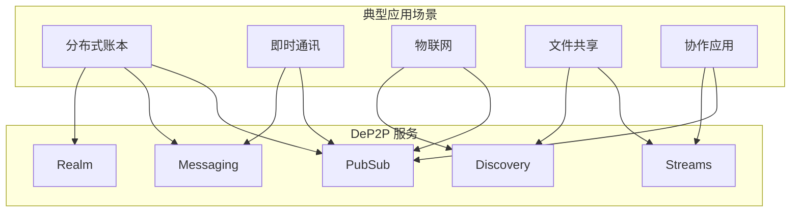

# 典型场景概览

> DeP2P 在典型应用场景中的服务映射和使用约束

---

## 场景总览



---

## 1. 分布式账本场景

包括区块链、DLT、分布式数据库等需要数据同步和共识的应用。

### 核心需求

| 需求 | 说明 |
|------|------|
| 区块/数据广播 | 新数据快速传播到全网 |
| 状态同步 | 节点启动时同步历史数据 |
| 网络隔离 | 主网/测试网分离 |
| 点对点请求 | 请求特定数据 |

### DeP2P 映射

| 需求 | 服务 | 用法 |
|------|------|------|
| 数据广播 | PubSub | `realm.PubSub().Publish("blocks", data)` |
| 状态同步 | Streams | `realm.Streams().Open(peer, "sync")` |
| 网络隔离 | Realm | `node.JoinRealmWithKey("mainnet", psk)` |
| 数据请求 | Messaging | `realm.Messaging().Request(peer, req)` |

### 使用约束

```
CONSTRAINT-DLT-001: 区块广播必须使用 PubSub
  理由：GossipSub 提供最优传播效率

CONSTRAINT-DLT-002: 批量同步必须使用 Streams
  理由：避免请求-响应的往返延迟

CONSTRAINT-DLT-003: 不同网络必须使用不同 Realm
  理由：防止消息跨网传播
```

---

## 2. 即时通讯场景

包括聊天应用、协作工具、社交网络等需要消息传递的应用。

### 核心需求

| 需求 | 说明 |
|------|------|
| 群聊消息 | 一对多消息广播 |
| 私聊消息 | 一对一消息传递 |
| 在线状态 | 用户上下线通知 |
| 历史记录 | 拉取历史消息 |

### DeP2P 映射

| 需求 | 服务 | 用法 |
|------|------|------|
| 群聊消息 | PubSub | `realm.PubSub().Publish("room/general", msg)` |
| 私聊消息 | Messaging | `realm.Messaging().Send(peer, msg)` |
| 在线状态 | PubSub | `realm.PubSub().Publish("presence", status)` |
| 历史记录 | Messaging | `realm.Messaging().Request(peer, historyReq)` |

### 使用约束

```
CONSTRAINT-IM-001: 群聊必须使用 PubSub
  理由：高效的一对多传播

CONSTRAINT-IM-002: 私聊应使用 Messaging.Send
  理由：无需等待响应，更低延迟

CONSTRAINT-IM-003: 团队隔离应使用 Realm
  理由：组织间消息隔离
```

---

## 3. 物联网场景

包括传感器网络、智能家居、工业物联网等设备互联应用。

### 核心需求

| 需求 | 说明 |
|------|------|
| 设备发现 | 发现网络中的设备 |
| 遥测数据 | 传感器数据上报 |
| 命令下发 | 控制设备执行操作 |
| 告警通知 | 异常事件广播 |

### DeP2P 映射

| 需求 | 服务 | 用法 |
|------|------|------|
| 设备发现 | Discovery | `realm.Discovery().FindPeers()` |
| 遥测数据 | PubSub | `realm.PubSub().Publish("sensors/temp", data)` |
| 命令下发 | Messaging | `realm.Messaging().Request(device, cmd)` |
| 告警通知 | PubSub | `realm.PubSub().Publish("alerts", alert)` |

### 使用约束

```
CONSTRAINT-IOT-001: 遥测数据使用 PubSub
  理由：一对多高效分发

CONSTRAINT-IOT-002: 命令下发使用 Request-Response
  理由：需要确认执行结果

CONSTRAINT-IOT-003: 设备组使用 Realm 隔离
  理由：不同区域/用途设备分离
```

---

## 4. 文件共享场景

包括 P2P 文件传输、分布式存储、内容分发等应用。

### 核心需求

| 需求 | 说明 |
|------|------|
| 文件发现 | 找到拥有文件的节点 |
| 文件传输 | 高效传输大文件 |
| 断点续传 | 支持中断后继续 |
| 多源下载 | 从多个节点并行下载 |

### DeP2P 映射

| 需求 | 服务 | 用法 |
|------|------|------|
| 文件发现 | DHT | `node.DHT().FindProviders(fileHash)` |
| 文件传输 | Streams | `realm.Streams().Open(peer, "transfer")` |
| 块请求 | Messaging | `realm.Messaging().Request(peer, blockReq)` |

### 使用约束

```
CONSTRAINT-FILE-001: 大文件必须使用 Streams
  理由：支持流式传输和背压控制

CONSTRAINT-FILE-002: 文件索引使用 DHT
  理由：去中心化的内容寻址
```

---

## 5. 协作应用场景

包括协作编辑、白板、实时同步等需要状态共享的应用。

### 核心需求

| 需求 | 说明 |
|------|------|
| 操作广播 | 实时同步编辑操作 |
| 状态同步 | 新加入者同步当前状态 |
| 光标位置 | 显示其他用户光标 |
| 冲突解决 | 处理并发编辑 |

### DeP2P 映射

| 需求 | 服务 | 用法 |
|------|------|------|
| 操作广播 | PubSub | `realm.PubSub().Publish("doc/ops", op)` |
| 状态同步 | Streams | `realm.Streams().Open(peer, "state")` |
| 光标位置 | PubSub | `realm.PubSub().Publish("cursors", pos)` |

### 使用约束

```
CONSTRAINT-COLLAB-001: 操作广播使用 PubSub
  理由：所有参与者实时接收

CONSTRAINT-COLLAB-002: 初始同步使用 Streams
  理由：高效传输完整状态
```

---

## 服务选择速查表

| 需求类型 | 推荐服务 | 典型场景 |
|----------|----------|----------|
| 一对多广播 | PubSub | 区块广播、群聊、事件 |
| 一对一请求 | Messaging.Request | RPC、数据请求 |
| 一对一通知 | Messaging.Send | 私聊、命令 |
| 大数据传输 | Streams | 文件、批量同步 |
| 网络隔离 | Realm | 多租户、环境隔离 |
| 节点发现 | Discovery/DHT | 设备发现、内容寻址 |

---

## 相关文档

- [场景约束索引](README.md)
- [PubSub 协议](../protocol/L4_application/pubsub.md)
- [Messaging 协议](../protocol/L4_application/messaging.md)
- [Realm 协议](../protocol/L4_application/realm.md)

---

**最后更新**：2026-01-11
