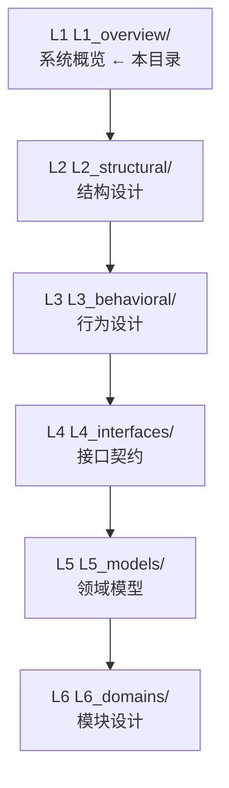

# L1: 系统概览 (System Overview)

> **版本**: v2.0.0  
> **更新日期**: 2026-01-24  
> **层级**: L1  
> **定位**: 面向管理层、业务方和新人的宏观认知

---

## 关于"层"的说明

DeP2P 文档中使用两种"层"的概念，它们解决不同的问题：

| 视角 | 层次 | 用途 |
|------|------|------|
| **用户感知** | 应用服务 / 业务隔离 / 系统基础 | 描述用户如何使用 DeP2P（本目录重点） |
| **软件架构** | API / Protocol / Realm / Core / Discovery | 描述代码如何组织（详见 [L2_structural](../L2_structural/)） |

---

## 本层定位

L1 是架构文档的入口层，提供 DeP2P 系统全貌的宏观视图：

| 关注点 | 说明 |
|--------|------|
| **系统定位** | DeP2P 是什么？解决什么问题？ |
| **系统边界** | 外部依赖、职责范围 |
| **核心术语** | 关键概念和术语定义 |
| **核心对象** | Node/Realm/Relay 对象模型 |
| **系统约束** | 必须满足的不变量 |

### 本层边界

| 包含 | 不包含 |
|------|--------|
| 系统定位和价值主张 | 具体技术实现细节 |
| 核心概念和术语 | 代码结构和接口定义 |
| 全局架构视图 | 配置参数和调优 |
| 系统边界定义 | 具体算法和数据结构 |

---

## 目录结构

```
L1_overview/
├── README.md              # 本文件
├── positioning.md         # DeP2P 定位与愿景
├── system_boundary.md     # 系统边界
├── core_concepts.md       # 核心概念
├── glossary.md            # 术语表
├── abstractions.md        # 核心抽象
├── domain_map.md          # 领域映射图
└── invariants.md          # 系统不变量
```

---

## DeP2P 定位

```
┌─────────────────────────────────────────────────────────────────────────┐
│                           DeP2P 定位                                     │
├─────────────────────────────────────────────────────────────────────────┤
│                                                                         │
│  "DeP2P 是一个以 身份优先、Realm 隔离、DHT 权威目录 为核心设计理念的      │
│   现代化 P2P 网络库，为分布式应用提供安全、可靠的点对点通信基础设施"       │
│                                                                         │
└─────────────────────────────────────────────────────────────────────────┘
```

---

## 核心特性

| 特性 | 说明 |
|------|------|
| **身份优先** | 每个节点拥有唯一密钥对，NodeID = 公钥哈希 |
| **Realm 隔离** | 逻辑网络隔离，使用 PSK 认证，协议路径嵌入 RealmID |
| **★ NAT 三层能力** | 外部地址发现 → 打洞 → 中继（三者目的不同） |
| **★ Relay 三大职责 (v2.0)** | 缓存加速层 + 打洞协调信令 + 数据通信保底 |
| **★ DHT 权威目录 (v2.0)** | DHT 是地址解析的权威来源，Relay 地址簿是缓存 |
| **★ 基础设施融合** | Bootstrap + Relay 可融合部署 |
| **★ 仅 ID 连接** | Realm 内支持纯 NodeID 连接，自动地址发现 |
| **协议可扩展** | 统一的协议命名空间 |

---

## 用户心智模型

用户只需要理解两个核心对象：**Node**（节点）和 **Realm**（域）。

```
┌─────────────────────────────────────────────────────────────────────────────┐
│                         用户视角                                             │
├─────────────────────────────────────────────────────────────────────────────┤
│                                                                             │
│   用户操作路径（三步）：                                                      │
│   ─────────────────────                                                     │
│                                                                             │
│   Step 1: 启动节点        node := dep2p.Start(ctx, dep2p.Desktop())        │
│   Step 2: 加入域          realm := node.JoinRealm(ctx, key)                │
│   Step 3: 业务通信        realm.Messaging() / realm.PubSub() / ...         │
│                          realm.Streams() / realm.Liveness()                │
│                                                                             │
│   用户不需要知道的（背后静默运行）：                                          │
│   ──────────────────────────────────                                        │
│                                                                             │
│   • DHT / K桶 / 路由表                                                      │
│   • 传输层连接管理                                                          │
│   • 外部地址发现 / 打洞 / 中继                                              │
│                                                                             │
│   ★ 关键语义：Connect 成功 = 可通信                                          │
│   ─────────────────────────────────                                         │
│   用户调用 Connect 返回成功后，必定可以通信。                                 │
│   底层的传输握手、Realm 成员验证、协议协商已全部完成。                        │
│                                                                             │
└─────────────────────────────────────────────────────────────────────────────┘
```

| 对象 | 职责 | 用户操作 | 感知程度 |
|------|------|----------|----------|
| **Node** | 网络节点：我是谁、我在哪、加入哪个域 | `dep2p.Start()`, `node.JoinRealm()` | ★★★★☆ 入口 |
| **Realm** | 业务域：域内成员、通信服务入口 | `Messaging()`, `PubSub()`, `Streams()`, `Liveness()` | ★★★★★ 核心 |
| **底层** | 传输、发现、中继 | 无需操作 | ★☆☆☆☆ 透明 |

---

## 软件架构五层

完整的软件架构采用五层结构（详见 [L2_structural/layer_model.md](../L2_structural/layer_model.md)）：

| 软件架构层 | 代码位置 | 对应用户感知层 |
|------------|----------|---------------|
| API Layer | `dep2p.go`, `node.go` | 系统基础（入口） |
| Protocol Layer | `internal/protocol/` | 应用服务 |
| Realm Layer | `internal/realm/` | 业务隔离 |
| Core Layer | `internal/core/` | 系统基础 |
| Discovery Layer | `internal/discovery/` | 系统基础 |

---

## 文档索引

| 文档 | 说明 | 主要读者 |
|------|------|----------|
| [positioning.md](positioning.md) | DeP2P 定位与愿景 | 管理层、新人 |
| [system_boundary.md](system_boundary.md) | 系统边界和职责范围 | 架构师 |
| [core_concepts.md](core_concepts.md) | Node/Realm/Relay 核心概念 | 开发者 |
| [abstractions.md](abstractions.md) | 核心抽象层次 | 开发者 |
| [glossary.md](glossary.md) | 术语定义 | 全员 |
| [domain_map.md](domain_map.md) | 领域映射图 | 开发者 |
| [invariants.md](invariants.md) | 系统不变量 | 架构师、开发者 |

---

## 与其他层的关系



| 层级 | 关系 |
|------|------|
| **L1** | **本目录** - 提供宏观认知 |
| L2 | 结构展开 - 细化分层和依赖 |
| L3 | 行为设计 - 端到端流程 |
| L4 | 接口契约 - API 设计 |
| L5 | 领域模型 - 数据模型 |
| L6 | 模块设计 - 组件实现 |

---

## 阅读建议

| 读者角色 | 推荐阅读顺序 |
|----------|--------------|
| **管理层** | `positioning.md` → `system_boundary.md` |
| **新人** | `glossary.md` → `core_concepts.md` → `domain_map.md` |
| **架构师** | 全部阅读，然后进入 L2 |
| **开发者** | `core_concepts.md` → `invariants.md` → L4/L6 |

---

## 核心不变量

| 不变量 | 说明 | 详细 |
|--------|------|------|
| **INV-001** | 身份第一性：连接必须绑定 NodeID | [详情](invariants.md#inv-001-身份第一性) |
| **INV-002** | Realm 成员资格：业务 API 需要成员资格 | [详情](invariants.md#inv-002-realm-成员资格) |
| **INV-003** | 连接优先级与 Relay 保留 | [详情](invariants.md#inv-003-连接优先级与-relay-保留) |

---

## 相关文档

| 文档 | 说明 |
|------|------|
| [../README.md](../README.md) | 架构设计导航入口 |
| [L2_structural/](../L2_structural/) | 结构设计（下一层） |
| [01_context/decisions/](../../01_context/decisions/) | ADR 架构决策 |
| [02_constraints/protocol/](../../02_constraints/protocol/) | 协议规范 |

---

**最后更新**：2026-01-24（v2.0 DHT 权威模型对齐）
