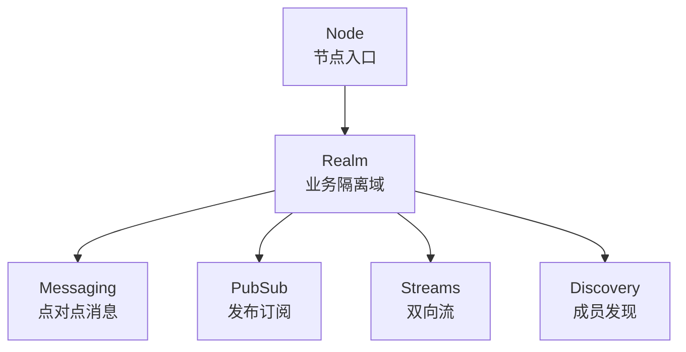
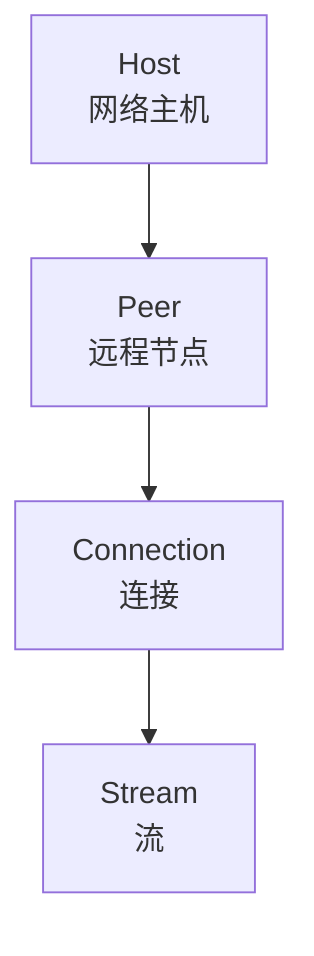
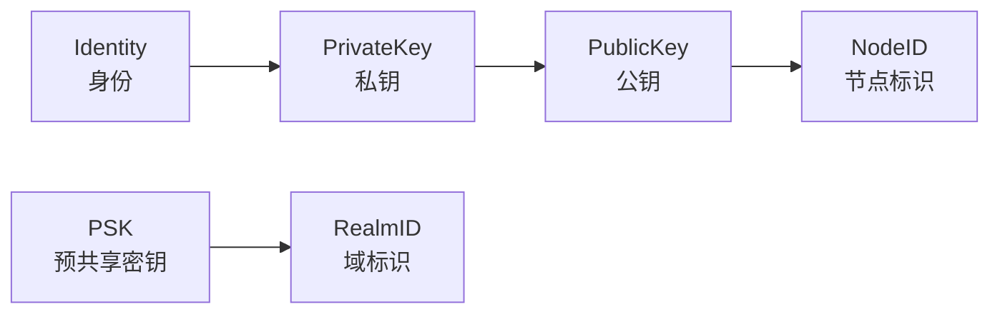
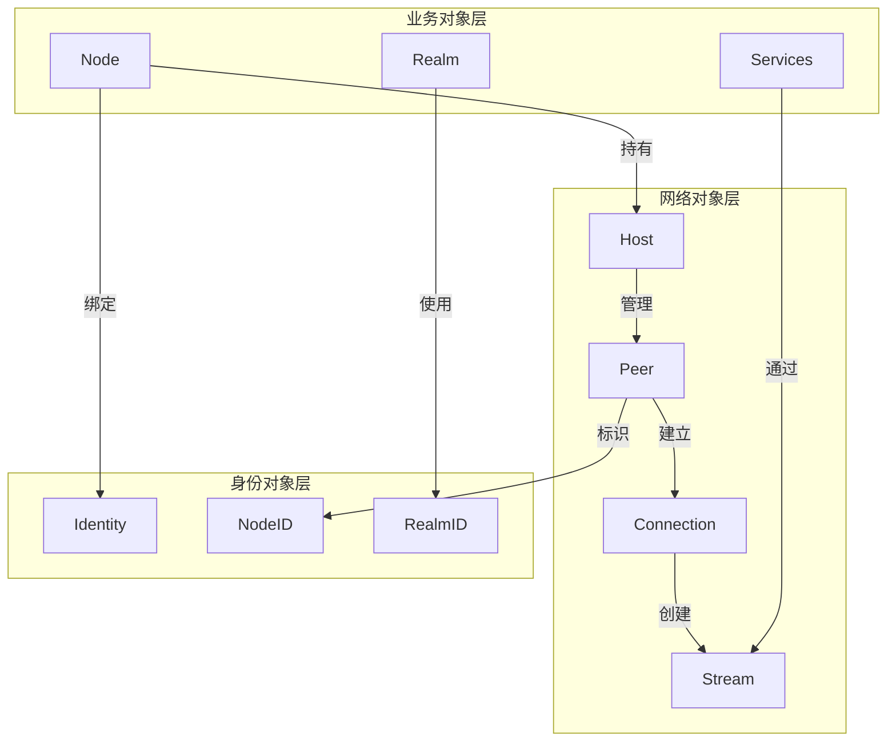

# 核心抽象 (Core Abstractions)

> 定义 DeP2P 的三层抽象模型，为架构设计提供统一的概念基础

---

## 概述

DeP2P 的抽象体系分为三个层次，从上到下分别是：

```
┌─────────────────────────────────────────────────────────────────────────────┐
│                          DeP2P 抽象层次                                       │
├─────────────────────────────────────────────────────────────────────────────┤
│                                                                             │
│   业务对象层 (Business Objects)                                              │
│   ─────────────────────────────                                             │
│   用户直接操作的对象，体现业务语义                                              │
│   Node → Realm → Services                                                   │
│                                                                             │
│   网络对象层 (Network Objects)                                               │
│   ─────────────────────────────                                             │
│   P2P 网络的核心抽象，对用户透明                                               │
│   Host → Peer → Connection → Stream                                         │
│                                                                             │
│   身份对象层 (Identity Objects)                                              │
│   ─────────────────────────────                                             │
│   密码学身份，贯穿所有层次                                                     │
│   Identity → PrivateKey → PublicKey → NodeID / RealmID                      │
│                                                                             │
└─────────────────────────────────────────────────────────────────────────────┘
```

---

## 业务对象层

业务对象层是用户直接交互的 API 层，体现 DeP2P 的核心价值主张。



### Node

```
┌─────────────────────────────────────────────────────────────────┐
│  Node - 节点入口                                                 │
├─────────────────────────────────────────────────────────────────┤
│                                                                 │
│  职责：                                                          │
│  • 代表本地 P2P 节点                                             │
│  • 持有密码学身份                                                 │
│  • 管理 Realm 生命周期                                           │
│                                                                 │
│  核心方法：                                                       │
│  • ID() NodeID              - 获取节点标识                       │
│  • JoinRealm(name, psk)     - 加入业务域                         │
│  • CurrentRealm() Realm     - 获取当前域                         │
│  • Close()                  - 关闭节点                          │
│                                                                 │
│  约束：                                                          │
│  • 一个 Node 同时只属于一个 Realm                                 │
│                                                                 │
└─────────────────────────────────────────────────────────────────┘
```

### Realm

```
┌─────────────────────────────────────────────────────────────────┐
│  Realm - 业务隔离域                                              │
├─────────────────────────────────────────────────────────────────┤
│                                                                 │
│  职责：                                                          │
│  • 提供业务隔离边界                                               │
│  • 管理成员资格                                                   │
│  • 作为应用服务的入口                                             │
│                                                                 │
│  核心方法：                                                       │
│  • ID() RealmID             - 获取 Realm 标识                    │
│  • Members() []NodeID       - 获取成员列表                       │
│  • IsMember(NodeID) bool    - 检查成员资格                       │
│  • Messaging() Messaging    - 获取消息服务                       │
│  • PubSub() PubSub          - 获取发布订阅服务                    │
│  • Streams() Streams        - 获取流服务                         │
│  • Leave()                  - 离开 Realm                        │
│                                                                 │
│  约束：                                                          │
│  • 所有业务 API 需要 Realm 成员资格 (INV-002)                     │
│                                                                 │
└─────────────────────────────────────────────────────────────────┘
```

### Services（多协议支持）

| 服务 | 职责 | 特点 |
|------|------|------|
| **Messaging** | 点对点消息传递 | 多协议支持（protocol 参数） |
| **PubSub** | 主题发布订阅 | 多主题支持（Topic 对象） |
| **Streams** | 双向数据流 | 多协议支持（protocol 参数） |
| **Liveness** | 存活检测 | Ping/Status/Watch |

**多协议设计**：
- Messaging 和 Streams 通过 `protocol` 参数区分不同业务协议
- PubSub 通过 `Join(topic)` 返回 Topic 对象，支持多主题并行
- 每个协议/主题独立注册处理器，互不干扰

---

## 网络对象层

网络对象层是 P2P 网络的核心抽象，对用户透明，由 DeP2P 内部管理。



### Host

```
┌─────────────────────────────────────────────────────────────────┐
│  Host - 网络主机                                                 │
├─────────────────────────────────────────────────────────────────┤
│                                                                 │
│  职责：                                                          │
│  • 管理本地监听地址                                               │
│  • 管理到远程节点的连接                                           │
│  • 提供协议多路复用                                               │
│                                                                 │
│  核心能力：                                                       │
│  • Listen(addr)             - 监听地址                          │
│  • Connect(peer)            - 连接远程节点                       │
│  • SetProtocolHandler(id)   - 注册协议处理器                     │
│  • NewStream(peer, proto)   - 打开新流                          │
│                                                                 │
│  内部组件：                                                       │
│  • Transport (QUIC)                                             │
│  • Security (TLS)                                               │
│  • Muxer (流多路复用)                                            │
│  • ConnMgr (连接管理)                                            │
│                                                                 │
└─────────────────────────────────────────────────────────────────┘
```

### Peer

```
┌─────────────────────────────────────────────────────────────────┐
│  Peer - 远程节点                                                 │
├─────────────────────────────────────────────────────────────────┤
│                                                                 │
│  职责：                                                          │
│  • 表示一个远程 P2P 节点                                          │
│  • 持有该节点的已知地址                                           │
│  • 记录连接状态和质量                                             │
│                                                                 │
│  核心属性：                                                       │
│  • ID NodeID                - 节点标识                          │
│  • Addrs []Multiaddr        - 已知地址列表                       │
│  • Connectedness            - 连接状态                          │
│  • Latency                  - 延迟                              │
│                                                                 │
│  连接状态：                                                       │
│  • NotConnected             - 未连接                            │
│  • Connected                - 已连接                            │
│  • CanConnect               - 可连接但未连接                     │
│  • CannotConnect            - 无法连接                          │
│                                                                 │
└─────────────────────────────────────────────────────────────────┘
```

### Connection

```
┌─────────────────────────────────────────────────────────────────┐
│  Connection - 连接                                               │
├─────────────────────────────────────────────────────────────────┤
│                                                                 │
│  职责：                                                          │
│  • 表示到远程节点的已建立连接                                      │
│  • 管理连接上的多个流                                             │
│  • 提供连接级别的元数据                                           │
│                                                                 │
│  核心属性：                                                       │
│  • RemotePeer NodeID        - 远程节点标识                       │
│  • LocalAddr Multiaddr      - 本地地址                          │
│  • RemoteAddr Multiaddr     - 远程地址                          │
│  • Streams []Stream         - 活跃流列表                         │
│                                                                 │
│  约束：                                                          │
│  • 连接必须绑定 NodeID (INV-001)                                  │
│  • 验证 RemotePeer == ExpectedPeer                              │
│                                                                 │
└─────────────────────────────────────────────────────────────────┘
```

### Stream

```
┌─────────────────────────────────────────────────────────────────┐
│  Stream - 流                                                     │
├─────────────────────────────────────────────────────────────────┤
│                                                                 │
│  职责：                                                          │
│  • 表示连接上的一个逻辑通道                                        │
│  • 提供双向读写能力                                               │
│  • 关联特定协议                                                   │
│                                                                 │
│  核心属性：                                                       │
│  • Protocol string          - 协议标识                          │
│  • Connection               - 所属连接                          │
│                                                                 │
│  核心方法：                                                       │
│  • Read([]byte) (int, error)                                    │
│  • Write([]byte) (int, error)                                   │
│  • Close() error                                                │
│  • Reset() error            - 强制重置                          │
│                                                                 │
└─────────────────────────────────────────────────────────────────┘
```

---

## 身份对象层

身份对象层提供密码学身份，是 DeP2P 安全模型的基础。



### Identity

```
┌─────────────────────────────────────────────────────────────────┐
│  Identity - 身份                                                 │
├─────────────────────────────────────────────────────────────────┤
│                                                                 │
│  职责：                                                          │
│  • 封装密钥对                                                     │
│  • 提供签名和验证能力                                             │
│  • 派生 NodeID                                                   │
│                                                                 │
│  核心组件：                                                       │
│  • PrivateKey (Ed25519)     - 私钥，用于签名                     │
│  • PublicKey                - 公钥，用于验证                     │
│  • NodeID                   - 公钥哈希，用于标识                  │
│                                                                 │
└─────────────────────────────────────────────────────────────────┘
```

### NodeID

```
┌─────────────────────────────────────────────────────────────────┐
│  NodeID - 节点标识                                               │
├─────────────────────────────────────────────────────────────────┤
│                                                                 │
│  定义：                                                          │
│  NodeID = SHA-256(PublicKey)                                    │
│                                                                 │
│  属性：                                                          │
│  • 长度：32 字节                                                 │
│  • 编码：Base58 (显示)                                           │
│  • 唯一性：密码学保证                                             │
│                                                                 │
│  用途：                                                          │
│  • 节点唯一标识                                                   │
│  • 连接目标验证 (INV-001)                                        │
│  • DHT 路由键                                                    │
│                                                                 │
└─────────────────────────────────────────────────────────────────┘
```

### RealmID

```
┌─────────────────────────────────────────────────────────────────┐
│  RealmID - 域标识                                                │
├─────────────────────────────────────────────────────────────────┤
│                                                                 │
│  定义：                                                          │
│  RealmID = HKDF(salt="dep2p-realm-id-v1", ikm=PSK)              │
│                                                                 │
│  属性：                                                          │
│  • 长度：32 字节                                                 │
│  • 派生自 PSK                                                    │
│  • 相同 PSK 产生相同 RealmID                                     │
│                                                                 │
│  用途：                                                          │
│  • Realm 唯一标识                                                │
│  • 协议命名空间前缀                                               │
│  • Rendezvous 命名空间                                           │
│                                                                 │
└─────────────────────────────────────────────────────────────────┘
```

---

## 抽象层次间的关系



### 层次职责分离

| 层次 | 用户可见性 | 职责 |
|------|-----------|------|
| **业务对象层** | 完全可见 | 提供业务 API |
| **网络对象层** | 部分可见 | 管理网络连接 |
| **身份对象层** | 仅 NodeID 可见 | 提供密码学保证 |

---

## 与系统不变量的关系

| 抽象 | 相关不变量 | 约束 |
|------|-----------|------|
| **Connection** | INV-001 | 必须绑定 ExpectedNodeID |
| **Realm** | INV-002 | 业务 API 需要成员资格 |
| **Stream** | INV-003 | 连接优先级：直连 → 打洞 → Relay |

---

## 相关文档

| 文档 | 说明 |
|------|------|
| [core_concepts.md](core_concepts.md) | 核心概念详解 |
| [invariants.md](invariants.md) | 系统不变量 |
| [../L2_structural/layer_model.md](../L2_structural/layer_model.md) | 五层软件架构 |
| [../L2_structural/module_design.md](../L2_structural/module_design.md) | 模块划分 |

---

**最后更新**：2026-01-23
