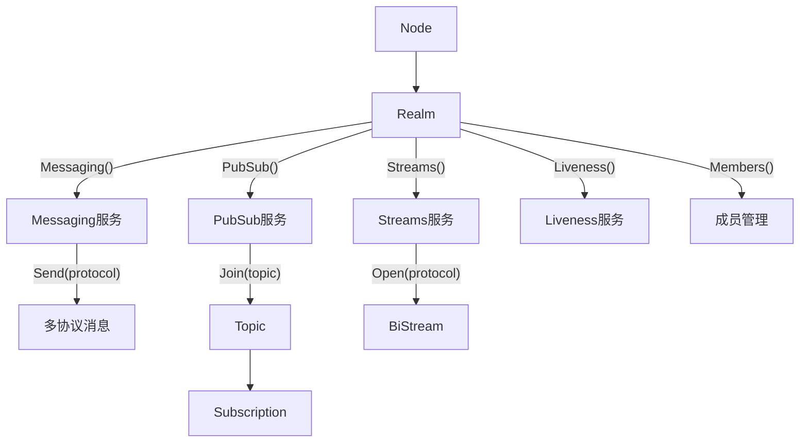
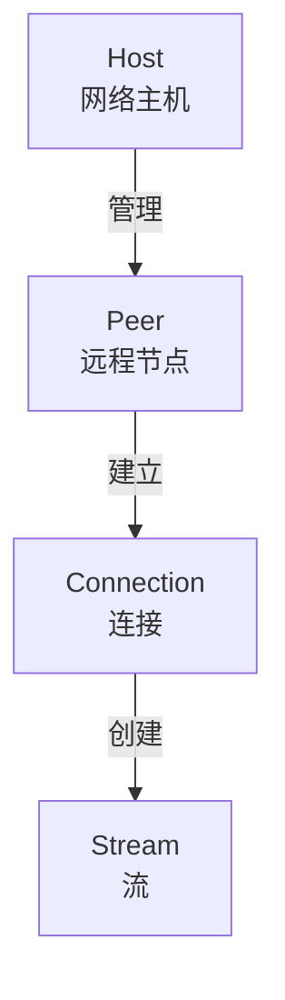
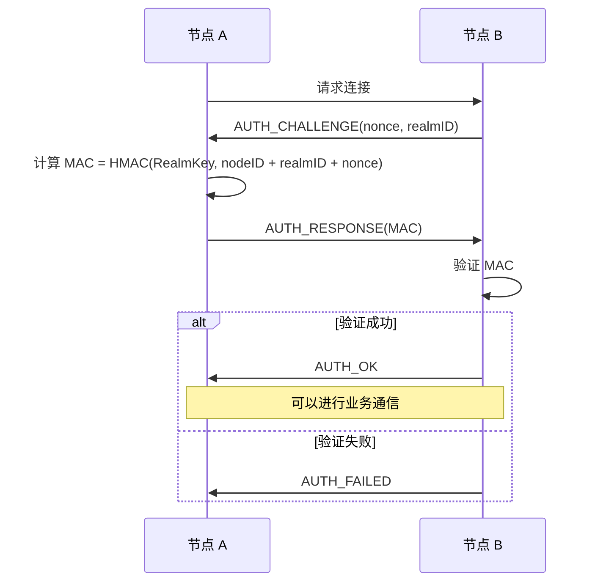
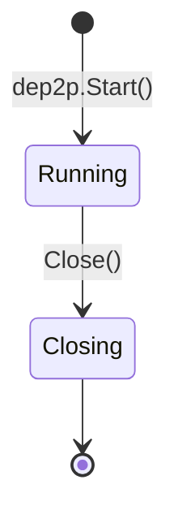
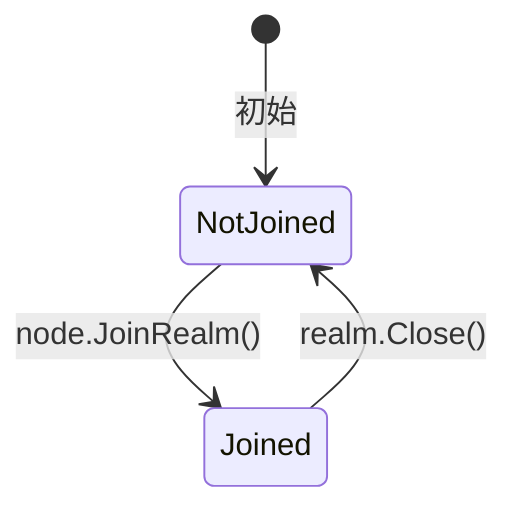

# 核心概念

> 定义 DeP2P 的核心对象模型、生命周期和产出关系

---

## 用户心智模型

DeP2P 的用户只需要理解两个核心对象：**Node**（节点）和 **Realm**（域）。

```
用户三步操作
═══════════════════════════════════════════════════════════════════════════════

Step 1: 启动节点
─────────────────
node := dep2p.Start(ctx, dep2p.Desktop())

                    ┌─────────┐
                    │  Node   │
                    │─────────│
                    │ ID()    │
                    │ Addrs() │
                    │ Health()│
                    └────┬────┘
                         │
                         │ node.JoinRealm(ctx, psk)
                         ▼
Step 2: 加入域
─────────────────
realm := node.JoinRealm(ctx, psk)

                    ┌──────────────────────────────────────────┐
                    │                 Realm                     │
                    │──────────────────────────────────────────│
                    │ ID(), Name(), Members(), Health()        │
                    │──────────────────────────────────────────│
                    │ Messaging() │ PubSub() │ Streams() │ ... │
                    └──────┬──────┴────┬─────┴─────┬────┴──────┘
                           │           │           │
                           ▼           ▼           ▼
Step 3: 业务通信（多协议/多主题）
─────────────────────────────────

┌─────────────────┐  ┌─────────────────┐  ┌─────────────────┐
│   Messaging     │  │     PubSub      │  │    Streams      │
│─────────────────│  │─────────────────│  │─────────────────│
│ Send(protocol)  │  │ Join(topic)     │  │ Open(protocol)  │
│ RegisterHandler │  │   → Topic       │  │ RegisterHandler │
│   (protocol)    │  │     .Publish()  │  │   (protocol)    │
└─────────────────┘  │     .Subscribe()│  └─────────────────┘
                     └─────────────────┘
```

```
┌─────────────────────────────────────────────────────────────────────────────┐
│                         用户心智模型                                         │
├─────────────────────────────────────────────────────────────────────────────┤
│                                                                             │
│   用户看到的：                                                               │
│   ────────────                                                              │
│                                                                             │
│   ┌─────────┐         ┌─────────┐         ┌─────────────────┐              │
│   │  Node   │ ─────▶  │  Realm  │ ─────▶  │ 通信服务（多协议）│              │
│   │  节点   │         │   域    │         │                 │              │
│   └─────────┘         └─────────┘         │ • Messaging()   │              │
│       │                   │               │ • PubSub()      │              │
│       │                   │               │ • Streams()     │              │
│       │                   │               │ • Liveness()    │              │
│       │                   │               └─────────────────┘              │
│       │                   │                                                 │
│       │                   ├── 域 ID / 名称                                  │
│       │                   ├── 成员列表                                      │
│       │                   └── 健康状态                                      │
│       │                                                                     │
│       ├── 节点 ID                                                           │
│       ├── 监听地址                                                          │
│       └── 健康状态                                                          │
│                                                                             │
│   用户不需要知道的（背后静默运行）：                                          │
│   ──────────────────────────────────                                        │
│                                                                             │
│   • DHT / K桶 / 路由表                                                      │
│   • 节点持久化存储                                                          │
│   • 传输层连接管理                                                          │
│   • NAT 穿透 / 中继                                                         │
│   • 协议协商 / 多路复用                                                     │
│                                                                             │
└─────────────────────────────────────────────────────────────────────────────┘
```

---

## ★ P2P 网络的三个核心问题

```
┌─────────────────────────────────────────────────────────────────────────────┐
│                    P2P 网络的三个核心问题（设计指导框架）                      │
├─────────────────────────────────────────────────────────────────────────────┤
│                                                                             │
│  DeP2P 的设计围绕三个核心问题展开：                                          │
│                                                                             │
│  ═══════════════════════════════════════════════════════════════════════   │
│  问题 1: 如何让别人找到我？                                                  │
│  ═══════════════════════════════════════════════════════════════════════   │
│  • 场景：其他节点想连接我，需要知道我的地址                                  │
│  • 解决：                                                                   │
│    - DHT 地址发布（只发布可达地址）                                         │
│    - Relay 地址簿注册（Relay 维护成员地址）                                 │
│    - 可达性验证（AutoNAT/dialback 确保地址有效）                            │
│  • 文档：discovery_flow.md、discovery_dht/、core_reachability/             │
│                                                                             │
│  ═══════════════════════════════════════════════════════════════════════   │
│  问题 2: 如何找到别人？（v2.0 更新）                                         │
│  ═══════════════════════════════════════════════════════════════════════   │
│  • 场景：我想连接目标节点，需要知道它的地址                                  │
│  • ★ v2.0 核心变化：DHT 是权威目录，Relay 地址簿是缓存加速层                │
│  • 解决（按优先级）：                                                       │
│    1. Peerstore 本地缓存（最近连接过）                                      │
│    2. MemberList 成员列表（Realm 内 Gossip 同步）                           │
│    3. ★ DHT 查询（权威来源，签名 PeerRecord）                               │
│    4. Relay 地址簿查询（缓存回退，仅在 DHT 失败时使用）                      │
│  • 文档：discovery_flow.md、core_peerstore/                                 │
│                                                                             │
│  ═══════════════════════════════════════════════════════════════════════   │
│  问题 3: 找到后如何建立双向通信？                                            │
│  ═══════════════════════════════════════════════════════════════════════   │
│  • 场景：知道地址后，如何穿越 NAT 建立连接                                   │
│  • 解决（按优先级）：                                                       │
│    1. 直连尝试                                                             │
│    2. NAT 打洞（需信令通道协调）                                            │
│    3. Relay 转发（兜底，确保可达）                                          │
│  • 核心机制：Relay 三大职责 v2.0（缓存加速 + 信令通道 + 数据保底）          │
│  • 文档：connection_flow.md、relay_flow.md、core_nat/、core_relay/         │
│                                                                             │
│  ★ 三个问题的关系：                                                         │
│  ┌─────────────────────────────────────────────────────────────────────┐   │
│  │  问题 1（让别人找到我）→ 问题 2（找到别人）→ 问题 3（建立通信）      │   │
│  │      DHT/Relay 发布       地址发现           连接建立                │   │
│  └─────────────────────────────────────────────────────────────────────┘   │
│                                                                             │
└─────────────────────────────────────────────────────────────────────────────┘
```

---

## 职责划分

```
┌─────────────────────────────────────────────────────────────────────────────┐
│                        Node vs Realm 职责                                    │
├─────────────────────────────────────────────────────────────────────────────┤
│                                                                             │
│  Node（网络节点层面）                                                         │
│  ─────────────────────                                                      │
│  回答的问题：我是谁？我在哪？加入哪个域？                                       │
│                                                                             │
│  • node.ID()          → 我的节点 ID                                         │
│  • node.Addrs()       → 我的监听地址                                        │
│  • node.Health()      → 节点网络是否正常                                     │
│  • node.JoinRealm()   → 加入域                                              │
│  • node.Realm()       → 当前域                                              │
│  • node.Close()       → 关闭节点                                            │
│                                                                             │
│  ─────────────────────────────────────────────────────────────────────────  │
│                                                                             │
│  Realm（业务域层面）                                                          │
│  ─────────────────────                                                      │
│  回答的问题：域里有谁？我怎么和他们通信？                                       │
│                                                                             │
│  • 域信息：                                                                  │
│      realm.ID()                 → 域 ID                                     │
│      realm.Members()            → 域内已连接成员（用户唯一需要的连接视图）     │
│      realm.MemberCount()        → 成员数量                                  │
│      realm.IsMember(peerID)     → 检查是否为成员                             │
│      realm.OnMemberJoin(h)      → 成员加入回调                               │
│      realm.OnMemberLeave(h)     → 成员离开回调                               │
│      realm.Health()             → 域是否健康（有成员连接）                    │
│                                                                             │
│  • 通信服务（多协议入口）：                                                   │
│      realm.Messaging()          → 请求-响应服务（多协议）                     │
│      realm.PubSub()             → 发布订阅服务（多主题）                      │
│      realm.Streams()            → 双向流服务（多协议）                        │
│      realm.Liveness()           → 存活检测服务                               │
│                                                                             │
│  • 域生命周期：                                                              │
│      realm.Close()              → 离开域                                    │
│                                                                             │
└─────────────────────────────────────────────────────────────────────────────┘
```

---

## 核心约束

| 约束 | 说明 |
|------|------|
| **单节点单域** | 一个节点只能加入一个 Realm |
| **多协议支持** | Messaging/Streams 支持多协议，PubSub 支持多主题 |
| **域内通信** | 所有业务通信必须在 Realm 上下文中 |
| **隐藏底层** | 用户不接触 DHT、连接池、传输层等 |
| **域级视图** | 用户只能看到域内的成员，不是全网节点 |

---

## 能力开关 (Capability Switches)

DeP2P 支持为节点启用额外的网络能力。这些能力通过**开关**方式启用，而非"角色"概念。

### 设计理念

```
┌─────────────────────────────────────────────────────────────────────────────┐
│                    能力开关 vs 节点角色                                       │
├─────────────────────────────────────────────────────────────────────────────┤
│                                                                             │
│  ❌ 旧概念：节点角色（暗示固定身份，可能互斥）                                 │
│  ─────────────────────────────────────────────                              │
│  • "普通节点" → "Bootstrap 节点"                                            │
│  • "普通节点" → "Relay 节点"                                                │
│                                                                             │
│  ✅ 新概念：能力开关（可开可关，可组合）                                      │
│  ─────────────────────────────────────────                                  │
│  • 普通节点 + EnableBootstrap() → 具有 Bootstrap 能力                       │
│  • 普通节点 + EnableRelay() → 具有 Relay 能力                               │
│  • 普通节点 + EnableBootstrap() + EnableRelay() → 融合部署（推荐）          │
│                                                                             │
└─────────────────────────────────────────────────────────────────────────────┘
```

### 可用能力

| 能力 | 级别 | API | 说明 |
|------|------|-----|------|
| **Bootstrap** | Node | `node.EnableBootstrap(ctx)` | DHT 引导节点，帮助新节点加入网络 |
| **Relay** | Node | `node.EnableRelay(ctx)` | 统一中继服务（缓存加速层 + 打洞信令 + 数据通信保底） |

### 启用方式

```pseudocode
// 启动时配置（推荐融合部署）
node = NewNode(ctx,
    EnableBootstrap: true,    // Bootstrap 能力
    EnableRelay: true         // Relay 能力
)

// 运行时启用/禁用
node.EnableBootstrap(ctx)
node.DisableBootstrap(ctx)
node.EnableRelay(ctx)
node.DisableRelay(ctx)
```

### 前置条件

所有网络能力都需要**公网可达**作为前置条件：

| 能力 | 前置条件 |
|------|----------|
| Bootstrap | 公网可达 |
| Relay | 公网可达 |

### 相关文档

- [ADR-0009: Bootstrap 极简配置](../../01_context/decisions/ADR-0009-bootstrap-simplified.md)
- [ADR-0010: Relay 明确配置](../../01_context/decisions/ADR-0010-relay-explicit-config.md)

---

## 软件架构层次

| 视角 | 层次 | 说明 |
|------|------|------|
| **用户感知** | Node / Realm | 用户直接操作的对象 |
| **软件架构** | API / Protocol / Realm / Core / Discovery | 详见 [L2_structural/layer_model.md](../L2_structural/layer_model.md) |

---

## 概念层次

DeP2P 的概念分为两个层次：

| 层次 | 对象 | 用户可见性 |
|------|------|-----------|
| **用户对象** | Node, Realm | 完全可见，直接操作 |
| **网络抽象** | Host, Peer, Connection, Stream | 内部透明，无需感知 |

详见 [abstractions.md](abstractions.md) 了解完整的抽象层次模型。

---

## 业务对象总览

| 对象 | 职责 | 用户操作 |
|------|------|----------|
| **Node** | 网络节点 | `dep2p.Start()` 创建，`node.Close()` 关闭 |
| **Realm** | 业务域 | `node.JoinRealm()` 加入，`realm.Close()` 离开 |
| **Messaging** | 请求-响应服务 | `realm.Messaging()` 获取 |
| **PubSub** | 发布订阅服务 | `realm.PubSub()` 获取 |
| **Topic** | 主题对象 | `pubsub.Join(topic)` 创建 |
| **Subscription** | 订阅句柄 | `topic.Subscribe()` 创建 |
| **Streams** | 双向流服务 | `realm.Streams()` 获取 |
| **BiStream** | 双向流 | `streams.Open()` 创建 |
| **Liveness** | 存活检测服务 | `realm.Liveness()` 获取 |

### 业务对象关系



---

## 网络抽象

网络抽象是 DeP2P 内部的 P2P 网络核心概念，对用户透明。

### Host

Host 是网络主机抽象，管理本地监听和远程连接。

```
┌─────────────────────────────────────────────────────────────────────────┐
│                              Host                                        │
├─────────────────────────────────────────────────────────────────────────┤
│                                                                         │
│  职责：                                                                  │
│  • 管理本地监听地址                                                      │
│  • 管理到远程节点的连接                                                  │
│  • 提供协议多路复用                                                      │
│                                                                         │
│  核心能力：                                                              │
│  • Listen(addr)             - 监听地址                                  │
│  • Connect(peer)            - 连接远程节点                               │
│  • SetProtocolHandler(id)   - 注册协议处理器                             │
│  • NewStream(peer, proto)   - 打开新流                                  │
│                                                                         │
└─────────────────────────────────────────────────────────────────────────┘
```

### Peer

Peer 表示一个远程 P2P 节点。

```
┌─────────────────────────────────────────────────────────────────────────┐
│                              Peer                                        │
├─────────────────────────────────────────────────────────────────────────┤
│                                                                         │
│  核心属性：                                                              │
│  • ID NodeID                - 节点标识                                  │
│  • Addrs []Multiaddr        - 已知地址列表                               │
│  • Connectedness            - 连接状态                                  │
│                                                                         │
│  连接状态：                                                              │
│  • NotConnected             - 未连接                                    │
│  • Connected                - 已连接                                    │
│  • CanConnect               - 可连接但未连接                             │
│  • CannotConnect            - 无法连接                                  │
│                                                                         │
└─────────────────────────────────────────────────────────────────────────┘
```

### Connection

Connection 表示到远程节点的已建立连接。

```
┌─────────────────────────────────────────────────────────────────────────┐
│                            Connection                                    │
├─────────────────────────────────────────────────────────────────────────┤
│                                                                         │
│  核心属性：                                                              │
│  • RemotePeer NodeID        - 远程节点标识                               │
│  • LocalAddr Multiaddr      - 本地地址                                  │
│  • RemoteAddr Multiaddr     - 远程地址                                  │
│  • Streams []Stream         - 活跃流列表                                 │
│                                                                         │
│  约束 (INV-001)：                                                        │
│  • 连接必须绑定 ExpectedNodeID                                           │
│  • 验证 RemotePeer == ExpectedPeer                                      │
│                                                                         │
└─────────────────────────────────────────────────────────────────────────┘
```

### Stream

Stream 表示连接上的一个逻辑通道。

```
┌─────────────────────────────────────────────────────────────────────────┐
│                              Stream                                      │
├─────────────────────────────────────────────────────────────────────────┤
│                                                                         │
│  核心属性：                                                              │
│  • Protocol string          - 协议标识                                  │
│  • Connection               - 所属连接                                  │
│                                                                         │
│  核心方法：                                                              │
│  • Read([]byte) (int, error)                                            │
│  • Write([]byte) (int, error)                                           │
│  • Close() error                                                        │
│  • Reset() error            - 强制重置                                  │
│                                                                         │
└─────────────────────────────────────────────────────────────────────────┘
```

### 网络抽象关系



---

## Node

### 定义

Node 代表本地 P2P 节点，是 DeP2P 的**唯一入口对象**。

```
┌─────────────────────────────────────────────────────────────────────────┐
│                              Node                                        │
├─────────────────────────────────────────────────────────────────────────┤
│                                                                         │
│  创建方式（唯一入口）：                                                   │
│  • dep2p.Start(ctx, opts...)  - 启动节点                                │
│                                                                         │
│  身份信息：                                                              │
│  • ID()              - NodeID（公钥哈希）                               │
│  • Addrs()           - 监听地址                                         │
│                                                                         │
│  健康检查：                                                              │
│  • Health()          - 节点网络是否正常                                 │
│                                                                         │
│  Realm 操作（单域模式）：                                                │
│  • JoinRealm(key)    - 加入 Realm                                       │
│  • Realm()           - 获取当前 Realm                                   │
│                                                                         │
│  生命周期：                                                              │
│  • Close()           - 关闭节点（自动离开域）                            │
│                                                                         │
└─────────────────────────────────────────────────────────────────────────┘
```

### NodeID

NodeID 是节点的唯一标识符，由公钥派生。

```
NodeID 计算：

  私钥 (Ed25519)
    ↓
  公钥 (32 字节)
    ↓
  SHA-256
    ↓
  NodeID (32 字节)
```

| 属性 | 值 |
|------|-----|
| 算法 | Ed25519 |
| 长度 | 32 字节 |
| 编码 | Base58 (显示) |
| 派生 | SHA-256(公钥) |

---

## Realm

### 定义

Realm 代表业务隔离域，是 DeP2P 的核心创新。用户在 Realm 上进行所有业务通信。

```
┌─────────────────────────────────────────────────────────────────────────┐
│                              Realm                                       │
├─────────────────────────────────────────────────────────────────────────┤
│                                                                         │
│  域信息：                                                                │
│  • ID()              - RealmID（从 PSK 派生）                           │
│  • Name()            - 域名称                                           │
│                                                                         │
│  成员管理：                                                              │
│  • Members()         - 域内已连接成员列表                               │
│  • MemberCount()     - 成员数量                                         │
│  • IsMember(nodeID)  - 检查是否为成员                                   │
│  • OnMemberJoin()    - 成员加入回调                                     │
│  • OnMemberLeave()   - 成员离开回调                                     │
│                                                                         │
│  健康检查：                                                              │
│  • Health()          - 域是否健康（有成员连接）                          │
│                                                                         │
│  通信服务（多协议入口）：                                                 │
│  • Messaging() Messaging      - 请求-响应服务（多协议）                  │
│  • PubSub() PubSub            - 发布订阅服务（多主题）                   │
│  • Streams() Streams          - 双向流服务（多协议）                     │
│  • Liveness() Liveness        - 存活检测服务                            │
│                                                                         │
│  生命周期：                                                              │
│  • Close()           - 离开 Realm                                       │
│                                                                         │
└─────────────────────────────────────────────────────────────────────────┘
```

### RealmID 派生

```
RealmID 派生：

  PSK (32 字节)
    ↓
  HKDF(salt="dep2p-realm-id-v1", info=SHA256(PSK))
    ↓
  RealmID (32 字节)
```

### 成员认证



---

## Relay

### 核心理念：中继 = 系统能力

```
┌─────────────────────────────────────────────────────────────────────────┐
│                    中继是"系统能力"，不是"地址类型"                       │
├─────────────────────────────────────────────────────────────────────────┤
│                                                                         │
│  用户视角（业务透明，需配置）：                                          │
│  ══════════════════════════════                                         │
│  • 用户只需要：realm.Connect(ctx, targetNodeID)                         │
│  • 用户不需要知道连接是否走中继（中继透明原则）                         │
│  • ★ Relay 地址需要显式配置（ADR-0010）                                 │
│  • 系统自动处理连接优化：直连 → 打洞 → Relay                            │
│                                                                         │
│  系统视角（显式配置 + 自动优化）：                                       │
│  ════════════════════════════════                                       │
│  • ★ Relay 地址通过配置指定（node.SetRelayAddr）                        │
│  • 不支持自动发现 Relay 候选（ADR-0010）                                │
│  • 中继电路建立对用户完全不可见                                         │
│  • 打洞成功后保留 Relay 连接作为备份（INV-003）                         │
│                                                                         │
└─────────────────────────────────────────────────────────────────────────┘
```

### ★ NAT 三层能力（概念边界）

```
┌─────────────────────────────────────────────────────────────────────────┐
│                    NAT 三层能力（★ 关键概念区分）                        │
├─────────────────────────────────────────────────────────────────────────┤
│                                                                         │
│  ★ 外部地址发现、打洞、中继是三个【不同目的】的能力                      │
│                                                                         │
│  ═════════════════════════════════════════════════════════════════════ │
│  1. 外部地址发现（知道自己在哪）                                         │
│  ═════════════════════════════════════════════════════════════════════ │
│  • 目的：获知本节点在公网上的地址                                       │
│  • 方式：STUN 查询、观察地址收集                                        │
│  • 结果：知道地址 ≠ 能被连接                                            │
│  • 注意：观察地址来源不可靠，需多源验证                                  │
│                                                                         │
│  ★ STUN vs 观察地址（两者不能简单等同）：                                │
│  ┌─────────────────────────────────────────────────────────────────┐   │
│  │ 特性           │ STUN（专门协议）     │ 观察地址（应用层）       │   │
│  ├─────────────────────────────────────────────────────────────────┤   │
│  │ 协议标准       │ RFC 5389            │ 无标准，各协议自定义     │   │
│  │ NAT类型检测    │ ✅ 可检测           │ ❌ 无法检测              │   │
│  │ 地址数量       │ 可获取多地址        │ 仅单个连接的地址         │   │
│  │ 独立性         │ 独立于应用连接      │ 绑定到具体连接           │   │
│  │ 来源可信度     │ 较高（专用服务器）  │ 较低（需多源验证）       │   │
│  │ 使用时机       │ 启动时主动探测      │ 运行时被动收集           │   │
│  └─────────────────────────────────────────────────────────────────┘   │
│  互补关系：STUN 用于启动时检测，观察地址用于运行时补充                   │
│                                                                         │
│  ═════════════════════════════════════════════════════════════════════ │
│  2. 打洞（建立直连）                                                     │
│  ═════════════════════════════════════════════════════════════════════ │
│  • 目的：让两个 NAT 后的节点建立直接连接                                 │
│  • 前置条件：★ 需要信令通道协调（通常由 Relay 连接提供）                 │
│  • 方式：同时向对方发包，在 NAT 上"打开洞"                              │
│  • 结果：成功则获得直连通道                                              │
│                                                                         │
│  ★ NAT 类型与打洞决策矩阵：                                              │
│  ┌──────────────────────────────────────────────────────────────────┐   │
│  │  发起方 ╲ 目标方   Full Cone   Restricted   Symmetric            │   │
│  ├──────────────────────────────────────────────────────────────────┤   │
│  │  Full Cone         直连优先    打洞优先     打洞尝试              │   │
│  │  Restricted        打洞优先    打洞尝试     Relay                 │   │
│  │  Symmetric         打洞尝试    Relay        Relay ★              │   │
│  └──────────────────────────────────────────────────────────────────┘   │
│  ★ 双方都是 Symmetric NAT 时，直接使用 Relay，不浪费时间打洞           │
│                                                                         │
│  ═════════════════════════════════════════════════════════════════════ │
│  3. 中继（兜底通信）                                                     │
│  ═════════════════════════════════════════════════════════════════════ │
│  • 目的：当直连和打洞都失败时，确保仍能通信                              │
│  • 方式：数据经第三方节点转发                                            │
│  • 结果：通信可达但延迟增加                                              │
│                                                                         │
│  三者关系：                                                              │
│  ┌─────────────────────────────────────────────────────────────────┐   │
│  │  外部地址发现 ─→ 打洞（需信令通道）─→ 中继（兜底）              │   │
│  │     知道地址        建立直连           确保可达                  │   │
│  └─────────────────────────────────────────────────────────────────┘   │
│                                                                         │
└─────────────────────────────────────────────────────────────────────────┘
```

### ★ DHT 地址生命周期（关键机制）

```
┌─────────────────────────────────────────────────────────────────────────┐
│                    DHT 地址生命周期（发布 → 续期 → 失效）                │
├─────────────────────────────────────────────────────────────────────────┤
│                                                                         │
│  ⚠️ DHT 记录不是"一次发布永久可达"，需要主动维护                        │
│                                                                         │
│  生命周期：                                                              │
│  ──────────                                                             │
│  1. 发布（Publish）：初次将地址写入 DHT                                 │
│  2. 续期（Refresh）：在 TTL 过期前重新发布                              │
│  3. 失效（Expire）：TTL 到期后记录被删除，节点不可发现                  │
│                                                                         │
│  DHT 地址参数（与 Relay 预留不同！）：                                   │
│  ────────────────────────────────────────                               │
│  • TTL：24 小时（Kademlia 默认）                                        │
│  • 续期间隔：建议 TTL/2（如 12 小时）                                   │
│  • 地址变化时：立即重新发布                                              │
│  • 说明：DHT 是分布式存储，记录有自然失效机制                           │
│                                                                         │
│  发布策略（取决于可达性）：                                              │
│  ────────────────────────────                                           │
│  • 可达节点（公网）→ 发布直接地址                                       │
│  • 不可达节点（NAT 后）→ 发布 Relay 地址                                │
│  • 前提：通过可达性验证（AutoNAT/dialback）                             │
│                                                                         │
│  ┌─────────────────────────────────────────────────────────────────┐   │
│  │  ★ 关键洞察：                                                    │   │
│  │  DHT 地址的目的是"让别人能连上我"                                │   │
│  │  发布什么地址取决于可达性验证结果                                │   │
│  └─────────────────────────────────────────────────────────────────┘   │
│                                                                         │
│  时间线示例（TTL=24h）：                                                 │
│  ┌──────────────────────────────────────────────────────────────────┐   │
│  │ 0h       12h            22h        24h                           │   │
│  │  ├────────┼──────────────┼──────────┤                            │   │
│  │  │        │              │          │                            │   │
│  │  发布     续期           续期窗口   过期                          │   │
│  └──────────────────────────────────────────────────────────────────┘   │
│                                                                         │
└─────────────────────────────────────────────────────────────────────────┘
```

### ★ IPv6 Only 环境策略

```
┌─────────────────────────────────────────────────────────────────────────┐
│                    IPv6 Only 环境下的 NAT 穿透策略                       │
├─────────────────────────────────────────────────────────────────────────┤
│                                                                         │
│  IPv6 环境的特点：                                                       │
│  ──────────────────                                                     │
│  • 通常无 NAT（全球可达地址）                                           │
│  • 但可能存在防火墙阻断入站连接                                         │
│  • 某些 ISP 仍使用 NAT64/DS-Lite                                        │
│  • 企业网络可能有状态防火墙                                             │
│                                                                         │
│  配置模式：IPv6NATTraversalMode                                         │
│  ┌──────────────────────────────────────────────────────────────────┐   │
│  │  full       完整 NAT 检测流程（保守，兼容边缘场景）               │   │
│  │  simplified 跳过 NAT 类型检测，保留可达性检测（推荐）★            │   │
│  │  disabled   完全跳过（仅确认纯 IPv6 无防火墙环境）                │   │
│  └──────────────────────────────────────────────────────────────────┘   │
│                                                                         │
│  推荐默认值：simplified                                                 │
│  ─────────────────────                                                  │
│  • 跳过 STUN NAT 类型检测（节省时间，IPv6 通常无 NAT）                 │
│  • 保留 AutoNAT 可达性检测（检测防火墙阻断）                           │
│  • 保留 Relay 作为 fallback（保障通达）                                 │
│                                                                         │
│  流程对比：                                                              │
│  ──────────                                                             │
│  IPv4: STUN → NAT类型 → 直连/打洞 → Relay                              │
│  IPv6: 直连 → 可达性检测 → Relay（simplified 模式）                    │
│                                                                         │
│  为什么保留 NAT 穿透逻辑？                                               │
│  ──────────────────────────                                             │
│  1. 防火墙场景：IPv6 可达不等于应用层可达                               │
│  2. 过渡环境：可能需要与 IPv4 节点通信                                  │
│  3. 边缘情况：NAT64、CGN 等场景仍需穿透                                 │
│  4. 一致性：统一的连接逻辑，减少特殊分支                                │
│                                                                         │
└─────────────────────────────────────────────────────────────────────────┘
```

### ★ Relay 三大职责（v2.0 核心设计）

> **v2.0 核心变化**：DHT 是权威目录，Relay 地址簿是本地缓存加速层

```
┌─────────────────────────────────────────────────────────────────────────┐
│                    Relay 三大职责（★ v2.0 核心概念）                     │
├─────────────────────────────────────────────────────────────────────────┤
│                                                                         │
│  ★ v2.0 三层架构                                                        │
│  Layer 1: DHT（★ 权威目录） — 存储签名 PeerRecord                       │
│  Layer 2: 缓存加速层 — Peerstore / MemberList / Relay 地址簿            │
│  Layer 3: 连接策略 — 直连 → 打洞 → Relay 兜底                           │
│                                                                         │
│  ═════════════════════════════════════════════════════════════════════ │
│  职责一：缓存加速层（Address Cache Acceleration）                       │
│  ═════════════════════════════════════════════════════════════════════ │
│                                                                         │
│  • Relay 维护连接成员的地址信息（地址簿）                              │
│  • ★ 作为 DHT 的本地缓存，仅在 DHT 查询失败时回退使用                  │
│  • 设计目标：加速本地 Relay 范围内的地址查询                           │
│                                                                         │
│  ═════════════════════════════════════════════════════════════════════ │
│  职责二：打洞协调信令（Hole Punch Signaling）★ 打洞必备前提             │
│  ═════════════════════════════════════════════════════════════════════ │
│                                                                         │
│  Alice ──[打洞请求]──▶ Relay ──[转发]──▶ Bob                           │
│                                                                         │
│  • Relay 连接作为打洞协调的信令通道（交换候选地址）                    │
│  • ★ 信令通道来自显式配置的 Relay 连接（ADR-0010）                     │
│  • 没有可用信令通道时，跳过打洞阶段，直接使用 Relay 转发               │
│                                                                         │
│  ═════════════════════════════════════════════════════════════════════ │
│  职责三：数据通信保底（Data Relay Fallback）                            │
│  ═════════════════════════════════════════════════════════════════════ │
│                                                                         │
│  Alice ─────────[Relay 转发]───────── Bob                              │
│                                                                         │
│  • 只有直连和打洞都失败时才使用 Relay 转发数据                         │
│  • 确保总是可达（真正的保底）                                          │
│  • 打洞需要双方交换候选地址，信令通道是必要前提                         │
│                                                                         │
│  ★ 地址发现优先级（v2.0）                                               │
│  Peerstore → MemberList → DHT（★权威） → Relay 地址簿（缓存回退）      │
│                                                                         │
└─────────────────────────────────────────────────────────────────────────┘
```

### 设计原则

```
┌─────────────────────────────────────────────────────────────────────────┐
│                          中继设计原则                                    │
├─────────────────────────────────────────────────────────────────────────┤
│                                                                         │
│  原则 1: 中继透明（Relay Transparency）★ 核心原则                       │
│  • 中继是系统内部能力，用户完全无感                                     │
│  • 用户不暴露任何"中继地址"类型                                         │
│                                                                         │
│  原则 2: Connect 成功 = 可通信 ★ 用户语义保证                           │
│  • 用户调用 Connect 返回成功后，必定可以通信                            │
│  • 底层的传输握手、Realm 成员验证、协议协商已全部完成                   │
│  • 避免"连接成功但无法通信"的抽象泄漏                                   │
│                                                                         │
│  原则 3: 三大职责 v2.0（Triple Responsibility）                          │
│  • 缓存加速层：维护地址簿，作为 DHT 本地缓存（非权威目录）              │
│  • 信令通道：打洞协调的必要前提（来自显式配置的 Relay 连接）           │
│  • 数据通信保底：直连/打洞失败时作为数据转发通道                        │
│                                                                         │
│  原则 4: P2P 优先（Direct Connection First）                            │
│  • 直连是核心，中继是辅助/兜底                                          │
│  • 惰性连接：按需使用，不预先建立                                       │
│                                                                         │
│  原则 5: Realm 内自动发现                                               │
│  • Realm 成员自动检测网络环境                                           │
│  • 公网可达节点自动广播中继能力                                         │
│  • 系统自动选择最优中继路径                                             │
│                                                                         │
│  连接优先级：地址发现 → 直连 → NAT 打洞 → Relay 保底                    │
│                                                                         │
│  ★ 打洞成功后保留 Relay 连接作为备份（详见下文）                         │
│                                                                         │
└─────────────────────────────────────────────────────────────────────────┘
```

### ★ 中继连接的身份问题（来自实测验证）

```
┌─────────────────────────────────────────────────────────────────────────┐
│                    中继连接的 RemotePeer 身份问题                        │
├─────────────────────────────────────────────────────────────────────────┤
│                                                                         │
│  场景：WiFi (A) → Relay (R) → 4G (B)                                    │
│                                                                         │
│  问题：                                                                 │
│  ──────                                                                 │
│  • B 收到 STOP 流时，stream.Conn().RemotePeer() = R（Relay）           │
│  • 实际应该返回 A（真正的发起方）                                       │
│  • 导致身份验证和 Peerstore 记录错误                                    │
│                                                                         │
│  解决方案：                                                              │
│  ──────────                                                             │
│  1. Relay 在转发 STOP 消息时携带真正的发起方 PeerID                     │
│  2. 接收方使用包装流（RelayedStream），覆写 RemotePeer()                │
│  3. 任何使用 stream.Conn().RemotePeer() 获取对端身份的代码              │
│     必须考虑中继场景，可能需要从消息体解析真实 PeerID                   │
│                                                                         │
│  受影响的组件：                                                          │
│  ────────────                                                           │
│  • Identify 协议（需正确记录对端地址）                                  │
│  • Realm 认证协议（需验证真正的对端身份）                               │
│  • 任何依赖 RemotePeer() 的身份相关逻辑                                 │
│                                                                         │
└─────────────────────────────────────────────────────────────────────────┘
```

### ★ "仅 ID 连接"边界（v2.0 更新）

```
┌─────────────────────────────────────────────────────────────────────────┐
│                    "仅 ID 连接"的严格边界（★ v2.0 核心概念）             │
├─────────────────────────────────────────────────────────────────────────┤
│                                                                         │
│  ★ 关键认知：Realm 是业务边界，"仅 ID 连接"严格限制在 Realm 内          │
│                                                                         │
│  ═════════════════════════════════════════════════════════════════════ │
│  Realm 内（✅ 允许"仅 ID 连接"）                                        │
│  ═════════════════════════════════════════════════════════════════════ │
│                                                                         │
│  realm.Connect(ctx, targetNodeID)   ← ✅ 允许                           │
│                                                                         │
│  ★ v2.0 地址发现来源（按优先级）：                                      │
│  • 优先级 1: Peerstore 本地缓存                                         │
│  • 优先级 2: MemberList 成员列表                                        │
│  • 优先级 3: DHT 查询（★ 权威来源）                                     │
│  • 优先级 4: Relay 地址簿查询（缓存回退）                               │
│                                                                         │
│  保底机制：                                                             │
│  • Relay 数据转发（总是可达）                                          │
│                                                                         │
│  ═════════════════════════════════════════════════════════════════════ │
│  跨 Realm / 节点级（❌ 禁止"仅 ID 连接"）                               │
│  ═════════════════════════════════════════════════════════════════════ │
│                                                                         │
│  node.Connect(ctx, targetNodeID)    ← ❌ 返回 ErrAddressRequired       │
│  node.Connect(ctx, multiaddr)       ← ✅ 必须提供地址                   │
│                                                                         │
│  原因：                                                                 │
│  • 无共享的发现机制                                                     │
│  • 无共享的 Relay 保底                                                  │
│  • 无信任基础                                                           │
│                                                                         │
│  这是刻意的设计限制，体现 Realm 作为业务边界的核心理念                  │
│                                                                         │
└─────────────────────────────────────────────────────────────────────────┘
```

### 基础设施融合设计

```
┌─────────────────────────────────────────────────────────────────────────┐
│                    基础设施节点融合设计（推荐）                          │
├─────────────────────────────────────────────────────────────────────────┤
│                                                                         │
│  ┌─────────────────────────────────────────────────────────────────┐   │
│  │  基础设施节点 = DHT 引导 + 地址发现 + 数据转发 + 打洞协调       │   │
│  │                                                                  │   │
│  │  可选提供（按需启用）：                                          │   │
│  │  • DHT 引导（让新节点加入网络）                                  │   │
│  │  • 地址发现（连接时提供观察地址 + 地址簿查询）                   │   │
│  │  • 数据转发（当打洞失败时）                                      │   │
│  │  • 打洞协调通道（在 Relay 连接上进行）                           │   │
│  └─────────────────────────────────────────────────────────────────┘   │
│                                                                         │
│  部署方式：                                                              │
│  ──────────                                                             │
│  • 融合部署：Bootstrap + Relay 同一节点（推荐，简化运维）              │
│  • 分离部署：Bootstrap 和 Relay 独立节点（大规模场景）                 │
│                                                                         │
│  ★ 参考：iroh 的设计将 Relay 同时提供地址发现和数据转发                 │
│  ★ 注意：Relay 节点需要配置 Bootstrap 地址以加入 DHT                   │
│                                                                         │
└─────────────────────────────────────────────────────────────────────────┘
```

### ★ 连接优先级（惰性中继策略）

```
┌─────────────────────────────────────────────────────────────────────────┐
│                    连接优先级（惰性中继策略）                            │
├─────────────────────────────────────────────────────────────────────────┤
│                                                                         │
│  1. 直连 ← 优先                                                         │
│     │     如果对方地址可直连，直接连接                                  │
│     ↓ 失败                                                              │
│                                                                         │
│  2. 通过 Relay 连接 + 打洞升级                                          │
│     │     如果对方发布的是 Relay 地址，先通过 Relay 连接                │
│     │     然后尝试打洞升级                                              │
│     ↓ 打洞失败                                                          │
│                                                                         │
│  3. 继续使用 Relay                                                      │
│          Symmetric NAT 或其他打洞失败情况                               │
│          数据经过第三方（兜底）                                          │
│                                                                         │
│  核心原则：                                                              │
│  • P2P 的核心是直连，中继是辅助                                         │
│  • ★ 打洞成功后保留 Relay 连接作为备份（见下文详细说明）                │
│                                                                         │
└─────────────────────────────────────────────────────────────────────────┘
```

### ★ 打洞成功后保留 Relay

```
┌─────────────────────────────────────────────────────────────────────────┐
│                    打洞成功后 Relay 连接策略                             │
├─────────────────────────────────────────────────────────────────────────┤
│                                                                         │
│  决策：✅ 保留 Relay 连接                                               │
│                                                                         │
│  理由：                                                                  │
│  ──────                                                                 │
│  1. A-B 打洞成功，但 A-C、A-D... 可能仍需借助 Relay                    │
│  2. Relay 连接用于打洞协调信令通道                                      │
│  3. 直连可能因网络变化断开，Relay 作为 fallback                         │
│  4. 重建 Relay 连接有成本（握手、预留）                                 │
│                                                                         │
│       A ══════════ 直连 ══════════ B                                   │
│       │                            │                                    │
│       │      ┌─────────┐          │                                    │
│       └──────│  Relay  │──────────┘   ← 保留，不关闭                   │
│              └─────────┘                                                │
│                  │                                                      │
│       C ─────────┘   打洞协调 / 数据 fallback / 其他节点连接           │
│                                                                         │
│  连接状态机：                                                            │
│  RelayOnly → [打洞成功] → DirectPrimary + RelayBackup                  │
│                              ↓ [直连断开]                               │
│                          RelayOnly → [重试打洞]                         │
│                                                                         │
└─────────────────────────────────────────────────────────────────────────┘
```

### ★ Relay 预留参数（关键参数）

```
┌─────────────────────────────────────────────────────────────────────────┐
│                    Relay 预留 TTL 与续租策略                              │
├─────────────────────────────────────────────────────────────────────────┤
│                                                                         │
│  推荐参数：                                                              │
│  ══════════                                                             │
│  • 预留 TTL：1 小时（3600 秒）                                          │
│  • 续租间隔：TTL / 2 = 30 分钟                                          │
│  • 续租窗口：TTL 过期前 5 分钟开始尝试                                  │
│  • 最大续租失败：3 次（之后重新建立预留）                               │
│                                                                         │
│  续租流程：                                                              │
│  ──────────                                                             │
│  1. 定时器在 TTL/2 时触发续租请求                                       │
│  2. 成功 → 重置 TTL 计时器                                              │
│  3. 失败 → 指数退避重试                                                 │
│  4. 连续失败超过阈值 → 重新建立预留                                     │
│                                                                         │
│  时间线示例（TTL=1h）：                                                  │
│  ┌──────────────────────────────────────────────────────────────────┐   │
│  │ 0min    30min         55min      60min                           │   │
│  │  ├────────┼────────────┼──────────┤                              │   │
│  │  │        │            │          │                              │   │
│  │  预留     续租         续租窗口   过期                            │   │
│  │  建立     触发         开始       (应避免)                        │   │
│  └──────────────────────────────────────────────────────────────────┘   │
│                                                                         │
│  ⚠️ 注意：Relay 预留 TTL ≠ DHT 地址 TTL                                 │
│  • Relay 预留是服务端资源，需要更频繁维护（1h TTL）                     │
│  • DHT 地址是分布式存储，刷新成本分散（24h TTL）                        │
│                                                                         │
└─────────────────────────────────────────────────────────────────────────┘
```

### ★ 多 Relay 选择策略

```
┌─────────────────────────────────────────────────────────────────────────┐
│                    多 Relay 场景下的选择策略                              │
├─────────────────────────────────────────────────────────────────────────┤
│                                                                         │
│  核心原则：发布地址时选择的 Relay = 连接时使用的 Relay                  │
│  ════════════════════════════════════════════════════                   │
│                                                                         │
│  理由：                                                                  │
│  ──────                                                                 │
│  1. DHT 发布的 Relay 地址格式：/p2p/QmRelay.../p2p-circuit/p2p/QmTarget│
│  2. 连接方按此地址连接，必须经过指定的 Relay                            │
│  3. 目标节点只在该 Relay 上有预留，其他 Relay 无法转发                  │
│                                                                         │
│  选择 Relay 时的考量：                                                   │
│  ────────────────────                                                   │
│  1. 【延迟优化】选择 RTT 最低的 Relay                                   │
│  2. 【地理就近】选择与自己地理位置最近的 Relay                          │
│  3. 【负载均衡】避免所有节点选择同一个 Relay                            │
│  4. 【可用性】选择历史稳定性好的 Relay                                  │
│                                                                         │
│  推荐策略：                                                              │
│  ┌─────────────────────────────────────────────────────────────────┐   │
│  │  1. 启动时：向所有已知 Relay 发送探测包，测量 RTT                │   │
│  │  2. 选择：RTT 最低 + 地理最近的 Relay 作为"主 Relay"            │   │
│  │  3. 预留：在主 Relay 上建立预留                                  │   │
│  │  4. 发布：在 DHT 发布主 Relay 的地址                             │   │
│  │  5. 备份：可选在第二 Relay 建立预留（高可用场景）                │   │
│  └─────────────────────────────────────────────────────────────────┘   │
│                                                                         │
│  Relay 切换策略：                                                        │
│  ─────────────────                                                      │
│  • 主 Relay 故障时，切换到备用 Relay                                    │
│  • 重新在 DHT 发布新的 Relay 地址                                       │
│  • 已建立的连接继续使用旧 Relay 直到断开                                │
│                                                                         │
│       Node A                                                            │
│         │                                                               │
│         ├── 预留 → Relay-1 (主, RTT=20ms)  ← DHT 发布此地址             │
│         │                                                               │
│         └── 预留 → Relay-2 (备, RTT=50ms)  ← 可选发布                   │
│                                                                         │
│       连接方：先尝试 Relay-1，失败则尝试 Relay-2                        │
│                                                                         │
└─────────────────────────────────────────────────────────────────────────┘
```

### 用户 API

```pseudocode
// ════════════════════════════════════════════════════════════════════════
// 普通用户：使用 Relay（完全透明）
// ════════════════════════════════════════════════════════════════════════

// Realm 内连接，系统自动处理：地址发现 → 直连 → 打洞 → Relay
realm.Connect(ctx, targetNodeID)
realm.Messaging().Send(ctx, peer, data)

// ════════════════════════════════════════════════════════════════════════
// 高级用户：Relay 配置
// ════════════════════════════════════════════════════════════════════════

// 配置要使用的 Relay 地址（客户端）
node.SetRelayAddr("/ip4/relay.dep2p.io/udp/4001/quic-v1/p2p/QmRelay...")

// 成为 Relay 服务提供者（服务端，需要公网可达）
node.EnableRelay(ctx)

// 禁用 Relay 服务
node.DisableRelay(ctx)
```

---

## 节点能力

> 注：DeP2P 采用"能力开关"模式而非"节点角色"概念，详见前文 [能力开关 (Capability Switches)](#能力开关-capability-switches) 章节。

### 能力分类

一个节点可以同时启用多种能力：

```
┌─────────────────────────────────────────────────────────────────────────┐
│                          节点能力                                        │
├─────────────────────────────────────────────────────────────────────────┤
│                                                                         │
│  基础节点（默认）                                                        │
│  • 可能在 NAT 后面                                                      │
│  • 使用引导/中继服务                                                    │
│                                                                         │
│  Bootstrap 能力                                                          │
│  • 前置条件：公网可达                                                    │
│  • 功能：DHT 引导、存活探测、主动发现                                    │
│  • 启用：node.EnableBootstrap(ctx)                                      │
│  • 禁用：node.DisableBootstrap(ctx)                                     │
│                                                                         │
│  Relay 能力                                                              │
│  • 前置条件：公网可达                                                    │
│  • 功能：缓存加速层 + 信令通道 + 数据通信保底（三大职责 v2.0）          │
│  • 启用：node.EnableRelay(ctx)                                          │
│  • 禁用：node.DisableRelay(ctx)                                         │
│                                                                         │
│  能力可组合：                                                            │
│  • Bootstrap + Relay 可同时运行（融合部署，推荐）                        │
│  • 各能力在架构上完全独立                                                │
│                                                                         │
│  ★ 基础设施节点边界规则（来自实测验证）：                               │
│  • Bootstrap/Relay 不参与 PubSub Mesh                                   │
│  • Bootstrap/Relay 可跳过 Realm 成员认证                                │
│                                                                         │
└─────────────────────────────────────────────────────────────────────────┘
```

### 核心条件

启用基础设施能力的**唯一硬性条件**：公网可达性

其他资源要求只是**建议**，体现去中心化精神——任何人都可以参与。

---

## 对象产出与生命周期

### 产出链

```
┌─────────────────────────────────────────────────────────────────────────┐
│                          对象产出与生命周期                               │
├─────────────────────────────────────────────────────────────────────────┤
│                                                                         │
│   dep2p.Start()                                                         │
│       │                                                                 │
│       ▼                                                                 │
│   ┌──────┐                                                              │
│   │ Node │ ─────────────────────────────────────────────────────────┐   │
│   └──┬───┘                                                          │   │
│      │                                                              │   │
│      │ JoinRealm(key)                                               │   │
│      ▼                                                              │   │
│   ┌───────┐                                                         │   │
│   │ Realm │ ─────────────────────────────────────────────────────┐  │   │
│   └───┬───┘                                                      │  │   │
│       │                                                          │  │   │
│       ├── Messaging() ──────────────▶ Messaging                  │  │   │
│       │   ├── Send(ctx, peer, proto, data)                       │  │   │
│       │   └── RegisterHandler(proto, handler)                    │  │   │
│       │                                                          │  │   │
│       ├── PubSub() ─────────────────▶ PubSub                     │  │   │
│       │   └── Join(topic) ──────────▶ Topic                      │  │   │
│       │       ├── Publish(ctx, data)                             │  │   │
│       │       └── Subscribe() ──────▶ Subscription               │  │   │
│       │                                                          │  │   │
│       ├── Streams() ────────────────▶ Streams                    │  │   │
│       │   ├── Open(ctx, peer, proto)▶ BiStream                   │  │   │
│       │   └── RegisterHandler(proto, handler)                    │  │   │
│       │                                                          │  │   │
│       └── Liveness() ───────────────▶ Liveness                   │  │   │
│           └── Ping(ctx, peer)                                    │  │   │
│                                                                  │  │   │
│   realm.Close() ◀────────────────────────────────────────────────┘  │   │
│   node.Close()  ◀───────────────────────────────────────────────────┘   │
│                                                                         │
└─────────────────────────────────────────────────────────────────────────┘
```

### 对象产出表

| 操作 | 产出对象 | 说明 |
|------|----------|------|
| `dep2p.Start()` | `Node` | 启动节点 |
| `node.JoinRealm(key)` | `Realm` | 加入业务域 |
| `realm.Messaging()` | `Messaging` | 请求-响应服务 |
| `realm.PubSub()` | `PubSub` | 发布订阅服务 |
| `pubsub.Join(topic)` | `Topic` | 主题对象 |
| `topic.Subscribe()` | `Subscription` | 订阅句柄 |
| `realm.Streams()` | `Streams` | 双向流服务 |
| `streams.Open(ctx, peer, proto)` | `BiStream` | 双向流 |
| `realm.Liveness()` | `Liveness` | 存活检测服务 |

---

## 业务通信 API

通过 Realm 获取通信服务，每个服务支持多协议/多主题。

### Messaging（请求-响应）

| 方法 | 说明 |
|------|------|
| `messaging.Send(ctx, peerID, protocol, data)` | 同步发送，等待响应 |
| `messaging.SendAsync(ctx, peerID, protocol, data)` | 异步发送 |
| `messaging.RegisterHandler(protocol, handler)` | 注册协议处理器 |
| `messaging.UnregisterHandler(protocol)` | 注销处理器 |

**多协议示例**：
```pseudocode
messaging = realm.Messaging()
messaging.RegisterHandler("chat", chatHandler)
messaging.RegisterHandler("rpc", rpcHandler)
```

### PubSub（发布订阅）

| 方法 | 说明 |
|------|------|
| `pubsub.Join(topic)` | 加入主题，返回 Topic 对象 |
| `topic.Publish(ctx, data)` | 发布消息 |
| `topic.Subscribe()` | 订阅，返回 Subscription |
| `subscription.Next(ctx)` | 获取下一条消息 |
| `topic.Close()` | 离开主题 |

**多主题示例**：
```pseudocode
pubsub = realm.PubSub()
chatTopic = pubsub.Join("room/general")
alertTopic = pubsub.Join("alerts")
```

### Streams（双向流）

| 方法 | 说明 |
|------|------|
| `streams.Open(ctx, peerID, protocol)` | 打开流 |
| `streams.RegisterHandler(protocol, handler)` | 注册流处理器 |
| `stream.Read(buf)` / `Write(data)` / `Close()` | io 操作 |

**多协议示例**：
```pseudocode
streams = realm.Streams()
streams.RegisterHandler("file-transfer", fileHandler)
streams.RegisterHandler("video", videoHandler)
```

### Liveness（存活检测）

| 方法 | 说明 |
|------|------|
| `liveness.Ping(ctx, peerID)` | 检测存活，返回 RTT |
| `liveness.Status(peerID)` | 查询状态 |
| `liveness.Watch(peerID)` | 持续监控 |

---

## 协议标识设计

### 协议 ID 体系

DeP2P 使用三层协议标识体系：

```
┌─────────────────────────────────────────────────────────────────────────────┐
│ 层级              │ 格式                                    │ 可见性      │
├───────────────────┼─────────────────────────────────────────┼─────────────┤
│ 系统协议          │ /dep2p/core/<protocol>/<version>        │ 用户不可见  │
│ (internal/core)   │                                         │             │
│                   │ /dep2p/core/identify/1.0.0              │             │
│                   │ /dep2p/core/relay/1.0.0                 │             │
│                   │ /dep2p/core/dht/1.0.0                   │             │
├───────────────────┼─────────────────────────────────────────┼─────────────┤
│ 应用协议          │ /dep2p/app/<realmID>/<service>/         │ 自动组装    │
│ (internal/protocol│        <user-protocol>/<version>        │             │
│                   │                                         │             │
│                   │ /dep2p/app/abc123/messaging/chat/1.0.0  │             │
│                   │ /dep2p/app/abc123/streams/file/1.0.0    │             │
├───────────────────┼─────────────────────────────────────────┼─────────────┤
│ 用户协议标识      │ 用户只需提供短名称                      │ 用户定义    │
│                   │                                         │             │
│                   │ "chat"                                  │             │
│                   │ "rpc"                                   │             │
│                   │ "file-transfer"                         │             │
│                   │ "video"                                 │             │
└───────────────────┴─────────────────────────────────────────┴─────────────┘
```

### 协议 ID 组装规则

**用户视角**：只关心协议短名称

```pseudocode
messaging.Send(ctx, peer, "chat", data)     // 用户传 "chat"
streams.Open(ctx, peer, "file-transfer")    // 用户传 "file-transfer"
```

**系统内部**：自动组装完整协议 ID

```
"chat" → /dep2p/app/<realmID>/messaging/chat/1.0.0
"file-transfer" → /dep2p/app/<realmID>/streams/file-transfer/1.0.0
```

### 协议隔离

- **系统协议**（`/dep2p/core/*`）：用于 P2P 网络基础设施，对用户透明
- **应用协议**（`/dep2p/app/*`）：用于业务通信，协议 ID 自动包含 RealmID
- **域隔离**：不同 Realm 的协议互不干扰，即使使用相同的协议名称

---

## 生命周期状态

### Node 状态



### Realm 状态



---

## 相关文档

| 文档 | 说明 |
|------|------|
| [abstractions.md](abstractions.md) | 核心抽象层次 |
| [glossary.md](glossary.md) | 术语表 |
| [domain_map.md](domain_map.md) | 领域映射 |
| [../L2_structural/layer_model.md](../L2_structural/layer_model.md) | 五层软件架构 |
| [INV-001](../../01_context/decisions/invariants/INV-001-identity-first.md) | 身份第一性 |
| [INV-002](../../01_context/decisions/invariants/INV-002-realm-membership.md) | Realm 成员资格 |
| [INV-003](invariants.md#inv-003-连接优先级与-relay-保留) | 连接优先级与 Relay 保留 |

---

**最后更新**：2026-01-24（v2.0 DHT 权威模型对齐）
