# 领域映射图 (Domain Map)

> DeP2P 系统的五层软件架构与模块映射

---

## 五层软件架构概览

DeP2P 采用五层软件架构，Realm 作为独立架构层突出其核心创新地位：

```
┌─────────────────────────────────────────────────────────────────────────────┐
│                      DeP2P 五层软件架构                                      │
├─────────────────────────────────────────────────────────────────────────────┤
│                                                                             │
│  ╔═══════════════════════════════════════════════════════════════════════╗  │
│  ║  API Layer (入口层)                                                    ║  │
│  ║  ─────────────────────────────────────────────────────────────────     ║  │
│  ║  用户入口门面，配置选项                                                 ║  │
│  ║                                                                        ║  │
│  ║  ┌────────┐ ┌─────────┐                                               ║  │
│  ║  │  Node  │ │ Options │                                               ║  │
│  ║  │ 节点   │ │  配置   │                                               ║  │
│  ║  └────────┘ └─────────┘                                               ║  │
│  ║                                                                        ║  │
│  ║  代码位置：dep2p.go, node.go, options.go                               ║  │
│  ╚═══════════════════════════════════════════════════════════════════════╝  │
│                                        ↓                                    │
│  ╔═══════════════════════════════════════════════════════════════════════╗  │
│  ║  Protocol Layer (协议层)                                               ║  │
│  ║  ─────────────────────────────────────────────────────────────────     ║  │
│  ║  用户级应用协议                                                         ║  │
│  ║                                                                        ║  │
│  ║  ┌─────────┐ ┌─────────┐ ┌─────────┐ ┌────────┐                       ║  │
│  ║  │Messaging│ │ PubSub  │ │ Streams │ │Liveness│                       ║  │
│  ║  │ 消息    │ │发布订阅 │ │   流    │ │ 存活   │                       ║  │
│  ║  └─────────┘ └─────────┘ └─────────┘ └────────┘                       ║  │
│  ║                                                                        ║  │
│  ║  协议前缀：/dep2p/app/<realmID>/*                                      ║  │
│  ║  代码位置：internal/protocol/                                          ║  │
│  ╚═══════════════════════════════════════════════════════════════════════╝  │
│                                        ↓                                    │
│  ╔═══════════════════════════════════════════════════════════════════════╗  │
│  ║  Realm Layer (Realm 层) — DeP2P 核心创新                               ║  │
│  ║  ─────────────────────────────────────────────────────────────────     ║  │
│  ║  业务隔离与成员管理                                                     ║  │
│  ║                                                                        ║  │
│  ║  ┌─────────────────────────────────────────────────────────────────┐  ║  │
│  ║  │                          Realm                                   │  ║  │
│  ║  │  ┌───────────┐ ┌───────────┐ ┌───────────┐                      │  ║  │
│  ║  │  │  Manager  │ │   Auth    │ │  Member   │                      │  ║  │
│  ║  │  │   管理    │ │   认证    │ │   成员    │                      │  ║  │
│  ║  │  └───────────┘ └───────────┘ └───────────┘                      │  ║  │
│  ║  └─────────────────────────────────────────────────────────────────┘  ║  │
│  ║                                                                        ║  │
│  ║  协议前缀：/dep2p/realm/<realmID>/*                                    ║  │
│  ║  代码位置：internal/realm/                                             ║  │
│  ╚═══════════════════════════════════════════════════════════════════════╝  │
│                                        ↓                                    │
│  ╔═══════════════════════════════════════════════════════════════════════╗  │
│  ║  Core Layer (核心层)                                                   ║  │
│  ║  ─────────────────────────────────────────────────────────────────     ║  │
│  ║  P2P 网络核心能力                                                       ║  │
│  ║                                                                        ║  │
│  ║  ┌─────────────────────────────────────────────────────────────────┐  ║  │
│  ║  │                          Host                                    │  ║  │
│  ║  │                    网络主机（协议组装）                           │  ║  │
│  ║  └─────────────────────────────────────────────────────────────────┘  ║  │
│  ║                                                                        ║  │
│  ║  ┌──────────┐ ┌───────────┐ ┌──────────┐ ┌───────┐ ┌─────────┐        ║  │
│  ║  │ Identity │ │ Transport │ │ Security │ │ Muxer │ │ ConnMgr │        ║  │
│  ║  │   身份   │ │   传输    │ │   安全   │ │ 复用  │ │连接管理 │        ║  │
│  ║  └──────────┘ └───────────┘ └──────────┘ └───────┘ └─────────┘        ║  │
│  ║                                                                        ║  │
│  ║  ┌───────┐ ┌─────┐                                                    ║  │
│  ║  │ Relay │ │ NAT │                                                    ║  │
│  ║  │ 中继  │ │穿透 │                                                    ║  │
│  ║  └───────┘ └─────┘                                                    ║  │
│  ║                                                                        ║  │
│  ║  协议前缀：/dep2p/sys/*                                                ║  │
│  ║  代码位置：internal/core/                                              ║  │
│  ╚═══════════════════════════════════════════════════════════════════════╝  │
│                                                                             │
│                                  ↕ 双向协作                                  │
│                                                                             │
│  ╔═══════════════════════════════════════════════════════════════════════╗  │
│  ║  Discovery Layer (发现层)                                              ║  │
│  ║  ─────────────────────────────────────────────────────────────────     ║  │
│  ║  节点发现与广播                                                         ║  │
│  ║                                                                        ║  │
│  ║  ┌────────────┐ ┌───────────┐ ┌────────┐ ┌────────────┐               ║  │
│  ║  │Coordinator │ │ Bootstrap │ │  mDNS  │ │ Rendezvous │               ║  │
│  ║  │   协调器   │ │ 引导节点  │ │ 局域网 │ │  命名空间  │               ║  │
│  ║  └────────────┘ └───────────┘ └────────┘ └────────────┘               ║  │
│  ║  ┌──────────┐                                                          ║  │
│  ║  │   DHT    │                                                          ║  │
│  ║  │ 分布式表 │                                                          ║  │
│  ║  └──────────┘                                                          ║  │
│  ║                                                                        ║  │
│  ║  代码位置：internal/discovery/                                         ║  │
│  ╚═══════════════════════════════════════════════════════════════════════╝  │
│                                                                             │
└─────────────────────────────────────────────────────────────────────────────┘
```

---

## 架构层与代码映射

### API Layer (入口层)

用户入口门面，配置选项。

| 模块 | 代码路径 | 说明 |
|------|----------|------|
| **Node** | `dep2p.go`, `node.go` | 节点入口 |
| **Options** | `options.go` | 配置选项 |

### Protocol Layer (协议层)

用户级应用协议。

#### 核心协议模块

| 模块 | 代码路径 | 说明 |
|------|----------|------|
| **Messaging** | `internal/protocol/messaging/` | 点对点消息服务 |
| **PubSub** | `internal/protocol/pubsub/` | 发布订阅服务 |
| **Streams** | `internal/protocol/streams/` | 流管理服务 |
| **Liveness** | `internal/protocol/liveness/` | 存活检测服务 |

#### 系统协议模块

| 模块 | 代码路径 | 说明 |
|------|----------|------|
| **AddrMgmt** | `internal/protocol/addrmgmt/` | 地址管理协议（签名、刷新通知） |
| **Delivery** | `internal/protocol/delivery/` | 可靠消息投递（ACK、队列） |

### Realm Layer (Realm 层)

业务隔离与成员管理。

| 模块 | 代码路径 | 说明 |
|------|----------|------|
| **Realm** | `internal/realm/` | Realm 核心（生命周期管理） |
| **Auth** | `internal/realm/auth/` | PSK 成员认证 |
| **Member** | `internal/realm/member/` | 成员管理与同步 |
| **Gateway** | `internal/realm/gateway/` | Realm 网关（跨域中继） |
| **Routing** | `internal/realm/routing/` | Realm 路由（跨域寻址） |
| **Connector** | `internal/realm/connector/` | 连接器（域内连接） |
| **Protocol** | `internal/realm/protocol/` | Realm 协议处理 |

### Core Layer (核心层)

P2P 网络核心能力。

#### 基础模块

| 模块 | 代码路径 | 说明 |
|------|----------|------|
| **Host** | `internal/core/host/` | 网络主机 |
| **Identity** | `internal/core/identity/` | 身份管理、NodeID |
| **Transport** | `internal/core/transport/` | QUIC/TCP 传输 |
| **Security** | `internal/core/security/` | TLS/Noise 安全 |
| **Muxer** | `internal/core/muxer/` | 多路复用 |
| **ConnMgr** | `internal/core/connmgr/` | 连接管理器 |
| **Relay** | `internal/core/relay/` | 统一中继 |
| **NAT** | `internal/core/nat/` | NAT 穿透 |

#### 基础设施模块

| 模块 | 代码路径 | 说明 |
|------|----------|------|
| **Swarm** | `internal/core/swarm/` | 连接池管理 |
| **Upgrader** | `internal/core/upgrader/` | 连接升级器 |
| **Peerstore** | `internal/core/peerstore/` | 节点存储 |
| **EventBus** | `internal/core/eventbus/` | 事件总线 |
| **Protocol** | `internal/core/protocol/` | 协议注册表 |
| **ResourceMgr** | `internal/core/resourcemgr/` | 资源管理器 |
| **Storage** | `internal/core/storage/` | 存储引擎 |
| **Metrics** | `internal/core/metrics/` | 监控指标 |
| **Bandwidth** | `internal/core/bandwidth/` | 带宽统计 |

#### 网络弹性模块

| 模块 | 代码路径 | 说明 |
|------|----------|------|
| **Network** | `internal/core/network/` | 网络接口监控与变化检测 |
| **NetMon** | `internal/core/netmon/` | 网络状态监控 |
| **NetReport** | `internal/core/netreport/` | 网络诊断报告 |
| **Reachability** | `internal/core/reachability/` | 可达性协调 |
| **Recovery** | `internal/core/recovery/` | 网络恢复 |
| **PathHealth** | `internal/core/pathhealth/` | 路径健康管理 |

#### QoS 与诊断模块

| 模块 | 代码路径 | 说明 |
|------|----------|------|
| **MsgRate** | `internal/core/msgrate/` | 消息速率跟踪 |
| **NodeDB** | `internal/core/nodedb/` | 节点数据库 |
| **Introspect** | `internal/core/introspect/` | 自省诊断服务 |

### Discovery Layer (发现层)

节点发现与广播。

| 模块 | 代码路径 | 说明 |
|------|----------|------|
| **Coordinator** | `internal/discovery/coordinator/` | 发现协调（统一调度） |
| **DHT** | `internal/discovery/dht/` | Kademlia DHT |
| **Bootstrap** | `internal/discovery/bootstrap/` | 引导节点发现 |
| **mDNS** | `internal/discovery/mdns/` | 局域网发现 |
| **DNS** | `internal/discovery/dns/` | DNS TXT 记录发现 |
| **Rendezvous** | `internal/discovery/rendezvous/` | 命名空间发现 |

### 公共包 Pkg

| 模块 | 代码路径 | 说明 |
|------|----------|------|
| **Types** | `pkg/types/` | 公共类型定义 |
| **Interfaces** | `pkg/interfaces/` | 公共接口定义 |
| **Proto** | `pkg/proto/` | Protobuf 定义 |

---

## 模块依赖关系

```mermaid
flowchart TB
    subgraph APILayer["API Layer"]
        Node[Node]
    end
    
    subgraph ProtocolLayer["Protocol Layer"]
        Messaging[Messaging]
        PubSub[PubSub]
        Streams[Streams]
        Liveness[Liveness]
    end
    
    subgraph RealmLayer["Realm Layer"]
        Realm[Realm]
        RealmMgr[Manager]
        RealmAuth[Auth]
        RealmMember[Member]
    end
    
    subgraph CoreLayer["Core Layer"]
        Host[Host]
        Identity[Identity]
        Transport[Transport]
        Security[Security]
        Muxer[Muxer]
        ConnMgr[ConnMgr]
        Relay[Relay]
        NAT[NAT]
    end
    
    subgraph DiscoveryLayer["Discovery Layer"]
        Coordinator[Coordinator]
        DHT[DHT]
        Bootstrap[Bootstrap]
        mDNS[mDNS]
        Rendezvous[Rendezvous]
    end
    
    APILayer --> ProtocolLayer
    ProtocolLayer --> RealmLayer
    RealmLayer --> CoreLayer
    CoreLayer <--> DiscoveryLayer
```



---

## L6 模块设计目录

L6_domains 包含各模块的详细设计文档：

| 模块目录 | 说明 | 对应架构层 |
|----------|------|----------|
| `protocol_messaging/` | 消息模块 | Protocol Layer |
| `protocol_pubsub/` | 发布订阅模块 | Protocol Layer |
| `protocol_streams/` | 流模块 | Protocol Layer |
| `protocol_liveness/` | 存活检测模块 | Protocol Layer |
| `realm/` | Realm 模块 | Realm Layer |
| `core_host/` | 网络主机模块 | Core Layer |
| `core_identity/` | 身份管理模块 | Core Layer |
| `core_transport/` | 传输模块 | Core Layer |
| `core_security/` | 安全模块 | Core Layer |
| `core_muxer/` | 多路复用模块 | Core Layer |
| `core_connmgr/` | 连接管理模块 | Core Layer |
| `core_relay/` | 中继模块 | Core Layer |
| `core_nat/` | NAT 穿透模块 | Core Layer |
| `discovery_coordinator/` | 发现协调模块 | Discovery Layer |
| `discovery_dht/` | DHT 发现模块 | Discovery Layer |
| `discovery_bootstrap/` | 引导节点模块 | Discovery Layer |
| `discovery_mdns/` | mDNS 发现模块 | Discovery Layer |
| `discovery_rendezvous/` | Rendezvous 模块 | Discovery Layer |
| `pkg_types/` | 公共类型 | 公共包 |

---

## 协议与模块映射

### System 协议 (/dep2p/sys/*)

| 协议 | 模块 | 架构层 |
|------|------|--------|
| `/dep2p/sys/identify/1.0.0` | `core_identity/` | Core Layer |
| `/dep2p/sys/ping/1.0.0` | `core_host/` | Core Layer |
| `/dep2p/sys/dht/1.0.0` | `discovery_dht/` | Discovery Layer |
| `/dep2p/relay/1.0.0/{hop,stop}` | `core_relay/` | Core Layer |
| `/dep2p/sys/holepunch/1.0.0` | `core_nat/` | Core Layer |

### Realm 协议 (/dep2p/realm/<realmID>/*)

| 协议 | 模块 | 架构层 |
|------|------|--------|
| `/dep2p/realm/{id}/auth/1.0.0` | `realm/` | Realm Layer |
| `/dep2p/realm/{id}/member/1.0.0` | `realm/` | Realm Layer |
| `/dep2p/realm/{id}/announce/1.0.0` | `realm/` | Realm Layer |

### App 协议 (/dep2p/app/<realmID>/*)

| 协议 | 模块 | 架构层 |
|------|------|--------|
| `/dep2p/app/{id}/msg/1.0.0` | `protocol_messaging/` | Protocol Layer |
| `/dep2p/app/{id}/pubsub/1.0.0` | `protocol_pubsub/` | Protocol Layer |
| `/dep2p/app/{id}/liveness/1.0.0` | `protocol_liveness/` | Protocol Layer |

---

## 核心流程与模块

### 连接建立

```
发起连接
    ↓
internal/discovery/coordinator (协调器查询)
    ↓
internal/discovery/dht | internal/discovery/bootstrap (具体发现)
    ↓
internal/core/transport (QUIC/TCP 连接)
    ↓
internal/core/security (TLS/Noise 握手)
    ↓
internal/core/nat (NAT 穿透，如需)
    ↓
internal/core/relay (Relay 回退，如需)
    ↓
连接建立
```

### Realm 加入

```
JoinRealm()
    ↓
internal/realm/manager (状态管理)
    ↓
internal/realm/auth (PSK 认证)
    ↓
internal/realm/member (成员发现)
    ↓
Realm 加入完成
```

### 消息发送

```
messaging := realm.Messaging()
messaging.Send(ctx, peerID, protocol, data)
    ↓
internal/protocol/messaging (协议 ID 组装)
    ↓
/dep2p/app/<realmID>/messaging/<protocol>/1.0.0
    ↓
internal/protocol/messaging (消息封装)
    ↓
internal/realm/auth (成员验证)
    ↓
internal/core/transport (流发送)
    ↓
消息送达
```

**协议 ID 组装示例**：
```
用户传入：protocol = "chat"
系统组装：/dep2p/app/abc123/messaging/chat/1.0.0
```

---

## 相关文档

| 文档 | 说明 |
|------|------|
| [core_concepts.md](core_concepts.md) | 核心概念 |
| [glossary.md](glossary.md) | 术语表 |
| [../L2_structural/layer_model.md](../L2_structural/layer_model.md) | 五层软件架构 |
| [../L6_domains/](../L6_domains/) | 模块设计文档 |
| [../L2_structural/](../L2_structural/) | 结构设计 |

---

**最后更新**：2026-01-23
