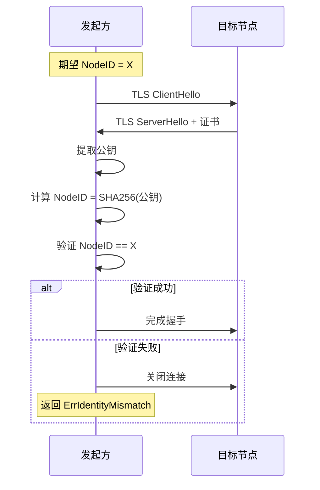
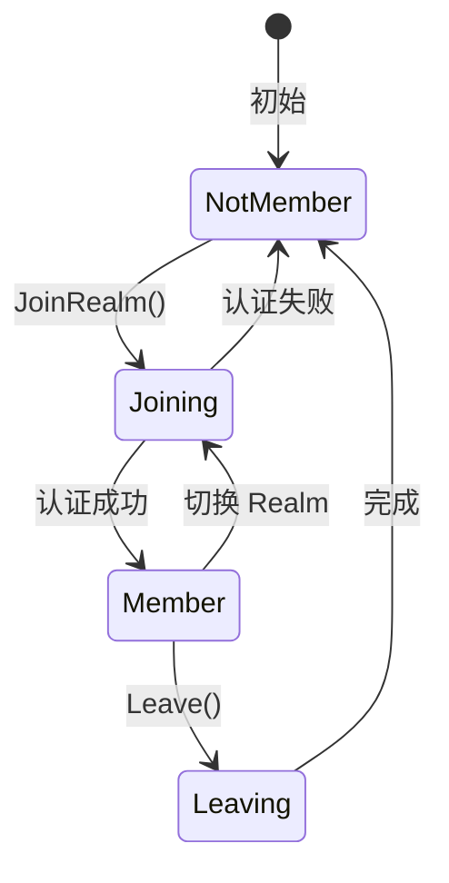
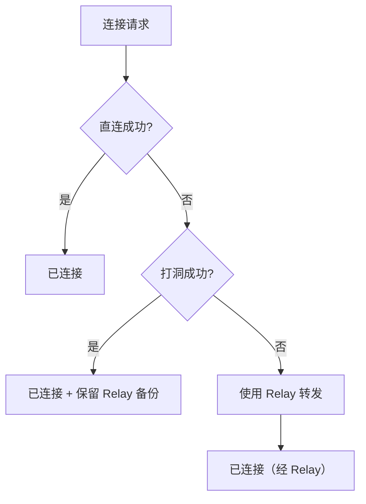
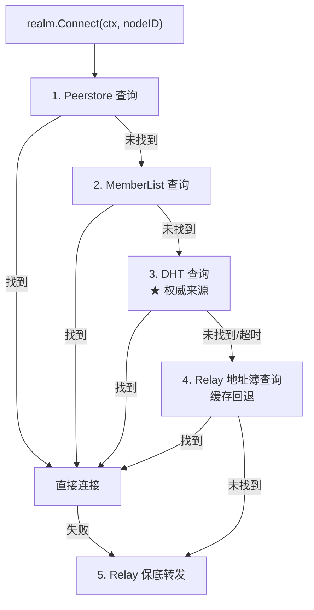
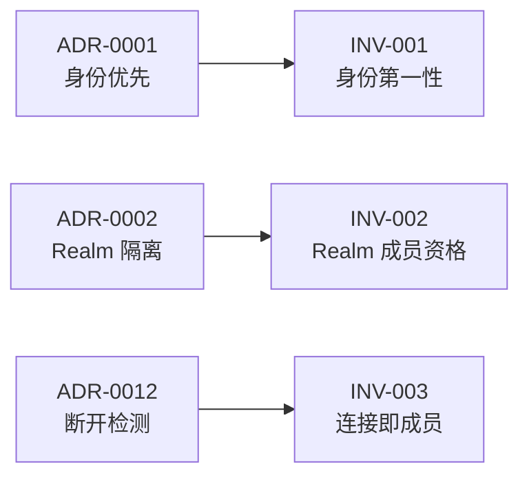

# 系统不变量 (Invariants)

> 定义 DeP2P 必须始终满足的系统约束

---

## 概述

系统不变量是 DeP2P 在任何情况下都必须保持成立的约束，是系统正确性和安全性的保证。

```
┌─────────────────────────────────────────────────────────────────────────┐
│                           系统不变量                                     │
├─────────────────────────────────────────────────────────────────────────┤
│                                                                         │
│  ★ 正式不变量（详见 01_context/decisions/invariants/）                   │
│  ═══════════════════════════════════════════════════                    │
│                                                                         │
│  INV-001: 身份第一性                                                     │
│  ────────────────────                                                   │
│  每个连接必须绑定预期的 NodeID，验证后才能通信                            │
│                                                                         │
│  INV-002: Realm 成员资格                                                 │
│  ────────────────────────                                               │
│  业务 API 需要 Realm 成员资格，非成员返回 ErrNotMember                    │
│                                                                         │
│  INV-003: 连接即成员 ★ v1.1 新增                                         │
│  ────────────────────────────                                           │
│  有连接才能是在线成员，断开即离开，连接状态是成员状态的唯一来源           │
│                                                                         │
│  ═══════════════════════════════════════════════════                    │
│  设计原则（概述性约束）                                                  │
│  ═══════════════════════════════════════════════════                    │
│                                                                         │
│  连接优先级与 Relay 保留                                                 │
│  ──────────────────────────                                             │
│  直连 → 打洞 → Relay，打洞成功后保留 Relay 作为备份                      │
│                                                                         │
│  "仅 ID 连接"边界                                                       │
│  ────────────────────────────                                           │
│  "仅 ID 连接"严格限制在 Realm 内，跨 Realm 必须提供地址                  │
│                                                                         │
│  "连接成功 = 可通信"语义保证                                             │
│  ────────────────────────────────────                                   │
│  Connect 成功时，传输层/协议层/应用层三层均已就绪，可立即发送消息          │
│                                                                         │
└─────────────────────────────────────────────────────────────────────────┘
```

---

## INV-001: 身份第一性

### 定义

```
∀ connection ∈ Connections:
  connection.ExpectedNodeID ≠ nil
  AND
  verify(connection.RemoteNodeID == connection.ExpectedNodeID)
```

### 规则

| 规则 | 说明 |
|------|------|
| 必须绑定 | 每个连接必须绑定 `ExpectedNodeID` |
| 必须验证 | 握手后验证 `RemoteID == ExpectedID` |
| 失败关闭 | 验证失败必须关闭连接 |
| 禁止纯 IP | 不存在"纯 IP 地址连接" |

### 验证流程



### 违反后果

| 后果 | 影响 |
|------|------|
| 中间人攻击 | 攻击者可冒充任意节点 |
| 消息误投 | 消息可能发送到错误节点 |
| 信任链断裂 | 无法建立可信通信 |

### 详细文档

[INV-001-identity-first.md](../../01_context/decisions/invariants/INV-001-identity-first.md)

---

## INV-002: Realm 成员资格

### 定义

```
∀ api ∈ BusinessAPIs:
  IF NOT node.IsMember(currentRealm) THEN
    RETURN ErrNotMember
  END
```

### 规则

| 规则 | 说明 |
|------|------|
| 必须加入 | 调用业务 API 前必须加入 Realm |
| 成员验证 | 通信对端必须是 Realm 成员 |
| 单 Realm | 节点同时只属于一个 Realm |
| PSK 认证 | 使用 PSK 派生密钥进行成员认证 |

### 成员状态机



### 违反后果

| 后果 | 影响 |
|------|------|
| 数据泄露 | 业务数据可能被非成员获取 |
| 权限绕过 | 非授权访问业务功能 |
| 隔离失效 | Realm 边界被突破 |

### 详细文档

[INV-002-realm-membership.md](../../01_context/decisions/invariants/INV-002-realm-membership.md)

---

## INV-003: 连接优先级与 Relay 保留

### 定义

```
∀ connection ∈ ConnectionAttempts:
  TRY direct_connect() FIRST
  IF direct_connect() FAILED THEN
    TRY hole_punch() via Relay signaling
  IF hole_punch() FAILED THEN
    USE relay_connect()   // 保底
  
  // ★ 关键：打洞成功后保留 Relay 连接
  IF hole_punch() SUCCEEDED AND relay_exists THEN
    KEEP relay_as_backup  // 不关闭 Relay 连接
```

### 规则

| 优先级 | 连接方式 | 说明 |
|--------|----------|------|
| 1 | **直连** | 如果对方地址可直连，直接连接 |
| 2 | **打洞** | ★ 需要信令通道（来自显式配置的 Relay 连接），交换候选地址后尝试 NAT 打洞 |
| 3 | **Relay** | 直连和打洞都失败时，使用 Relay 转发 |

> ★ 关键约束（与 ADR-0010 一致）：
> - 信令通道来自**显式配置**的 Relay 连接，不支持自动发现
> - 如果没有配置 Relay，则无信令通道可用，跳过打洞阶段
> - Relay 地址通过 `node.SetRelayAddr()` 配置

### ★ 保留 Relay 备份

```
┌─────────────────────────────────────────────────────────────────────────┐
│                    打洞成功后保留 Relay 的原因                           │
├─────────────────────────────────────────────────────────────────────────┤
│                                                                         │
│  1. A-B 打洞成功，但 A-C、A-D... 可能仍需借助 Relay                    │
│  2. Relay 连接用于打洞协调信令通道                                      │
│  3. 直连可能因网络变化断开，Relay 作为 fallback                         │
│  4. 重建 Relay 连接有成本（握手、预留）                                 │
│                                                                         │
│       A ══════════ 直连 ══════════ B                                   │
│       │                            │                                    │
│       └──────┬─────────┬──────────┘   ← 保留 Relay，不关闭             │
│              │  Relay  │                                                │
│              └────┬────┘                                                │
│                   │                                                     │
│       C ──────────┘   打洞协调 / 数据 fallback / 其他节点连接          │
│                                                                         │
└─────────────────────────────────────────────────────────────────────────┘
```

### 连接流程



### 违反后果

| 后果 | 影响 |
|------|------|
| 性能下降 | 不按优先级尝试会导致不必要的延迟 |
| 资源浪费 | 关闭 Relay 备份后需重建连接 |
| 可用性降低 | 网络波动时无法快速回退 |

### 相关文档

- [core_concepts.md](core_concepts.md#★-relay-三大职责-v20核心设计) — Relay 三大职责 v2.0 设计
- [core_concepts.md](core_concepts.md#★-打洞成功后保留-relay) — 打洞成功后保留 Relay

---

## ★ INV-004: "仅 ID 连接"边界

### 定义

```
∀ connect(target) ∈ ConnectOperations:
  IF context == Realm THEN
    ALLOW connect(nodeID)           // 系统自动发现地址
  ELSE IF context == Node THEN
    IF target.hasAddress() THEN
      ALLOW connect(multiaddr)      // 必须提供地址
    ELSE
      RETURN ErrAddressRequired     // 禁止纯 NodeID 连接
    END
  END
```

### 规则

| 规则 | 说明 |
|------|------|
| Realm 内允许 | `realm.Connect(ctx, nodeID)` 系统自动发现地址 |
| 跨 Realm 禁止 | `node.Connect(ctx, nodeID)` 返回 `ErrAddressRequired` |
| 必须提供地址 | 跨 Realm 必须使用 `node.Connect(ctx, multiaddr)` |
| 刻意限制 | 体现 Realm 作为业务边界的核心理念 |

### 地址发现来源（Realm 内，v2.0 更新）

> **v2.0 核心变化**：DHT 是权威目录，Relay 地址簿是缓存加速层



**v2.0 三层架构**：
- Layer 1: **DHT（★ 权威目录）** — 存储签名 PeerRecord
- Layer 2: **缓存加速层** — Peerstore / MemberList / Relay 地址簿
- Layer 3: **连接策略** — 直连 → 打洞 → Relay 兜底

### 违反后果

| 后果 | 影响 |
|------|------|
| 安全边界模糊 | 无法区分 Realm 内外连接 |
| 发现机制混乱 | 无统一的地址发现策略 |
| Relay 滥用 | 跨 Realm 连接占用 Relay 资源 |

---

## ★ INV-005: "连接成功 = 可通信"语义保证

### 定义

```
∀ conn ∈ Connect(ctx, target):
  IF conn.Error == nil THEN
    // 以下三个层级的检查均已完成且成功
    TransportLayer.Ready(conn)      == true  // 传输层：QUIC 连接已建立
    ProtocolLayer.Ready(conn)       == true  // 协议层：握手完成、身份验证通过
    ApplicationLayer.Ready(conn)    == true  // 应用层：Realm 成员验证通过（如适用）
    
    // 用户可以立即发送消息
    conn.SendMessage(data) → success OR clear_error
  END
```

### 三层连接状态

```
┌─────────────────────────────────────────────────────────────────────────────┐
│                    Connect 成功 = 三层均就绪（★ 核心语义）                   │
├─────────────────────────────────────────────────────────────────────────────┤
│                                                                             │
│  层级 1: 传输层（Transport Layer）                                          │
│  ═══════════════════════════════════                                        │
│  • QUIC 连接已建立                                                          │
│  • TLS 1.3 握手完成                                                         │
│  • 密钥协商成功                                                             │
│                                                                             │
│  层级 2: 协议层（Protocol Layer）                                           │
│  ════════════════════════════════                                           │
│  • Identify 协议交换完成                                                    │
│  • 对端 NodeID 验证通过（INV-001）                                          │
│  • 协议协商成功                                                             │
│                                                                             │
│  层级 3: 应用层（Application Layer，Realm 场景）                            │
│  ════════════════════════════════════════════════                           │
│  • Realm 成员认证完成（INV-002）                                            │
│  • PSK 验证通过                                                             │
│  • 可以直接调用 Messaging/PubSub 等业务 API                                 │
│                                                                             │
│  ★ Connect 返回成功时，以上三层均已就绪                                     │
│  ★ 用户无需再做额外检查，可直接发送消息                                     │
│                                                                             │
└─────────────────────────────────────────────────────────────────────────────┘
```

### 规则

| 规则 | 说明 |
|------|------|
| 全层就绪 | Connect 成功意味着三层均已就绪 |
| 立即可用 | 返回成功后可直接发送消息 |
| 失败早暴露 | 任何一层失败，Connect 即返回错误 |
| 无抽象泄漏 | 用户无需关心底层状态机 |

### API 语义保证

```pseudocode
// ════════════════════════════════════════════════════════════════════════════
// Realm 内连接：Connect 成功 = 立即可通信
// ════════════════════════════════════════════════════════════════════════════

conn, err = realm.Connect(ctx, targetNodeID)
if err != nil:
    // 连接失败，处理错误
    return err

// ★ 到这里，三层均已就绪，可直接发送消息
err = conn.Send(message)  // 保证可用，不会因为"未就绪"失败

// ════════════════════════════════════════════════════════════════════════════
// 错误类型区分
// ════════════════════════════════════════════════════════════════════════════

// 传输层失败
ErrConnectionFailed      // QUIC 连接建立失败
ErrTLSHandshakeFailed    // TLS 握手失败

// 协议层失败
ErrIdentityMismatch      // NodeID 不匹配（INV-001 违反）
ErrProtocolNegotiation   // 协议协商失败

// 应用层失败
ErrNotMember             // 非 Realm 成员（INV-002 违反）
ErrAuthFailed            // PSK 认证失败
```

### 违反后果

| 后果 | 影响 |
|------|------|
| 抽象泄漏 | 用户需要自己检查连接状态 |
| 使用困难 | API 不直观，容易出错 |
| 错误处理复杂 | 需要处理"半就绪"状态 |

### 相关文档

- [connection_flow.md](../L3_behavioral/connection_flow.md#★-connect-成功--可通信核心语义) — 连接流程中的语义保证
- [public_interfaces.md](../L4_interfaces/public_interfaces.md) — Realm.Connect() 接口契约

---

## 不变量与 ADR 的关系



| ADR | 不变量 | 关系 |
|-----|--------|------|
| ADR-0001 | INV-001 | ADR 定义决策，INV 定义约束 |
| ADR-0002 | INV-002 | ADR 定义决策，INV 定义约束 |
| ADR-0012 | INV-003 | ADR 定义决策，INV 定义约束 |

---

## 验证机制

### 编译时验证

| 验证点 | 方式 |
|--------|------|
| 接口约束 | 类型系统强制 |
| 依赖检查 | 导入规则 |

### 运行时验证

| 验证点 | 方式 |
|--------|------|
| 连接身份 | TLS 证书验证 |
| 成员资格 | PSK 签名验证 |
| 协议路由 | 前缀匹配检查 |

### 测试验证

| 验证点 | 方式 |
|--------|------|
| 不变量测试 | 专项测试用例 |
| 模糊测试 | 边界情况覆盖 |

---

## 相关文档

| 文档 | 说明 |
|------|------|
| [core_concepts.md](core_concepts.md) | 核心概念 |
| [../L2_structural/layer_model.md](../L2_structural/layer_model.md) | 五层软件架构 |
| [01_context/decisions/invariants/](../../01_context/decisions/invariants/) | 不变量详细文档 |
| [ADR 决策](../../01_context/decisions/) | 架构决策记录 |

---

**最后更新**：2026-01-28（新增 INV-003 连接即成员，重新组织正式不变量与设计原则）
