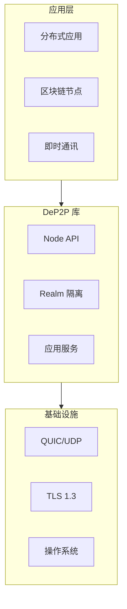
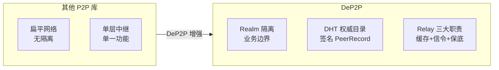

# DeP2P 定位与愿景

> 定义 DeP2P 的战略定位、设计理念和核心价值主张

---

## 愿景

```
┌─────────────────────────────────────────────────────────────────────────┐
│                           DeP2P 愿景                                     │
├─────────────────────────────────────────────────────────────────────────┤
│                                                                         │
│      "让 P2P 连接像调用函数一样简单：给一个公钥，发个消息"                  │
│                                                                         │
│  DeP2P 通过 身份优先、Realm 隔离、DHT 权威目录 三大设计理念，             │
│  为分布式应用提供安全、可靠、易用的点对点通信基础设施。                    │
│                                                                         │
└─────────────────────────────────────────────────────────────────────────┘
```

---

## 产品定位

### 定位矩阵

| 维度 | DeP2P |
|------|-------|
| **类型** | P2P 网络库 |
| **语言** | Go |
| **传输** | QUIC 优先 |
| **安全** | TLS 1.3 + PSK |
| **发现** | DHT + mDNS + Bootstrap |
| **目标用户** | 分布式应用开发者 |

### 技术栈位置



---

## 设计理念

### 三大核心理念

```
┌─────────────────────────────────────────────────────────────────────────┐
│                         三大核心设计理念                                  │
├─────────────────────────────────────────────────────────────────────────┤
│                                                                         │
│  1. 身份优先 (Identity First)                                           │
│     ────────────────────────                                            │
│     每个连接必须绑定预期的 NodeID                                         │
│     连接建立后验证 RemoteID == ExpectedID                                │
│     不存在"纯 IP 地址连接"                                               │
│                                                                         │
│  2. Realm 隔离 (Realm Isolation)                                        │
│     ────────────────────────────                                        │
│     业务 API 需要 Realm 成员资格                                         │
│     非成员调用返回 ErrNotMember                                          │
│     Realm 内使用 PSK 相互认证                                            │
│                                                                         │
│  3. DHT 权威目录 + Relay 三大职责 (v2.0)                                │
│     ────────────────────────────────────                                │
│     ★ DHT 是权威目录：存储签名 PeerRecord，跨 Relay 统一可达            │
│     ★ Relay 三大职责：                                                  │
│       - 缓存加速层：维护地址簿，作为 DHT 本地缓存（非权威）             │
│       - 打洞协调信令：提供打洞协调的信令通道                            │
│       - 数据通信保底：直连/打洞失败时，Relay 转发数据                   │
│     基础设施融合：Bootstrap + Relay 可融合部署                          │
│                                                                         │
└─────────────────────────────────────────────────────────────────────────┘
```

### 理念对应的系统不变量

| 设计理念 | 系统不变量 | 文档 |
|----------|-----------|------|
| 身份优先 | INV-001 | [INV-001-identity-first.md](../../01_context/decisions/invariants/INV-001-identity-first.md) |
| Realm 隔离 | INV-002 | [INV-002-realm-membership.md](../../01_context/decisions/invariants/INV-002-realm-membership.md) |
| 连接优先级 | INV-003 | [invariants.md](invariants.md#inv-003-连接优先级与-relay-保留) |

---

## 与竞品的差异

### 对比矩阵

| 特性 | DeP2P | go-libp2p | iroh |
|------|-------|-----------|------|
| **域隔离** | Realm 概念 | 无 | 无 |
| **地址发现** | DHT 权威目录 + Relay 缓存 | DHT + Peerstore | Relay + DNS |
| **Relay 设计** | 三大职责 + 融合部署 | 单层 | 单层（参考） |
| **成员验证** | PSK 认证 | 无 | 无 |
| **传输** | QUIC 优先 | 多传输 | QUIC 优先 |
| **模块化** | 中等 | 高度模块化 | 简洁 |

### DeP2P 独特价值



| 独特价值 | 说明 |
|----------|------|
| **业务隔离** | Realm 提供逻辑隔离边界 |
| **DHT 权威目录 (v2.0)** | DHT 存储签名 PeerRecord，跨 Relay 统一可达 |
| **Relay 三大职责** | 缓存加速层 + 打洞协调信令 + 数据通信保底 |
| **基础设施融合** | Bootstrap + Relay 可融合部署，简化运维 |
| **简化认证** | PSK 一次派生，成员相互认证 |

---

## 核心特性

### 特性列表

| 特性 | 说明 | 状态 |
|------|------|------|
| **QUIC 传输** | 内置加密、多路复用、0-RTT | 核心 |
| **身份验证** | NodeID = SHA256(公钥) | 核心 |
| **Realm 隔离** | PSK 认证、成员管理 | 核心 |
| **DHT 权威目录 (v2.0)** | 签名 PeerRecord，跨 Relay 统一可达 | 核心 |
| **Relay 三大职责** | 缓存加速层 + 打洞协调信令 + 数据通信保底 | 核心 |
| **NAT 穿透** | 直连 → 打洞 → Relay（保留备份） | 核心 |
| **节点发现** | DHT（权威）+ mDNS + Bootstrap | 核心 |
| **消息传递** | Send/Request 模式 | 应用 |
| **发布订阅** | GossipSub | 应用 |

### 特性分层

```
┌─────────────────────────────────────────────────────────────────────────┐
│                         特性分层                                         │
├─────────────────────────────────────────────────────────────────────────┤
│                                                                         │
│  应用层特性                                                              │
│  ────────────                                                           │
│  消息传递、发布订阅、流式通信                                             │
│                                                                         │
│  业务层特性                                                              │
│  ────────────                                                           │
│  Realm 隔离、PSK 认证、成员管理                                          │
│                                                                         │
│  基础层特性                                                              │
│  ────────────                                                           │
│  QUIC 传输、身份验证、NAT 穿透、节点发现、中继                            │
│                                                                         │
└─────────────────────────────────────────────────────────────────────────┘
```

---

## 目标用户

### 用户画像

| 用户类型 | 使用场景 | 关注点 |
|----------|----------|--------|
| **区块链开发者** | 节点通信、共识消息 | 安全、可靠 |
| **分布式应用开发者** | P2P 应用后端 | 易用、灵活 |
| **即时通讯开发者** | 去中心化 IM | 实时、隐私 |
| **物联网开发者** | 设备互联 | 轻量、穿透 |

### 使用模式

```
典型使用流程：

  1. 启动节点
     node = StartNode(opts...)
     
  2. 加入 Realm（获取业务隔离）
     realm = node.JoinRealmWithKey(name, psk)
     
  3. 使用应用服务（多协议支持）
     // Messaging - 通过 protocol 参数区分协议
     realm.Messaging().Send(ctx, peer, "rpc", data)
     
     // PubSub - 通过 Topic 对象管理主题
     topic, _ := realm.PubSub().Join("chat")
     topic.Publish(ctx, data)
     
     // Streams - 通过 protocol 参数区分协议
     stream, _ := realm.Streams().Open(ctx, peer, "sync")
     stream.Write(data)
     
  4. 优雅关闭
     topic.Close()
     realm.Leave()
     node.Close()
```

---

## 设计原则

### 核心原则

| 原则 | 说明 |
|------|------|
| **简单优先** | API 简洁，隐藏复杂性 |
| **安全默认** | 默认加密，强制身份验证 |
| **隔离优先** | 业务数据不跨 Realm 泄露 |
| **渐进增强** | 直连优先，Relay 回退 |

### 非目标

| 非目标 | 说明 |
|--------|------|
| 通用协议栈 | 不追求支持所有传输 |
| 浏览器运行 | 不支持 WebRTC |
| 匿名网络 | 不提供匿名性 |

---

## 相关文档

| 文档 | 说明 |
|------|------|
| [system_boundary.md](system_boundary.md) | 系统边界 |
| [core_concepts.md](core_concepts.md) | 核心概念 |
| [../L2_structural/layer_model.md](../L2_structural/layer_model.md) | 五层软件架构 |
| [ADR-0001](../../01_context/decisions/ADR-0001-identity-first.md) | 身份优先决策 |
| [ADR-0002](../../01_context/decisions/ADR-0002-realm-isolation.md) | Realm 隔离决策 |

---

**最后更新**：2026-01-24（v2.0 DHT 权威模型对齐）
