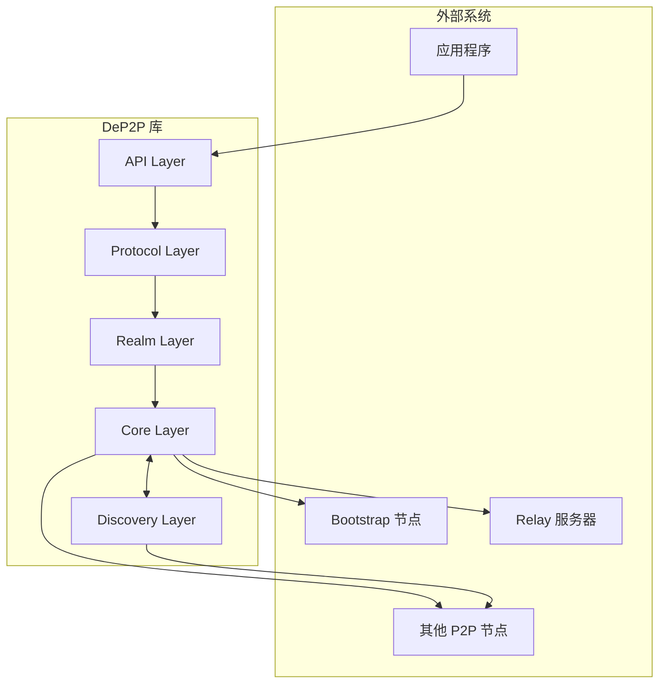
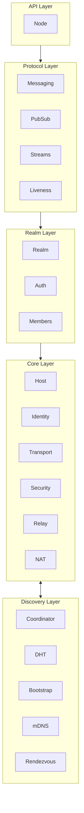
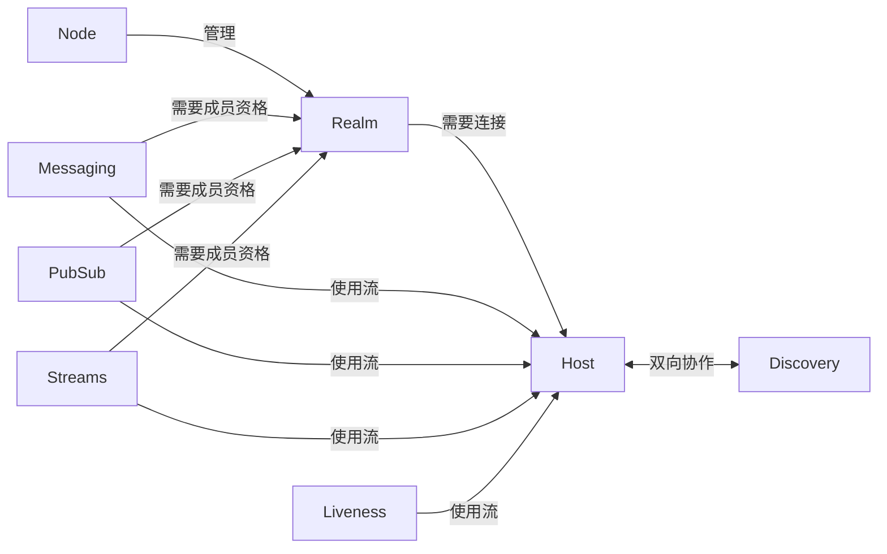
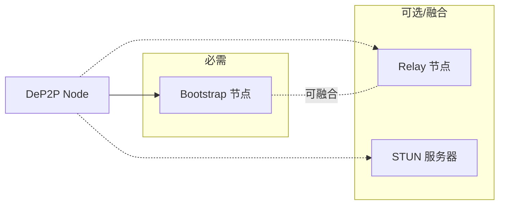
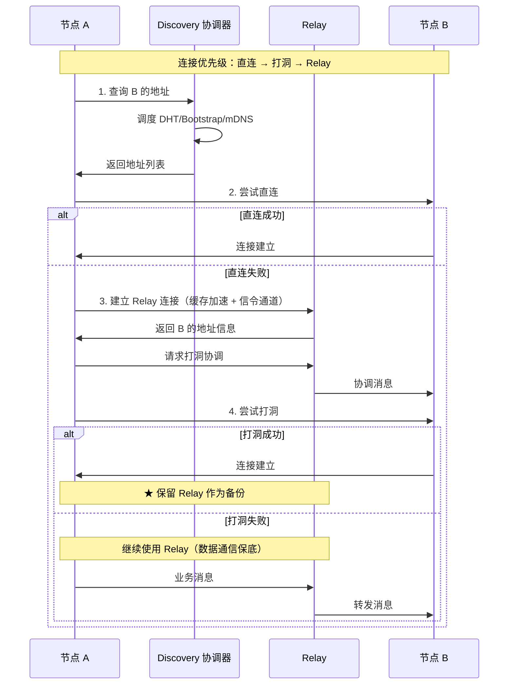

# 系统边界

> 定义 DeP2P 的系统边界、职责范围和外部交互

---

## 架构说明

本文档描述 DeP2P 的系统边界、职责范围和外部交互。

软件架构采用**五层结构**（API / Protocol / Realm / Core / Discovery），
详见 [L2_structural/layer_model.md](../L2_structural/layer_model.md)。

---

## 系统上下文



---

## 五层软件架构

```
┌─────────────────────────────────────────────────────────────────────────────┐
│                      DeP2P 五层软件架构 (v1.1.0)                              │
├─────────────────────────────────────────────────────────────────────────────┤
│                                                                             │
│  ┌───────────────────────────────────────────────────────────────────────┐  │
│  │  API Layer (入口层)                                                    │  │
│  │                                                                       │  │
│  │   ┌────────┐                                                          │  │
│  │   │  Node  │  dep2p.New() → Node                                     │  │
│  │   │  入口  │                                                          │  │
│  │   └────────┘                                                          │  │
│  │                                                                       │  │
│  │   代码位置: dep2p.go, node.go, options.go                              │  │
│  └───────────────────────────────────────────────────────────────────────┘  │
│                                        ▲                                    │
│                                        │                                    │
│  ┌───────────────────────────────────────────────────────────────────────┐  │
│  │  Protocol Layer (协议层)                                               │  │
│  │                                                                       │  │
│  │   ┌─────────┐ ┌─────────┐ ┌─────────┐ ┌─────────┐                    │  │
│  │   │Messaging│ │ PubSub  │ │ Streams │ │Liveness │                    │  │
│  │   │  消息   │ │发布订阅 │ │   流    │ │  存活   │                    │  │
│  │   └─────────┘ └─────────┘ └─────────┘ └─────────┘                    │  │
│  │                                                                       │  │
│  │   协议前缀: /dep2p/app/<realmID>/*                                     │  │
│  │   代码位置: internal/protocol/                                         │  │
│  └───────────────────────────────────────────────────────────────────────┘  │
│                                        ▲                                    │
│                                        │ realm.Messaging() / realm.PubSub() │
│                                        │                                    │
│  ┌───────────────────────────────────────────────────────────────────────┐  │
│  │  Realm Layer (Realm 层) — 业务隔离                                     │  │
│  │                                                                       │  │
│  │   ┌─────────────────────────────────────────────────────────────────┐ │  │
│  │   │                            Realm                                │ │  │
│  │   │  基本信息: Name() / ID() / Members() / IsMember()                │ │  │
│  │   │  服务入口: Messaging() / PubSub() / Streams() / Liveness()       │ │  │
│  │   │  子组件: Manager / Auth / Member                                │ │  │
│  │   │  生命周期: Leave() / Context()                                   │ │  │
│  │   └─────────────────────────────────────────────────────────────────┘ │  │
│  │                                                                       │  │
│  │   协议前缀: /dep2p/realm/<realmID>/*                                   │  │
│  │   代码位置: internal/realm/                                            │  │
│  └───────────────────────────────────────────────────────────────────────┘  │
│                                        ▲                                    │
│                                        │ node.JoinRealm()                   │
│                                        │                                    │
│  ┌───────────────────────────────────────────────────────────────────────┐  │
│  │  Core Layer (核心层) — P2P 网络核心能力                                │  │
│  │                                                                       │  │
│  │   ┌─────────────────────────────────────────────────────────────────┐ │  │
│  │   │                            Host                                 │ │  │
│  │   │             网络主机：组装各协议、连接管理、流管理                 │ │  │
│  │   └─────────────────────────────────────────────────────────────────┘ │  │
│  │                                                                       │  │
│  │   ┌──────────┐ ┌───────────┐ ┌──────────┐ ┌───────┐ ┌─────────┐      │  │
│  │   │ Identity │ │ Transport │ │ Security │ │ Muxer │ │ ConnMgr │      │  │
│  │   │   身份   │ │ QUIC/TCP  │ │TLS/Noise │ │ Yamux │ │连接管理 │      │  │
│  │   └──────────┘ └───────────┘ └──────────┘ └───────┘ └─────────┘      │  │
│  │                                                                       │  │
│  │   ┌───────┐ ┌─────┐                                                   │  │
│  │   │ Relay │ │ NAT │                                                   │  │
│  │   │  中继 │ │ 穿透│                                                   │  │
│  │   └───────┘ └─────┘                                                   │  │
│  │                                                                       │  │
│  │   协议前缀: /dep2p/sys/*                                               │  │
│  │   代码位置: internal/core/                                             │  │
│  └───────────────────────────────────────────────────────────────────────┘  │
│                                                                             │
│                                  ↕ 双向协作                                  │
│                                                                             │
│  ┌───────────────────────────────────────────────────────────────────────┐  │
│  │  Discovery Layer (发现层) — 节点发现与广播                              │  │
│  │                                                                       │  │
│  │   ┌────────────┐ ┌───────────┐ ┌────────┐ ┌────────────┐             │  │
│  │   │Coordinator │ │ Bootstrap │ │  mDNS  │ │ Rendezvous │             │  │
│  │   │   协调器   │ │  引导节点 │ │ 局域网 │ │  命名空间  │             │  │
│  │   └────────────┘ └───────────┘ └────────┘ └────────────┘             │  │
│  │                                                                       │  │
│  │   ┌──────────┐                                                        │  │
│  │   │   DHT    │                                                        │  │
│  │   │ Kademlia │                                                        │  │
│  │   └──────────┘                                                        │  │
│  │                                                                       │  │
│  │   代码位置: internal/discovery/                                        │  │
│  └───────────────────────────────────────────────────────────────────────┘  │
│                                                                             │
└─────────────────────────────────────────────────────────────────────────────┘
```

---

## 层职责

### API Layer (入口层)

```
┌─────────────────────────────────────────────────────────────────────────┐
│  API Layer (入口层)                                                      │
├─────────────────────────────────────────────────────────────────────────┤
│                                                                         │
│  职责：提供面向应用开发者的入口 API                                       │
│  范围：节点创建、配置选项                                                │
│  特点：用户的第一个接触点                                                │
│                                                                         │
│  核心组件：                                                              │
│  • Node              - 用户入口门面                                     │
│  • Options           - 配置选项                                         │
│                                                                         │
│  代码位置：dep2p.go, node.go, options.go                                │
│                                                                         │
└─────────────────────────────────────────────────────────────────────────┘
```

### Protocol Layer (协议层)

```
┌─────────────────────────────────────────────────────────────────────────┐
│  Protocol Layer (协议层)                                                 │
├─────────────────────────────────────────────────────────────────────────┤
│                                                                         │
│  职责：提供面向应用开发者的业务通信服务                                   │
│  范围：消息、发布订阅、流、存活检测                                       │
│  特点：必须先 JoinRealm，否则返回 ErrNotMember                           │
│                                                                         │
│  核心组件：                                                              │
│  • Messaging         - 点对点消息                                       │
│  • PubSub            - 发布订阅 (GossipSub)                             │
│  • Streams           - 双向流                                           │
│  • Liveness          - 存活检测                                         │
│                                                                         │
│  协议前缀：/dep2p/app/<realmID>/*                                        │
│  代码位置：internal/protocol/                                            │
│                                                                         │
└─────────────────────────────────────────────────────────────────────────┘
```

### Realm Layer (Realm 层)

```
┌─────────────────────────────────────────────────────────────────────────┐
│  Realm Layer (Realm 层) — DeP2P 核心创新                                │
├─────────────────────────────────────────────────────────────────────────┤
│                                                                         │
│  职责：提供业务隔离能力                                                   │
│  范围：成员管理、准入控制、权限校验                                       │
│  特点：用户显式操作，严格单 Realm                                        │
│                                                                         │
│  核心组件：                                                              │
│  • Realm             - 业务隔离域                                       │
│  • Manager           - Realm 生命周期管理                               │
│  • Auth (PSK)        - 准入控制                                         │
│  • Member            - 成员管理                                         │
│                                                                         │
│  协议前缀：/dep2p/realm/<realmID>/*                                      │
│  代码位置：internal/realm/                                               │
│                                                                         │
└─────────────────────────────────────────────────────────────────────────┘
```

### Core Layer (核心层)

```
┌─────────────────────────────────────────────────────────────────────────┐
│  Core Layer (核心层)                                                     │
├─────────────────────────────────────────────────────────────────────────┤
│                                                                         │
│  职责：提供 P2P 网络的核心能力（DeP2P 的核心价值）                        │
│  范围：传输、安全、身份、穿透、中继                                       │
│  特点：节点启动自动就绪，用户完全无感知                                   │
│                                                                         │
│  核心组件：                                                              │
│  • Host              - 网络主机                                         │
│  • Identity          - 身份管理、NodeID                                 │
│  • Transport         - QUIC/TCP 传输                                    │
│  • Security          - TLS/Noise 安全                                   │
│  • Muxer             - 多路复用 (Yamux)                                 │
│  • ConnMgr           - 连接管理                                         │
│  • Relay             - 统一中继（三大职责: 缓存加速+信令+保底）          │
│  • NAT               - NAT 穿透 (STUN/打洞)                             │
│                                                                         │
│  协议前缀：/dep2p/sys/*                                                  │
│  代码位置：internal/core/                                                │
│                                                                         │
│  ★ NAT 三层能力（概念区分）：                                             │
│  • 外部地址发现：STUN/观察地址，知道"自己在公网的地址"（不等于中继）     │
│  • 打洞：需要信令通道协调（通常由 Relay 提供），建立 NAT 后直连          │
│  • 中继：直连/打洞都失败时，数据经第三方转发（兜底）                     │
│                                                                         │
│  ★ v2.0 三层架构（DHT 权威模型）：                                        │
│  • Layer 1: DHT（★ 权威目录）— 存储签名 PeerRecord                       │
│  • Layer 2: 缓存加速层 — Peerstore / MemberList / Relay 地址簿           │
│  • Layer 3: 连接策略 — 直连 → 打洞 → Relay 兜底                          │
│                                                                         │
│  Relay 三大职责（v2.0）：                                                 │
│  • 缓存加速层：维护地址簿，作为 DHT 的本地缓存（非权威）                 │
│  • 打洞协调信令：提供打洞协调的信令通道                                  │
│  • 数据通信保底：直连/打洞失败时转发数据                                 │
│  • 可与 Bootstrap 融合部署                                               │
│                                                                         │
└─────────────────────────────────────────────────────────────────────────┘
```

### Discovery Layer (发现层)

```
┌─────────────────────────────────────────────────────────────────────────┐
│  Discovery Layer (发现层)                                                │
├─────────────────────────────────────────────────────────────────────────┤
│                                                                         │
│  职责：提供节点发现与广播能力                                             │
│  范围：DHT、引导节点、局域网、命名空间发现                                │
│  特点：与 Core Layer 双向协作                                            │
│                                                                         │
│  核心组件：                                                              │
│  • Coordinator       - 发现协调（统一调度）                              │
│  • DHT               - Kademlia 分布式哈希表                            │
│  • Bootstrap         - 引导节点发现                                     │
│  • mDNS              - 局域网发现                                       │
│  • Rendezvous        - 命名空间发现                                     │
│                                                                         │
│  代码位置：internal/discovery/                                           │
│                                                                         │
└─────────────────────────────────────────────────────────────────────────┘
```

---

## 服务边界

### 服务边界图



### 服务输入/输出定义

| 服务 | 输入 | 输出 | 协议前缀 |
|------|------|------|----------|
| **Messaging** | `(NodeID, Protocol, Data)` | `Response / Error` | `/dep2p/app/{realmID}/msg/*` |
| **PubSub** | `(Topic, Data)` | `Subscription` | `/dep2p/app/{realmID}/pubsub/*` |
| **Streams** | `(NodeID, Protocol)` | `Stream` | `/dep2p/app/{realmID}/stream/*` |
| **Liveness** | `(NodeID)` | `Latency / Error` | `/dep2p/sys/ping/*` |
| **Realm** | `(Name, PSK)` | `Realm / Error` | `/dep2p/realm/{realmID}/auth/*` |
| **Host** | `(Multiaddr)` | `Connection` | `/dep2p/sys/*` |

### 服务依赖关系



### 服务约束

| 服务 | 前置条件 | 不变量 |
|------|----------|--------|
| **Messaging** | 已加入 Realm | INV-002 |
| **PubSub** | 已加入 Realm | INV-002 |
| **Streams** | 已加入 Realm | INV-002 |
| **Liveness** | Node 已启动 | - |
| **Realm** | Node 已启动 | - |
| **Host** | - | INV-001, INV-003 |

---

## 边界定义

### 系统边界

| 边界 | 内部 | 外部 |
|------|------|------|
| **上边界** | Node API | 应用程序 |
| **下边界** | Transport | OS 网络栈 |
| **侧边界** | 本节点 | 其他 P2P 节点 |

### 职责边界

| 职责 | DeP2P 负责 | 应用负责 |
|------|-----------|----------|
| **传输** | QUIC/TCP 连接管理 | - |
| **安全** | TLS/Noise 握手、身份验证 | 业务加密 |
| **发现** | DHT、mDNS、Bootstrap | 业务级发现 |
| **路由** | 路径选择、NAT 穿透 | - |
| **隔离** | Realm 成员验证 | PSK 分发 |
| **消息** | 消息传递基础设施 | 消息格式、处理 |

---

## 外部依赖

### 运行时依赖

| 依赖 | 类型 | 说明 |
|------|------|------|
| Bootstrap 节点 | 网络 | DHT 引导，初始节点发现 |
| Relay 节点 | 网络 | 缓存加速层（非权威）+ 打洞信令 + 数据通信保底 |
| STUN 服务器 | 网络 | 外部地址发现（可选） |

> 注：Bootstrap 和 Relay 可融合部署到同一节点

### 依赖关系图



---

## 协议命名空间

### 协议前缀

| 前缀 | 层级 | 说明 | 示例 |
|------|------|------|------|
| `/dep2p/sys/` | Core | 系统协议 | `/dep2p/sys/ping/1.0.0` |
| `/dep2p/realm/{id}/` | Biz | Realm 协议 | `/dep2p/realm/{id}/auth/1.0.0` |
| `/dep2p/app/{id}/` | App | 应用协议 | `/dep2p/app/{id}/chat/1.0.0` |

### 协议隔离

```
┌─────────────────────────────────────────────────────────────────────────┐
│                          协议命名空间隔离                                 │
├─────────────────────────────────────────────────────────────────────────┤
│                                                                         │
│  Relay 转发的协议：                                                      │
│  • /dep2p/sys/*       — 系统协议                                        │
│  • /dep2p/realm/*     — Realm 协议（需验证成员资格）                     │
│  • /dep2p/app/*       — 应用协议（需验证成员资格）                       │
│                                                                         │
│  Realm 自动隔离：                                                        │
│  • 用户代码：realm.Messaging().Send(target, "chat/1.0.0", data)          │
│  • 实际协议：/dep2p/app/<realmID>/chat/1.0.0                             │
│  • RealmID 自动植入，无法伪造                                            │
│                                                                         │
└─────────────────────────────────────────────────────────────────────────┘
```

---

## 连接建立流程



---

## 日志与指标说明

日志和指标不作为独立域，直接使用：

| 能力 | 处理方式 |
|------|----------|
| **Logging** | 直接使用标准库 `log/slog` |
| **Metrics** | 直接使用 `prometheus` |

用户可通过 `slog.SetDefault()` 自定义日志处理，无需抽象接口。

---

## 相关文档

| 文档 | 说明 |
|------|------|
| [positioning.md](positioning.md) | 产品定位 |
| [core_concepts.md](core_concepts.md) | 核心概念 |
| [domain_map.md](domain_map.md) | 领域映射 |
| [../L2_structural/layer_model.md](../L2_structural/layer_model.md) | 分层模型 |

---

**最后更新**：2026-01-24（v2.0 DHT 权威模型对齐）
